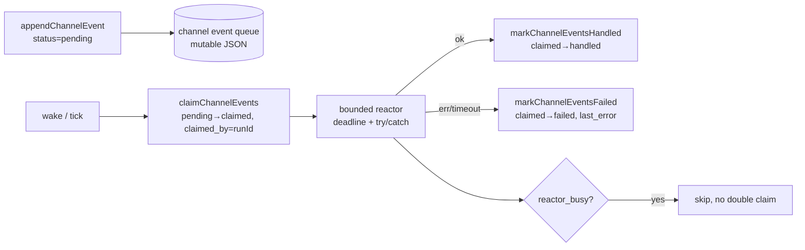

# 证据批原语评审：从 Channel presence reactor 推广到认知侧

- 日期：2026-08-09
- 状态：评审稿（Phase 0 交付，不含实施）
- 关联：epic #33、#34 Phase 0；PR #32（目标机制图）；[`src/channel/presence-reactor.mjs`](../src/channel/presence-reactor.mjs)、[`src/channel/event-queue.mjs`](../src/channel/event-queue.mjs)

本文回答 #33 评估清单第 3 项：**证据批原语（claim/ack/幂等唤醒）能否直接复用 presence reactor 模式？**

结论：**可复用核心原语与状态机，但不能整段照搬**——Channel 用可变队列 + 内存态 run，认知侧须以 append-only 证据流 + 批次 checkpoint 为底，claim/ack 语义对齐、存储形态不同。

---

## 1. Channel 先例：已验证的原语



### 1.1 事件生命周期（`event-queue.mjs`）

| 状态 | 含义 |
| --- | --- |
| `pending` | 可认领 |
| `claimed` | 已被某 `runId` 占用，反应进行中 |
| `handled` | 反应成功完成 |
| `failed` | 反应失败或超时，保留 `last_error` 可重试 |
| `superseded` | 同类 pending 合并淘汰（如 `keepLatest`） |

### 1.2 关键 API

| 原语 | 函数 | 语义 |
| --- | --- | --- |
| 入队 | `appendChannelEvent` | 写入 `pending` 事件 |
| 认领 | `claimChannelEvents({ runId, limit, types })` | 原子地将最多 N 条 pending 改为 claimed，绑定 `claimed_by` |
| 成功确认 | `markChannelEventsHandled(eventIds)` | claimed → handled |
| 失败确认 | `markChannelEventsFailed(eventIds, { error })` | claimed → failed，不吞批 |
| 幂等防重 | `readPresenceState` + `reactor_busy` / `isPresenceRunExpired` | 同一 run 未完成时不二次 claim；超时 mark failed 后可重试 |
| 有界执行 | `deadlineAt` + `runWithTimeout` + `failPresenceRun` | 超时释放 claimed 批，事件回到 failed 可再唤醒 |

### 1.3 presence reactor 两阶段

1. **决策阶段**（`runPresenceReactor`）：claim → plan → execute → handled/failed
2. **产出阶段**（`runChannelSpeechGenerationTask`）：独立 claim `speech_generation_requested` → 逐条 handled/failed

这与认知侧「认知反应器 + 法则反应器 + 记忆压实器」三反应器拆分一致：**同一证据流，不同 type/filter 的 claim 策略**。

---

## 2. 认知侧需要的证据批定义

「证据批（evidence batch）」= 反应器的**最小反应单元**，同时是：

- **审计单元**：一次反应对应一条 honesty 事件（R5）
- **checkpoint 单元**：中断后可从批次 id 重放（R2、可恢复不变量）
- **KV 缓存锚点**：stable prefix 按 batch id 组织（R5，Phase 7 验收）

### 2.1 建议的原语（认知侧）

| 原语 | 语义 | 对应 Channel |
| --- | --- | --- |
| `batch_id` | 全局唯一，如 `batch-<uuid>`；降级后的「轮」仅作批次 id | `runId` |
| `append_evidence(event)` | 向 append-only 流追加契约化事件（已有 `recordEvolutionEvent` + schema） | `appendChannelEvent` |
| `claim_evidence_batch({ batch_id, filter, limit, cursor })` | 从流中认领未消费证据，写入 `evidence-batch-claims.jsonl` 或 sidecar index | `claimChannelEvents` |
| `ack_batch_handled(batch_id, event_ids)` | 标记批内事件已消费；产出 honesty + checkpoint | `markChannelEventsHandled` |
| `nack_batch_failed(batch_id, event_ids, error)` | 失败不吞批；事件保持可重认领 | `markChannelEventsFailed` |
| `is_reactor_busy(reactor_kind)` | 同 subject 同反应器类型单飞 | `reactor_busy` |
| `reconcile_expired_batch(batch_id)` | 超时 kill -9 后把 claimed 改 failed | `isPresenceRunExpired` + mark failed |

### 2.2 与 Channel 的关键差异

| 维度 | Channel | 认知侧 |
| --- | --- | --- |
| 事实源 | 可变 `channel-event-queue.json` | append-only `evolution-events.jsonl`（+ 可选 claim index） |
| 认领实现 | 原地改 `status` 字段 | **不能改 jsonl 行**；须 sidecar（claim ledger）或 offset+id 索引 |
| 唤醒源 | channel tick / classifier | 证据到达、operator 请求、goal 证据窗口（R6） |
| 空批 | `allow_empty_claim` / `force` | 认知反应需 honesty 闸：空批是否允许须显式策略 |
| 合并 | `supersedePendingChannelEvents` | 法则反应器 per-goal 窗口；认知侧按优先级/type filter |

**结论**：状态机与 bounded-deadline 模式**直接复用**；存储层须新增 **claim ledger**（append-only 或 atomic JSON），不能原地 mutate jsonl。

---

## 3. 推广可行性评估（#33 清单第 3 项）

| 问题 | 结论 |
| --- | --- |
| claim/ack 语义能否复用？ | **能**。pending/claimed/handled/failed 四态 + runId 绑定已足够 |
| 幂等唤醒能否复用？ | **能**。busy 检测 + expired reconcile 模式已验证 |
| 失败不吞批？ | **能**。`markChannelEventsFailed` 先例明确 |
| 直接 copy event-queue.mjs？ | **不能**。须适配 append-only 流 + claim sidecar |
| 两阶段反应？ | **能**。认知 Decide 与 exec 已分离；法则/记忆可独立 claim filter |

**推荐 Phase 1 前置**：在 `src/contracts/` 登记 `evidence-batch-claim.mjs`（claim record schema），Phase 1 读侧投影时一并产出 claim index 雏形（只读、不对行为）。

---

## 4. 建议的 claim record 形态（草案）

```json
{
  "batch_id": "batch-a1b2c3d4",
  "reactor": "cognitive",
  "subject": "agentank-tank",
  "claimed_at": "2026-08-09T00:00:00.000Z",
  "deadline_at": "2026-08-09T00:05:00.000Z",
  "event_ids": ["evt-...", "evt-..."],
  "status": "claimed",
  "last_error": null
}
```

Ack 追加一行 `{ ...status: "handled", handled_at }` 或原地更新 atomic store（与 channel 队列同策略，subject 锁保护）。

---

## 5. 下一步（Phase 1 输入）

1. 证据流读侧投影：receipts / verify / probe / operator / channel → 统一 `evolution-event` 契约（行为零变化）
2. claim ledger 只读影子：与 channel 队列对账，验证「同一批 event_ids 只 handled 一次」
3. 认知反应器 Phase 2 影子跑：claim → Seen → 判断 → 影子队列（不入真实 pending_decisions）

参考 PR #32 机制图与 [`docs/reactor-target-mechanism.md`](https://github.com/imjszhang/js-evolution-agent/blob/cursor/rule-inventory-reactor-migration-3ec4/docs/reactor-target-mechanism.md)（PR 合入后路径稳定）。
