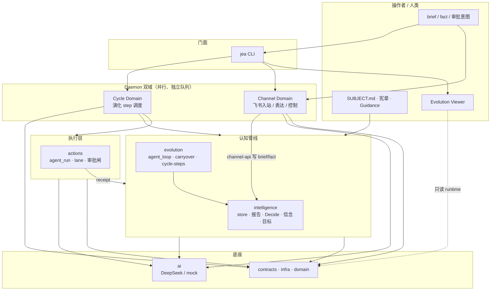
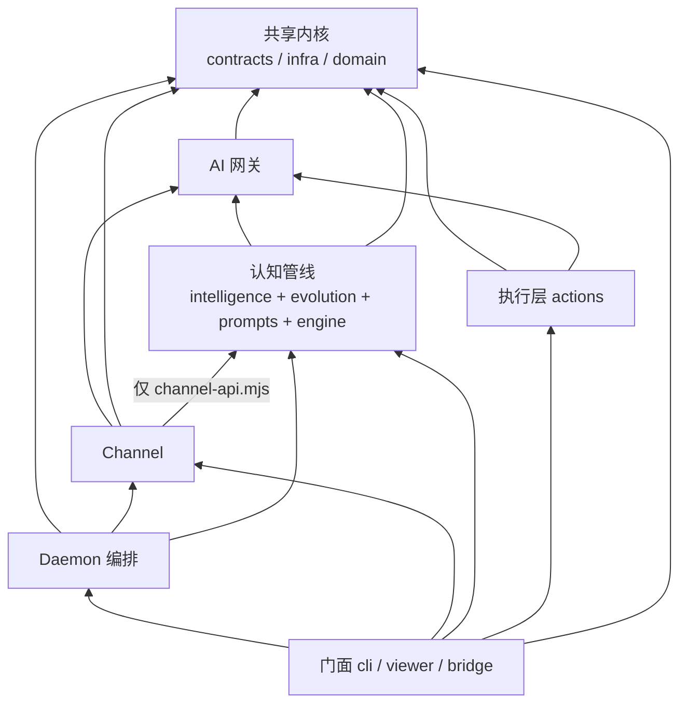
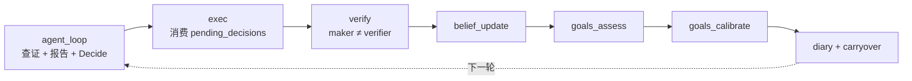
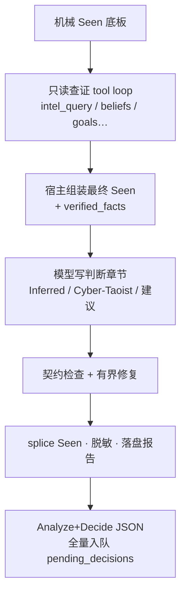
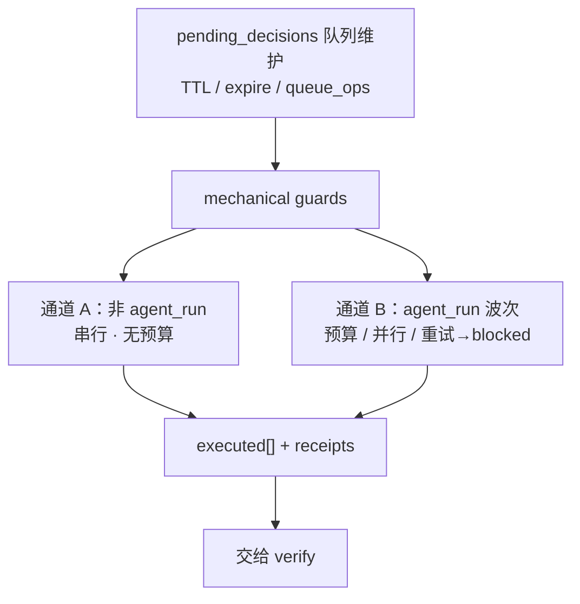
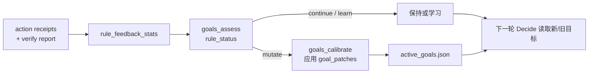
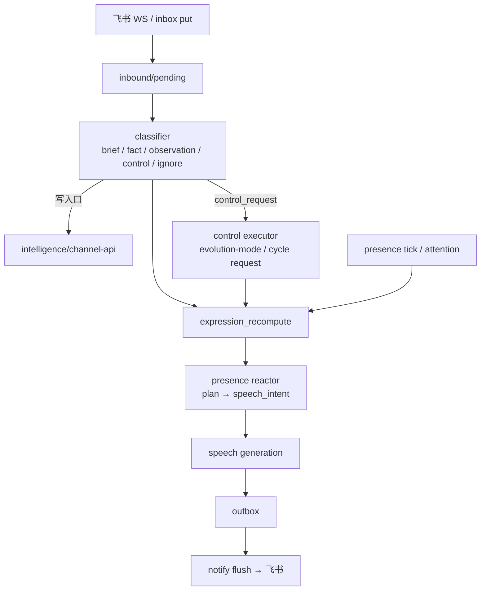
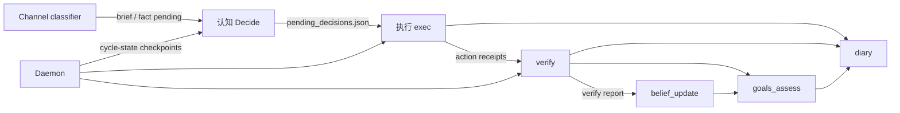
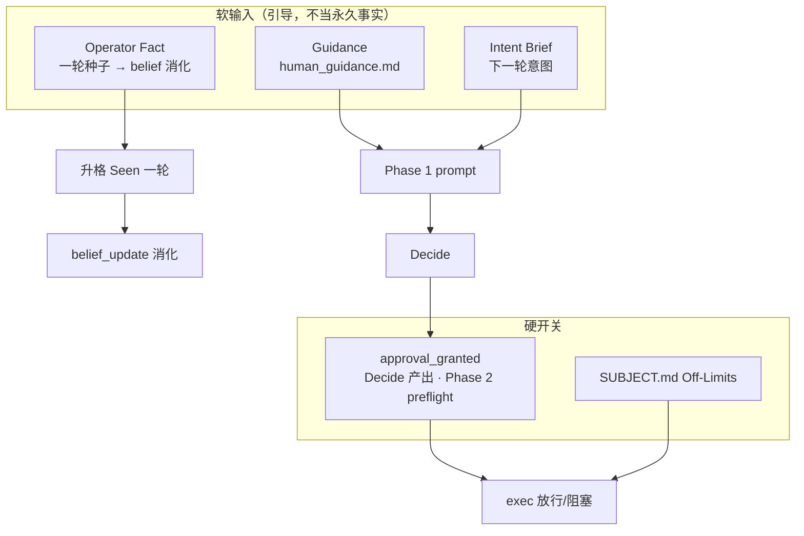

# JEA 机制图

- 日期：2026-08-07
- 范围：当前仓库大模块、双域调度、单轮演化闭环与跨模块数据契约
- 相关：[`src/contracts/OWNERSHIP.md`](../src/contracts/OWNERSHIP.md)、[`docs/module-decoupling-plan.md`](./module-decoupling-plan.md)、根 [`AGENTS.md`](../AGENTS.md)

本文用几张机制图说明 JEA **如何运转**，而不是罗列全部命令。

---

## 1. 系统总览：谁在驱动谁



要点：

- **Cycle** 负责「想清楚 → 做事 → 验证 → 改法则」。
- **Channel** 负责「对外收消息 / 说话 / 本地控制」，不直接改决策队列。
- 跨模块默认靠 **落盘契约** 交接，不靠互相深 import。

---

## 2. 模块依赖方向（设计约束）



合法方向：`门面 → 业务 → AI → 内核`。  
Channel 写情报必须经 `src/intelligence/channel-api.mjs`。

---

## 3. 单轮演化机制（Cycle）

默认 Phase 1 为 `agent_loop`；其后 step 固定。



### 3.1 Phase 1（agent_loop）内部



### 3.2 Phase 2（exec）双通道



### 3.3 目标自修正（法则反馈）



---

## 4. Channel 机制（与 Cycle 平级）



Channel **不能**直接写 `pending_decisions` 或伪造 `approval_granted`；审批仍走 brief → 下一轮 Decide。

---

## 5. 跨模块数据契约（机制关节）



| 契约文件 | 生产者 → 消费者 |
| --- | --- |
| `pending_decisions.json` | Decide → exec |
| `cycle-state/<id>/<step>.json` | 各 step 接力 |
| action receipts | exec → verify / belief / diary |
| verify report | verify → belief / goals |
| operator briefs / facts | Channel 或 CLI → 下一轮认知 |
| channel inbound/outbox | Channel 内部 |

---

## 6. 操作者输入分层（治理机制）



---

## 7. 运行时落盘骨架（按 Subject）

```text
runtime/subjects/<namespace>/
├── SUBJECT.md
└── data/
    ├── evolution/          # cycle-state · decisions · briefs · carryover · diary
    ├── intelligence/       # store · beliefs · reports · standing memory
    ├── channel/            # inbound · outbox · channel tasks · events
    └── goals/              # active goals · goal-events
```

Daemon 以 **checkpoint 是否写完** 判定 step 完成；Channel 与 Cycle 使用独立 task queue / worker-state / 锁。

---

## 8. 一张图记住主回路

```text
人类设定边界与意图
        │
        ▼
┌─ Channel ─┐              ┌────────────── Cycle ──────────────┐
│ 收消息分类 │──brief/fact─►│ 查证→报告→Decide→执行→验证        │
│ 表达/通知  │◄─attention──│ →信念→目标校准→日记→下一轮         │
└───────────┘              └───────────────────────────────────┘
        │                              │
        └────────── Viewer / CLI 只读观测 ─┘
```

核心机制不是「固定 `/goal` 刷到绿」，而是：

1. **证据诚实**（宿主组装 Seen）  
2. **行动可审计**（queue + receipt + verify）  
3. **法则可修正**（goals assess/calibrate）  
4. **人机边界清晰**（brief/fact ≠ approval_granted）
