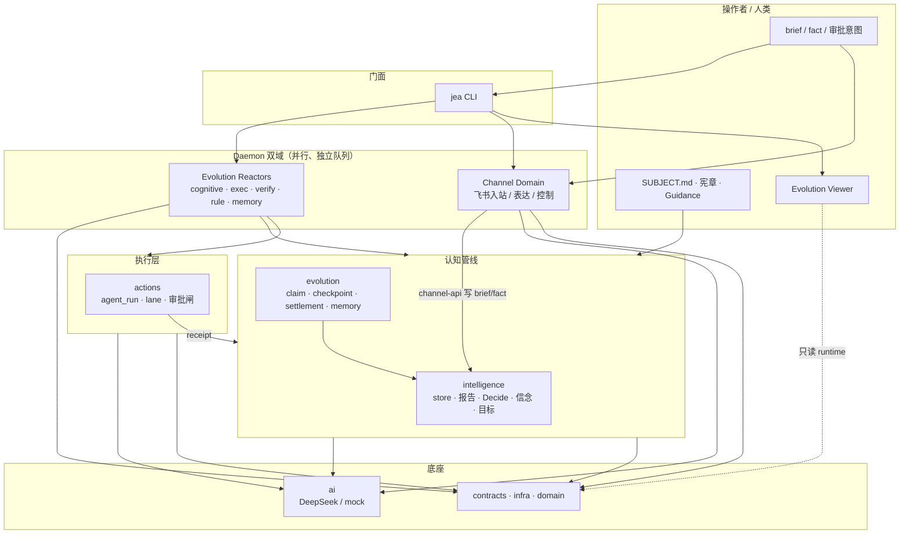
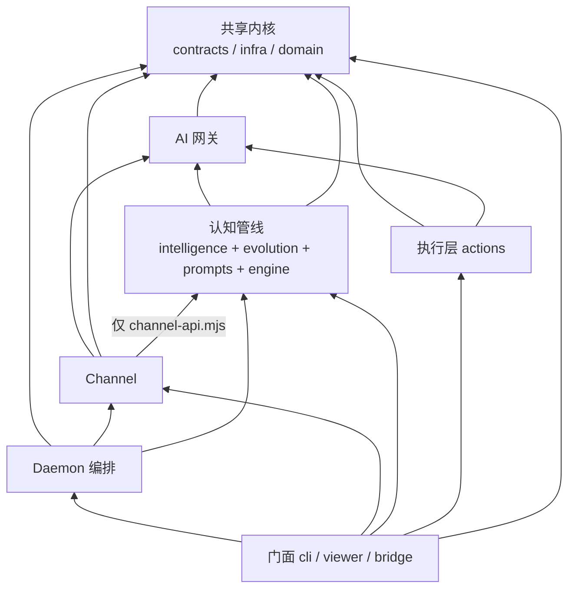
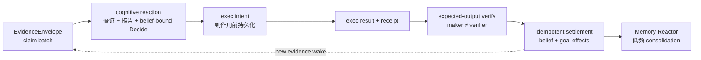
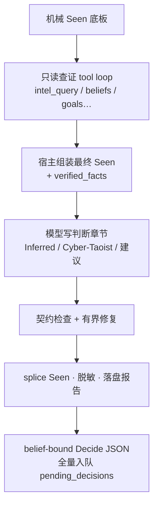
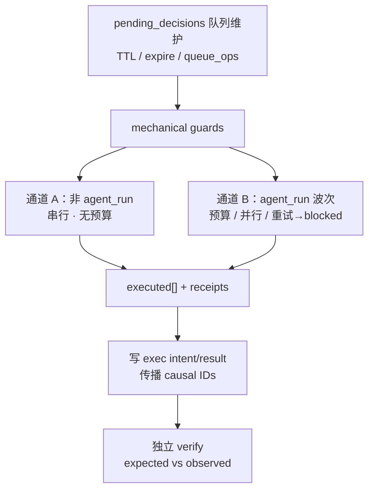
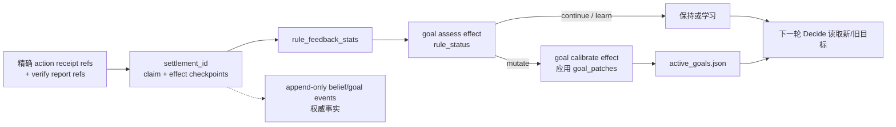
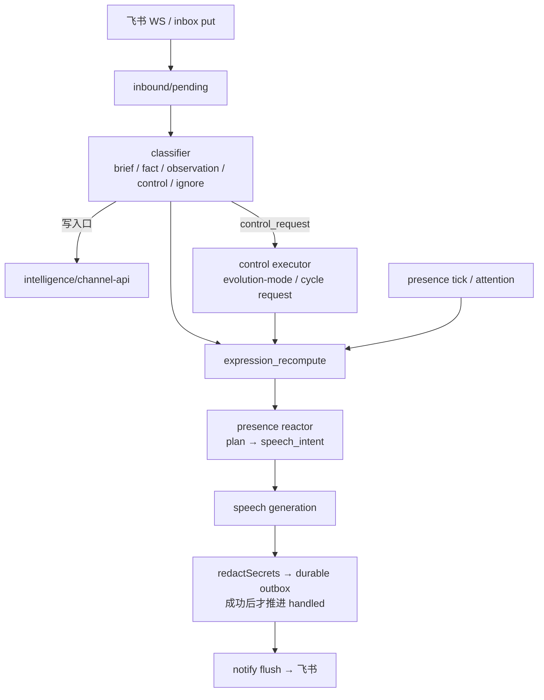
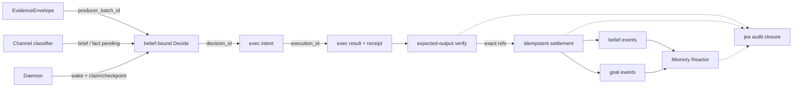
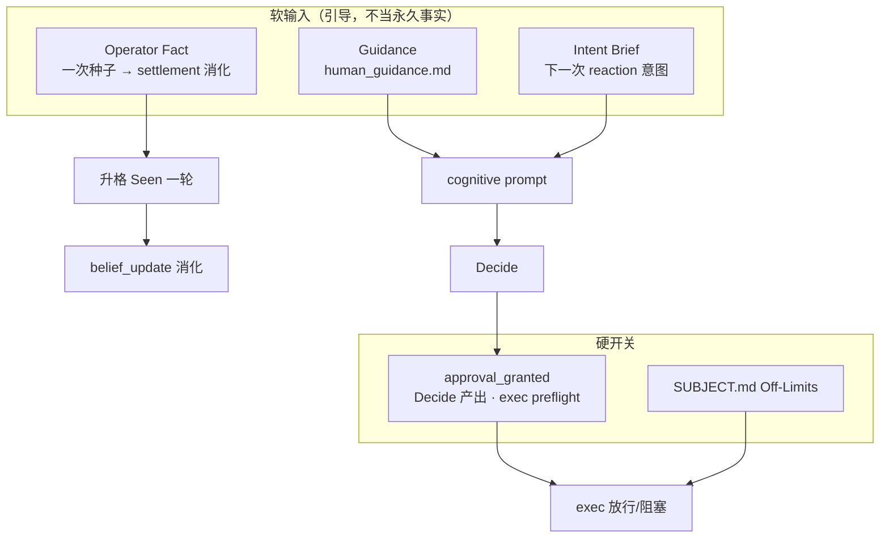

# JEA 机制图

- 日期：2026-08-22
- 范围：0.2.0 belief-driven async loop、Channel delivery、operator projection 与跨模块数据契约
- 相关：[`src/contracts/OWNERSHIP.md`](../src/contracts/OWNERSHIP.md)、[`docs/module-decoupling-plan.md`](./module-decoupling-plan.md)、根 [`AGENTS.md`](../AGENTS.md)

本文用几张机制图说明 JEA **如何运转**，而不是罗列全部命令。

---

## 1. 系统总览：谁在驱动谁



要点：

- **Evolution Reactors** 负责「证据 → 报告 → 决策 → 执行 → 验证 → settlement → 记忆」。
- **Channel** 负责「对外收消息 / 说话 / 本地控制」，不直接改决策队列。
- 跨模块默认靠 **落盘契约** 交接，不靠互相深 import。

---

## 2. 模块依赖方向（设计约束）



合法方向：`门面 → 业务 → AI → 内核`。  
Channel 写情报必须经 `src/intelligence/channel-api.mjs`。

---

## 3. Belief-driven async loop



### 3.1 Cognitive reaction



### 3.2 Exec / verify



### 3.3 幂等 settlement 与目标自修正



`settlements.json` 只是可重建协调 sidecar；带 `settlement_id` /
`settlement_effect` 的 append-only belief/goal events 才是权威事实。

---

## 4. Channel delivery（与 Evolution Reactors 平级）



Channel **不能**直接写 `pending_decisions` 或伪造 `approval_granted`；审批仍走 brief → 下一轮 Decide。

---

## 5. 跨模块数据契约（机制关节）



| 契约文件 | 生产者 → 消费者 |
| --- | --- |
| `pending_decisions.json` | Decide → exec |
| batch claim / checkpoint | reactors 的 claim-ack 与 crash 恢复 |
| exec intent / result | 副作用前意图 → verify 独立认领 |
| action receipts | exec → verify / settlement |
| verify report comparison | expected output → settlement |
| belief / goal events | settlement → Memory Reactor（append-only authority） |
| operator briefs / facts | Channel 或 CLI → 下一次 cognitive reaction |
| channel inbound/outbox | Channel 内部 |

---

## 6. 操作者输入分层（治理机制）



---

## 7. 运行时落盘与 maintenance（按 Subject）

```text
<JEA_HOME>/subjects/<namespace>/
├── SUBJECT.md
└── data/
    ├── evolution/          # decisions · reactor claims/checkpoints/intents/results/settlements
    ├── intelligence/       # store · receipts · verify · beliefs · reports · standing memory
    ├── channel/            # inbound · outbox · channel tasks · events
    └── goals/              # active goals · goal-events
```

Daemon 以 claim/checkpoint/intent/result 的持久状态恢复 reactor。Channel 与
Evolution 使用独立 task queue / worker-state / 锁。heartbeat 默认每 24 小时
运行 runtime maintenance：先归档 terminal sidecar records，再压缩 hot state；
active claims/leases、uncertain intents 与主 append-only evidence 不清理。

---

## 8. 一张图记住主回路

```text
人类设定边界与意图
        │
        ▼
┌─ Channel delivery ─┐      ┌──────── Evolution Reactors ──────────┐
│ classifier/presence│─wake►│ evidence→report→decision→exec→verify │
│ speech/outbox      │◄proj─│ →settlement→Memory Reactor            │
└────────────────────┘      └───────────────────────────────────────┘
        │                              │
        └────────── Viewer / CLI 只读观测 ─┘
```

核心机制不是「固定 `/goal` 刷到绿」，而是：

1. **证据诚实**（宿主组装 Seen）
2. **行动可追因**（causal IDs + intent + receipt）
3. **验证有期望**（expected ≠ execution success）
4. **settlement 幂等**（精确 refs + append-only authority）
5. **记忆低频收敛**（Memory Reactor）
6. **人机边界清晰**（brief/fact ≠ approval_granted）
