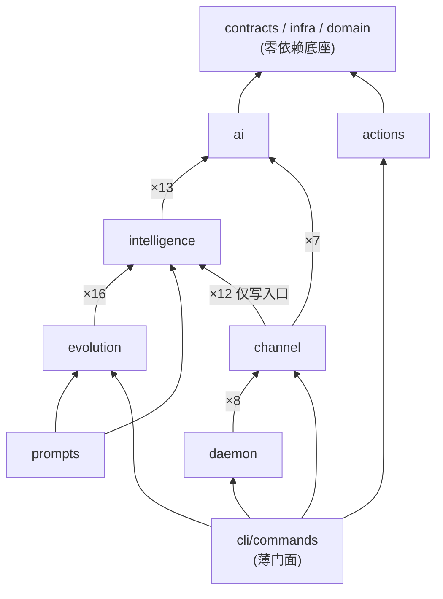

# 模块解耦与多 Agent 并行维护实施计划

- 日期：2026-08-07
- 状态：实施中
- 范围：仅重组模块边界与依赖方向，不改变任何运行时行为与数据格式

### 实施进度

| 阶段 | 状态 | PR |
| --- | --- | --- |
| Phase A｜`cli/utils` 内核归位 | 已实施 | #27 |
| Phase B｜channel → intelligence 收口 | 已实施 | #28 |
| Phase C｜契约冻结与 ownership | 已实施（见 `src/contracts/OWNERSHIP.md`） | 本阶段 PR |
| Phase D｜AGENTS.md 拆分 | 已实施 | 后续 PR |

## 1. 背景与目标

当前项目由单一维护者/单一 agent 串行维护。为了让多个 agent 并行维护不同子系统而不互相冲突，需要：

1. 把代码库划分成边界清晰、依赖单向的大模块，每个模块可指定独立 owner；
2. 把跨模块的隐性耦合（共享工具目录、直接 import 内部文件、共享文档）收口成显式契约；
3. 约定跨模块变更的流程，使并行开发时的合并冲突面最小化。

本计划**只重组边界，不改行为**：所有阶段的验收标准都以现有测试全绿 + `jea run --mock` 冒烟通过为准，不引入新功能。

## 2. 现状依赖分析（实测数据）

### 2.1 模块划分：6 个业务模块 + 1 个共享内核

| # | 模块 | 覆盖目录 | 职责 |
| --- | --- | --- | --- |
| 0 | 共享内核 | `src/contracts`、`src/infra`、`src/domain`、`src/cli/utils` 的大部分 | schema、原子 JSON 写入、subject registry/路径、cycle-state 原语 |
| 1 | AI 网关 | `src/ai` | DeepSeek client、LLM 档案、KV 缓存元数据、mock client |
| 2 | 认知管线 | `src/intelligence`、`src/evolution`、`src/prompts`、`src/domain/cognition`、`src/engine` | Phase 1 agent_loop / 报告 / Decide、信念、目标、carryover、诚实闸 |
| 3 | 执行层 | `src/actions`、`src/engine/pipelines/exec.mjs` | Phase 2 exec、agent adapter、lane/worktree、审批策略 |
| 4 | Daemon 编排 | `src/daemon`、`src/cli/utils` 中 `daemon-*` / `cycle-*` 系列 | task queue、worker、step runner、reconcile |
| 5 | Channel | `src/channel`（含 `adapters/feishu`） | classifier / presence / speech / notify / control |
| 6 | 观测与门面 | `tools/evolution-viewer`、`src/intelligence/evolution-viewer`、`src/cli/commands`、`src/bridge` | 只读 viewer、CLI 命令薄壳、openclaw bridge |

### 2.2 依赖方向（跨目录 import 实测）

关键事实（基于 `rg` 对 `src/` 各子目录跨目录 import 的统计）：

- `src/contracts`、`src/domain`、`src/bridge` **零**跨目录依赖；`src/infra` 仅 1 处（引 `cli/utils`）。
- `src/engine` 是 vendored 自包含引擎（见 `src/engine/VENDORED.md`），只被少量引用。
- `intelligence` 与 `evolution` 基本单向（evolution→intelligence ×16，反向仅 1 处），二者属于 Phase 1 同一条生产线，**不建议硬拆**，合为「认知管线」模块。
- `channel` 与 cycle 侧在运行时层面已隔离（独立队列、worker-state、锁边界）；代码上对 `intelligence` 的 12 处依赖集中在 brief / fact / observation 的**写入口**。
- `daemon` 对 `channel` 的 8 处依赖是任务编排层面（channel domain worker 的启动与任务领取），方向单一。

### 2.3 耦合热点：`src/cli/utils`

`src/cli/utils` 名义上属于 CLI，实际是全项目的运行时内核。被非 CLI 模块引用的实测计数：

| 引用方 | 次数 |
| --- | --- |
| `src/channel` | 32 |
| `src/daemon` | 14 |
| `src/evolution` | 5 |
| `src/intelligence` | 5 |
| `src/actions` | 4 |
| `src/infra` | 1 |

被引用最多的文件（非 CLI 模块视角）：`subjects`(12)、`evolve-runs`(11)、`files`(6)、`markdown-sections`(5)、`daemon-tasks`(4)、`daemon-projection`(4)、`daemon-events`(4)、`cycle-dispatch`(4)、`project`(3)、`daemon-worker-state`(3)、`cycle-state`(3)、`atomic-json-write`(2)、`cycle-reducer`(2)、`cycle-checkpoints`(2)、`evolution-mode`(2)、`evolution-mode-apply`(2)、`subject-artifacts`(2) 等——没有一个是「CLI 参数解析」，全部是共享基础设施。

如果直接按目录分配 owner 而不处理它，任何 agent 改 `cli/utils` 都会波及其他所有模块，这是并行维护的最大冲突源。

### 2.4 隐性契约：运行时数据文件

代码 import 之外，模块间真正的契约是磁盘上的 JSON/JSONL 文件：

| 运行时文件 | 生产者 → 消费者 | 既有 schema |
| --- | --- | --- |
| `pending_decisions.json` | 认知管线（Decide）→ 执行层（exec） | `src/contracts/decision.mjs` |
| `cycle-state/<id>/<step>.json` | 各 step 间 checkpoint 接力 | `src/contracts/step-checkpoint.mjs` |
| action receipts | 执行层 → verify / belief / diary | `src/contracts/action-receipt.mjs` |
| `evolution-events.jsonl` | 各模块 → viewer / daemon | （事件字段松散，待收口） |
| channel `inbound|outbox` envelope | channel 内部 + listener | `src/contracts/channel-envelope.mjs` |
| daemon task queue | daemon 内部 | `src/contracts/daemon-task.mjs` |
| verify report | verify → belief / goals | `src/contracts/verify-report.mjs` |

`src/contracts` 已经为大部分契约建了 schema——这是现成的解耦缝：**契约变更由共享内核 owner 单点把关**，业务模块只能消费不能私改。

## 3. 分阶段实施步骤

四个阶段相互独立、各自可回滚，可按 A → B → C → D 顺序执行，也可 C/D 提前（纯文档与流程，无代码风险）。

### Phase A｜`cli/utils` 内核归位

**目标**：把藏在 CLI 里的共享内核拆到正确归属，消除最大耦合热点。

**改动范围**：

1. 迁往 `src/infra`（共享内核）：
   - `subjects.mjs`、`subject-selection.mjs`、`subject-artifacts.mjs`、`subject-lock.mjs`、`subject-lane-guard.mjs`
   - `files.mjs`、`atomic-json-write.mjs`、`markdown-sections.mjs`、`project.mjs`、`env-file.mjs`、`process.mjs`、`process-alive.mjs`
2. 迁往 `src/daemon`（编排模块）：
   - `daemon-tasks.mjs`、`daemon-events.mjs`、`daemon-projection.mjs`、`daemon-worker-state.mjs`
   - `cycle-state.mjs`、`cycle-dispatch.mjs`、`cycle-reducer.mjs`、`cycle-checkpoints.mjs`、`cycle-start-requests.mjs`、`cycle-pipeline-mode.mjs`
   - `evolution-mode.mjs`、`evolution-mode-apply.mjs`、`evolve-runs.mjs`
3. 留在 `src/cli/utils`（纯 CLI）：`args.mjs`、`prompt.mjs`、`i18n.mjs`、`register-qr.mjs`、`policy-sections.mjs` 等只被 `cli/commands` 引用的文件。
4. 全仓 import 路径机械改写（约 60+ 处非 CLI 引用 + `cli/commands` 内部引用）；每个被移动文件可先留 re-export shim 过渡，全部改写完成后删除 shim。

**边界判定原则**：一个文件若被 ≥2 个业务模块引用则进 `src/infra`；只被 daemon/cycle 编排引用则进 `src/daemon`；只被 CLI 命令引用则留下。上面的清单按当前实测引用关系初分，迁移时以实际 `rg` 结果为准微调。

**验收标准**：

- `npm test` 全绿（重点回归：`cli.test.mjs`、`daemon-*.test.mjs`、`cycle-*.test.mjs`、`channel*.test.mjs`、`e2e-mock-cycle.test.mjs`）
- `npm run jea -- run --mock` 冒烟通过
- `rg "from ['\"].*cli/utils" src/channel src/daemon src/evolution src/intelligence src/actions src/infra` 结果为空

**风险**：侵入面最大（60+ import 改写）但纯机械，无逻辑变更；Windows 路径与 ESM 相对路径需逐一验证（项目在 Windows 与 Linux 双平台运行）。

### Phase B｜channel → intelligence 写入口收口

**目标**：channel 不再直接 import intelligence 内部文件，只依赖一个窄门面。

**改动范围**：

1. 新建情报写入门面（建议 `src/intelligence/ingest-api.mjs`，或独立 `src/intelligence/facade/`），只导出 channel 需要的能力：
   - operator brief 写入（`operator-briefs.mjs` 的 put）
   - operator fact 写入（`operator-facts.mjs` 的 put）
   - observation ingest（`store.mjs` 的写路径）
   - 只读查询（presence context 需要的最近情报摘要）
2. channel 的 12 处直接 import（分布在 `classifier.mjs`、`presence-context.mjs`、`presence-memory.mjs`、`ingest.mjs` 等）全部改走门面。
3. 门面的函数签名冻结为契约级 API：变更需内核 owner 评审。

**验收标准**：

- `channel*.test.mjs`、`feishu-*.test.mjs`、`channel-adapter-registry.test.mjs` 全绿
- `rg "from ['\"].*intelligence/(?!ingest-api|facade)" src/channel` 结果为空（即只剩门面引用）

**风险**：中等；12 处调用点替换，语义不变。注意 `classifier` 的 fact/brief 写入路径与 CLI `jea intel fact put` 共用底层实现，门面必须复用同一实现而不是复制。

### Phase C｜契约冻结与 ownership 声明

**目标**：让并行 agent 有明确的「谁能改哪里、跨界怎么走」的规则。

**改动范围**（纯文档与流程，无代码）：

1. 在 `src/contracts/` 下新增 `OWNERSHIP.md`（或在本文档维护），声明：
   - `src/contracts` 为单点审批区，仅内核 owner 可合并变更；
   - 跨模块数据格式变更流程 = 先提 contracts 变更 PR（内核 owner 审）→ 合并后两侧模块各自适配。
2. ownership 表（初始建议）：

| 模块 | 目录 | Owner（示意） |
| --- | --- | --- |
| 共享内核 | `src/contracts`、`src/infra`、`src/domain` | agent-kernel |
| AI 网关 | `src/ai` | agent-ai |
| 认知管线 | `src/intelligence`、`src/evolution`、`src/prompts`、`src/engine` | agent-cognition |
| 执行层 | `src/actions` | agent-exec |
| Daemon 编排 | `src/daemon` | agent-daemon |
| Channel | `src/channel` | agent-channel |
| 观测与门面 | `tools/evolution-viewer`、`src/cli`、`src/bridge` | agent-facade |

3. `evolution-events.jsonl` 的事件字段目前无 schema，列入 contracts 的待补清单（后续由内核 owner 补 `src/contracts/evolution-event.mjs`，不阻塞本阶段）。

**验收标准**：ownership 文档合并；各 agent 的任务说明引用该文档。

### Phase D｜文档拆分（消除 AGENTS.md 冲突热点）

**目标**：根 `AGENTS.md` 目前承载所有模块的操作说明（1000+ 行），多 agent 同改必然冲突。

**改动范围**：

1. 各模块目录下建 per-module 文档：
   - `src/channel/AGENTS.md`（Channel 通道、飞书部署、classifier/presence）
   - `src/daemon/AGENTS.md`（daemon 工作流、step 状态、韧性）
   - `src/intelligence/AGENTS.md`（intel 管线、报告、目标信念、操作者输入）
   - `src/actions/AGENTS.md`（Phase 2 exec、审批、lane）
   - `src/ai/AGENTS.md`（LLM 档案、KV 缓存约定）
2. 根 `AGENTS.md` 瘦身为：基础用法 + 环境诊断 + 各模块文档索引 + 全局约定（subject/运行时数据、操作建议）。
3. 拆分只做搬运与索引，不改写内容语义，避免与操作者已有心智模型冲突。

**验收标准**：根 `AGENTS.md` 只保留全局段落与索引；每个模块文档可独立更新。

## 4. 测试与守门策略

- **模块测试随目录分配**：`test/` 下测试已按模块命名（`channel-*`、`feishu-*`、`daemon-*`、`cycle-*`、`intel-report-*`、`goal-*`、`belief-*`、`agent-loop-*`、`agent-adapter-*` 等），直接归属对应模块 owner，无需重组。
- **跨模块 e2e 归内核 owner**：`cycle-e2e.test.mjs`、`e2e-mock-cycle.test.mjs`、`contracts.test.mjs`、`engine-facade.test.mjs` 作为集成守门，任何模块 PR 都必须保持其全绿。
- **live 测试不变**：`intel-report-honesty-live` 等 opt-in 测试维持现状（需 `DEEPSEEK_API_KEY`，默认 CI 跳过）。
- 每个 Phase 单独成 PR，PR 内 `npm test` + `jea run --mock` 双重验收。

## 5. 风险与回滚

| 风险 | 等级 | 缓解 |
| --- | --- | --- |
| Phase A import 改写遗漏导致运行时 ENOENT/模块找不到 | 中 | 机械改写 + `rg` 全量核查 + re-export shim 过渡；`npm test` 与 mock 冒烟双闸 |
| Phase B 门面遗漏 channel 某个写路径 | 低 | 以 `rg` 对 `src/channel` 的 intelligence import 清零为硬验收 |
| 移动文件与并行进行中的其他分支冲突 | 中 | Phase A 单独窗口执行、尽快合并；期间冻结对被移动文件的其他改动 |
| 文档拆分后操作者找不到入口 | 低 | 根 AGENTS.md 保留完整索引与常用命令速查 |
| runtime 数据格式意外变化 | — | 本计划所有阶段均不触碰 `runtime/` 数据格式；contracts 不做不兼容变更 |

回滚策略：每个 Phase 独立 PR，出现回归直接 revert 对应 PR 即可，无跨阶段数据迁移。

## 6. 明确不做

- 不拆分为多仓库 / npm 包（当前单仓 + 目录 ownership 已足够，拆包会引入版本协调成本）；
- 不硬拆 `intelligence` 与 `evolution`（同一条 Phase 1 生产线，拆开反而制造接口）；
- 不改 `src/engine`（vendored，冻结维护）；
- 不改任何 prompt 语义与 DeepSeek KV 缓存前缀布局（见 AGENTS.md 动态载荷约定）。
