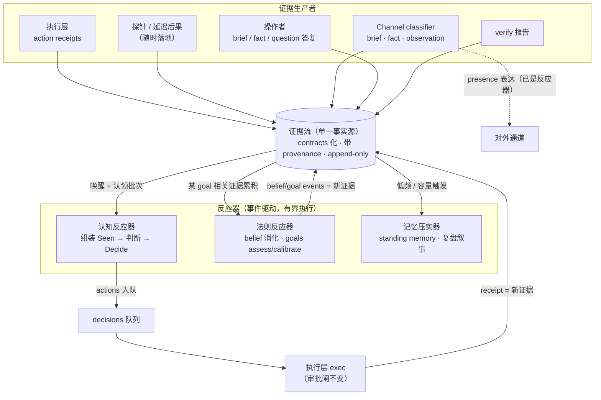
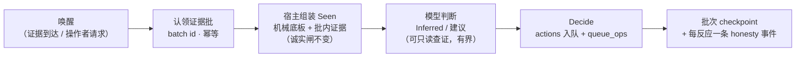
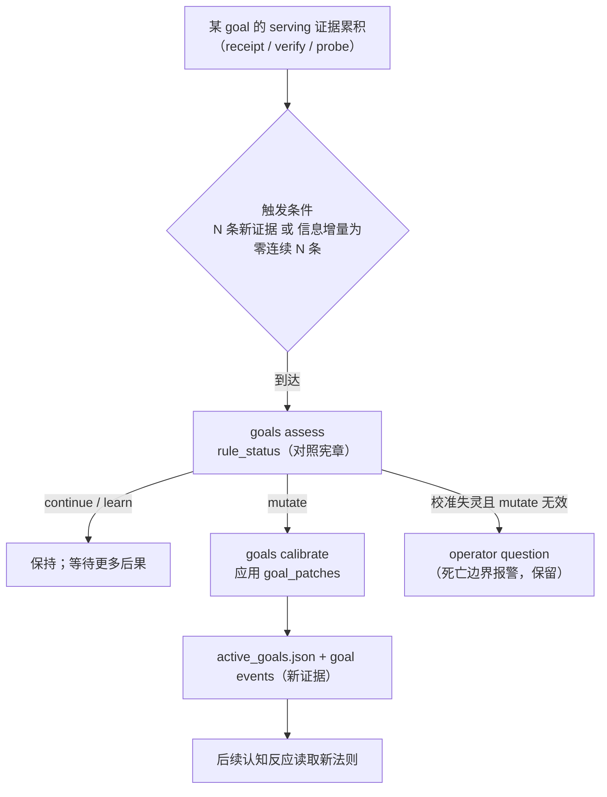
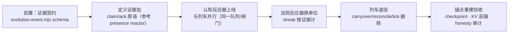

# 目标机制图：证据流反应器（反应器化后的 JEA）

- 日期：2026-08-15
- 状态：S0–S8 实现已在 `feat/reactor-target-s0-s9` 落地（gate 默认仍关，除 health primary）；S9 仅文档/删除条件，旧 step 列车保留为显式回退
- 前置：[`docs/reactor-migration-rule-inventory.md`](./reactor-migration-rule-inventory.md)（法则清单：哪些删、哪些换单位、哪些保留）
- 对照：[`docs/mechanism-diagram.md`](./mechanism-diagram.md)（现状机制图）

本文回答两个问题：**新架构长什么样**（机制图），以及**新规则集是哪几条**（替代被删掉的约 17 条补偿性法则）。

---

## 1. 一句话差异

```text
现状：定时开轮 → agent_loop→exec→verify→belief→goals→diary 七节车厢 → 轮末统一结算
目标：证据到达 → 唤醒反应器 → 认领一批证据 → 反应（认知/法则/记忆）→ 行动 → 新证据
```

「轮（cycle）」从**语义单位**降级为**批次 id（evidence batch id）**：只用于审计、checkpoint 和缓存锚点，不再切断信息流，不再决定何时思考。

---

## 2. 目标总览：证据流为中心



关键点：

- **单一事实源**：cycle-state 与 task queue 的双源真相消失，reconcile / drift 修复随之退役。
- **延迟后果无需专门机制**：探针结果晚到就是一条新证据，到达即触发相关反应——「感知天道」由后果的到达时刻驱动，不被轮次节拍绑架。
- **安静即健康**：无证据则无反应，空转在结构上不可能；`evolution_stalled` 类健康判定退役。

---

## 3. 单次认知反应（替代七节车厢的前三节）



与现状的对应关系：

| 现状（列车） | 目标（反应） |
| --- | --- |
| agent_loop（查证+报告+Decide） | 认知反应器的一次反应 |
| exec | 不变，仍独立消费队列；receipt 回流证据流 |
| verify | 不变（maker ≠ verifier）；报告回流证据流 |
| belief_update / goals_assess / goals_calibrate | 法则反应器：按 goal 的证据累积触发，不再固定在轮末 |
| diary | 记忆压实器：低频/容量触发的叙事压实，不再是每轮车厢 |
| carryover 全家族 | **消失**——未消费证据本来就留在流里 |

---

## 4. 法则反应回路（目标自修正，换单位后）



保留的理论法则（清单 B 类）在此回路原位工作：`mutate_effective` 化妆式 mutate 检测、死亡边界报警、guard 退役/重生——只是 streak 的计量单位从「连续 N 轮」换成「连续 N 条相关证据」。

---

## 5. 新规则集（替代被删的约 17 条补偿性法则）

新架构不是无法则，而是把补偿性法则换成一组**少而结构性**的规则：

| # | 新规则 | 替代/消解的旧法则 |
| --- | --- | --- |
| R1 | **证据契约**：写入证据流必须符合 schema（`evolution-event.mjs`），带 provenance（来源、时间、引用） | evolution-events 无 schema 的缺口；observation guard 部分吸收 |
| R2 | **批次反应**：反应器以 claim-batch 方式消费（幂等唤醒、有界 deadline、失败不吞批） | tick reconcile、stuck watchdog 对账、`JEA_CYCLE_*` 接力 |
| R3 | **安静即健康**：无证据不反应；唤醒条件可配（证据类别/优先级/阈值） | 5min tick 开轮、continuous/on_demand 双模式、`evolution_stalled` 判定 |
| R4 | **单一事实源**：证据流是唯一进度真相；反应器状态只是缓存 | cycle-state 与 task queue 双源、drift 修复 |
| R5 | **批次即锚点**：batch id 是 checkpoint 单元、honesty 审计单元、KV 缓存前缀锚点 | 按 step 切檔、每轮一条 honesty 事件、轮次缓存前缀 |
| R6 | **法则反应阈值**：per-goal 证据窗口（条数/信息增量）触发 assess；streak 按证据计 | `RULE_FEEDBACK_WINDOW/DEAD_STREAK` 按轮计、mutate cooldown 等两轮 |
| R7 | **资源治理换单位**：agent 并发上限 + 速率预算（墙钟）；backpressure 由队列深度驱动 | 每轮 agent 预算、`cycles_seen` TTL |
| R8 | **operator 输入生命周期**：brief 消费于下一次相关反应；fact 默认真直至被下一批相关后果消化 | 「恰好一轮默认真」、轮末统一消化、存量迁移代码 |

不变的（清单 B/C/D 类，此处只列关键项）：

- 宿主组装 Seen、typed ref、脱敏、report repair 有界重问
- `approval_granted` preflight、`JEA_APPROVAL_MODE`、Off-Limits、core policy
- 写类 profile 独占、attempts→blocked、subject lock、原子写、presence 节流

---

## 6. 迁移路线（概念顺序，非排期）



三个验收不变量（迁移期间任何时刻必须成立）：

1. **诚实**：每次反应恰好一条 honesty 事件；Seen 永远由宿主组装。
2. **治理**：审批闸与 Off-Limits 在 exec preflight 原位工作，不因驱动方式改变而绕过。
3. **可恢复**：任一反应中断后，可从批次 checkpoint 重放，不丢证据、不重复副作用。

---

## 7. 对照速览：删掉的复杂度去了哪

```text
旧：轮末 diary 写 carryover → 下轮读回 → 销账/防腐/去重     （7 条法则）
新：未消费证据留在流里，下次反应自然可见                      （0 条）

旧：cycle-state 与 task queue 双源 → tick reconcile 修漂移    （5 条法则）
新：证据流单一事实源 + claim-batch 幂等                       （R2 + R4）

旧：定时开轮 + 双模式 + stalled 判定 + 每轮预算/TTL           （4+ 条法则）
新：证据到达即唤醒；安静即健康；速率预算                       （R3 + R7）
```

Channel presence reactor 是这套形态的在库先例（claim events → bounded reactor → 两阶段产出 → 幂等唤醒）；认知侧迁移即把这个已验证的模式推广到主回路。
