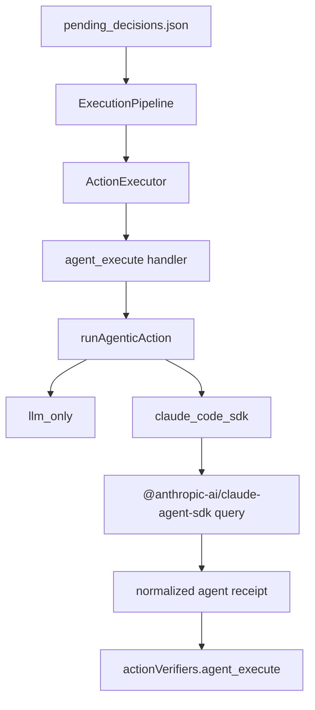

# Agentic Exec 与 Claude SDK Provider 接入记录

> 日期：2026-05-12
> 项目：js-evolution-agent
> 类型：架构设计 / 功能实现 / 调研分析 / 问题排查
> 来源：Cursor Agent 对话

---

## 目录

1. [背景与动机](#1-背景与动机)
2. [分析过程](#2-分析过程)
3. [方案设计](#3-方案设计)
4. [实现要点](#4-实现要点)
5. [验证与测试](#5-验证与测试)
6. [结果复盘](#6-结果复盘)
7. [后续演化](#7-后续演化)

---

## 1. 背景与动机

本次工作从 `run.mjs` 中的 exec 阶段开始。目标是弄清当前项目工作流里 `ExecutionPipeline` 到底如何执行决策，以及能否把 LLM 或其它 agent 接入 exec，使队列中的 action 不再只由本地代码 handler 处理，而是可以委托给更强的模型/agent 自主执行。

初始分析确认：

- `run.mjs` 的 Phase 2 使用 `js-evolution-engine` 中的 `ExecutionPipeline`。
- `ExecutionPipeline` 本身不直接调用 LLM 执行动作，而是从 `pending_decisions.json` claim 决策，再通过 `ActionExecutor` 调用 `host.actionHandlers[action.type]`。
- 当前仓库的动作 handler 位于 `src/actions/handlers.mjs`，主要做 observation、probe、review、receipt 记录等本地操作。

因此，本次核心目标不是重写 exec pipeline，而是在现有 action handler 层新增一个 agent-backed 执行入口，让 exec 继续保持队列调度与状态流转职责。

---

## 2. 分析过程

分析分为四步。

| 阶段 | 重点 | 结论 |
| ---- | ---- | ---- |
| exec 源码阅读 | `node_modules/js-evolution-engine/src/pipelines/exec.mjs` | exec 从 queue/GitHub claim 决策，逐条调用 `ActionExecutor.execute(action)`。 |
| handler 边界确认 | `src/actions/handlers.mjs`、`oada.config.mjs` | 真正执行点是 `host.actionHandlers`，`aiClient` 只作为 `ctx.ai` 暴露给 handler。 |
| Agentic Exec 设计 | 用户要求“尽量减少代码式限制” | 采用宽松 action schema，把详细行动交给 agent，自身只保留边界、receipt、状态。 |
| Claude SDK 调研 | Claude Agent SDK / DeepSeek Claude Code 接入文档 | 官方包为 `@anthropic-ai/claude-agent-sdk`，可通过 `query()` 驱动 Claude Code agent loop；DeepSeek 可通过 Anthropic-compatible 环境变量接入。 |

关键判断：

1. `ExecutionPipeline` 不应承载模型执行逻辑，否则会把队列调度和 agent 能力耦合。
2. `agent_execute` 应作为宽松委托动作存在，允许上游 LLM 决策阶段把开放式任务放入队列。
3. provider 应放在 `src/actions/agent-adapter.mjs`，先支持 `llm_only`，再加入 `claude_code_sdk`。
4. Claude Agent SDK 不是普通文本 LLM API，而是带工具、权限、工作目录、设置源、stream 消息的 agent runtime。
5. 由于用户希望模型/agent 能力优先，Claude SDK 默认使用 `bypassPermissions`，同时记录到 receipt 便于审计。

---

## 3. 方案设计

最终设计保留原有 exec 流程，只在 action handler 背后增加 agent adapter。



### 关键决策

| 决策 | 选择 | 理由 |
| ---- | ---- | ---- |
| 接入位置 | `actionHandlers.agent_execute` | 不改引擎依赖，保留 exec 的调度边界。 |
| action 类型 | 新增 `agent_execute` | 让 LLM 决策阶段可以显式委托 agent。 |
| provider 抽象 | `llm_only` / `claude_code_sdk` / 预留 `cursor_sdk`、`cli_agent` | 后续可替换或新增 agent runtime。 |
| Claude SDK 默认权限 | `bypassPermissions` | 满足“尽量发挥模型/agent 本身能力”的方向。 |
| 设置源 | 默认 `user,project,local` | 复用本机 Claude Code CLI 的用户、项目、本地配置。 |
| DeepSeek 接入 | `ANTHROPIC_BASE_URL=https://api.deepseek.com/anthropic` + `ANTHROPIC_AUTH_TOKEN` | 按 DeepSeek 官方 Claude Code 接入文档配置。 |
| 凭证检查 | `ANTHROPIC_API_KEY` 或 `ANTHROPIC_AUTH_TOKEN` 任一可用 | 兼容 Anthropic 官方 key 与 DeepSeek Bearer token。 |

---

## 4. 实现要点

### 项目结构

```text
js-evolution-agent/
├── src/actions/
│   ├── agent-adapter.mjs
│   ├── handlers.mjs
│   └── registry.mjs
├── test/
│   └── actions.test.mjs
├── .env.example
├── package.json
└── package-lock.json
```

### 关键模块

| 文件 | 职责 |
| ---- | ---- |
| `src/actions/registry.mjs` | 注册 `agent_execute`，并在 prompt hint 中说明 provider、mode、settingSources。 |
| `src/actions/handlers.mjs` | 新增 `agent_execute` handler，调用 adapter，记录 evolution event 与 action receipt。 |
| `src/actions/agent-adapter.mjs` | 实现 provider 路由、prompt 构造、Claude SDK options 映射、stream 消费与 receipt 归一化。 |
| `test/actions.test.mjs` | mock Claude SDK，覆盖 provider 路由、权限映射、沙箱编辑、缺凭证路径。 |
| `.env.example` | 增加 DeepSeek Claude Code 默认环境变量示例。 |
| `package.json` | 新增 `@anthropic-ai/claude-agent-sdk` 依赖。 |

### Agentic action

`agent_execute` 采用宽松参数，而不是把步骤写死在代码里：

| 参数 | 用途 |
| ---- | ---- |
| `objective` | 要完成什么。 |
| `context` | 背景和已有观察。 |
| `mode` | `observe`、`propose`、`patch_proposal`、`sandbox_patch`、`core_apply`。 |
| `boundary` | 工作目录、sandbox/worktree、审批信息等。 |
| `acceptance` | 完成标准。 |
| `provider` | `llm_only` 或 `claude_code_sdk` 等。 |

### Claude SDK options

Claude provider 的默认行为：

- `permissionMode: "bypassPermissions"`。
- `allowDangerouslySkipPermissions: true`。
- `settingSources: ["user", "project", "local"]`。
- `sandbox_patch` 使用编辑工具：`Read`、`Edit`、`Write`、`Bash`、`Grep`、`Glob`。
- `observe` / `propose` / `patch_proposal` 默认仍只给读类工具，但在 `bypassPermissions` 下主要用于记录与审计，并不作为强限制。

### DeepSeek Claude Code 配置

按 DeepSeek 官方文档 [接入 Claude Code](https://api-docs.deepseek.com/zh-cn/quick_start/agent_integrations/claude_code)，`.env.example` 增加：

- `ANTHROPIC_BASE_URL=https://api.deepseek.com/anthropic`
- `ANTHROPIC_AUTH_TOKEN=`
- `ANTHROPIC_MODEL=deepseek-v4-pro`
- `ANTHROPIC_DEFAULT_OPUS_MODEL=deepseek-v4-pro`
- `ANTHROPIC_DEFAULT_SONNET_MODEL=deepseek-v4-pro`
- `ANTHROPIC_DEFAULT_HAIKU_MODEL=deepseek-v4-flash`
- `CLAUDE_CODE_SUBAGENT_MODEL=deepseek-v4-flash`
- `CLAUDE_CODE_EFFORT_LEVEL=max`

由于 DeepSeek 文档使用的是 `ANTHROPIC_AUTH_TOKEN`，代码中的 Claude SDK 凭证检查也同步改为接受 `ANTHROPIC_API_KEY` 或 `ANTHROPIC_AUTH_TOKEN`。

---

## 5. 验证与测试

### 自动化测试

执行结果：

```text
npm test

Test Files  4 passed (4)
Tests       82 passed (82)
```

覆盖点：

- `llm_only` 仍可通过 `ctx.ai` 工作。
- `claude_code_sdk` provider 可以路由到 SDK query。
- `claude_code` / `claude_agent_sdk` alias 会归一到 `claude_code_sdk`。
- 默认 `permissionMode` 为 `bypassPermissions`，并自动设置 `allowDangerouslySkipPermissions: true`。
- 默认 `settingSources` 为 `user,project,local`。
- `sandbox_patch` 会使用编辑工具集合。
- 缺少 `ANTHROPIC_API_KEY` 与 `ANTHROPIC_AUTH_TOKEN` 时会 deferred，不会调用 SDK。

### 真实连通性测试

在项目根目录通过 `dotenv` 加载本地 `.env` 后，真实调用 `runAgenticAction` 的 `claude_code_sdk` provider，使用 `permissionMode: plan` 做连通性探测。

结果：

| 项 | 结果 |
| ---- | ---- |
| `success` | `true` |
| `error` | `null` |
| `agent.status` | `completed` |
| `permissionMode` | `plan` |
| 耗时 | 约 12s |

这证明当前机器的环境变量与 DeepSeek Anthropic-compatible 端点可以被 Claude Agent SDK 正常使用。

### 真实编辑链路测试

随后在系统临时目录创建 disposable sandbox，真实调用 `mode: sandbox_patch`，不覆盖默认权限，让 provider 使用默认：

- `permissionMode: bypassPermissions`
- `allowDangerouslySkipPermissions: true`
- `allowedTools: Read, Edit, Write, Bash, Grep, Glob`

任务要求 Claude 在沙箱内创建 `agent-smoke.txt`，内容为 `CLAUDE_SDK_OK`。

结果：

| 项 | 结果 |
| ---- | ---- |
| `success` | `true` |
| `permissionMode` | `bypassPermissions` |
| `allowDangerouslySkipPermissions` | `true` |
| `agent-smoke.txt` | 存在 |
| 文件内容 | `CLAUDE_SDK_OK\n` |
| 影响范围 | 仅系统临时目录，不影响仓库源码 |
| 耗时 | 约 23s |

---

## 6. 结果复盘

本次工作完成了从“exec 只能调用本地 handler”到“exec 可以委托 agent runtime 执行”的关键转变。

主要结果：

1. `ExecutionPipeline` 没有被改动，仍然保持引擎层的队列消费与状态流转职责。
2. `agent_execute` 成为一个低约束、高自治的 action 类型。
3. `llm_only` 可以继续使用现有 `ctx.ai` 做分析/提案。
4. `claude_code_sdk` 可以通过 Claude Agent SDK 执行真实 agent loop。
5. DeepSeek 的 Anthropic-compatible 接入方式已被 `.env.example` 记录，并通过真实调用验证。
6. 沙箱验证证明默认 `bypassPermissions + 编辑工具` 能实际落盘写文件。

过程中遇到的问题：

| 问题 | 处理 |
| ---- | ---- |
| `npm install @anthropic-ai/claude-agent-sdk` 出现 peer dependency 冲突 | 使用 `--legacy-peer-deps` 安装。 |
| DeepSeek 文档使用 `ANTHROPIC_AUTH_TOKEN`，原代码只检查 `ANTHROPIC_API_KEY` | 修改检查逻辑，任一凭证存在即可。 |
| SDK 返回 JSON 时可能包在 Markdown code fence 中 | 当前 parse fallback 可归一为 completed summary，后续可进一步强化结构化解析。 |
| `bypassPermissions` 风险较高 | 按用户要求设为默认，但把权限模式、工具、cwd、settingSources 写入 receipt，保留审计能力。 |

---

## 7. 后续演化

近期可继续推进：

1. **更强 JSON receipt 解析**：优先解析 Markdown fence 内 JSON，避免 `message` 留下完整代码块。
2. **真实 exec 队列演练**：向 `pending_decisions.json` 写入一条 `agent_execute`，完整跑 `run.mjs` 的 exec + verify + goals。
3. **sandbox/worktree 管理**：为 `sandbox_patch` 自动创建隔离 worktree 或 runtime 草稿目录，而不是依赖 action 显式传入。
4. **核心层审批**：`core_apply` 在默认 `bypassPermissions` 下能力很强，应增加清晰的人工审批 action 或 receipt gate。
5. **provider 配置文档**：补充一篇面向使用者的说明，区分 DeepSeek OpenAI-compatible、DeepSeek Anthropic-compatible、Anthropic first-party 三套环境变量。
6. **CI 安全测试**：新增不依赖真实 API 的 adapter contract test，确保危险默认值被清晰记录到 receipt 中。
