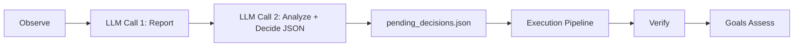

# 对话式报告决策实施、运行与提示词修正记录

> 日期：2026-05-12
> 项目：js-evolution-agent
> 类型：架构设计 / 功能实现 / 问题排查 / 调研分析
> 来源：Cursor Agent 对话

---

## 目录

1. [背景与动机](#1-背景与动机)
2. [分析过程](#2-分析过程)
3. [方案设计](#3-方案设计)
4. [实现要点](#4-实现要点)
5. [验证与测试](#5-验证与测试)
6. [运行结果与问题复盘](#6-运行结果与问题复盘)
7. [后续演化](#7-后续演化)

---

## 1. 背景与动机

本次工作围绕 `js-evolution-agent` 的一轮自演进流程展开。最初的问题是：当前 `pending_decisions.json` 的生成逻辑、`actions` 的范围、以及人类可读情报报告是否参与 `Analyze+Decide` 的上下文。

分析后确认：

- `pending_decisions.json` 由 Phase 1 的 `IntelligencePipeline` 在本地模式下写入。
- 原来的情报报告 Phase 1.5 是 `Analyze+Decide` 之后的后置产物，不会进入本轮决策上下文。
- `actions` 在 prompt 层受到 `ACTION_REGISTRY` 引导，但入队时没有强制校验；真正的执行边界由 `host.actionHandlers` 决定。

随后讨论出新的方向：不要把报告作为事后解释，而是把两次 LLM 调用改成连续对话。第一次调用生成报告，第二次调用重建完整 OpenAI-compatible messages，把第一次的 assistant 报告作为上下文，再生成严格 JSON 的 `Analyze+Decide`。

---

## 2. 分析过程

本次分析涉及的关键模块如下：

| 文件 | 发现 |
| ---- | ---- |
| `run.mjs` | 原流程为 `IntelligencePipeline -> buildIntelReport -> ExecutionPipeline -> verify -> goals assess`。 |
| `node_modules/js-evolution-engine/src/pipelines/intel.mjs` | 本地模式下写 `draft_issues` 并调用 `DecisionQueue.addDecisions`。 |
| `node_modules/js-evolution-engine/src/engine.mjs` | `observeAnalyzeAndDecide` 一次性完成观察、分析和决策。 |
| `src/intelligence/report-builder.mjs` | 原报告构建器依赖 `intelResult`，天然偏向后置报告。 |
| `src/ai/deepseek-client.mjs` | 原 DeepSeek 客户端只接受单字符串 prompt，底层实际使用 OpenAI-compatible Chat Completions。 |
| `src/intelligence/conversation-prompts.mjs` | 新增后成为报告与决策对话 prompt 的集中定义。 |

关键判断：

1. 物理上仍然是两次 LLM 请求，但第二次请求可以通过完整 messages 重建逻辑连续性。
2. 不应直接修改 `node_modules/js-evolution-engine`，因为当前项目以 npm 依赖消费引擎。更稳妥的方式是在宿主层新增对话式 intel pipeline。
3. 报告阶段发生在 `Analyze+Decide` 之前，因此上下文不能包含“本轮已生成 actions / decisions / draft / execution / verification”等尚未发生的内容。
4. 第二次决策必须继续保留 JSON schema、action registry、目标对齐和证据约束，避免被第一篇自由 Markdown 报告带偏。

---

## 3. 方案设计

最终采用的流程为：



### 关键决策

| 决策 | 选择 | 理由 |
| ---- | ---- | ---- |
| 实现层级 | 宿主层新增 pipeline | 避免修改 npm 依赖中的引擎源码。 |
| LLM 调用格式 | OpenAI-compatible messages | 保留两次调用，同时让第二次继承第一次报告上下文。 |
| 报告位置 | Observe 之后、Analyze+Decide 之前 | 让报告成为决策前的分析产物，而不是事后解释。 |
| 队列格式 | 兼容原 `pending_decisions.json` | 保持执行阶段和已有数据结构不变。 |
| 报告上下文 | 使用 pre-decision 视图 | 不向报告 prompt 注入尚未生成的 actions、decisions、draft、exec、verify。 |

---

## 4. 实现要点

### 项目结构

```text
js-evolution-agent/
├── run.mjs
├── src/
│   ├── ai/
│   │   ├── deepseek-client.mjs
│   │   └── messages.mjs
│   └── intelligence/
│       ├── conversation-prompts.mjs
│       ├── conversational-intel-pipeline.mjs
│       ├── decision-queue.mjs
│       └── report-builder.mjs
└── test/
    └── conversational-intel-pipeline.test.mjs
```

### 关键模块

| 文件 | 职责 |
| ---- | ---- |
| `src/ai/deepseek-client.mjs` | 新增 `chatMessages(messages, opts)`，直接走 OpenAI-compatible Chat Completions。 |
| `src/ai/messages.mjs` | 提供 messages 兼容层；无原生 messages 能力时序列化为文本回退到 `chat()`。 |
| `src/intelligence/conversation-prompts.mjs` | 定义统一 system prompt、报告 user prompt、决策 user prompt。 |
| `src/intelligence/conversational-intel-pipeline.mjs` | 编排 Observe、报告生成、报告持久化、第二次决策、草稿与队列写入。 |
| `src/intelligence/decision-queue.mjs` | 宿主侧实现兼容引擎队列格式的本地队列写入器。 |
| `src/intelligence/report-builder.mjs` | 抽出 `prepareIntelReport` 和 `persistIntelReport`，供对话式 pipeline 复用。 |
| `run.mjs` | Phase 1 切换为 `ConversationalIntelligencePipeline`；Phase 1.5 改为复用已生成报告。 |

---

## 5. 验证与测试

实现后执行了完整测试：

```powershell
npm test
```

结果：

- 4 个测试文件通过。
- 77 个测试通过。
- 新增测试覆盖：
  - messages fallback 序列化。
  - 对话 messages 顺序：`system -> user(report) -> assistant(report) -> user(decide)`。
  - 报告生成后再决策并写入队列。
  - `pending_decisions.json` 的 decision 结构保持兼容。
  - 报告 prompt 不再包含决策前尚未生成的 `decisions_queued` 字段。

随后使用 `ReadLints` 检查改动文件，未发现 linter 诊断。

---

## 6. 运行结果与问题复盘

正式执行一次进化：

```powershell
npm start
```

本轮运行结果：

| 项 | 结果 |
| ---- | ---- |
| cycle | `cycle-20260512-161234` |
| 报告 | `runtime/subjects/js-evolution-agent/data/intelligence/reports/cycle-20260512-161234.md` |
| 决策入队 | 3 条 |
| 执行动作 | `record_observation` x2，`request_core_review` x1 |
| 执行结果 | 3 条全部成功 |
| verify | 3 verified，0 pending |
| verify 报告 | `runtime/subjects/js-evolution-agent/data/evolution/verify_reports/exec-20260512-162009.json` |
| goals assess | `insufficient_evidence`，confidence low |

运行后发现报告中出现一个误判：报告声称 `draft_issues/cycle-20260512-161234` 不存在，但实际完整流程结束后该目录存在。

复盘后确认根因不是文件系统错误，而是时序问题：

1. 对话式报告发生在 `Analyze+Decide` 之前。
2. 此时本轮 `actions`、`decisions_queued`、`draft_issues` 尚未生成。
3. 原报告上下文中传入了一个带空 `actions` / 空 `decisions_queued` 的 `preliminaryIntelResult`。
4. 模型把“尚未生成”误读成了“缺失 / 异常”。

修正措施：

- 给报告阶段构造专门的 pre-decision context。
- `current_cycle` 只保留 `cycle_id`、`mode`、`stage` 和简短 note。
- 不再向报告 prompt 注入本轮尚未生成的 `actions`、`decisions_queued` 等字段。
- 精简提示词，避免出现“草稿缺失 / 异常 / 失败”等容易反向锚定模型的词。

修正后再次执行：

```powershell
npm test
```

结果仍为 4 个测试文件、77 个测试全部通过。

---

## 7. 后续演化

近期可继续改进：

1. 将报告阶段的 `Machine Context` 明确拆成 `pre_decision_context`，从命名层面避免误解。
2. 在 report index 中记录 `stage: pre_analyze_decide_report`，便于后续区分前置报告和后置总结。
3. 考虑增加一个后置 execution summary report，用于记录执行与核验结果，避免前置报告承担事后解释职责。
4. 决策前可增加 action type 校验或 warning，将未知 action type 标记为 deferred-before-queue，而不是等执行阶段才 deferred。
5. 对历史 pending 队列进行治理，避免旧周期 pending 长期堆积影响人工阅读。

---

记录时间：2026-05-12 16:42:47 +08:00
