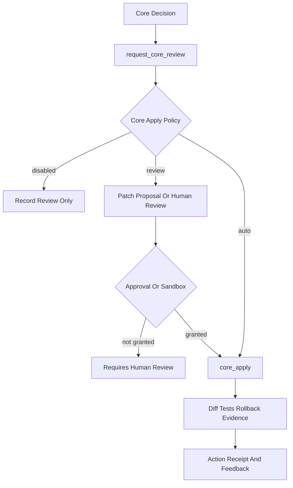
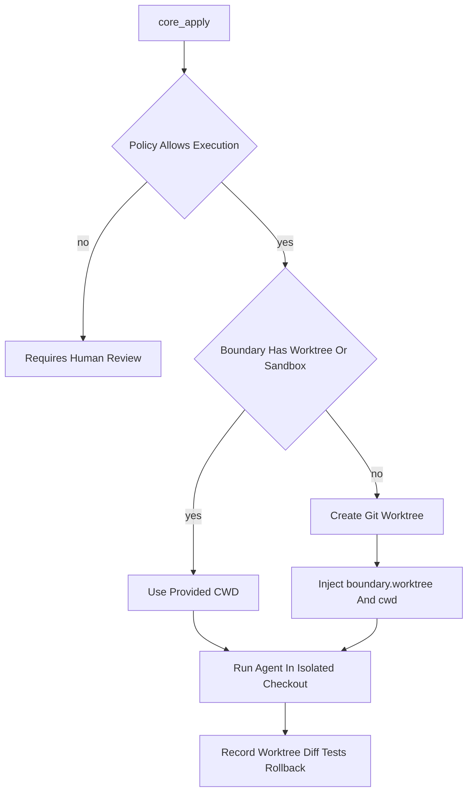

# 进化安全与核心变更协议化

> 日期：2026-05-14
> 项目：js-evolution-agent
> 类型：问题排查 / 架构设计 / 功能实现 / 调研分析
> 来源：Cursor Agent 对话

---

## 目录

1. [背景与动机](#1-背景与动机)
2. [分析过程](#2-分析过程)
3. [方案设计](#3-方案设计)
4. [实现要点](#4-实现要点)
5. [验证与测试](#5-验证与测试)
6. [后续演化](#6-后续演化)

---

## 1. 背景与动机

本次工作起点是一系列连续自演化循环暴露出的安全与治理问题。`js-evolution-agent` 在完成 bootstrap 验证后，主动执行了 safe-runtime 边界探针。探针结果显示：当前 agent provider 的读取能力并不受运行时数据命名空间约束，`.env` 与 `node_modules` 等命名空间外路径可被读取。后续写隔离探针进一步证明：当前 agent 执行层同样不能阻止越界写入，项目根、敏感路径与路径穿越测试都能成功创建临时文件。

随后又发现两个更深层问题：

1. `request_core_review` 原本会因 agent 没有返回 `writes.core_reviews` 而无法持久化核心审核请求。
2. Phase 2 / Phase 3 的 action receipt、conversation context、verify report 等持久化产物缺少统一脱敏，可能把敏感内容继续传播到后续循环。
3. `core_apply` 被 provider 层硬编码为“无显式批准则 requires_human_review”，但 agent 实际已经拥有较大文件系统权限；这不是安全边界，只是流程门槛。
4. safe-runtime 目标曾隐含“当前系统能强制读写隔离”的期待，但实验证据表明当前 provider 下只有行为协议、预检和审计，不能声明硬隔离。

因此，本次工作的目标不是简单“禁止 agent 做核心变更”，而是将安全与核心变更治理从隐式 prompt 约束升级为显式协议：

- 敏感信息必须脱敏后才能进入长期记忆。
- 核心审核请求必须能入库，不能因 agent 输出格式不完整而静默失败。
- 核心变更必须可策略化执行，并默认进入隔离 worktree，留下 diff、测试和回滚证据。
- safe-runtime 必须从“硬隔离承诺”重标定为“软约束、审批、审计与未来外部沙箱路线图”。

---

## 2. 分析过程

### 2.1 已观测后果

| 后果 | 证据含义 |
| ---- | ---- |
| safe-runtime 读边界探针能读取命名空间外路径 | `boundary` 只是 prompt 约束，不是文件系统沙箱 |
| safe-runtime 写边界探针可越界创建临时文件 | 当前 agent 执行层没有强制写入隔离 |
| `request_core_review` 失败且提示缺少 `writes.core_reviews` | handler 过度依赖 agent-first 写入契约 |
| 运行产物中可能包含密钥片段 | store、conversation context、verify raw response 缺少统一脱敏 |
| provider 层阻止 `core_apply` 无批准执行 | 这是流程门槛，不是实际能力约束 |

### 2.2 第一性原理判断

从第一性原理看，安全边界应先问：

- 谁真正有能力改变系统？
- 哪些变化会伤及主体连续性？
- 如果变化失败，是否可隔离、可审计、可回滚？

当前 agent 已经具备较大读写能力，因此“禁止 core_apply”不能被当成真正安全机制。它只能算治理协议的一部分。如果没有正式核心变更通道，agent 仍可能通过其他全权限路径产生改动，反而绕过审计。

更合理的判断是：自演化系统不应消灭变化，而应让变化可感知、可约束、可恢复。

### 2.3 Cyber-Taoist 视角

结合 Cyber-Taoist 进化学应用指南，本次系统处于“试探性突破”向“规则更新”过渡阶段：

- **事实**：边界探针已证明旧 safe-runtime 读隔离与写隔离假设都不成立。
- **推断**：旧法则“prompt boundary 足以代表安全边界”已经失效。
- **规则更新**：当前 provider 下应把读写边界视为 agent 行为协议、host preflight、审批与审计组合，而不是 provider / 文件系统硬隔离。

分形守破结构如下：

| 层级 | 本系统中的含义 | 策略 |
| ---- | ---- | ---- |
| 核心层 | 操作者信任、密钥、主分支、运行时记忆、外部依赖包 | 不能被无记录地破坏 |
| 缓冲层 | 当前工作区、测试失败、可回滚代码改动 | 可承受，但必须可恢复 |
| 探针层 | probe、patch proposal、sandbox/worktree core apply | 允许失败，失败必须回传信息 |

因此，`core_apply` 不应被永久堵住，而应成为“可死亡探针”：可以尝试，但必须有死亡边界、验证结果和回滚方案。

---

## 3. 方案设计

### 关键决策

| 决策 | 选择 | 理由 |
| ---- | ---- | ---- |
| 敏感信息处理 | 新增统一脱敏层 | 单点处理 store、report、conversation context、verify result，避免密钥扩散 |
| `request_core_review` | 只负责审核请求入库，不执行核心变更 | review 与 apply 分离，防止审核请求被执行门槛卡死 |
| safe-runtime 目标口径 | 重标定为软约束 + 审计 + 未来硬隔离 | 当前 provider 不提供真实读写沙箱，不能伪造安全承诺 |
| `core_apply` | 新增独立 action + 策略控制 | 让核心变更成为正式协议，而非借 `agent_execute` 隐式表达 |
| 核心变更执行位置 | 自动 git worktree | 策略允许执行时默认隔离到 `.worktrees/`，不直接修改主工作区 |
| 默认核心策略 | `JEA_CORE_APPLY_POLICY=review` | 保守默认；无批准或 sandbox 时不落地修改 |
| 自动核心变更 | `auto` 策略允许，但强制审计证据 | 承认 agent 可变更核心，同时要求 diff/test/rollback |
| 边界风险审计 | 新增 `boundary_risk` | 区分 agent 行为合规、host preflight 与 provider 硬隔离 |

### 核心变更协议



### 自动 Worktree 隔离

在继续讨论后，又补充了一层执行隔离：`core_apply` 一旦被策略允许执行，不再默认使用主工作区，而是优先使用独立 git worktree。



设计约束：

- 默认 `review` 且无批准时仍不创建 worktree、不执行变更。
- 如果 action 已显式提供 `boundary.worktree` / `boundary.sandbox` / `cwd`，尊重用户路径。
- 如果策略允许执行且未提供隔离路径，则自动创建 `.worktrees/js-evolution-agent/<name>`。
- 不自动合并回主工作区。
- 不自动删除 worktree，保留现场供审计；receipt 中提供 cleanup hint。

---

## 4. 实现要点

### 项目结构

```text
js-evolution-agent/
├── src/
│   ├── actions/
│   │   ├── agent-adapter.mjs
│   │   ├── handlers.mjs
│   │   ├── registry.mjs
│   │   └── worktree-manager.mjs
│   ├── cli/
│   │   └── utils/i18n.mjs
│   └── intelligence/
│       ├── conversation-context.mjs
│       ├── conversation-prompts.mjs
│       ├── goal-assessor.mjs
│       ├── redaction.mjs
│       ├── report-builder.mjs
│       └── store.mjs
└── test/
    ├── actions.test.mjs
    └── intelligence.test.mjs
```

### 关键模块

| 文件 | 职责 |
| ---- | ---- |
| `src/intelligence/redaction.mjs` | 统一脱敏常见密钥格式与敏感字段 |
| `src/intelligence/store.mjs` | 所有 intelligence 持久化入口统一调用脱敏 |
| `src/intelligence/conversation-context.mjs` | conversation context 与 semantic verify 输入输出脱敏，并要求输出 `boundary_risk` |
| `src/intelligence/conversation-prompts.mjs` | Analyze+Decide 阶段要求边界相关 action 明确软约束、审批、审计和清理 |
| `src/intelligence/goal-assessor.mjs` | goal assess 消费 verify report 中的 `boundary_risk`，区分软约束与硬隔离 |
| `src/intelligence/report-builder.mjs` | 写入 Markdown 报告前脱敏 |
| `src/actions/handlers.mjs` | 修复 `request_core_review`，新增 `core_apply` 策略 handler、严格 verifier、`run_probe` 目标级预检与 `boundary_risk` 审计 |
| `src/actions/agent-adapter.mjs` | 移除 provider 层 `core_apply` 硬审批，将策略上移到 handler |
| `src/actions/registry.mjs` | 注册 `core_apply` action spec，并统一 `boundary` 是操作契约而非沙箱承诺 |
| `src/actions/worktree-manager.mjs` | 封装 git worktree 创建、命名、分支和 cleanup hint |
| `src/cli/utils/i18n.mjs` | 更新 safe-runtime 默认目标文案，明确当前 provider 下读写边界是软约束，硬隔离属于未来外部沙箱能力 |

### 修复一：统一脱敏

统一脱敏层覆盖：

- action receipts
- probe results / probe threads
- observations
- retrospectives
- evolution events
- goal events
- standing memory
- intel reports index
- conversation context
- semantic verify raw response

脱敏目标包括：

- `sk-...`
- `crsr_...`
- Anthropic 风格 token
- `API_KEY` / `AUTH_TOKEN` / `ACCESS_TOKEN` / `SECRET` / `PASSWORD` 等字段

### 修复二：核心审核入库

`request_core_review` 被重新定义为“记录审核请求”，不执行核心变更：

- agent 返回 `writes.core_reviews` 时优先使用。
- agent 未返回时，从 action params 合成 `core_review_requested` 事件。
- 状态保持 `requires_human_review`。
- 不再因缺少 `writes.core_reviews` 而阻断审核请求入库。

### 修复三：safe-runtime 目标澄清

默认目标文案从“数据命令仅作用于命名空间”改为更精确的表述：

- 当前 provider 不提供硬读写隔离。
- agent 默认只读写当前主体相关上下文和运行时数据。
- 越界、敏感或核心层动作必须先审批并留下审计回执。
- 敏感读取只允许持久化脱敏元数据，不能写入明文证据。
- 真正硬隔离需要 cwd、worktree、容器、ACL、禁用工具或 provider enforcement。

### 修复四：核心变更协议化

新增 `core_apply` action spec 与 handler。策略由 `JEA_CORE_APPLY_POLICY` 控制：

| 策略 | 行为 |
| ---- | ---- |
| `disabled` | 不调用 agent，记录待人审 |
| `review` | 默认；无批准且无 sandbox/worktree/cwd 时不执行 |
| `auto` | 允许自动执行，但必须有审计证据 |

`core_apply` 的审计证据包括：

- changed files
- diff summary
- test results / tests run
- rollback plan
- death boundary result

缺少关键审计字段时，verifier 最多标记为 `partial`，不能标记为 `improved`。

### 修复五：自动 Worktree 隔离

新增 `src/actions/worktree-manager.mjs`，封装 `git worktree` 生命周期：

- 使用 `git rev-parse --show-toplevel` 确认仓库根目录。
- 默认 worktree 根路径为 `.worktrees/js-evolution-agent/`。
- 分支名使用 `jea/core-apply/<name>`。
- 创建命令为 `git worktree add -b <branch> <path> HEAD`。
- 返回 `path`、`branch`、`auto_created`、`cleanup_hint`。

`core_apply` handler 的执行逻辑也随之调整：

| 场景 | 行为 |
| ---- | ---- |
| `disabled` | 不创建 worktree，不执行 |
| 默认 `review` 且无批准 | 不创建 worktree，不执行 |
| `review + approval_granted` | 若无显式 worktree，自动创建 |
| `auto` | 若无显式 worktree，自动创建 |
| 显式 `boundary.worktree/sandbox/cwd` | 直接使用用户提供路径 |
| worktree 创建失败 | 阻塞，不回退到主工作区 |

同时在 `.gitignore` 加入 `.worktrees/`，避免隔离工作区被主仓库误跟踪。

### 修复六：`run_probe` 目标级预检

> 追加时间：2026-05-14 12:31:15 +08:00

后续测试发现一个剩余风险：`run_probe` 原本会先把探针交给 agentic provider 执行，只有在 agent 未返回结构化证据且允许 legacy fallback 时，才进入本地主机的 `runReadOnlyProbe`。这意味着即使本地读取器会拦截 `.env`、`.git`、`archives`、密钥文件或项目外路径，显式指向这些目标的探针仍可能先把敏感目标暴露给 agent。

修复方式是在 `run_probe` 进入 agent 前增加 host read-boundary preflight：

- 先用本地主机读取器对 action 的显式 `target` / `targets` / `initial_targets` 做一次预检。
- 如果预检发现目标被本地边界阻断，直接记录 `probe_blocked`、`probe_result` 和 action receipt。
- 不调用 agent，不把敏感目标交给 provider。
- 对混合目标采用保守策略：只要显式目标集合中有一个目标被阻断，整次探针留在本地并记录 blocked 结果。

这里的“混合目标”指显式目标集合，例如 `targets: ["README.md", ".env"]`。如果 target 是项目根目录，本地目录 inventory 会过滤 `.env` 等敏感 entry，但不会因为项目根目录下存在 `.env` 就整体阻断。该修复是**目标级预检**，不是完整文件系统沙箱；agent 后续自主探索仍需要 provider/tool 层路径白名单才能彻底约束。

### 修复七：安全边界重标定

> 追加时间：2026-05-14 13:30:09 +08:00

写隔离主动验证探针执行后，系统获得了完整的边界证据：当前 provider 下读隔离与写隔离都不能被视为硬安全边界。写隔离探针使用 4 组 10 个用例验证：

| 分组 | 预期 | 实际 |
| ---- | ---- | ---- |
| A 组：运行时数据命名空间内写入 | 全部成功 | 3/3 成功 |
| B 组：项目根等越界路径 | 应被拒绝 | 3/3 成功 |
| C 组：敏感路径 | 应被拒绝 | 2/2 成功 |
| D 组：路径穿越/边界情形 | 应被拒绝 | 2/2 成功 |

所有探针临时文件已清理，未留下残余。该结果不是“进化失败”，而是高价值负面证据：safe-runtime 不能再描述为“系统会自动阻止越界读写”，而应描述为“agent 行为协议、审批、审计、脱敏、death boundary 与未来硬隔离路线图”的组合。

本次重标定实施内容：

1. **主体策略更新**  
   在 `policies/subjects/js-evolution-agent.md` 新增 Runtime Boundary Model，明确当前 provider 下读写路径边界不是文件系统级硬隔离，`boundary` / `death_boundary` 只有在 cwd、worktree、容器、ACL 或 provider enforcement 支撑时才可称为硬边界。

2. **目标口径更新**  
   更新 `runtime/subjects/js-evolution-agent/data/goals/active_goals.json` 与 `src/cli/utils/i18n.mjs` 默认目标。`safe-runtime` 现在强调 agent 默认不越界、越界需审批并审计、敏感内容只脱敏持久化、硬隔离是未来外部沙箱能力。

3. **action 语义更新**  
   `run_probe` 不再自称 `sandboxed read-only probe`，而是 `bounded read-only probe`。action hint 明确：host preflight 可阻断本地 fallback 探针，但不证明 provider 级隔离。

4. **决策 prompt 更新**  
   Analyze+Decide 阶段要求边界相关 action 必须说明 `boundary` 是软操作约束，不是沙箱承诺，并写清审批、审计和清理方式。

5. **预检语义修正**  
   `run_probe` 仍保留 host preflight 的保守阻断行为，但 action receipt 里的说明从“host read boundary prevented agent access”改为“host preflight blocked local probe; provider-level agent access is not guaranteed blocked”。

6. **结构化边界风险审计**  
   `agent_execute` 结果新增 `boundary_risk`，记录：

   - `boundary_contract`
   - `boundary_model`
   - `sandbox_backing`
   - `approval_granted`
   - `requires_approval`
   - `writes_observed`
   - `declared_paths`
   - `sensitive_path_signal`
   - `review_recommended`

   Phase 3 semantic verify prompt 要求读取该字段，并区分 agent 行为合规、host preflight 与 provider / 文件系统硬隔离。goal assess 也会把 verify report 中的 `boundary_risk` 纳入目标校准证据。

---

## 5. 验证与测试

本次新增和调整了测试覆盖：

| 测试范围 | 覆盖点 |
| ---- | ---- |
| `request_core_review` | 无 agent writes 时仍能从 params 入库 |
| redaction | action receipt、probe result、conversation context 均不保留明文密钥 |
| `core_apply disabled` | 不调用 agent，记录待人审 |
| `core_apply review` | 默认无批准不执行 |
| `core_apply approval` | 有显式批准时允许执行 |
| `core_apply auto partial` | 自动执行但缺审计证据时标记 `partial` |
| `core_apply auto improved` | 完整 diff/test/rollback 证据时标记 `improved` |
| `core_apply worktree auto` | 批准或 auto 策略下自动创建 worktree，并将 provider cwd 指向隔离路径 |
| `core_apply explicit worktree` | 已提供 `boundary.worktree` 时不自动创建 |
| `core_apply worktree failure` | worktree 创建失败时阻塞，不回退到主工作区 |
| `run_probe sensitive preflight` | 显式敏感目标在 agent 执行前被本地主机边界拦截 |
| `run_probe mixed targets preflight` | 显式混合目标中包含敏感路径时整次探针留在本地，不调用 agent |
| `run_probe boundary wording` | action registry 不再把 probe 描述为 provider sandbox |
| `agent_execute boundary_risk` | 记录软边界、sandbox backing、敏感路径信号和复核建议 |
| semantic verify boundary prompt | Phase 3 要求区分软约束、host preflight 与 provider 硬隔离 |
| goal assess boundary context | goal assess 能消费 verify report 中的 `boundary_risk` |

验证命令：

```powershell
npm test -- test/actions.test.mjs
npm test
```

验证结果：

| 命令 | 结果 |
| ---- | ---- |
| `npm test -- test/actions.test.mjs` | 34 个测试通过 |
| `npm test`（早期核心协议验证） | 4 个测试文件、112 个测试全部通过 |
| `npm test`（安全边界重标定后） | 4 个测试文件、115 个测试全部通过 |
| `node --preserve-symlinks src/cli/jea.mjs run --mock` | cycle-20260514-131911 跑通；3 executed，3 verified，0 pending，semantic ok |
| `ReadLints` | 无 linter 错误 |
| 代码区密钥模式扫描 | 仅命中脱敏正则本身，未发现新增明文密钥 |

---

## 6. 后续演化

### 近期行动

1. **轮换已暴露密钥**  
   历史 runtime 产物中曾出现密钥片段，脱敏修复只保证后续写入，不自动修复历史数据。

2. **历史产物脱敏迁移**  
   若要保留历史数据，应先备份，再对 `runtime/subjects/js-evolution-agent/data/` 下旧 JSON/Markdown 运行一次脱敏迁移。

3. **硬隔离路线评估**  
   读写隔离缺失都已被探针确认。下一步若仍要求硬隔离，应评估容器、受限 cwd、overlay/worktree、文件系统 ACL、禁用 shell/Write 或专用受限写入 API，而不是继续强化 prompt 文案。

4. **worktree 结果合并策略**  
   当前已能自动创建 worktree 并隔离执行，但不会自动合并回主工作区。后续需要设计“审查 diff → 接受/拒绝 → 合并/丢弃”的流程。

5. **将目标级预检升级为 provider 级白名单**  
   当前 `run_probe` 已能拦截显式敏感目标，但这不是完整沙箱。若 agent 在项目根目录内自主探索或执行写入，仍需要 provider/tool 层路径白名单或外部沙箱才能阻止 `.env` 等敏感路径被读取或写入。

### 长期方向

- 将 `core_apply` 与 retrospective 联动：核心变更成功或失败后自动写学习记录。
- 将 death boundary 变成结构化字段，并在 verify 阶段强制检查。
- 为自动 worktree 增加可配置清理策略，例如 `JEA_CORE_WORKTREE_CLEANUP=on_success|never`。
- 为 provider 层增加真正的工具路径白名单，区分“prompt 边界”和“能力边界”。
- 将目标评估中的 `safe-runtime` 拆成两个独立子目标：`boundary-conduct`（当前可执行的软约束/审计）与 `boundary-enforcement`（未来硬隔离能力）。

---

## 结论

这次讨论和实现的核心不是“让 agent 更受限”，而是让系统停止依赖虚假的安全感。

当前更合理的演化方向是：

- 敏感信息默认脱敏；
- 审核请求必须入库；
- 核心变更可以发生，但必须通过显式策略；
- 策略允许的核心变更默认进入隔离 worktree；
- 显式敏感探针目标必须先经过 host read-boundary preflight，不能先交给 agent；
- 当前 provider 下读写边界必须表述为软约束、审批与审计，不能表述为硬隔离；
- `boundary_risk` 必须进入 action receipt、semantic verify 与 goal assess，作为目标校准证据；
- 任何核心变更都必须留下 diff、测试、回滚和死亡边界反馈。

这使 `js-evolution-agent` 从“靠 prompt 自律的受控循环”向“可审计、可恢复、可隔离执行的核心变更协议”前进了一步。
