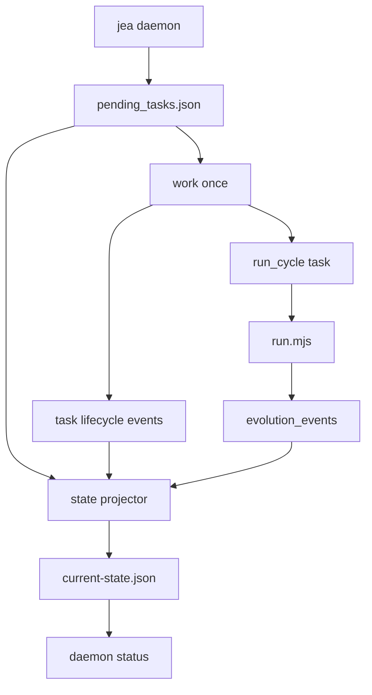

# 事件驱动后台进化：任务队列与 work-once 骨架

> 日期：2026-05-18  
> 项目：js-evolution-agent  
> 类型：架构设计 / 功能实现  
> 来源：Cursor Agent 对话  

---

## 目录

1. [背景与动机](#1-背景与动机)
2. [分析过程](#2-分析过程)
3. [方案设计](#3-方案设计)
4. [实现要点](#4-实现要点)
5. [验证与测试](#5-验证与测试)
6. [后续演化](#6-后续演化)

---

## 1. 背景与动机

多轮进化已从「PowerShell 循环」进化为 [`jea evolve`](../../src/cli/commands/evolve.mjs)，能持久化 manifest、重试、resume。但长期目标是：**异步、事件驱动、可持续在后台推进演化**。

若继续把所有推进都绑在一次性 CLI 进程上，会带来几类问题：

- 进程被杀后，除 manifest 外缺少**通用任务账本**与**统一事件流**；
- 难以被外部调度器（cron、服务、CI）以「拉一次、干一点」的方式驱动；
- 与「决策队列」`pending_decisions.json` 的职责混用风险高。

因此本阶段只做**基础设施**：独立任务队列、任务级事件、`work --once` worker、状态投影；**不**做常驻 `daemon start/stop`，**不**拆 Phase。

---

## 2. 分析过程

**已有能力**

- 单轮仍可由子进程跑根目录 [`run.mjs`](../../run.mjs)；失败时可有结构化 [`JEA_EXIT_RECORD`](../../run.mjs)。
- 情报侧已有 [`IntelligenceStore.recordEvolutionEvent`](../../src/intelligence/store.mjs)，写入 `evolution_events` 的 append-only JSONL。
- [`LocalDecisionQueue`](../../src/intelligence/decision-queue.mjs) 证明了文件锁 + 原子写可行；但其语义是 **action 决策队列**，且锁失败时存在无锁降级路径，**不宜**直接当作 daemon 任务队列。

**取舍**

| 选项 | 结论 |
| ---- | ---- |
| 复用 `pending_decisions.json` 存 daemon 任务 | 否，避免与 `js-evolution-engine` 消费格式混淆 |
| 新增独立 `pending_tasks.json` | 是，专用于 `run_cycle` 等调度任务 |
| 第一阶段常驻进程 | 否，先做 `work --once`，便于测试与外部编排 |
| 任务事件写哪里 | 先复用 `evolution_events`，减少新 source 迁移成本 |
| `proper-lockfile` 同步 API | `lockSync` **不能**带 retries 配置（否则会抛错），与本仓库其它用法需区分 |

---

## 3. 方案设计

整体数据流：CLI 入队 → 队列持锁更新 → worker claim（租约）→ 执行整轮 `run.mjs` → 写任务事件 → 投影供 `status` 展示。



### 关键决策

| 决策 | 选择 | 理由 |
| ---- | ---- | ---- |
| 最小任务类型 | `run_cycle` | 先任务化「一整轮」，不拆 Phase |
| worker 形态 | `jea daemon work --once` | 零守护进程负担，可被外部循环调用 |
| 幂等键 | `idempotency_key` 必填语义（enqueue 时生成或传入） | 避免重复投放同一意图 |
| 失败重试 | 结合 `JEA_EXIT_RECORD` / 现有分类，可重试则回 `pending` | 与 evolve 层错误语义对齐 |
| 与 evolve 衔接 | `jea evolve --enqueue-only` | 批处理用户可改为「只入队、不集中执行」 |

---

## 4. 实现要点

### 数据落盘（按主体）

| 路径（相对 `runtime/subjects/<namespace>/`） | 用途 |
| --------------------------------------------- | ---- |
| `data/evolution/tasks/pending_tasks.json` | daemon 任务队列（热状态） |
| `data/evolution/views/current-state.json` | 投影缓存，可删后重建 |

### 关键模块

| 文件 | 职责 |
| ---- | ---- |
| [`src/cli/utils/daemon-tasks.mjs`](../../src/cli/utils/daemon-tasks.mjs) | enqueue、claim（lease）、complete、fail、重试释放；`proper-lockfile.lockSync` + tmp/rename |
| [`src/cli/utils/daemon-projection.mjs`](../../src/cli/utils/daemon-projection.mjs) | 汇总队列 + 近期 `evolution_events`，写 `current-state.json` |
| [`src/cli/commands/daemon.mjs`](../../src/cli/commands/daemon.mjs) | `enqueue` / `work --once` / `status`；任务生命周期调用 `recordEvolutionEvent` |
| [`src/cli/commands/evolve.mjs`](../../src/cli/commands/evolve.mjs) | `--enqueue-only`：按 rounds × subjects 批量创建 `run_cycle` 任务 |
| [`src/cli/jea.mjs`](../../src/cli/jea.mjs) | 注册 `daemon` 子命令与 help |

### 任务执行

- `run_cycle` 调用现有 [`runSingleCycle`](../../src/cli/commands/evolve.mjs)（子进程 `run.mjs`）。
- 成功：`task_completed` 事件 + 队列 `completed`。
- 失败：若 `retryable` 且未超过 `input.retries` 推导的尝试上限，则回 `pending`；否则 `failed`。

### 可用命令（示例）

```powershell
npm run jea -- daemon enqueue --type run_cycle --subject agentank-tank --mock
npm run jea -- daemon work --once --mock --subject agentank-tank
npm run jea -- daemon status --subject agentank-tank --json
npm run jea -- evolve --rounds 3 --enqueue-only --subject agentank-tank --json
```

---

## 5. 验证与测试

- **单元测试**：[`test/cli.test.mjs`](../../test/cli.test.mjs) 中 `daemon task queue foundation`：入队幂等、claim lease、complete/fail、投影落盘、`workOnce` 在缺少 `run.mjs` 的工程根下失败路径。
- **命令**：`npm test` 全量通过（当前套件含上述用例）。

---

## 6. 后续演化

| 方向 | 说明 |
| ---- | ---- |
| `jea daemon start/stop` | PID、心跳、优雅退出；适合第二阶段 |
| Phase 任务 | `run_cycle` 拆成 observe / exec / verify 等独立 task，需契约与落盘 |
| Action 任务 | `execute_action(decision_id)` 与幂等、风险档位 |
| 纯粹事件源 | 必要时新增专用 `daemon_events` source，再与 `evolution_events` 收敛 |
| 策略调度 | 根据情报事件自动 `enqueue`，形成「持续进化」闭环 |

---

## 与同日另一篇日记的关系

- [`jea-evolve-multi-round-runner.md`](./jea-evolve-multi-round-runner.md)：侧重 **多轮 manifest、resume、观察性强化**。
- 本文：侧重 **任务队列 + worker 雏形 + 与 evolve 入队衔接**，为后台化铺路。

二者可独立阅读；合并演进路线时，可理解为「先看账本跑稳，再把推进从进程绑到任务上」。
