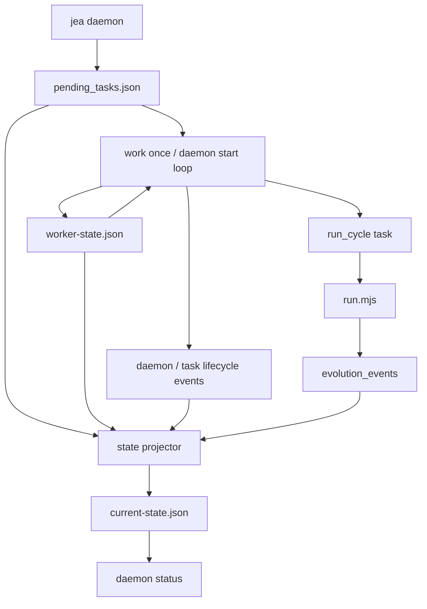

# 事件驱动后台进化：任务队列与 work-once 骨架

> 日期：2026-05-18  
> 项目：js-evolution-agent  
> 类型：架构设计 / 功能实现（同日补记：常驻 worker、长任务租约与停机路径）  
> 来源：Cursor Agent 对话  

---

## 目录

1. [背景与动机](#1-背景与动机)
2. [分析过程](#2-分析过程)
3. [方案设计](#3-方案设计)
4. [实现要点](#4-实现要点)
5. [验证与测试](#5-验证与测试)
6. [后续演化](#6-后续演化)
7. [同日补记：实施、手测与踩坑](#7-同日补记实施手测与踩坑)

---

## 1. 背景与动机

多轮进化已从「PowerShell 循环」进化为 [`jea evolve`](../../src/cli/commands/evolve.mjs)，能持久化 manifest、重试、resume。但长期目标是：**异步、事件驱动、可持续在后台推进演化**。

若继续把所有推进都绑在一次性 CLI 进程上，会带来几类问题：

- 进程被杀后，除 manifest 外缺少**通用任务账本**与**统一事件流**；
- 难以被外部调度器（cron、服务、CI）以「拉一次、干一点」的方式驱动；
- 与「决策队列」`pending_decisions.json` 的职责混用风险高。

因此首轮目标仍是**基础设施**：独立任务队列、任务级事件、`work --once` worker、状态投影；**不**拆 Phase。  
**同日后续迭代**（仍属「奠基」范围、未拆 Phase）在此基础上补齐：`daemon start/stop` 常驻 worker、`worker-state.json` 心跳、长任务期间的**任务租约续约**、`daemon stop` 向 `runSingleCycle`/子进程的**中止信号链路**，以及与情报侧对齐的 **`recordDaemonEvent` 命名空间**——避免仅靠「单次 work 首尾打点」误判 worker/租约陈旧。

---

## 2. 分析过程

**已有能力**

- 单轮仍可由子进程跑根目录 [`run.mjs`](../../run.mjs)；失败时可有结构化 [`JEA_EXIT_RECORD`](../../run.mjs)。
- 情报侧已有 [`IntelligenceStore.recordEvolutionEvent`](../../src/intelligence/store.mjs)，写入 `evolution_events` 的 append-only JSONL。
- [`LocalDecisionQueue`](../../src/intelligence/decision-queue.mjs) 证明了文件锁 + 原子写可行；但其语义是 **action 决策队列**，且锁失败时存在无锁降级路径，**不宜**直接当作 daemon 任务队列。

**取舍**

| 选项 | 结论 |
| ---- | ---- |
| 复用 `pending_decisions.json` 存 daemon 任务 | 否，避免与 `js-evolution-engine` 消费格式混淆 |
| 新增独立 `pending_tasks.json` | 是，专用于 `run_cycle` 等调度任务 |
| 常驻 worker rollout | **初版**：`work --once` 优先，便于测试与外部编排；**同日扩展**：`daemon start/stop` + `worker-state.json`，与长任务租约/心跳配套 |
| 任务事件写哪里 | 先复用 `evolution_events`，减少新 source 迁移成本 |
| `proper-lockfile` 同步 API | `lockSync` **不能**带 retries 配置（否则会抛错），与本仓库其它用法需区分 |
| 与 foreground `jea evolve` 并发 | 同一 subject 通过 `runtime/.../evolution/.evolve.lock` **互斥**；后台 daemon 占用锁时，另开终端跑 `evolve --rounds N` 会立刻失败并提示 `Subject is already running`（属预期防护，而非「卡住」） |

---

## 3. 方案设计

整体数据流：CLI 入队 → 队列持锁更新 → worker claim（租约）→ 执行整轮 `run.mjs`（**长跑期间**续约租约并刷新心跳，必要时响应 `daemon stop`）→ 写任务事件 → 投影供 `status` 展示。



### 关键决策

| 决策 | 选择 | 理由 |
| ---- | ---- | ---- |
| 最小任务类型 | `run_cycle` | 先任务化「一整轮」，不拆 Phase |
| worker 形态 | `work --once` **与** `daemon start` 常驻循环 | 前者便于测试与外部编排；后者提供心跳、租约续约与可请求的优雅停机 |
| 幂等键 | `idempotency_key` 必填语义（enqueue 时生成或传入） | 避免重复投放同一意图 |
| 失败重试 | 结合 `JEA_EXIT_RECORD` / 现有分类，可重试则回 `pending` | 与 evolve 层错误语义对齐 |
| 与 evolve 衔接 | `jea evolve --enqueue-only` | 批处理用户可改为「只入队、不集中执行」 |

---

## 4. 实现要点

### 数据落盘（按主体）

| 路径（相对 `runtime/subjects/<namespace>/`） | 用途 |
| --------------------------------------------- | ---- |
| `data/evolution/tasks/pending_tasks.json` | daemon 任务队列（热状态） |
| `data/evolution/daemon/worker-state.json` | 常驻 worker 的 pid、heartbeat、`stop_requested_at` 等 |
| `data/evolution/views/current-state.json` | 投影缓存，可删后重建 |

### 关键模块

| 文件 | 职责 |
| ---- | ---- |
| [`src/cli/utils/daemon-tasks.mjs`](../../src/cli/utils/daemon-tasks.mjs) | enqueue、claim（租约）、`renewTaskLease`、过期租约回收、排序与摘要；complete/fail、重试释放；`proper-lockfile.lockSync` + tmp/rename |
| [`src/cli/utils/daemon-worker-state.mjs`](../../src/cli/utils/daemon-worker-state.mjs) | `worker-state.json`：创建、`updateWorkerHeartbeat`、`requestWorkerStop`、`markWorkerStopped`、Stale 判定与展示摘要 |
| [`src/cli/utils/daemon-events.mjs`](../../src/cli/utils/daemon-events.mjs) | `recordDaemonEvent`：daemon/任务生命周期事件写入情报侧 store（与同目录其它 writer 对齐） |
| [`src/cli/utils/daemon-projection.mjs`](../../src/cli/utils/daemon-projection.mjs) | 汇总队列、`worker`、`expired_running`、近期 `evolution_events`，写 `current-state.json` |
| [`src/cli/commands/daemon.mjs`](../../src/cli/commands/daemon.mjs) | `enqueue` / `work --once` / `start` / `stop` / `status`；`runDaemonWorker` 循环、过期租约回收、hardening 的 `workRunCycle`（watchdog） |
| [`src/cli/commands/evolve.mjs`](../../src/cli/commands/evolve.mjs) | `runSingleCycle`：`AbortSignal`、子进程 `SIGTERM`/`SIGKILL`、结构化停机记录；`--enqueue-only` 写 daemon 事件 |
| [`src/cli/jea.mjs`](../../src/cli/jea.mjs) | 注册 `daemon` 子命令与 help（含常驻 worker、`heartbeat-ms` / `lease-ms` 等与长任务相关 flag） |

### 任务执行

- `run_cycle` 调用 [`runSingleCycle`](../../src/cli/commands/evolve.mjs)（子进程 `run.mjs`）。
- **长任务（子进程进行中）**：`workRunCycle` 内 watchdog 按间隔刷新 **`updateWorkerHeartbeat`** 与 **`renewTaskLease`**，并读取 `stop_requested_at`；若请求停机则 **`AbortController.abort()`** → `runSingleCycle` 对子进程发 **`SIGTERM`**，必要时 **`SIGKILL`**，并产出结构化 **`daemon_stop_requested`** 一类出口记录。
- **成功**：任务完成事件 + 队列 `completed`。
- **失败 / 中止**：结合 `JEA_EXIT_RECORD` 与 retry 策略；daemon 发起的可重试中断可回 `pending`（例如用户 `daemon stop` 打断时的语义，与实现对齐）。
- **`daemon start`**：主循环在每次 `workOnce` 前后仍会维护 worker 心跳，并处理与本 worker 相关的**过期租约回收**（与长跑任务中的 watchdog 互为补充）。

### 可用命令（示例）

```powershell
# 单次拉取执行任务（编排器友好）
npm run jea -- daemon enqueue --type run_cycle --subject agentank-tank --mock
npm run jea -- daemon work --once --mock --subject agentank-tank
npm run jea -- daemon status --subject agentank-tank --json

# 常驻 worker（长任务时请配合 heartbeat-ms / lease-ms）
npm run jea -- daemon start --subject agentank-tank --max-iterations 1 --mock
npm run jea -- daemon stop --subject agentank-tank

# 只入队、由 daemon 消化
npm run jea -- evolve --rounds 3 --enqueue-only --subject agentank-tank --json
```

---

## 5. 验证与测试

- **单元测试**：[`test/cli.test.mjs`](../../test/cli.test.mjs) 在当前分支除「队列奠基」外，还覆盖：**worker-state** 生命周期与 **stop request**、`reclaimExpiredLeases` **显式回收**、`renewTaskLease` **持有者校验与延期**、`runSingleCycle` 在 **`AbortSignal`** 下结构化停机记录、`runDaemonWorker` 在**长跑任务仿真**中断续续约/心跳、`daemon stop` 向子进程传导并可将任务放回 **pending** 等路径。
- **动作层**：[`test/actions.test.mjs`](../../test/actions.test.mjs) 中与 **`record_observation`** 默认「本地入库」、`provider: llm_only` 时走 agent 路径的断言对齐（见下文 §7）。
- **手测**：`daemon start` + mock/真实一轮用于观察 `status` 与 diary；并曾遇到与 foreground **`evolve` 争抢 subject 锁**的现象（详见 §7）。
- **命令**：`npm test` 全量通过在实施修复后应保持为验收标准。

---

## 6. 后续演化

| 方向 | 说明 |
| ---- | ---- |
| ~~常驻 worker~~ | **已实现（同日）**：`daemon start/stop`、`worker-state`、长跑任务 watchdog、租约续约、停机信号链路；本条留作占位，提醒文档读者「奠基文初稿之后才合并」 |
| Phase 任务 | `run_cycle` 拆成 observe / exec / verify 等独立 task，需契约与落盘 |
| Action 任务 | `execute_action(decision_id)` 与幂等、风险档位 |
| 纯粹事件源 | [`daemon-events.mjs`](../../src/cli/utils/daemon-events.mjs) 已通过 `recordDaemonEvent` 集中写入情报 store；如需独立 **`daemon_events` JSONL** 仍可再分叉后收敛 |
| 策略调度 | 根据情报事件自动 `enqueue`，形成「持续进化」闭环 |
| UX / 运维 | 「已在跑」时对用户的提示（daemon vs `evolve` vs 队列）与一键诊断输出 |

---

## 7. 同日补记：实施、手测与踩坑

以下为 **2026-05-18 对话与代码合并后**的补充事实，不改变上文「为何要任务化」的结论，只对齐**实际落地的行为与教训**。

### 7.1 长周期 `run_cycle`：租约与用户感知的 worker 健康

**现象**：仅用「work 首尾」刷新状态时，长达数分钟～数十分钟的 **`run.mjs`** 执行期间 **任务租约过期**，`status` 上看似 worker 尚 fresh、任务却已 **expired running**，误导运维；同时 **`daemon stop`** 无法在子进程侧及时生效。

**处理**：在 `workRunCycle` 内嵌 **watchdog 定时器**：同周期 **`renewTaskLease`** + **`updateWorkerHeartbeat`** + 读取 **`stop_requested_at`** → **`AbortSignal`** → `runSingleCycle` 内 **`SIGTERM` / `SIGKILL`** 链路；结构化出口记录中包含 **`daemon_stop_requested`**（或等价分类），便于与 `JEA_EXIT_RECORD` 对齐。

### 7.2 与前台 `jea evolve` 的锁互斥（非 bug）

手测：**另开终端**执行 `npm run jea -- evolve --rounds 5 --subject <same> ...` 时，若 daemon 或其它进化进程已持有 **`runtime/subjects/<s>/data/evolution/.evolve.lock`**，会立刻失败：`Subject is already running`。**这是预期**：避免双写 manifest / 回合状态。**若期望「另一条 evolve 在后台跑」**，应先结束占用锁的进程，或只对其它 subject 跑。

### 7.3 真实回合中误判「卡在 record_observation」

**根因**：`record_observation` 曾**无条件**走 Phase 2 agent → 触发 **不必要 DeepSeek 调用**，在真实密钥与网络下表现为长时间停顿。

**修复**： [`src/actions/handlers.mjs`](../../src/actions/handlers.mjs) 中，若 `agentExecutionRequested(action)` 为假（即 **未**提供 `provider`、`force_agent`、`boundary`、`cwd`、`allowedTools`、`maxTurns` 等任一「需要走 agent」字段），则 **默认本地 ingest**（`local` provider），省去 LLM。**需要 agent 参与**时在 action 中加 **`provider`**（或其它命中上述条件的字段）；测试中常用 **`provider: 'llm_only'`** 显式走 agent-first。

### 7.4 DeepSeek 客户端超时未传入底层 SDK

[`src/ai/deepseek-client.mjs`](../../src/ai/deepseek-client.mjs)：`chatMessages` 的 **`timeout`** 此前未传给 `openai.chat.completions.create`，配置超时时仍可能**长时间阻塞**。**已修复**：将 `timeout` 透传到 create 选项。

### 7.5 小结

daemon 侧的「长跑可观测 + 安全中断」与同日的 action/API 两个小修 **独立但互补**：前者保证 **编排层**，后者保证 **单轮进化内部**不会因默认策略或 SDK 封装而「假死」。回归以 **`npm test`** 与关键 CLI 冒烟为准。

---

## 与同日另一篇日记的关系

- [`jea-evolve-multi-round-runner.md`](./jea-evolve-multi-round-runner.md)：侧重 **多轮 manifest、resume、观察性强化**。
- 本文：侧重 **任务队列 + worker（含常驻循环）+ 与 evolve 入队衔接**，为后台化铺路。

二者可独立阅读；合并演进路线时，可理解为「先看账本跑稳，再把推进从进程绑到任务上」；需注意 **同源 subject 上前台 `evolve` 与后台进化仍受 `.evolve.lock` 统一约束**。
