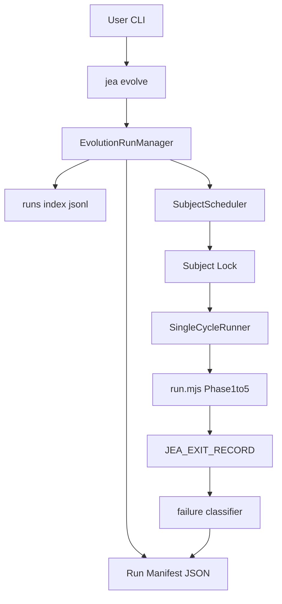

# 多轮进化运行器：从手动循环到可恢复、可调度的一轮调度

> 日期：2026-05-18  
> 项目：js-evolution-agent  
> 类型：架构设计 / 功能实现 / 运维增强  
> 来源：Cursor Agent 对话  

---

## 目录

1. [背景与动机](#1-背景与动机)
2. [分析过程](#2-分析过程)
3. [方案设计](#3-方案设计)
4. [实现要点](#4-实现要点)
5. [验证与测试](#5-验证与测试)
6. [后续演化](#6-后续演化)

---

## 1. 背景与动机

需要执行大量「单轮进化」（intel → exec → verify → goals assess → diary）。当时做法是用 PowerShell 连续调用 `npm run jea -- run` 多次。

**实际结果：** 第 17 轮在 Phase 1 情报管线失败，错误为 **DeepSeek returned empty content**，进程以 **exit code 1** 退出，**后续轮次未执行**；前面约 16 轮已完整跑完。说明仅靠外层的 shell 循环，既不能自动重试瞬时故障，也没有可恢复的进度账本。

因此希望升级系统：**连续多轮、失败可重试、中断可断点续传**，并预留**多主体串行轮转**能力，而不是把复杂度塞进根目录 `run.mjs`。

---

## 2. 分析过程

**现状梳理**

- `jea run` → [`src/cli/commands/run.mjs`](../../src/cli/commands/run.mjs) → 子进程执行根目录 [`run.mjs`](../../run.mjs)，单轮是一个线性脚本，阶段之间靠局部变量串联，**未导出可组合的 API**。
- 活跃主体由 [`policies/active-subject.json`](../../policies/active-subject.json) 决定，解析逻辑在 [`src/cli/utils/subjects.mjs`](../../src/cli/utils/subjects.mjs)。
- 决策队列已有 [`src/intelligence/decision-queue.mjs`](../../src/intelligence/decision-queue.mjs) 的文件锁，但**没有**「批量进化 run」的全局状态文件。

**约束与取舍**

- 第一版不拆 `run.mjs` 的 Phase，避免 decision queue / verify / receipts 的副作用在「半轮恢复」上失控；**断点粒度定为「整轮」**。
- 多主体若每次改 `active-subject.json`，会污染操作者工作区；更合理的是 **进程内临时指定主体**（环境变量），子进程继承即可。
- 失败判定：**优先**使用 [`run.mjs`](../../run.mjs) 异常退出时打印的 **`JEA_EXIT_RECORD { "code", "message", "retryable" }`**（机器可读）；若无该行则再用日志正则作为 fallback（兼容旧输出或非标准错误）。

---

## 3. 方案设计

在 CLI 之上增加一层 **Evolution Supervisor**：manifest 持久化 + 每轮 spawn 一次现有 `run.mjs`；强化阶段再把 `run.mjs` 的结构化退出接入分类与 manifest，并增加按主体的事件索引。

### 关键决策

| 决策 | 选择 | 理由 |
| ---- | ---- | ---- |
| 单轮实现方式 | 子进程执行 `run.mjs` | 零侵入拆分 Phase，尽快可用 |
| 断点粒度 | 轮级 | Phase 级需严格幂等与恢复契约 |
| 多主体指定 | `JEA_SUBJECT` 覆盖读取 | 不改磁盘上的 active subject |
| 并发 | 第一版串行 + 每主体文件锁 | 避免 API 限流与队列竞态 |
| 多主体轮转 | A1→B1→C1→A2… | 每轮每个主体各推进「一格」到目标 `N` 轮 |
| 中断恢复 | 无锁时 stale `running`/`retrying` → `interrupted` | 进程被杀后 manifest 不会永远卡在 running |
| 可观测性 | `runs/index.jsonl` 追加事件 | 便于审计与后续接 UI / 报表 |

---

## 4. 实现要点

### 新增 CLI

- **`jea evolve --rounds N`**：启动批量 run，生成 `run_id`，写入 manifest。
- **`jea evolve --rounds N --subject NAME` / `--subjects a,b,c`**：多主体时每个主体内各写一份 manifest（同名 `run_id`），轮转执行。
- **`jea evolve resume <run_id>`**：加载各主体 manifest 前做中断归一化；打印每主体的 skip/next 摘要；按 manifest 跳过已成功轮次继续。
- **`jea evolve status [run_id]`**：人类可读为多段块（run id、进度、next round、`counts`、最近错误码）；`--json` 含 `last_error_code` / `current_round` / `next_round` 等稳定字段。

入口注册：[`src/cli/jea.mjs`](../../src/cli/jea.mjs)。命令实现：[`src/cli/commands/evolve.mjs`](../../src/cli/commands/evolve.mjs)。

### 状态落盘

- **Manifest**：`runtime/subjects/<namespace>/data/evolution/runs/<run_id>.json`
- **事件索引**：`runtime/subjects/<namespace>/data/evolution/runs/index.jsonl`（追加 `created`、`round_started`、`round_succeeded`、`round_failed`、`run_succeeded`、`run_failed` 等）
- 工具：[`src/cli/utils/evolve-runs.mjs`](../../src/cli/utils/evolve-runs.mjs)

Manifest 中除轮次列表外，另记录 **`last_error_code` / `last_error_reason` / `current_round`**，便于 `status --json` 被脚本消费。

### 单轮与子进程

- [`run.mjs`](../../run.mjs)：失败时 `console.error('JEA_EXIT_RECORD …')`；Phase 2 执行条数可由环境变量 **`JEA_EXEC_LIMIT`** 控制（数值 clamp）。
- `evolve`：`parseExitRecord` 取最后一行结构化记录；`classifyCycleFailure` 优先使用其中 `retryable` / `code`。`buildCycleEnv` 在传入 `--exec-limit` 时设置 `JEA_EXEC_LIMIT`。

### 临时主体

- [`src/cli/utils/subjects.mjs`](../../src/cli/utils/subjects.mjs)：`readActiveSubject` 在存在 **`JEA_SUBJECT`** 时返回该主体的默认 policy 布局（不写回 `active-subject.json`）。子进程跑 `run.mjs` 时由 evolve 注入该环境变量。

### 主体锁

- `runtime/subjects/<namespace>/data/evolution/.evolve.lock`（`proper-lockfile`），防止同一主体上并发 evolve。  
- **中断归一化**：仅在**未持有**该锁时，把遗留的 `running` / `retrying` 轮次标为 **`interrupted`**，整体状态 `interrupted`，便于 `resume` 不重猜进度。

### 可调参数（与当前实现一致）

| 标志 | 含义 |
| ---- | ---- |
| `--rounds N` | 每主体目标轮数 |
| `--retries N` | 每轮额外重试次数（默认 3） |
| `--retry-delay-ms` | 可重试失败后的等待（默认 30000） |
| `--exec-limit N` | 单轮 Phase 2 最多执行决策条数，经 `JEA_EXEC_LIMIT` 传给 `run.mjs` |
| `--global-delay-ms N` | 每个主体完成一轮（成功或本轮结束）后的额外等待，减轻限流 / 成本压力；写入 manifest `flags` 以便 resume 行为一致 |
| `--continue-on-failure` | 某主体失败后仍继续其他主体/轮次 |
| `--mock` / `--deepseek` / `--skip-goals-assess` | 与 `jea run` 语义对齐，通过子进程环境传递 |

失败时终端会提示 **`Resume with: jea evolve resume <run_id>`**。

---

## 5. 验证与测试

- **单元测试**：[`test/cli.test.mjs`](../../test/cli.test.mjs) 中 `evolve run manifests` 覆盖：manifest 创建与 flags（含 `exec_limit` / `global_delay_ms`）、`JEA_EXIT_RECORD` 优先于正文正则、`interrupted` 归一化、`index.jsonl` 追加、`buildCycleEnv` 与 `JEA_EXEC_LIMIT`。
- **建议命令**
  - `npm run jea -- evolve --rounds 5 --subject agentank-tank`
  - `npm run jea -- evolve status`
  - `npm run jea -- evolve resume <run_id>`
  - `npm run jea -- evolve --rounds 1 --mock --retry-delay-ms 0 --exec-limit 1`
  - `node --preserve-symlinks ./node_modules/vitest/vitest.mjs run test/cli.test.mjs`
  - `npm test`（全量套件）

当前仓库在该轮改动后，**全量 `npm test` 可通过**；若未来再次引入与环境强耦合的断言，仍以单测隔离 fixture 为准。

---

## 6. 后续演化

| 方向 | 说明 |
| ---- | ---- |
| Phase 级断点 | 需把 `run.mjs` 拆成可幂等调用的模块，并定义每 Phase 的输入/输出契约 |
| `--concurrency N` | 跨主体并发 + 更强的锁与 API 配额策略 |
| 失败码字典 | 在 `run.mjs` 侧统一产出 `code` 枚举，evolve 侧只做透传与展示，进一步减少正则依赖 |
| `status` 读 index | 可选从 `index.jsonl` 聚合最近 N 条事件，补全「最近一次 round 花了多久」等 |
| 与 shell 循环的关系 | 旧方式仍可应急；长期操作推荐统一用 `jea evolve` 留下可恢复账本 |

---

## 附：与「30 轮手动跑」的对比

| 维度 | PowerShell 连续 `jea run` | `jea evolve` |
| ---- | ------------------------- | ------------ |
| 进度 | 仅终端输出 | manifest + 可选 `index.jsonl` |
| 瞬时 API 失败 | 整轮退出 | 可重试 + 退避；结构化 `retryable` |
| 中断后 | 需人工估算从第几轮重跑 | `resume`；stale 状态可归一为 `interrupted` |
| 多主体 | 需手写切换与轮转 | `--subjects` 轮转 + 每主体 manifest |
| 成本 / 队列 | 固定行为 | `--exec-limit`、 `--global-delay-ms` 可调 |
