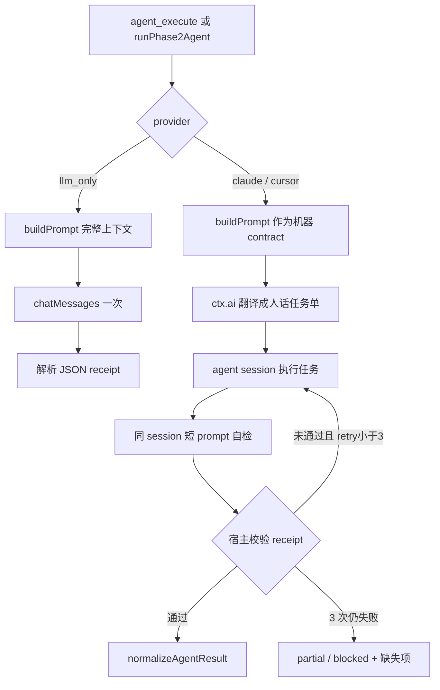

# Exec 双路径改造：LLM 直出与 Agent 任务翻译 + 同会话校验闭环

> 日期：2026-05-19
> 项目：js-evolution-agent
> 类型：架构设计 / 功能实现 / 问题排查 / 调研分析
> 来源：Cursor Agent 对话
> 最近更新：2026-05-19 01:35 +08:00

---

## 目录

1. [背景与动机](#1-背景与动机)
2. [分析过程](#2-分析过程)
3. [方案设计](#3-方案设计)
4. [实现要点](#4-实现要点)
5. [验证与真实进化运行](#5-验证与真实进化运行)
6. [后续演化](#6-后续演化)

---

## 1. 背景与动机

本次对话从一个问题出发：**exec 阶段到底怎么给 agent 提示词？**

阅读代码后发现，`src/actions/agent-adapter.mjs` 里 `buildPrompt()` 生成同一套「机器化、JSON-heavy」的 system/user 结构，然后：

- `llm_only`：当作普通 chat messages 发给 `ctx.ai`；
- `claude_code_sdk` / `cursor_sdk`：把 system + user 拼成一大段 prompt，再交给 Claude Code 或 Cursor Agent。

用户指出：这和「直接调 LLM API」与「交给 Claude Code / Cursor 这类带工具、工作目录、权限模型的 agent runtime」不是同一种交互。把报告式长 prompt 直接塞给代码 agent，容易错位——agent 更需要**任务委托单**，而不是完整情报 dump。

对话逐步收敛为明确目标：

1. **只区分两条路径**：`llm-only` 与 `agent`（Claude/Cursor 等 provider 归到 agent 路径）。
2. **agent 路径**：先用 LLM 把完整 contract 翻译成**人话任务 prompt**，再交给 agent 执行。
3. **执行完成后**：在**同一 session** 里发短 prompt，让 agent 自检是否满足 acceptance；通过再交付严格 JSON receipt；不通过则继续补完，**最多 3 次**。
4. 制定实施计划并完成代码改造，再用 `npm start` 做真实进化验证。

---

## 2. 分析过程

### 2.1 当前 exec 提示词从哪来

| 环节 | 行为 |
| ---- | ---- |
| `ExecutionPipeline` | 从队列 claim 决策，调用 `host.actionHandlers[action.type]`，**不拼 prompt** |
| `runPhase2Agent`（handlers） | 把原 action 包成合成 `agent_execute`，带上 `phase: exec`、`contract`、完整 `action` |
| `runAgenticAction`（adapter） | 按 provider 分叉；此前 Claude/Cursor/LLM 共用 `buildPrompt` |

`buildPrompt` 内容大致包括：objective、mode guidance、context、boundary、acceptance、recent intelligence、agentContextDocs（每份截断）、以及完整 output contract 示例 JSON。

### 2.2 两类 provider 的本质差异

| 维度 | llm-only | agent（Claude Code / Cursor SDK） |
| ---- | -------- | ----------------------------------- |
| 能力 | 无工具、无 cwd，需上下文写全 | 可读文件、可改 sandbox/worktree、多轮工具循环 |
| 合适 prompt | 完整 contract + schema | 简短、行动化的任务单 + 硬边界在 runtime options |
| 风险 | 上下文不足则瞎编 | 长 JSON prompt 噪声大；自称 completed 不可信 |

结论：**共享 action contract，不共享 prompt 模板**。用户进一步要求 agent 侧 contract 也由 LLM **翻译**成人话，而不是手写第二套模板——更接近「人给同事派活」。

### 2.3 同 session 校验的必要性

若 agent 第一次返回自然语言或残缺 JSON，宿主不能只靠 `parseJsonFromText` 兜底当成功。需要在**同一会话**里追问：

- 你实际做了什么？
- 是否满足 acceptance？
- 不满足则继续；满足则只输出一个严格 JSON receipt。

Cursor SDK 应用 `Agent.create().send().wait()` 多轮；Claude SDK 应用 `query({ resume: sessionId })` 续接（且 session 必须持久化）。

---

## 3. 方案设计

### 3.1 总体流程



### 3.2 关键决策

| 决策 | 选择 | 理由 |
| ---- | ---- | ---- |
| 路径划分 | 仅 `llm_only` vs `agent` | 避免 per-provider 三套 prompt；Claude/Cursor 执行语义一致 |
| contract 来源 | 保留 `buildPrompt` | Phase 1 决策字段不变；翻译器输入稳定 |
| 翻译职责 | LLM 只翻译，不判完成 | 执行与自检仍由 agent + 宿主校验负责 |
| 校验轮次 | 最多 3 次短 prompt | 平衡质量与耗时 |
| receipt 可信度 | 宿主 `validateAgentReceipt` + 要求 raw 为严格 JSON | 防止 `normalizeAgentResult` 把非 JSON 当 summary 误判通过 |
| handler 层 | 尽量不改 `handlers.mjs` | 复杂度集中在 adapter；`runPhase2Agent` 接口不变 |

### 3.3 宿主侧 receipt 校验（按 effective action type）

| action type | 至少需要的产物 |
| ----------- | -------------- |
| `record_observation` | `writes.observations` |
| `propose_probe` | `writes.probe_proposals`（或兼容字段） |
| `run_probe` | `evidence` 或 `writes.probe_results` |
| `write_retrospective` | `writes.retrospectives` |
| `request_core_review` | `writes.core_reviews` 或 `requires_human_review` |
| `core_apply` | changed files、diff_summary、tests、rollback_plan、death_boundary_result |
| 其它 / `agent_execute` | `status` + `summary` + 严格 JSON |

校验结果写入 `agent.outputs.agent_loop`（task_prompt、verification_attempts、final_validation、same_session）。

---

## 4. 实现要点

### 4.1 主要改动文件

| 文件 | 变更 |
| ---- | ---- |
| `src/actions/agent-adapter.mjs` | 双路径、翻译、Claude/Cursor 多轮 session、宿主校验 |
| `test/actions.test.mjs` | llm-only 不变；Cursor session mock；Claude resume；校验重试与失败降级 |

`src/actions/handlers.mjs` **未改接口**：仍通过 `runPhase2Agent` → `runAgenticAction`。

### 4.2 新增核心函数（概念）

- `translateAgentTaskPrompt`：用 `ctx.ai` + 专用 system/user，把 `buildPrompt` 输出翻成人话任务单。
- `buildAgentVerificationPrompt`：短自检 prompt，带上缺失字段列表。
- `validateAgentReceipt` / `strictRawReceipt`：按 action type 检查结构化产物。
- `runClaudeCodeSdk`：首轮 `query` → 最多 3 轮 `resume` 校验。
- `runCursorSdk`：优先 `Agent.create` + `send`/`wait`；无 create 时降级单次 `Agent.prompt`。

### 4.3 Claude session 持久化修复（真实运行暴露）

**现象**（`cycle-20260519-003046`）：

```text
agent_execute / request_core_review FAIL:
No conversation found with session ID: ...
```

**根因**：`buildClaudeOptions` 里曾为一次性调用设置 `persistSession: false`，但新设计第二轮要用 `options.resume`。session 未落盘则无法 resume。

**修复**：Claude agent 路径改为 `persistSession: true`。

### 4.4 Cursor 同 session

使用 `Agent.create(options)`，首轮 `send(翻译后任务单)`，后续 `send(校验 prompt)`，最后 `Symbol.asyncDispose()` 释放资源。与官方 SDK 文档「多轮用 create + send」一致。

---

## 5. 验证与真实进化运行

### 5.1 自动化测试

```bash
npm test -- --run test/actions.test.mjs
npm test
```

结果：**148 tests passed**（全量）。覆盖点包括：

- llm-only 仍只调一次 `chatMessages`；
- agent provider 先翻译再调 agent；
- Cursor 同 session 多轮直至 receipt 合法；
- 3 次仍缺字段 → `partial` + `verification_hints`；
- Claude `persistSession: true` 与 `resume` 传参。

### 5.2 真实 `npm start` 多轮摘要

| 轮次 | cycle | exec 动作概览 | 新路径是否命中 | 结果 |
| ---- | ----- | ------------- | -------------- | ---- |
| 1 | `cycle-20260519-002326` | sync / generate / simulate | 否（configured external） | 全流程 OK，约 6 分钟 |
| 2 | `cycle-20260519-003046` | 含 `agent_execute`、`request_core_review` | 是 | `agent_execute` / `request_core_review` **FAIL**（session 未找到）；`write_retrospective` 缺 summary；进程 exit 0 |
| 3 | `cycle-20260519-004649` | sync / generate / simulate / evaluate / observation | 否 | simulate **FAIL**（外部 `latest.json` ENOENT）；其余 OK |
| 4 | `cycle-20260519-010240` | sync / **propose_probe** / generate / retrospective | **是**（`propose_probe`、`write_retrospective` 走 `runPhase2Agent`） | 最终 **4/4 OK**；`propose_probe` 极慢（整轮约 **32 分钟**） |

第 4 轮关键日志（说明新路径已打通）：

```text
propose_probe: OK probe proposal recorded from agent writes: probe-...
write_retrospective: OK retrospective recorded from agent writes (1)
verify: 4 verified, 0 pending
diary: runtime/.../diaries/exec-20260519-010550.md
```

第 2 轮在修复 `persistSession` 后，同类 session 错误应可消除；第 4 轮未再出现该错误。

### 5.3 与业务问题的边界

真实进化中反复出现的 **agentank `latest.json` ENOENT**、**挑战真空**、**调度去重跳过 evaluate** 等，属于 **agentank-tank 主体 / 外部 runner** 问题，不是本次 adapter 改造引入的。本次改造验证的是：**当队列排到 agent 类 action 时，翻译 → 执行 → 同 session 校验 → 宿主落盘** 链路能跑通。

---

## 6. 后续演化

| 优先级 | 项 | 说明 |
| ------ | -- | -- |
| 高 | **agent 外层超时** | `propose_probe` 真实运行曾长时间无输出（约 20+ 分钟才完成），需对 Claude/Cursor 单轮与总时长设 cap，超时返回 `partial`/`blocked` + 可审计 receipt |
| 高 | **进度/心跳日志** | exec 日志在 agent 执行期间长时间静默，易被误判挂死；建议在翻译完成、每轮 verify、session id 变化时打 info |
| 中 | 再跑一轮必含 `agent_execute` 的 cycle | 验证 `persistSession` 修复后 Claude follow-up 稳定 |
| 中 | `write_retrospective` 决策缺 `summary` | Phase 1 应保证 params 完整，或 handler 从 agent writes 合成 |
| 低 | 翻译 LLM 与执行 agent 分离配置 | `translation_thinking` / `translation_timeout` 已预留，可与环境变量统一 |
| 低 | Cursor 无 `Agent.create` 时的降级路径 | 当前合并 prompt 无法真同 session，应明确告警 |

### 6.1 给后来读者的操作提示

- 跑一轮完整进化：`npm start`（主体默认 `agentank-tank`）。
- 只看 action 层单测：`npm test -- --run test/actions.test.mjs`。
- 查本轮 diary / verify：`runtime/subjects/agentank-tank/data/evolution/diaries/`、`verify_reports/`。
- 默认 agent provider 环境变量：`JEA_AGENT_PROVIDER`（如 `claude_code_sdk`）；Claude 需 `ANTHROPIC_API_KEY` 或 `ANTHROPIC_AUTH_TOKEN`。

---

<!--
本日记对应对话主线：
1. 分析 exec 如何给 agent 提示词
2. 区分 llm-only vs agent，提出 LLM 翻译 + 同 session 校验（≤3 次）
3. 制定并实施 Agent Exec 双路径改造计划
4. 多轮 npm start 真实验证 + Claude persistSession 修复
-->
