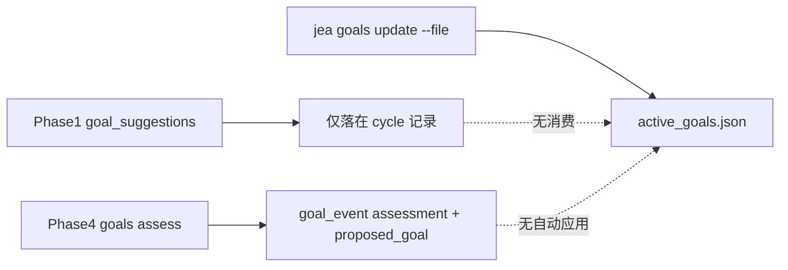
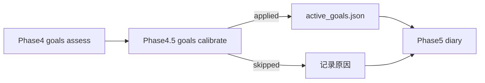

# 自动目标校准：从「只给建议」到 Phase 4.5 机械应用

> 日期：2026-05-19
> 项目：js-evolution-agent（主体 agentank-tank 运行时）
> 类型：问题排查 / 调研分析 / 功能实现
> 来源：Cursor Agent 对话
> 最近更新：2026-05-19

---

## 目录

1. [背景与动机](#1-背景与动机)
2. [分析过程](#2-分析过程)
3. [方案设计](#3-方案设计)
4. [实现要点](#4-实现要点)
5. [验证与测试](#5-验证与测试)
6. [后续演化](#6-后续演化)

---

## 1. 背景与动机

用户观察到 **agentank 策略没有在持续更新**，并指定进化日记 `exec-20260519-070109` 作为切入点，要求结合项目配置与历史记录做分析（只分析、不执行）。

对话沿三条线展开：

1. **这轮进化实际做了什么？** — 读日记、verify 报告、intel cycle `065849` 的 `analyze_decide.json`。
2. **记录里有没有「改目标」的意图？** — 查 `goal_suggestions`、`goal_events`、日记措辞。
3. **工作流是否支持 agent 直接校准目标？** — 追代码路径后决定改造。

最终落地：**在 `goals assess` 之后增加 Phase 4.5，对高置信 `refine` 自动写入 `active_goals.json`**，把「建议」变成「下一轮真的用新目标」。

---

## 2. 分析过程

### 2.1 `exec-20260519-070109` 做了什么、没做什么

| 环节 | 内容 |
| ---- | ---- |
| 情报 cycle | `cycle-20260519-065849` |
| 执行 cycle | `exec-20260519-070109` |
| Phase 2 动作 | `run_probe`、`agentank_sync_context`、`request_core_review`、`write_retrospective`（后者因 code fence 为 partial） |
| **未出现** | `agentank_generate_candidate`、`agentank_simulate_candidate`、`agentank_evaluate_candidate`、`agentank_publish_candidate` |

结论：**执行层按 Phase 1 排程忠实运行**；未更新远端/本地策略，是因为本轮根本没有排「生成—模拟—评估—发布」链，而不是 handler 失灵。

Phase 1 在 `analyze_decide.json` 里 **显式 defer** 了整条 agentank 管道，理由大意是：证据不足、评分不可信，应先补数据与推观测管道审批，避免无意义空转。

### 2.2 策略管道何时断掉（历史锚点）

对 `runtime/.../verify_reports/` 扫 action 类型可得：

| 时间点 | 现象 |
| ------ | ---- |
| 约 `exec-20260519-060723` | **最后一次** `agentank_generate_candidate` + `agentank_simulate_candidate` |
| `060723` → `070109` 之间多轮 | 以探针、`request_core_review`、复盘为主 |
| 远端 | `matchCount=10` 多 cycle 不变；评分多为 `keep_current`；候选仅 RNG 种子变异 |

用户体感「很久没更新策略」与日志一致：**不是单轮失误，而是多轮决策层主动转向「诊断 / 审批」模式**。

### 2.3 记录里有没有改目标的意图？

**有，且反复出现，但从未写入 `active_goals.json`。**

| 来源 | 内容 |
| ---- | ---- |
| `analyze_decide` 的 `goal_suggestions` | 多轮建议把主目标从「提升胜率」收敛为「恢复自动发布管道并获取真实匹配反馈，稳定模拟管道」 |
| `goal_events`（约 137 条 assessment，81 条 `refine`） | 常带完整 `proposed_goal` 草案（如 `win-more-agentank-refined`） |
| `exec-070109` 日记文末 | 软性提示：若再持续 48h 需考虑目标收敛 |
| **`type: updated` 的 goal_event** | **0 条** — 从未走正式更新路径 |

### 2.4 改造前：目标校准在代码里怎么走



要点：

- **新目标由 LLM 生成**：Phase 4 `assessGoalsWithAi` 已输出 `proposed_goal`；Phase 1 的 `goal_suggestions` 是另一路文字建议，**代码不读取**。
- **应用目标只有人工/脚本**：`jea goals update --file ... --reason ...`。
- **goal-assessor prompt** 写明「只做判定，不执行修改」——语义判断在 LLM，落盘原先没有闭环。

---

## 3. 方案设计

### 3.1 第一性原理收敛

初版讨论曾设想较多门禁（冷却、scope diff、多级审批等）。用户要求用第一性原理简化：

> **目标是给下一轮行动提供方向。** 若当前目标无法指导可验证进展，且 LLM 已高置信给出 `refine` 与合法 `proposed_goal`，就应自动成为下一轮 active goal。

因此机械门禁只保留三条：

```text
status === "refine"
confidence === "high"
proposed_goal 通过最小结构校验
```

不做第二次 LLM「生成目标」；**复用 Phase 4 已有 `proposed_goal`**。语义约束（文献相容、能收敛不扩展）继续交给 `goal-assessor` prompt，不在代码层复制一套智能判断。

### 3.2 工作流位置



- **不**放进 Phase 2 action 队列（避免与演化动作混权）。
- **不**让 `agent_execute` / `sandbox_patch` 直接改 goals 文件。

### 3.3 关键决策

| 决策 | 选择 | 理由 |
| ---- | ---- | ---- |
| 目标草案来源 | Phase 4 `proposed_goal`（LLM） | 已有完整证据与 assessor 约束，避免双 LLM |
| 自动应用范围 | 仅 `refine` + `high` | 最小安全边界；`replace/split/retire` 仍须人工 |
| 写入路径 | 复用 `updateGoals` 同类事件结构 | `previous_goal` / `next_goal` / `reason` / `evidence_refs` 可追溯 |
| 结构校验 | 机械字段检查 | 防止畸形 JSON 写坏 active goals；失败则 skip，不炸整轮 |
| 审计 | `evolution_event type=goals_calibrate` | applied / skipped / failed 可 grep |
| 日记 | `phase4_5` 写入 diary context | 人读 `exec-*.md` 能分辨「建议」vs「已改目标」 |

---

## 4. 实现要点

### 4.1 涉及文件

| 文件 | 变更 |
| ---- | ---- |
| `src/cli/commands/goals.mjs` | `validateGoalShape`、`applyGoalObject`、`autoCalibrateGoals`；`updateGoals` 复用 `commitGoalUpdate` |
| `run.mjs` | Phase 4.5 调用 `autoCalibrateGoals`，记录 `goals_calibrate` 事件，传入 diary |
| `src/intelligence/evolution-diary-builder.mjs` | 上下文增加 `phase4_5`；fallback 日记展示校准状态 |
| `test/cli.test.mjs` | 应用、校验、自动应用与跳过分支测试 |

### 4.2 核心 API 行为（`goals.mjs`）

**`validateGoalShape(goal)`** — 递归检查：

- 顶层及子目标均需非空字符串：`id`、`name`、`intent`、`good_signal`、`bad_signal`
- `children` 必须为数组

**`applyGoalObject(root, nextGoal, opts)`** — 校验通过后：

- 写 `data/goals/active_goals.json`
- 记 `goal_event`，`type: "updated"`

**`autoCalibrateGoals(root, goalsAssessResult)`** — 返回例如：

```json
{
  "status": "applied | skipped | failed",
  "reason": "...",
  "previous_goal_id": "...",
  "next_goal_id": "...",
  "written": 1
}
```

跳过原因包括：`status_not_refine`、`confidence_not_high`、`no_proposed_goal`、`invalid_proposed_goal`、`no_assessment`。

### 4.3 `run.mjs` Phase 4.5 片段逻辑

仅在 `goalsAssessResult` 存在时执行（Phase 4 被 `JEA_SKIP_GOALS_ASSESS` 或报告缺失跳过时不会跑）：

1. 调用 `autoCalibrateGoals`
2. 控制台打印 `status` / `reason` / `next goal`
3. `store.recordEvolutionEvent({ type: 'goals_calibrate', ... })`
4. 将 `goalsCalibrateResult` 传给 `buildEvolutionDiary`

应用成功时的 `reason` 模板：

```text
Applied high-confidence goal refine from cycle <cycle_id>.
```

### 4.4 与 agentank 停滞问题的关系

本改动 **不直接** 恢复 `generate/simulate/publish`，但解决一类结构性错位：

| 改造前 | 改造后 |
| ------ | ------ |
| 多轮 `refine` + `proposed_goal` 只进 `goal_events` | 高置信 `refine` 写入 `active_goals.json` |
| Phase 1 仍读「提升胜率」旧树，却 defer 策略管道 | 下一轮 observe/decide 可对齐「恢复发布管道」类中间目标 |
| 日记写「考虑目标收敛」但文件不变 | `phase4_5` 标明 applied/skipped |

若 assessor 继续输出高置信 refine（agentank 场景下已大量出现），**下一轮目标表述会与执行意图一致**，减少「嘴上收敛、文件仍是 win-more-agentank」的三重错位。

---

## 5. 验证与测试

| 项 | 结果 |
| ---- | ---- |
| `npm test -- --run test/cli.test.mjs` | 75 passed |
| `npm test -- --run`（全量） | 156 passed |
| Lint | 改动文件无新增诊断 |

新增测试覆盖：

- `applyGoalObject` 写盘 + `updated` 事件
- `validateGoalShape` 合法 / 非法 `children`
- `autoCalibrateGoals`：`refine`+`high` → applied；`keep` / `medium` / 非法结构 → skipped 且 active goals 不变

**尚未做**：在真实 `npm start` / agentank-tank 上跑一整轮，观察 `active_goals.json` 是否在 assess 后变为 `win-more-agentank-refined` 一类草案；可作为上线后第一次人工确认项。

---

## 6. 后续演化

| 优先级 | 项 | 说明 |
| ------ | -- | ---- |
| 高 | 真实主体跑一轮 | 看 Phase 4.5 是否 applied，以及下一轮 Phase 1 是否按新目标排 `generate/simulate` |
| 中 | `goal_suggestions` 与 Phase 4 对齐 | Phase 1 仍可能写建议但不被消费；可考虑 deprecate 或合并到 assess 输入，减少重复噪声 |
| 中 | assess 失败时 diary 提示 | Phase 4 非致命失败时无 `goalsAssessResult`，Phase 4.5 不跑——可在运维文档中说明 |
| 低 | 开关 `JEA_AUTO_GOAL_CALIBRATE=0` | 当前无环境变量关闭自动应用；若需 A/B 可加 |
| 低 | `replace/split` 人工审批流 | 超出本次最小闭环；保持 CLI `goals update` |

### 给后来读者的操作提示

```powershell
# 查看当前 active 目标
npm run jea -- goals show

# 查看目标历史（含 assessment 与 updated）
npm run jea -- goals history --limit 20

# 跑完整进化（含 Phase 4 + 4.5）
npm start

# 查本轮是否自动校准
# evolution_events 中搜 goals_calibrate
# 或读 diaries/exec-*.md / verify 同 cycle 的 diary 上下文 phase4_5
```

---

## 附录：Goal patches 模式（2026-05-31）

完整复盘见 [`journal/2026-05-31/goal-patch-calibration.md`](../2026-05-31/goal-patch-calibration.md)。

在整棵 `proposed_goal` 之外，Phase 4 可输出 `goal_patches`（`add_child` / `update_child` / `remove_child`），Phase 4.5 经 [`src/intelligence/goal-patches.mjs`](../../src/intelligence/goal-patches.mjs) 机械合并并写 `goal_event` 类型 `patched`。

- 与 `proposed_goal` 互斥；同轮双填时 patches 优先。
- `remove_child` 前对绑定 `goal_id` 的 active/validated 信念执行 auto-retire（`belief_event` 可追溯）。
- 自动门槛（balanced）：add/remove 需 `refine`+`high`；update_child 允许 `medium`+。
- 人工：`jea goals patch --file patches.json --reason "..."`。

## 附：对话时间线（便于回溯）

1. 分析 `exec-20260519-070109` → 诊断/同步/审批，无策略管道动作。
2. 查历史 → `060723` 后无 generate/simulate；记录中大量目标收敛建议未落盘。
3. 梳理目标校准代码 → assess 只写 event；update 仅 CLI。
4. 定方案：Phase 4.5 + 三条件机械门禁 + LLM 只负责 Phase 4 `proposed_goal`。
5. 实现并测试通过（本文第 4–5 节）。
6. 增补 goal_patches 单子目标校准（见上附录）。
