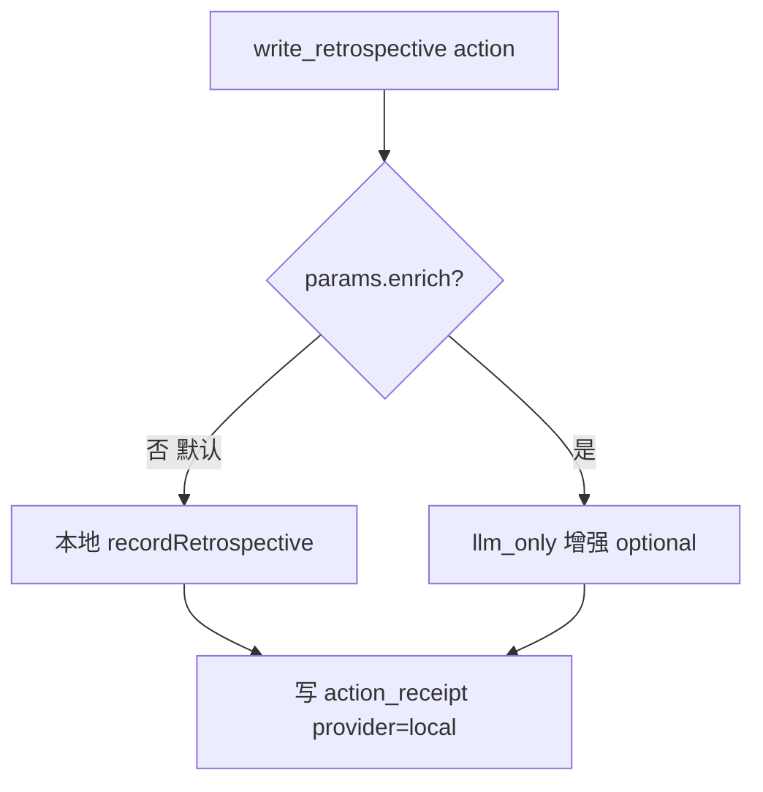

# write_retrospective 本地快速路径：修复复盘动作误走 Claude SDK 扫仓库

> 日期：2026-05-19  
> 项目：js-evolution-agent（主体：agentank-tank）  
> 类型：问题排查 / 功能实现  
> 来源：Cursor Agent 对话  

---

## 目录

1. [背景与动机](#1-背景与动机)
2. [分析过程](#2-分析过程)
3. [方案设计](#3-方案设计)
4. [实现要点](#4-实现要点)
5. [验证与测试](#5-验证与测试)
6. [后续演化](#6-后续演化)

---

## 1. 背景与动机

在分析 `exec-20260519-202622`（单轮进化，总耗时约 **21 分 32 秒**）时，发现一轮本应轻量的诊断回合被异常拖慢：

| 阶段 | 耗时 | 占比 |
|------|------|------|
| Intel 情报 | ~4 分钟 | 19% |
| **Exec 执行** | **~15.5 分钟** | **72%** |
| Verify + Goals + Diary | ~2 分钟 | 9% |

本轮决策只有 3 个动作（`run_probe`、`sync`、`record_observation`），合计约 3 分 25 秒。多出来的 **12 分钟**来自 exec 队列里 claim 的**第 4 个动作**：上一轮积压的 `write_retrospective`（`cycle-20260519-153308:5`）。

该动作走了 Claude Code SDK，尽管 prompt 写了「不要读写外部文件」，agent 仍执行了 **38 次 tool call**（Glob/Bash/Read），扫了 `journal/`、`runtime/`、`src/` 等目录，共 **176 条 message**、3 轮 verification loop。

**目标**：把 `write_retrospective` 从「带文件工具的 agent 调查任务」改回它应有的定位——**纯结构化复盘写入**，不应读仓库，也不应因 backlog 拖慢新一轮进化。

---

## 2. 分析过程

### 2.1 不是 cwd 设错的问题

最初怀疑积压的 `write_retrospective` 是否缺少正确的 `params.cwd`。查证后发现：

| 维度 | 实际情况 |
|------|----------|
| 原始决策 params | 只有 `summary/outcome/lessons/next_actions`，**无 cwd** |
| decide prompt 是否要求 cwd | **不要求**——cwd 规则只覆盖 `agent_execute` / `run_probe` 的本地文件操作 |
| SDK 实际 cwd | fallback 到 `D:\github\My\js-evolution-agent`（宿主根目录） |
| 语义上该设哪个 cwd | **不该是文件操作**——复盘是组织层学习写入，不是改 agentank-evolver 代码 |

结论：**慢的原因不是 cwd 路由修漏了，而是 action 类型与执行路径不匹配**。

### 2.2 根因链路


关键代码（修复前）：

```js
async write_retrospective(action, ctx) {
  requireParams(action, ['summary']);
  const agenticExecution = await runPhase2Agent(action, ctx, {
    mode: 'propose',
    objective: 'Execute a retrospective write...',
  });
```

- `mode: 'propose'` 默认给 Claude SDK **Read/Glob/Grep** 工具
- 无显式 `cwd` 时 fallback 到宿主项目根，agent 可在整个仓库内探索
- prompt 里的「不要读文件」只是软约束，**工具未被禁用**

### 2.3 与进化日记的区别

| | `write_retrospective` | Phase 5 进化日记 |
|---|---|---|
| 阶段 | exec（Phase 2） | 整轮结束后自动生成 |
| 触发 | decide 显式调度 | 流水线固定步骤 |
| 格式 | 结构化字段 | 人类可读 Markdown 长文 |
| 存储 | `retrospectives` + `latest_review` | `diaries/exec-*.md` |
| 修复前问题 | 误走 SDK 扫仓库 | 无此问题 |

---

## 3. 方案设计

采用**最小改动**：默认本地写入，保留可选 AI 增强但强制无工具。

### 关键决策

| 决策 | 选择 | 理由 |
|------|------|------|
| 默认执行路径 | 本地 `store.recordRetrospective()` | 复盘所需信息已在 decide params 里，无需 agent 再调查 |
| AI 增强 | 显式 `params.enrich === true` 才启用 | 避免常规路径继承 `JEA_AGENT_PROVIDER=claude_code_sdk` |
| 增强时的 provider | 强制 `llm_only`，`allowedTools: []` | 纯推理，禁止读盘 |
| cwd | 不要求、不设置 | 复盘不是文件操作；需要证据时先 `run_probe` |
| backlog 队列策略 | 暂不改动 | 本地路径已足够快，积压 claim 也只耗毫秒级 |

### 修复后的执行流



---

## 4. 实现要点

### 4.1 代码改动

| 文件 | 改动 |
|------|------|
| [`src/actions/handlers.mjs`](../../src/actions/handlers.mjs) | 默认路径：直接从 params 组装 retrospective 并 `store.recordRetrospective()`；仅 `enrich/agent_enrich/force_agent` 时走 agent，且经 `buildRetrospectiveEnrichmentAction()` 强制 `llm_only` + 空工具 |
| [`src/actions/registry.mjs`](../../src/actions/registry.mjs) | 更新 `promptHint`：明确是 host-backed 学习写入，不是文件调查，不需要 cwd |
| [`src/intelligence/conversation-prompts.mjs`](../../src/intelligence/conversation-prompts.mjs) | decide prompt 增加：`write_retrospective` 只记录已掌握的结论；需要读文件时先 `run_probe` |
| [`test/cli.test.mjs`](../../test/cli.test.mjs) | 新增 2 条测试：默认本地写入不启动 agent；增强动作默认无文件工具 |

### 4.2 核心逻辑（修复后）

```js
async write_retrospective(action, ctx) {
  requireParams(action, ['summary']);
  const store = storeFrom(ctx);

  // 默认：本地快速写入，不调用 runPhase2Agent
  if (!retrospectiveEnrichmentRequested(action)) {
    const review = buildRetrospectiveRecord(action);
    const written = store.recordRetrospective(review);
    // ... provider: 'local', writes_applied: { retrospectives: written }
    return result;
  }

  // 可选增强：llm_only，无文件工具
  const agenticExecution = await runPhase2Agent(
    buildRetrospectiveEnrichmentAction(action), ctx, { mode: 'propose', ... }
  );
  // ...
}
```

### 4.3 显式增强开关

仅在 action params 含以下字段之一时，才走 agent 路径：

- `enrich: true`
- `agent_enrich: true`
- `force_agent: true`
- `require_agentic_execution: true`

增强时强制：

```js
provider: 'llm_only',
allowedTools: [],
mode: 'propose',
```

---

## 5. 验证与测试

### 5.1 单元测试

```bash
npm test
# 4 passed, 160 tests passed（新增 2 条）
```

新增用例：

| 测试 | 断言 |
|------|------|
| 默认 `write_retrospective` | `provider: 'local'`，无 `agentic_execution`，写入 retrospectives + receipt |
| `buildRetrospectiveEnrichmentAction` | `provider: 'llm_only'`，`allowedTools: []` |

### 5.2 受控手动验证

```bash
node --input-type=module -e "
  // 构造 write_retrospective action，调用 actionHandlers.write_retrospective
"
```

结果：

| 指标 | 修复前（积压 SDK 路径） | 修复后（本地路径） |
|------|------------------------|-------------------|
| 耗时 | ~12 分钟 | **21 ms** |
| provider | `claude_code_sdk` | `local` |
| tool calls | 38 | 0 |
| agentic_execution | 有 | **无** |

### 5.3 预期对进化的影响

若 exec 队列再次 claim 积压的 `write_retrospective`：

- **修复前**：可能再耗 10+ 分钟扫仓库
- **修复后**：毫秒级本地写入，不再阻塞本轮

---

## 6. 后续演化

### 6.1 近期可做

- **再跑 1 轮进化**，确认 backlog `write_retrospective` 不再拖慢 exec
- 观察 decide 层是否仍频繁调度 `write_retrospective`；若内容偏短，可考虑在 intel 阶段提供更完整的上下文，而不是让 exec agent 去扫盘

### 6.2 长期方向

- **同类 action 审计**：`record_observation` 等 buffer 层动作是否也有不必要的 agent 路径
- **backlog claim 策略**：若低优先级旧 cycle 动作仍频繁被 claim，可考虑按 cycle 或 priority 隔离（本次未做，避免扩大改动面）
- **retrospective 与 diary 职责边界**：在 policy 或 prompt 中更明确「结构化复盘 vs 叙事日记」的分工

### 6.3 关键教训

1. **action 类型决定执行路径，不是反过来**：`write_retrospective` 是写入动作，不应默认走带工具的 code agent。
2. **prompt 里的 boundary 拦不住已启用的工具**：要禁读盘，必须在 runtime 层 `allowedTools: []` 或走 `llm_only`。
3. **backlog 会放大小问题的代价**：一个 12 分钟的动作积压在队列里，会在无关的新 cycle 里被 claim，拖慢整轮进化。
4. **先问「这个 action 需要 agent 吗？」再选 provider**：很多 buffer 层动作只需要 host 持久化，不需要 Claude SDK。

---

## 附录：相关 exec 与 receipt 速查

| 项 | 值 |
|---|---|
| 触发分析的 exec | `exec-20260519-202622` |
| 积压 retrospective 来源 | `cycle-20260519-153308:5` |
| 积压 receipt 时间 | 2026-05-19T12:41:49Z |
| 积压 SDK 统计 | 38 tool / 176 msg / 3 verify attempts |
| 修复涉及 commit 文件 | `handlers.mjs`, `registry.mjs`, `conversation-prompts.mjs`, `cli.test.mjs` |
