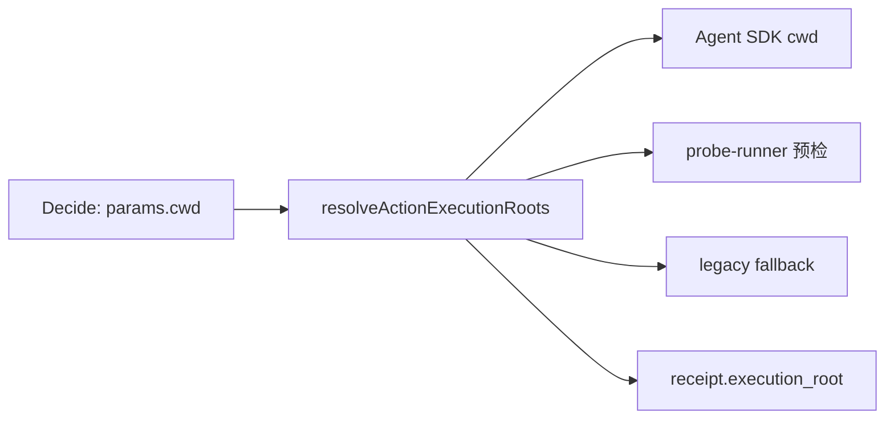

# 统一 Execution Root：修复 Agent 在错误目录里找文件

> 日期：2026-05-20  
> 项目：js-evolution-agent（主体：agentank-tank，外部项目：agentank-evolver）  
> 类型：问题排查 / 调研分析 / 功能实现  
> 来源：Cursor Agent 对话  

---

## 目录

1. [背景与动机](#1-背景与动机)
2. [分析过程](#2-分析过程)
3. [方案设计](#3-方案设计)
4. [实现要点](#4-实现要点)
5. [验证与测试](#5-验证与测试)
6. [后续演化](#6-后续演化)

---

## 1. 背景与动机

### 触发事件

进化日记 [`exec-20260520-013239`](../../runtime/subjects/agentank-tank/data/evolution/diaries/exec-20260520-013239.md) 记录了一次**诚实的校验**：情报报告声称候选 `a3f92b` 已生成且与基线 `78ec7e` 不同，但探针在本地搜遍 70 个候选文件、72 个评分文件后，**找不到 `a3f92b`**；`worker-state.json` 在 agent 能访问的 `agentank-evolver` 项目里也不存在。

用户把现象与此前日记 [agent-cwd-routing-and-10-round-evolution-review](../2026-05-19/agent-cwd-routing-and-10-round-evolution-review.md) 联系起来：当时已做过一轮 **cwd 路由修复**（decide 要求 `params.cwd`、SDK 传入 `options.cwd`），但显然**问题没有完全消失**。

### 要回答的核心问题

1. 为什么 decide 已经写了 `params.cwd`，Agent 还是在错误目录里找文件？
2. 系统里还有哪些地方会犯同类错误？
3. 怎样用**尽量简单**的方式修，而不是再叠一层「多根目录说明」？

---

## 2. 分析过程

### 2.1 第一轮发现：SDK cwd 对了，Prompt 还在误导 Agent

decide 阶段（`cycle-20260520-012950`）对探针的配置其实是**正确的**：

| 探针目标 | `params.cwd` |
|----------|----------------|
| 候选 / 评分 | `D:\github\My\agentank-evolver` |
| 主体日记 | `D:\github\My\js-evolution-agent\runtime\subjects\agentank-tank` |

但执行层 `buildPrompt` 仍向 Agent 输出：

- `project_root` → 主体 runtime（`agentank-tank`）
- `source_root` → 宿主仓库（`js-evolution-agent`）

而 Claude 系统提示还写死为「在 js-evolution-agent 内执行」。Agent 很容易把 **`project_root` 当成文件搜索根**，在 subject runtime 或宿主仓库里翻 `data/candidates/`，而不是在 evolver 里。

**第一轮补丁**（已合入 `agent-adapter`）：增加 `execution_cwd` 段落，明确「相对路径以 execution_cwd 为准，不要默认搜 host_project_root」。

### 2.2 全系统扫描：不止 Agent Prompt 一处

用第一性原理追问后，把问题收敛为：**一个 action 只能有一个「文件项目根」**。扫描代码发现多处仍按宿主根解析：

| 位置 | 旧行为 | 风险 |
|------|--------|------|
| `probe-runner` 预检 / legacy fallback | `sandbox` 用 `host.sourceRoot ?? projectRoot` | 与 SDK cwd **分裂**：Agent 在 evolver，预检在宿主 |
| `runPhase2Agent` | 用泛化文案覆盖原 `objective` | 目录对了，任务语义被埋进 JSON context |
| 无 `cwd` 时的 fallback | `sourceRoot → projectRoot → process.cwd()` | decide 漏写 cwd 时静默猜错 |
| 情报层 Observer | `projectRoot` = subject runtime | 观测不到 evolver（本轮**未改**，属后续项） |
| 情报裸路径 | 如 `worker-state.json` 无根限定 | 验证命题本身可能指向错误位置 |

### 2.3 与「找不到 a3f92b」的关系

即使路径根修对，仍可能存在**证据链问题**（候选未落盘、情报引用 JEA daemon 的 `worker-state` 等）。但 **cwd / executionRoot 错根** 会系统性放大误判：Agent 在错误树里「诚实报告找不到」，与情报「已有 a3f92b」形成表面矛盾。

---

## 3. 方案设计

### 核心原则（一句话）

> **调度 action 之前，宿主先定唯一 `executionRoot`；所有读文件、预检、SDK、receipt 只认这一根。**

不把 `projectRoot`、`sourceRoot`、`runtimeRoot` 再塞进 Agent 的主任务视野；它们只作宿主元数据。

### 关键决策

| 决策 | 选择 | 理由 |
|------|------|------|
| 对外字段 | 继续接受 `params.cwd`，内部统一 `executionRoot` | 不破坏已有 decide JSON 与 policy |
| 解析顺序 | `executionRoot` → `cwd` → `boundary.cwd/sandbox/worktree` | 兼容旧数据，语义单一 |
| 缺根时 | 本地文件型 `run_probe` / 相关 `agent_execute` **直接失败** | 禁止 fallback 猜目录 |
| 预检与 Agent | 共用 `execution-root.mjs` | 消除「SDK 对、预检错」 |
| Phase2 包装 | 原 action 的 objective/targets 作主任务 | 避免「在正确目录做泛化探索」 |
| Observer 多根 | **本轮不做** | 不是 cwd 错根的必要条件，单独排期 |



---

## 4. 实现要点

### 新增模块

| 文件 | 职责 |
|------|------|
| [`src/actions/execution-root.mjs`](../../src/actions/execution-root.mjs) | 解析 `executionRoot`、判断 action 是否必须有根、校验目录存在 |
| [`src/actions/agent-adapter.mjs`](../../src/actions/agent-adapter.mjs) | 复用解析器；缺根失败；prompt / SDK 对齐 `executionRoot` |
| [`src/actions/probe-runner.mjs`](../../src/actions/probe-runner.mjs) | `sandbox` / `resolveTarget` / `relPath` 均基于 action 的执行根 |
| [`src/actions/handlers.mjs`](../../src/actions/handlers.mjs) | `runPhase2Agent` 透传原任务；`run_probe` 缺根阻断；receipt 写 `execution_root` |
| [`src/intelligence/conversation-prompts.mjs`](../../src/intelligence/conversation-prompts.mjs) | decide 约束：cwd 即唯一 executionRoot，预检与 fallback 同源 |

### 解析逻辑（可复制理解）

```text
configuredRoot =
  params.executionRoot
  ?? params.cwd
  ?? boundary.cwd
  ?? boundary.sandbox
  ?? boundary.worktree

若 run_probe / 需访问本地文件的 agent_execute 且 configuredRoot 为空 → 结构化失败
否则 executionRoot = resolve(configuredRoot)   // 绝对路径
```

### 行为变化摘要

| 场景 | 修复前 | 修复后 |
|------|--------|--------|
| `cwd=agentank-evolver`，`targets=["data/candidates/"]` | 预检可能解析到宿主下的 `data/candidates` | 预检与 Agent 均在 evolver 下 |
| decide 漏写 cwd 的 `run_probe` | 可能 fallback 到 `sourceRoot` | `blocked`，`missing executionRoot` |
| `run_probe` 经 Phase2 执行 | 主 objective 为「Execute Phase 2…」 | 保留原探针 objective + targets |
| action receipt | 难以复盘「在哪个根找的」 | 记录 `execution_root` |

### 与 5 月 19 日 cwd 修复的关系

[agent-cwd-routing-and-10-round-evolution-review](../2026-05-19/agent-cwd-routing-and-10-round-evolution-review.md) 已完成：

- decide / policy 要求 `params.cwd`
- SDK `options.cwd` 校验

本次是**第二层闭合**：让 **宿主预检、prompt 语义、缺根策略、receipt** 与 SDK 使用同一根，避免「半套 cwd 修复」。

---

## 5. 验证与测试

### 单元测试

```bash
npm test
# Test Files  4 passed
# Tests       163 passed
```

新增 / 调整要点：

- 显式 `params.cwd` 时 Claude/Cursor `options.cwd` 与 `executionRoot` 一致
- 外部 evolver cwd 时，probe-runner 列出的是 evolver 下 `data/candidates`，而非 host 影子目录
- 缺 cwd 的本地 `run_probe` 不启动 Agent，返回 `missing executionRoot`
- `sandbox_patch` 无 cwd 时不再误走「需人工审批」而应先失败（与必须有根策略一致）

### 刻意未做的运行时验证

- 未再跑一整轮 daemon 进化（避免消耗 API 与长时间 exec）
- 未改 Observer 扫描 evolver（计划内「不做的事」）

---

## 6. 后续演化

### 建议优先

1. **跑 1～2 轮含 `run_probe` 的 cycle**，对照 receipt 里的 `execution_root` 与 `tool_uses`，确认搜索目录是否收敛（对比 5 月 19 日日记里 70+ 次 tool call 的 case）。
2. **情报路径规范**：机器事实写 `execution_root + 相对路径`，避免裸写 `worker-state.json`。
3. **Observer 多 workspace**：subject policy 声明 evolver 根后，观测阶段合并外部目录树或 external action 摘要。

### 可择机

- subject 级 `defaultAgentCwd` 自动注入，减轻 decide 漏填
- 从 policy 解析 `externalToolRoot`，减少绝对路径硬编码

### 给人看的教训

1. **「写了 cwd」≠「全链路在同一根下工作」** — SDK、预检、prompt、fallback 必须共用同一解析函数。
2. **少根优于多根说明** — 对 Agent 只强调一个 `executionRoot`，比同时解释 project/source/runtime 更不容易搜错。
3. **缺配置要失败，不要猜** — fallback 到宿主根是此类 bug 的温床。
4. **路径对了还要任务对** — Phase2 包装不能把真实 objective 藏进 context JSON。

---

## 附录：相关路径速查

| 用途 | 路径 |
|------|------|
| 触发日记 | `runtime/subjects/agentank-tank/data/evolution/diaries/exec-20260520-013239.md` |
| 前序 cwd 日记 | `journal/2026-05-19/agent-cwd-routing-and-10-round-evolution-review.md` |
| agentank-tank policy（三分 cwd） | `policies/subjects/agentank-tank.md` |
| 外部演化项目 | `D:\github\My\agentank-evolver` |
| 主体 runtime | `D:\github\My\js-evolution-agent\runtime\subjects\agentank-tank` |
