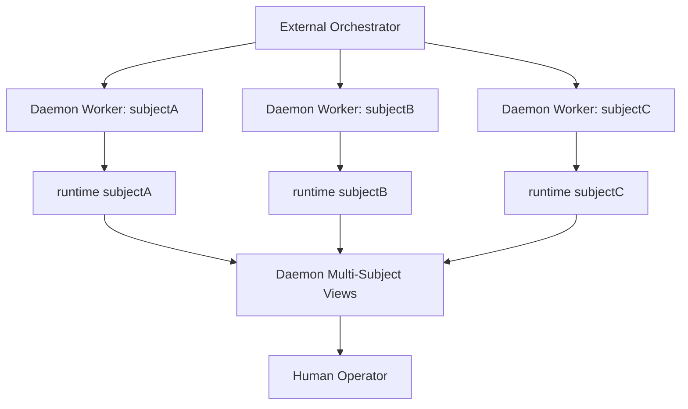

# 多 Subject Daemon 管理：并行进化主体的统一观察面

> 日期：2026-05-20  
> 项目：js-evolution-agent  
> 类型：架构设计 / 功能实现 / 运维增强  
> 来源：Cursor Agent 对话

---

## 目录

1. [背景与动机](#1-背景与动机)
2. [分析过程](#2-分析过程)
3. [方案设计](#3-方案设计)
4. [实现要点](#4-实现要点)
5. [验证与测试](#5-验证与测试)
6. [后续演化](#6-后续演化)

---

## 1. 背景与动机

真正的问题不是“daemon 能不能跑一轮”。

真正的问题是：当一台设备上同时存在多个进化主体时，操作者能不能看清它们各自跑到哪里了、卡在哪里、产出了什么。

此前项目已经具备单主体 daemon 基础：任务队列、worker 心跳、租约、`status`、`doctor`、`events`、`tasks`。也已经具备主体隔离：每个 subject 有自己的 policy、runtime、intelligence、goals 和 evolution 数据。

但用户进一步澄清了真实运行模型：

- 不需要项目自己负责 Windows Service / systemd / 开机自启 / 崩溃拉起，这些交给外部编排器。
- 不需要项目内置自动调度下一轮任务的全局脑。
- subject 之间不是轮转关系，而是**彼此独立、可以并行进化**。
- token 预算制未来重要，但当前没有 token 统计系统，因此暂不实现。

所以这次工作的目标收敛为一句话：

> 保持每个 subject 独立并行运行，同时给操作者一个跨 subject 的统一管理与跟踪入口。

---

## 2. 分析过程

### 2.1 现有模型哪里是对的

项目已有的 subject 隔离模型本身是对的：

```text
runtime/subjects/<data_namespace>/
  data/
    evolution/
    intelligence/
    goals/
```

这意味着每个 subject 可以天然拥有独立的：

- daemon task queue
- worker state
- evolve lock
- intel reports
- evolution diaries
- verify reports
- standing memory

同一 subject 内需要互斥，防止双写；不同 subject 之间应该允许并行。这与用户提出的长期使用方式一致。

### 2.2 需要修正的理解

此前曾把“多主体运行”理解成类似 `evolve --subjects a,b,c` 的轮转模型。这对批处理实验有用，但不是用户要的长期部署模型。

长期模型更像：

```text
external orchestrator
  -> daemon start --subject A
  -> daemon start --subject B
  -> daemon start --subject C

js-evolution-agent
  -> 每个 subject 独立排队、执行、记录
  -> 全局命令只聚合状态，不串行调度
```

因此本次没有去改 `evolve --subjects` 的轮转语义，而是在 `daemon` 层补齐跨 subject 的管理视图。

### 2.3 操作边界

多 subject 命令分成两类：

| 类型 | 允许多 subject | 理由 |
| --- | --- | --- |
| 只读观察 | 是 | `status` / `doctor` / `events` / `tasks list` / `inbox` 可安全聚合 |
| 保守停机 | 是 | `stop` 只是写入各 subject 的 stop request |
| 启动与执行 | 否 | `start` / `work --once` 应保持一 subject 一进程，由外部编排器并行启动 |
| 任务突变 | 否 | `tasks inspect/retry/cancel` 第一版保持单 subject，避免误操作 |

这个边界让项目提供“看得清、停得住”，但不抢外部编排器的职责。

---

## 3. 方案设计

最终方案是在现有 daemon 命令上增加 subject selection 与聚合层。



### 关键决策

| 决策 | 选择 | 理由 |
| --- | --- | --- |
| subject 选择 | 新增统一 selection 工具 | 避免 `--all` / `--subjects` 逻辑散落到各命令里 |
| 多 subject 状态 | 复用每个 subject 的现有 projection | 不重写 daemon 状态模型，降低风险 |
| 产物入口 | 新增 `daemon inbox` | 操作者最关心“新报告、新日记、失败与注意事项” |
| 并行模型 | 一 subject 一 worker 进程 | 外部编排器负责并行生命周期，项目内只保证 subject 隔离 |
| 批量 stop | 允许 fan-out | 停机请求是保守操作，适合跨 subject 管理 |
| 批量 retry/cancel | 暂不支持 | 任务突变风险更高，第一版保持单 subject |
| token 预算 | 暂不实现 | 当前缺 token 统计系统，不能做可靠预算账本 |

---

## 4. 实现要点

### 项目结构

```text
js-evolution-agent/
├── src/
│   └── cli/
│       ├── commands/
│       │   └── daemon.mjs
│       ├── utils/
│       │   ├── subject-selection.mjs
│       │   └── subject-artifacts.mjs
│       └── jea.mjs
├── test/
│   └── cli.test.mjs
└── README.md
```

### 关键模块

| 文件 | 职责 |
| --- | --- |
| [`src/cli/utils/subject-selection.mjs`](../../src/cli/utils/subject-selection.mjs) | 统一解析 active / `--subject` / `--subjects` / `--all`，并校验 subject policy |
| [`src/cli/utils/subject-artifacts.mjs`](../../src/cli/utils/subject-artifacts.mjs) | 聚合单 subject 最新 intel report、diary、verify report、standing memory 与 health attention |
| [`src/cli/commands/daemon.mjs`](../../src/cli/commands/daemon.mjs) | 为 `status`、`doctor`、`events`、`tasks list`、`stop`、`inbox` 增加多 subject 支持 |
| [`src/cli/jea.mjs`](../../src/cli/jea.mjs) | 更新 help，展示多 subject daemon 入口 |
| [`README.md`](../../README.md) | 增加 Multi-Subject Daemon Operations 使用说明 |
| [`test/cli.test.mjs`](../../test/cli.test.mjs) | 覆盖 subject selection、多 subject status、stop fan-out、任务突变拒绝、artifact inbox |

### 新增命令能力

```powershell
jea daemon status --all
jea daemon status --subjects agentank-tank,other-subject --json

jea daemon doctor --all
jea daemon events --all --limit 10
jea daemon tasks list --all --status failed

jea daemon inbox --all
jea daemon stop --subjects agentank-tank,other-subject
```

其中 `daemon inbox` 第一版只做索引与摘要，不解析大段 Markdown 正文：

- 最新 intel report：来自 `intel_reports` index。
- 最新 evolution diary：来自 `data/evolution/diaries/*.md`。
- 最新 verify report：来自 `data/evolution/verify_reports/*.json`。
- standing memory 更新时间与来源 cycle。
- health reason、pending task 数、failed task 数。

### 保留的单 subject 边界

以下命令仍保持单 subject：

```powershell
jea daemon start --subject agentank-tank
jea daemon work --once --subject agentank-tank
jea daemon enqueue --subject agentank-tank --type run_cycle
jea daemon tasks retry <task_id> --subject agentank-tank
jea daemon tasks cancel <task_id> --subject agentank-tank
```

这不是遗漏，而是刻意保守：启动并行 worker 应交给外部编排器；任务突变第一版不做批量化。

---

## 5. 验证与测试

本次做了三层验证。

### 5.1 IDE 诊断

对新增和修改文件执行 linter 诊断：

```text
No linter errors found.
```

检查范围包括：

- `src/cli/commands/daemon.mjs`
- `src/cli/utils/subject-selection.mjs`
- `src/cli/utils/subject-artifacts.mjs`
- `src/cli/jea.mjs`
- `test/cli.test.mjs`
- `README.md`

### 5.2 针对性 CLI 测试

```powershell
node --preserve-symlinks ./node_modules/vitest/vitest.mjs run test/cli.test.mjs
```

结果：

```text
Test Files  1 passed (1)
Tests       87 passed (87)
```

新增覆盖重点：

- `selectSubjects()` 能解析 active、显式 subject 列表和 `--all`。
- `daemon status --all --json` 能返回多个 subject 的 health 与 task summary。
- `daemon stop --subjects beta` 只影响指定 subject，不影响其它 worker state。
- `daemon tasks cancel --all` 被拒绝，避免批量任务突变。
- `daemon inbox --all --json` 能聚合最新报告、日记和验证报告。

### 5.3 全量测试

```powershell
npm test
```

结果：

```text
Test Files  4 passed (4)
Tests       176 passed (176)
```

---

## 6. 后续演化

这次解决的是多 subject 运维可见性，不是长期自治的全部问题。后续可以继续推进：

1. **未读与重要性标记**：`daemon inbox` 目前只展示最新产物，后续可增加“自上次阅读以来的新报告/新日记”。
2. **更丰富的失败摘要**：对 failed task、verify pending、semantic verification failed 做统一 attention 分类。
3. **外部编排器契约文档**：明确外部如何启动多个 worker、如何读取 `daemon status --all --json`，以及如何响应 blocked / failed / stale。
4. **token 预算账本**：等 LLM token 统计进入系统后，再实现 per-subject token budget、消耗记录和预算门禁。
5. **可选 UI / dashboard**：当前 CLI 已有稳定 JSON 输出，后续可以接一个只读 dashboard。

---

## 附：本轮对话问题—思考—方案—执行对照

| 阶段 | 内容 |
| --- | --- |
| 问题 | 用户希望一台设备上多个 subject 独立并行进化，项目内部能统一管理和跟踪，但不负责系统服务、自启动、自动调度，也暂不做 token 预算。 |
| 思考 | 现有 subject runtime 隔离是正确基础；`evolve --subjects` 的轮转模型不应成为长期多主体 daemon 模型；全局层应聚合状态而不是串行调度。 |
| 方案 | 增加统一 subject selection；扩展 daemon 多 subject 只读视图和保守 stop fan-out；新增 `daemon inbox` 聚合人类可读产物。 |
| 执行 | 新增 `subject-selection.mjs`、`subject-artifacts.mjs`，扩展 `daemon.mjs`、help、README 与 CLI 测试；针对性测试 87 passed，全量测试 176 passed。 |
