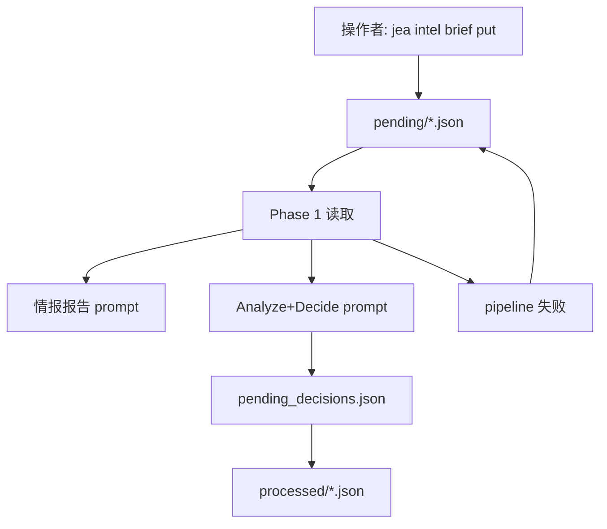

# 别把一句话塞进长期记忆：Operator Intent Brief 的来龙去脉

> 日期：2026-05-20  
> 项目：js-evolution-agent（主体：agentank-tank）  
> 类型：架构设计 / 功能实现  
> 来源：Cursor Agent 对话  

---

## 目录

1. [背景与动机](#1-背景与动机)
2. [分析过程](#2-分析过程)
3. [方案设计](#3-方案设计)
4. [实现要点](#4-实现要点)
5. [验证与测试](#5-验证与测试)
6. [后续演化](#6-后续演化)

---

## 1. 背景与动机

真正的问题不是“模型能不能听到我这句话”。

真正的问题是：**这句话进入进化系统以后，会变成什么？**

如果它变成长期指导，它会每一轮都生效；如果它变成事实证据，它会污染后续判断；如果它变成待执行动作，它又绕过了 decide。

这次要解决的，就是这个看似很小、实际很关键的边界问题：**用户想给下一轮进化一个一次性的核实意图，但系统原来没有这样一个干净的位置。**

### 触发点：下一轮要核实什么

在完成一轮进化（`exec-20260520-124944`）后，用户希望**主动提供一条情报**，让系统在**下一轮**进化里去核实两个悬而未决的问题：

1. 进化日记里写的「物理日记目录 `data/evolution/diaries/` 仍然缺失」，是否只是旧 standing_memory 或**错误 execution root** 下的 ENOENT 误判（与当日 [execution-root-unification](./execution-root-unification.md) 第二阶段「资源寻址模型」相关）。
2. 上一轮已通过 `agent_execute` 把 `INJECTION_APPLY=true` 写入 `agentank-evolver/.env`，但**尚未用候选生成或 `codeHash`** 验证注入是否真正生效（baseline 仍为 `78ec7e`）。

这不是「再跑一轮泛化诊断」，而是明确的**下一轮验证意图**。

### 卡住的地方：已有入口都“差一点”

系统里已有 `human_guidance.md`（`data/evolution/human_guidance.md`），Phase 1 会读入并注入情报报告与 Analyze+Decide 的 **Operator Guidance** 区块。但：

| 入口 | 语义 | 问题 |
| --- | --- | --- |
| `human_guidance.md` | 持续操作指导 | 只要 `## Current` 有内容，**每一轮**都会读；当前 conversational pipeline **不会**在 cycle 结束后自动 `markAsProcessed`，容易长期污染 |
| `intel_observations` 手工 ingest | 证据 | 人工意图被当成「已观测事实」，证据层级错位 |
| 直接写 `pending_decisions.json` | 已决动作 | **绕过 decide**，破坏 OADA 闭环 |
| `standing_memory` 手改 | 长期态势 | 把**待验证假设**固化成长期记忆 |

所以用户真正需要的不是一个“更强的 prompt”，而是一个新的因果槽位：

> **影响下一轮 decide，但不冒充事实、不永久生效。**

---

## 2. 分析过程

### 2.1 第一性原理：先给输入定性

进化系统里至少应区分四类输入，不能混用：

| 类型 | 含义 | 典型载体 |
| --- | --- | --- |
| **Evidence（证据）** | 世界发生了什么，可被推翻 | observations、probe_results、receipts |
| **Intent（意图）** | 人类希望下一轮关注什么，**不是事实** | （此前缺失） |
| **Constraint（约束）** | 长期必须/禁止遵守的边界 | policies、`human_guidance`、OADA rules |
| **Action（动作）** | 已决定要执行的操作 | `pending_decisions.json` |

这张表一摆出来，答案就很清楚了：

**用户诉求「下一轮请核实 X」= 一次性 Intent。**

它不是 Constraint，不应该每轮生效；它也不是 Action，不应该绕过 decide；它更不是 Evidence，不能被写进系统记忆当事实。

### 2.2 与 `human_guidance` 的对比

`HumanGuidanceReader`（js-evolution-engine）设计为：

- 读 `## Current` 段落 → 注入 prompt  
- 提供 `markAsProcessed(cycleId)` → 清空 Current、追加到 Processed  

但关键细节在这里：

**JEA 的 `ConversationalIntelligencePipeline` 只调用 `readGuidance()`，没有在 cycle 结束调用 `markAsProcessed`。**

这意味着 `human_guidance.md` 在当前系统里不是“一次性提醒”，而更像一个持续生效的背景场。它适合放稳定约束，比如“ENOENT 必须带 execution_root 解释”；不适合放“下一轮请核实这两个具体点”。

### 2.3 与资源寻址、上一轮进化的衔接

- [execution-root-unification](./execution-root-unification.md) 已让 decide/探针必须带 `resource_scope` / `execution_root`，避免跨 root 的 ENOENT 被说成「模块缺失」。  
- `exec-20260520-124944` 的 AI 进化日记仍复述「日记目录缺失」，说明 **情报/standing_memory 里的旧判断** 可能尚未被新机制纠正。  
- 用 Operator Intent Brief 可以在下一轮 **显式要求** 按 subject_runtime 核实 diaries，并优先 `agentank_generate_candidate` 验证 `INJECTION_APPLY`，而不依赖模型自己「想起来」。

这里真正的风险是：旧情报会继续塑造新判断。

资源寻址模型已经修好了“应该在哪里查”的规则，但如果旧 standing memory 仍在讲“日记目录缺失”，下一轮模型可能继续沿着旧结论走。Operator Intent Brief 的价值，就是把这个待核实点明确摆到下一轮 decide 面前，并且标注它只是**待验证假设**。

---

## 3. 方案设计

### 3.1 核心概念：一次性人工意图简报

**单轮人工意图简报**，生命周期：

```text
创建 → 下一轮 Phase 1 注入 report/decide → 决策入队成功 → 归档到 processed
```

若 intel pipeline **失败**，brief **留在 pending**，下次重试仍可消费（与计划一致）。

这个设计的重点不是“又加一个文件夹”。

重点是把一句人类输入放在正确的位置：它能影响下一轮 report 和 decide，但不会假装自己是证据，也不会永远留在 prompt 里。

### 关键决策

| 决策 | 选择 | 理由 |
| --- | --- | --- |
| 存储形态 | subject runtime 下 JSON 文件队列 | 与 `pending_decisions` 类似，可审计、可 CLI 管理 |
| 目录 | `data/evolution/operator_briefs/pending/`、`processed/` | 与 evolution 数据同域，按主体隔离 |
| 注入位置 | 报告 + 决策 prompt 的 **Operator Intent Briefs** 区块；`reportContext.operator_intent_briefs` | 与 **Operator Guidance** 语义分离，避免与长期指导混淆 |
| 消费时机 | Analyze+Decide 成功且 **非 dry-run** 完成入队后归档 | 保证「影响了 decide」再消费；失败可重试 |
| 是否写 standing_memory | 否（prompt 禁止把 claim 当事实） | 待验证假设不得固化 |
| CLI | `jea intel brief put/list/processed` | 降低手写 JSON 门槛，自动补 id、时间戳 |

### 3.2 数据流



### 3.3 单条 brief 数据形状（摘要）

| 字段 | 作用 |
| --- | --- |
| `kind` | 如 `verification_request` |
| `scope` | `next_cycle` |
| `summary` | 人类可读一句话 |
| `claims_to_verify[]` | 待验证命题 + `evidence_boundary` |
| `desired_decision_effect` | 希望 decide 如何排优先级 |
| `suggested_actions` | 如 `run_probe`、`agentank_generate_candidate` |
| `expires_after_cycle` | 默认 true |
| 归档后 `consumed_by_cycle`、`outcome` | 审计本轮是否采纳 |

---

## 4. 实现要点

实现分成四层：存储、注入、消费、操作入口。

存储层让 brief 有地方待命；注入层把它送进 report/decide；消费层保证成功影响一轮后归档；CLI 则让操作者不用手写目录和文件名。

### 4.1 新增与修改的文件

| 文件 | 职责 |
| --- | --- |
| [`src/intelligence/operator-briefs.mjs`](../../src/intelligence/operator-briefs.mjs) | 读写 pending/processed、归一化、prompt 格式化、归档 |
| [`src/cli/commands/intel-briefs.mjs`](../../src/cli/commands/intel-briefs.mjs) | `put` / `list` / `processed` 子命令 |
| [`src/intelligence/conversational-intel-pipeline.mjs`](../../src/intelligence/conversational-intel-pipeline.mjs) | Phase 1 读 brief → 注入 prompt/context → 入队后归档 |
| [`src/intelligence/conversation-prompts.mjs`](../../src/intelligence/conversation-prompts.mjs) | 中英文 report/decide 增加 **Operator Intent Briefs** 与证据边界说明 |
| [`src/intelligence/report-builder.mjs`](../../src/intelligence/report-builder.mjs) | `gatherReportContext` / `prepareIntelReport` 携带 `operator_intent_briefs` |
| [`src/intelligence/conversation-context.mjs`](../../src/intelligence/conversation-context.mjs) | 持久化 `operator_intent_briefs` 供 Phase 3 对话验证追溯 |
| [`src/cli/commands/intel.mjs`](../../src/cli/commands/intel.mjs)、[`src/cli/jea.mjs`](../../src/cli/jea.mjs) | 注册 `intel brief` 与 help 文案 |

### 4.2 操作者常用命令

```bash
# 从文件提交一条 brief
jea intel brief put --file path/to/brief.json

# 从 stdin 提交
echo '{"summary":"...","claims_to_verify":["..."]}' | jea intel brief put --stdin

# 查看待消费 / 已归档
jea intel brief list
jea intel brief processed --limit 10
```

### 4.3 已为本轮主题预置的 pending brief

路径（agentank-tank）：

`runtime/subjects/agentank-tank/data/evolution/operator_briefs/pending/2026-05-20T05-13-00-000Z-brief-verify-diaries-injection.json`

要点：

- 核实 `exec-20260520-124944.md` 中「日记目录缺失」是否来自 stale 情报或 wrong-root ENOENT。  
- 核实 `INJECTION_APPLY=true` 后需用候选/`codeHash` 对比 baseline `78ec7e`。  
- 建议动作：`run_probe`、`agentank_generate_candidate`。

**下一次 `npm start` / `jea run` 会消费该 brief**（成功入队后移入 `processed/`）。

### 4.4 与 `human_guidance` 的分工（建议）

| 用途 | 用哪个 |
| --- | --- |
| 长期偏好、稳定约束（如「ENOENT 必须带 execution_root」） | `human_guidance.md` |
| 下一轮请核实某具体问题（一次性） | `jea intel brief put` |
| 已确定必须执行、不想等 decide | `pending_decisions`（慎用） |

---

## 5. 验证与测试

这次不是只靠“看起来逻辑对”。实现后跑了针对性测试和全量测试，确认 brief 能被读到、注入、归档，并且不会被误当作事实。

| 项 | 结果 |
| --- | --- |
| `operator-briefs` 单元行为 | 写入、读 pending、坏 JSON 隔离、归档带 `consumed_by_cycle` |
| `ConversationalIntelligencePipeline` | brief 出现在 report/decide prompt；成功 run 后 pending 清空、processed 有记录 |
| prompt 约束 | 中英文均声明 brief 非事实；decide 未采纳需写 `deferred` |
| CLI | `brief put/list/processed` 在 active subject runtime 下路径正确 |
| 全量 | `npm test`：**171 passed** |

---

## 6. 后续演化

现在机制已经落地，下一步要看它在真实进化轮次里是否真的改变了 decide 的注意力。

1. **跑一轮进化**，观察 decide 是否按 brief 排出 `run_probe`（diaries + `resource_scope=subject_runtime`）与 `agentank_generate_candidate`，并检查 receipt 中的 `execution_root` / `codeHash`。  
2. **可选**：在 intel 成功结束后对 `human_guidance` 调用 `markAsProcessed`，或文档明确 guidance 与 brief 的分工，减少误用。  
3. **可选**：`jea intel brief put` 支持纯 Markdown 简表单项，由 CLI 转成 JSON，进一步降低操作成本。  
4. 若 brief 经常被忽略，可在 `evolution_events` 记录「brief 已读 / 已归档 / 建议动作是否在 actions 中出现」便于审计采纳率。

---

## 附：本轮对话问题—思考—方案—执行对照

| 阶段 | 内容 |
| --- | --- |
| **问题** | 能否提供一条情报影响下一轮？`human_guidance` 会每轮生效；需要核实日记目录误判与 `INJECTION_APPLY` 是否真生效。 |
| **思考** | 用第一性原理区分 Evidence / Intent / Constraint / Action；一次性意图不应进 standing_memory 或持久 guidance。 |
| **方案** | Operator Intent Brief：pending → Phase 1 注入 → decide → processed；独立 prompt 区块 + CLI。 |
| **执行** | 实现模块与 pipeline/CLI/测试；为 agentank-tank 写入 pending brief `brief-verify-diaries-injection-20260520`。 |
