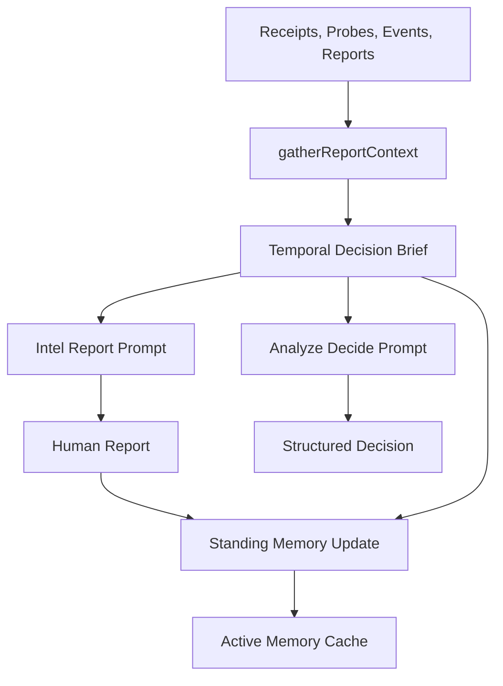

# 证据状态治理：别让旧结论继续指挥进化

> 日期：2026-05-21  
> 项目：js-evolution-agent  
> 类型：架构设计 / 功能实现 / 问题排查  
> 来源：Cursor Agent 对话

---

## 目录

1. [背景与动机](#1-背景与动机)
2. [分析过程](#2-分析过程)
3. [方案设计](#3-方案设计)
4. [实现要点](#4-实现要点)
5. [验证与测试](#5-验证与测试)
6. [后续演化](#6-后续演化)
7. [附：本轮对话问题—思考—方案—执行对照](#附本轮对话问题思考方案执行对照)

---

## 1. 背景与动机

这次问题的起点很小：进化工作流在构建上下文时，会不会把多篇历史内容混在一起，却没有讲清楚时间？

继续追问后，真正的问题浮出来了。

进化系统不是一次性问答。它会连续生成情报报告、执行动作、写日记、更新 `standing_memory`，下一轮再把这些材料喂回模型。只要其中某个旧判断被错误压缩进长期记忆，或者某篇历史报告里的断言没有被新证据覆盖，它就可能在后续轮次里继续传播。

最新的 `agentank-tank` 日记已经出现了这种迹象：旧报告曾反复引用 `worker-state.json` 中并不存在的同步字段，也曾把“日记写入停滞”“standing_memory 可逐条清理”等判断当成事实。后续探针发现，这些结论有的无法从文件结构复现，有的已经被证伪。

真正的问题不是“prompt 里有没有一句以最新为准”。

真正的问题是：进化系统缺少一个明确的证据状态层，去告诉模型哪些是当前事实、哪些只是历史观点、哪些已经被证伪、哪些还需要验证。

---

## 2. 分析过程

这次先看了 Phase 1 的上下文链路：

| 环节 | 文件 | 发现 |
| --- | --- | --- |
| Phase 1 管道 | [`src/intelligence/conversational-intel-pipeline.mjs`](../../src/intelligence/conversational-intel-pipeline.mjs) | report 和 decide 共用一套上下文，但此前没有独立的证据状态摘要 |
| 报告上下文 | [`src/intelligence/report-builder.mjs`](../../src/intelligence/report-builder.mjs) | `gatherReportContext()` 会收集 `standing_memory`、历史报告、receipts、events、probes 等多源材料 |
| 提示词 | [`src/intelligence/conversation-prompts.mjs`](../../src/intelligence/conversation-prompts.mjs) | 已要求 standing_memory 不能覆盖新证据，但没有完整的冲突裁决协议 |
| 存储 | [`src/intelligence/store.mjs`](../../src/intelligence/store.mjs) | 结构化记录有时间字段，但 claim 的生命周期还没有独立数据源 |
| 日记 | [`src/intelligence/evolution-diary-builder.mjs`](../../src/intelligence/evolution-diary-builder.mjs) | 日记也会消费 recent memory，长期应复用同一套证据状态语义 |

第一性原理下，系统要解决的不是“把更多上下文塞给模型”，而是让持续演化主体基于最新可信反馈，做出下一步最小有效行动。

因此要先回答三个问题：

- 什么是事实？
- 什么事实仍然有效？
- 这些事实如何约束下一步行动？

历史 Markdown、`standing_memory`、复盘日记都很有价值，但它们本质上是模型或人类整理过的观点。它们可以解释系统处境，却不能天然拥有事实权威。

---

## 3. 方案设计

最终方案是新增一层 `Temporal Decision Brief`。

它不是新的报告，也不是新的决策者，而是 report/decide 之前的证据状态摘要。它把当前上下文重新分层：

- `current_facts`：来自 receipts、probe results、evolution events、goal events 的结构化事实。
- `historical_claims`：来自历史报告、`standing_memory`、latest review 的历史模型结论。
- `refuted_or_weakened_claims`：文本或新证据显示已经被削弱、证伪的结论。
- `unverified_claims`：缺少原始证据支撑、仍需验证的结论。
- `decision_constraints`：目标、队列、operator brief 等行动边界。
- `source_ordering`：各类来源的新旧时间和证据等级。

### 关键决策

| 决策 | 选择 | 理由 |
| --- | --- | --- |
| 核心抽象 | `Temporal Decision Brief` | 先用系统结构告诉模型“当前证据状态”，而不是只靠 prompt 自觉 |
| 证据优先级 | 原始/直接证据 > 结构化机器记录 > 已验证 claim > 历史模型总结 > 人工意图 | 避免旧报告和长期记忆压过新证据 |
| 历史报告 | 降级为 historical claim | 保留历史脉络，但不再默认当作当前事实 |
| standing_memory | 定义为 active claim cache | 它是缓存，不是权威事实源 |
| Claim Ledger | 先预留数据源和 API | 第一版不做复杂 claim 抽取，但字段设计要能迁移到长期生命周期管理 |

数据流变成：



---

## 4. 实现要点

### 关键模块

| 文件 | 职责 |
| --- | --- |
| [`src/intelligence/decision-brief.mjs`](../../src/intelligence/decision-brief.mjs) | 新增 `buildTemporalDecisionBrief()`，按来源、时间和证据等级生成结构化 brief |
| [`src/intelligence/report-builder.mjs`](../../src/intelligence/report-builder.mjs) | 在 `prepareIntelReport()` 中生成 brief；修正近期报告取样；收紧 standing memory 更新协议 |
| [`src/intelligence/conversation-prompts.mjs`](../../src/intelligence/conversation-prompts.mjs) | 在 report/decide prompt 中加入 `Temporal Decision Brief`，明确冲突裁决顺序 |
| [`src/intelligence/specs.mjs`](../../src/intelligence/specs.mjs) | 新增 `claim_ledger` 数据源定义 |
| [`src/intelligence/store.mjs`](../../src/intelligence/store.mjs) | 新增 `recordClaimLedgerEntry()` 与 `readClaimLedger()` |
| [`test/intelligence.test.mjs`](../../test/intelligence.test.mjs) | 更新数据源清单测试，覆盖新增 `claim_ledger` |

### 关键变化

`readRecentReportMarkdowns()` 从 `.slice(-limit)` 改为 `.slice(0, limit)`。这是因为现有 store 的 `readLatestIntelReport()` 语义已经假设 `readIntelReports({ limit: 1 })[0]` 是最新报告；如果这里继续取尾部，就可能把“较旧的近期报告”误当作最近报告全文。

报告上下文新增 `historical_report_references`。它保留 `cycle_id`、`generated_at`、`md_path`、`tldr`，并明确 `use_policy`：这些报告只能作为历史 claim，需要先和 brief 及结构化证据核对。

prompt 层新增明确裁决规则：

```text
原始/直接文件证据 > 结构化机器记录 > 当前已验证 claim > 历史模型总结 > 人工意图
```

standing memory 更新也变成基于 brief 的 active 记忆维护：只保留仍被当前事实或结构化证据支持的结论；被削弱、证伪、替代的旧判断要降级、删除或明确标记；关键数值和状态判断应尽量引用 evidence refs 或 source cycle。

---

## 5. 验证与测试

本轮做了两层验证。

第一层是编辑后的静态诊断：

```bash
ReadLints
```

结果：相关改动文件无 linter 错误。

第二层是项目测试：

```bash
npm test
```

第一次运行暴露了两个合理失败：

- `claim_ledger` 是新增数据源，测试里的 expected source list 需要更新。
- pre-decision report prompt 的测试要求不要出现 `decisions_queued`。新 brief 初版把完整 `current_cycle` 带进了 prompt，因此需要把 brief 的 `current_cycle` 改成预决策安全摘要，只保留 `cycle_id`、`mode`、`stage`、`note`。

修正后重新运行：

```bash
npm test
```

结果：4 个测试文件、185 个测试全部通过。

---

## 6. 后续演化

第一版已经把“以最新证据为准”从一句 prompt 提醒，推进成了可复用的上下文结构。但它仍然是轻量版。

后续可以继续做三件事：

1. **把 Claim Ledger 真正写起来**  
   现在已经有 `claim_ledger` 数据源和 store API，但还没有自动抽取和更新 claim 生命周期。下一步可以把关键报告结论持久化为 `active/refuted/unverified/superseded` 状态。

2. **让日记生成复用 Temporal Decision Brief**  
   当前日记构建仍有自己的 `recent_memory` 读取逻辑。后续可以让 `evolution-diary-builder` 也消费 brief，避免日记复盘再次把旧 claim 写成事实。

3. **增加真实回归样本**  
   可以用 `agentank-tank` 最近记录构造测试样本，验证“日记写入停滞”“worker-state 存在 sync 字段”“standing_memory 可逐条清理”等旧结论会被 brief 标记为 refuted 或 unverified。

---

## 附：本轮对话问题—思考—方案—执行对照

| 阶段 | 内容 |
| --- | --- |
| 问题 | 进化工作流调用多篇历史内容时，没有充分注明时间，也没有明确要求按最新结论裁决，导致旧结论可能继续污染后续轮次 |
| 思考 | 第一性原理下，持续演化系统不能依赖语言连续性维持记忆，而要依赖证据状态维持记忆 |
| 方案 | 新增 `Temporal Decision Brief`，把当前事实、历史 claim、未验证/被削弱 claim、证据优先级和行动约束结构化 |
| 执行 | 新增 `decision-brief`，接入 report/decide prompt，降权历史 Markdown，收紧 standing memory，并预留 `claim_ledger` |
| 验证 | `ReadLints` 无错误，`npm test` 全部通过 |
