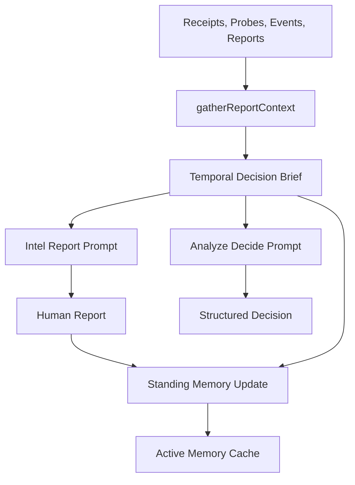
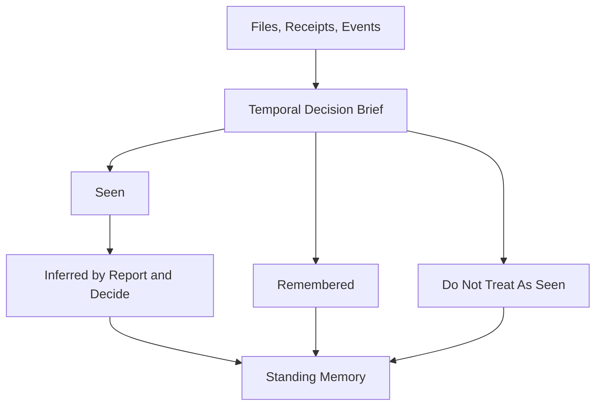

# 证据状态治理：别让旧结论继续指挥进化

> 日期：2026-05-21  
> 项目：js-evolution-agent  
> 类型：架构设计 / 功能实现 / 问题排查  
> 来源：Cursor Agent 对话

---

## 目录

1. [背景与动机](#1-背景与动机)
2. [分析过程](#2-分析过程)
3. [方案设计](#3-方案设计)
4. [实现要点](#4-实现要点)
5. [验证与测试](#5-验证与测试)
6. [后续演化](#6-后续演化)
7. [附：本轮对话问题—思考—方案—执行对照](#附本轮对话问题思考方案执行对照)

---

## 1. 背景与动机

这次问题的起点很小：进化工作流在构建上下文时，会不会把多篇历史内容混在一起，却没有讲清楚时间？

继续追问后，真正的问题浮出来了。

进化系统不是一次性问答。它会连续生成情报报告、执行动作、写日记、更新 `standing_memory`，下一轮再把这些材料喂回模型。只要其中某个旧判断被错误压缩进长期记忆，或者某篇历史报告里的断言没有被新证据覆盖，它就可能在后续轮次里继续传播。

最新的 `agentank-tank` 日记已经出现了这种迹象：旧报告曾反复引用 `worker-state.json` 中并不存在的同步字段，也曾把“日记写入停滞”“standing_memory 可逐条清理”等判断当成事实。后续探针发现，这些结论有的无法从文件结构复现，有的已经被证伪。

第一阶段修复后，又执行了 20 轮进化。结果很有价值：系统确实更容易发现旧幻觉，但并没有完全阻断新幻觉。最新观察报告仍然把 `worker-state.json.remote.*`、`pipeline.*`、`queue.*` 这类不存在字段写成当前事实，后续报告和 `standing_memory` 又会吸收这些 claim。

这说明第一阶段的方向是对的，但防线太靠后。

真正的问题不是“prompt 里有没有一句以最新为准”。

真正的问题是：进化系统缺少一个明确的证据状态层，去告诉模型哪些是当前事实、哪些只是历史观点、哪些已经被证伪、哪些还需要验证。

---

## 2. 分析过程

这次先看了 Phase 1 的上下文链路：

| 环节 | 文件 | 发现 |
| --- | --- | --- |
| Phase 1 管道 | [`src/intelligence/conversational-intel-pipeline.mjs`](../../src/intelligence/conversational-intel-pipeline.mjs) | report 和 decide 共用一套上下文，但此前没有独立的证据状态摘要 |
| 报告上下文 | [`src/intelligence/report-builder.mjs`](../../src/intelligence/report-builder.mjs) | `gatherReportContext()` 会收集 `standing_memory`、历史报告、receipts、events、probes 等多源材料 |
| 提示词 | [`src/intelligence/conversation-prompts.mjs`](../../src/intelligence/conversation-prompts.mjs) | 已要求 standing_memory 不能覆盖新证据，但没有完整的冲突裁决协议 |
| 存储 | [`src/intelligence/store.mjs`](../../src/intelligence/store.mjs) | 结构化记录有时间字段，但 claim 的生命周期还没有独立数据源 |
| 日记 | [`src/intelligence/evolution-diary-builder.mjs`](../../src/intelligence/evolution-diary-builder.mjs) | 日记也会消费 recent memory，长期应复用同一套证据状态语义 |

第一性原理下，系统要解决的不是“把更多上下文塞给模型”，而是让持续演化主体基于最新可信反馈，做出下一步最小有效行动。

因此要先回答三个问题：

- 什么是事实？
- 什么事实仍然有效？
- 这些事实如何约束下一步行动？

历史 Markdown、`standing_memory`、复盘日记都很有价值，但它们本质上是模型或人类整理过的观点。它们可以解释系统处境，却不能天然拥有事实权威。

20 轮验证后，又补充了第二个结论：

**污染源比 report/decide 更早。**

`observe` 阶段先于 `Temporal Decision Brief` 运行。如果 observe 报告已经把不存在字段写成事实，后面的 TDB 虽然能提醒模型降权历史材料，却已经是在污染进入上下文之后补救。更糟的是，第一版 TDB 把 receipt/probe 的自然语言 `summary` 放进 `current_facts`，等于把 agent 叙述套上了“结构化事实”的外壳。

---

## 3. 方案设计

最终方案是新增一层 `Temporal Decision Brief`。

它不是新的报告，也不是新的决策者，而是 report/decide 之前的证据状态摘要。它把当前上下文重新分层：

- `current_facts`：来自 receipts、probe results、evolution events、goal events 的结构化事实。
- `historical_claims`：来自历史报告、`standing_memory`、latest review 的历史模型结论。
- `refuted_or_weakened_claims`：文本或新证据显示已经被削弱、证伪的结论。
- `unverified_claims`：缺少原始证据支撑、仍需验证的结论。
- `decision_constraints`：目标、队列、operator brief 等行动边界。
- `source_ordering`：各类来源的新旧时间和证据等级。

### 关键决策

| 决策 | 选择 | 理由 |
| --- | --- | --- |
| 核心抽象 | `Temporal Decision Brief` | 先用系统结构告诉模型“当前证据状态”，而不是只靠 prompt 自觉 |
| 证据优先级 | 原始/直接证据 > 结构化机器记录 > 已验证 claim > 历史模型总结 > 人工意图 | 避免旧报告和长期记忆压过新证据 |
| 历史报告 | 降级为 historical claim | 保留历史脉络，但不再默认当作当前事实 |
| standing_memory | 定义为 active claim cache | 它是缓存，不是权威事实源 |
| Claim Ledger | 先预留数据源和 API | 第一版不做复杂 claim 抽取，但字段设计要能迁移到长期生命周期管理 |

数据流变成：



### 第二阶段：Observe 前移证据治理

20 轮运行后的结论是：仅有 `Temporal Decision Brief` 不够。治理必须前移到 observe，并且 TDB 自身要把“机器结构化状态”和“agent 自然语言 claim”拆开。

第二阶段方案增加了三条防线：

| 防线 | 作用 |
| --- | --- |
| `Observation Evidence Guard` | 在 observe prompt 中提前声明已知 schema guard 和 forbidden claim，要求字段声明必须带 `source_path` / `json_pointer` |
| `Model Observation Claims` | 将 Observation Report 降级为模型观察 claim，放在 TDB 之后，避免它先入为主 |
| TDB 证据分级硬化 | 把 `summary` 放入 `agent_claims`，不再作为 `current_facts` |

新的目标不是让模型“更谨慎一点”，而是让它很难把旧幻觉重新包装成当前事实。

### 第三阶段：把治理语言压缩成 Seen / Inferred / Remembered

第二阶段之后，系统的证据污染明显减少，但另一个问题开始显现：治理术语变多了。

`Temporal Decision Brief` 里有 `direct_evidence`、`structured_status`、`agent_claims`、`historical_claims`、`refuted_or_weakened_claims`、`unverified_claims`。`Observation Evidence Guard` 又有自己的 schema guard 和 forbidden claim 语言。`standing_memory` 更新协议也在讲 active claim、verified claim、agent claim。

这些词都对，但系统开始变得像在维护一套复杂的“事实法院”。

用户指出一个关键约束：不是所有事实都能靠代码证明。继续扩大 claim ledger 或 forbidden 列表，可能会把系统带向过度工程化。于是第三阶段回到第一性原理：

真正要避免的不是“所有 claim 都必须被证明”。

真正要避免的是把“不知道”写成“知道”。

因此第三阶段把证据治理统一成四栏：

| 栏位 | 含义 | 使用规则 |
| --- | --- | --- |
| `seen` | 本轮或近期由文件、API、结构化记录直接看到的东西 | 可以当事实使用 |
| `inferred` | 基于 `seen` 推断出的当前判断 | 必须引用 `seen`，并说明反证条件 |
| `remembered` | 历史报告、日记、`standing_memory`、agent summary 中说过的内容 | 只能当线索或背景 |
| `do_not_treat_as_seen` | 已证伪、禁止复活、或不能当直接事实的说法 | 不得作为事实或行动前提 |

这不是推翻前两阶段，而是给它们换一套更容易被模型和人类共同遵守的语言。

### 第四阶段：把 Seen 从提示词规则变成写入门禁

三栏模型上线后，又执行了 3 轮 `agentank-tank` 进化。结果很清楚：

- `Observation Evidence Guard` 已经进入 observe prompt。
- `standing_memory` 已经按 Seen / Inferred / Remembered / Do Not Treat As Seen 四段输出。
- 系统开始主动识别污染，并把污染范围量化到 17 条条目。

但核心漏洞还在。

模型已经会说“这不是 Seen”，但 `standing_memory` 更新器仍会把完整 `reportContext` 交给模型。模型可以从 `action_receipts`、日记、报告正文、partial receipt 的 summary 中重新摘取内容，再写回 `Seen`。

这里的第一性原理更简单：

> 记忆只能把亲眼见过的东西写进 Seen。  
> “别人说看见了”不是 Seen。

因此第四阶段不再加新的治理术语，也不继续扩展 forbidden 列表，而是在 `standing_memory` 写入路径上加硬门禁：`Seen` 只能来自 TDB 的 `seen`，并且要再过滤掉 partial / failed receipt 这类不适合进入长期事实层的状态。

---

## 4. 实现要点

### 关键模块

| 文件 | 职责 |
| --- | --- |
| [`src/intelligence/decision-brief.mjs`](../../src/intelligence/decision-brief.mjs) | 新增 `buildTemporalDecisionBrief()`，按来源、时间和证据等级生成结构化 brief |
| [`src/intelligence/report-builder.mjs`](../../src/intelligence/report-builder.mjs) | 在 `prepareIntelReport()` 中生成 brief；修正近期报告取样；收紧 standing memory 更新协议 |
| [`src/intelligence/conversation-prompts.mjs`](../../src/intelligence/conversation-prompts.mjs) | 在 report/decide prompt 中加入 `Temporal Decision Brief`，明确冲突裁决顺序 |
| [`src/intelligence/observation-guard.mjs`](../../src/intelligence/observation-guard.mjs) | 新增 `Observation Evidence Guard`，为 observe 阶段提供 schema guard、forbidden claim 和字段引用要求 |
| [`src/intelligence/conversational-intel-pipeline.mjs`](../../src/intelligence/conversational-intel-pipeline.mjs) | 将 guard 注入 `AIDrivenObserver` 的 rules，避免修改上游 `node_modules` |
| [`src/intelligence/specs.mjs`](../../src/intelligence/specs.mjs) | 新增 `claim_ledger` 数据源定义 |
| [`src/intelligence/store.mjs`](../../src/intelligence/store.mjs) | 新增 `recordClaimLedgerEntry()` 与 `readClaimLedger()` |
| [`test/intelligence.test.mjs`](../../test/intelligence.test.mjs) | 更新数据源清单，新增 guard 和 TDB 分级测试 |
| [`test/conversational-intel-pipeline.test.mjs`](../../test/conversational-intel-pipeline.test.mjs) | 验证 observe prompt 包含 guard，report prompt 中 TDB 位于 Observation Report 之前 |

### 关键变化

`readRecentReportMarkdowns()` 从 `.slice(-limit)` 改为 `.slice(0, limit)`。这是因为现有 store 的 `readLatestIntelReport()` 语义已经假设 `readIntelReports({ limit: 1 })[0]` 是最新报告；如果这里继续取尾部，就可能把“较旧的近期报告”误当作最近报告全文。

报告上下文新增 `historical_report_references`。它保留 `cycle_id`、`generated_at`、`md_path`、`tldr`，并明确 `use_policy`：这些报告只能作为历史 claim，需要先和 brief 及结构化证据核对。

prompt 层新增明确裁决规则：

```text
原始/直接文件证据 > 结构化机器记录 > 当前已验证 claim > 历史模型总结 > 人工意图
```

standing memory 更新也变成基于 brief 的 active 记忆维护：只保留仍被当前事实或结构化证据支持的结论；被削弱、证伪、替代的旧判断要降级、删除或明确标记；关键数值和状态判断应尽量引用 evidence refs 或 source cycle。

第二阶段又做了三项关键收紧：

1. **observe 前置 guard**  
   `Observation Evidence Guard` 明确要求：JSON 字段 claim 必须带 `source_path` 和 `json_pointer`。例如 `worker-state.json.remote.*`、`pipeline.*`、`queue.*`、`secrets.*`、`cycle3.*` 都属于 forbidden unless independently verified。

2. **Observation Report 降权**  
   report/decide prompt 中，`Temporal Decision Brief` 被放到 `Model Observation Claims` 之前。Observation Report 明确只是线索，不是权威事实源。

3. **TDB 拆分证据等级**  
   第一版 `current_facts` 会收纳 receipt/probe 的 summary。第二版改为：

   - `direct_evidence`
   - `structured_status`
   - `agent_claims`
   - `historical_claims`
   - `forbidden_or_refuted_claims`

   其中自然语言 summary 进入 `agent_claims`，不再默认是事实。

### 第三阶段简化实现

第三阶段没有删除旧字段，也没有继续扩展大型 claim ledger。它做的是兼容式收敛：旧结构继续存在，新上下文优先使用 Seen / Inferred / Remembered 语言。

| 文件 | 第三阶段变化 |
| --- | --- |
| [`src/intelligence/decision-brief.mjs`](../../src/intelligence/decision-brief.mjs) | 在 TDB 中新增 `seen`、`inferred`、`remembered`、`do_not_treat_as_seen` 兼容视图；`seen` 来自 `direct_evidence` 和 `structured_status`，`remembered` 来自 agent/historical/unverified claims |
| [`src/intelligence/conversation-prompts.mjs`](../../src/intelligence/conversation-prompts.mjs) | report/decide prompt 改为先读 `seen`，再读 `inferred`，最后读 `remembered`；Observation Report 明确归入 remembered/lead material |
| [`src/intelligence/observation-guard.mjs`](../../src/intelligence/observation-guard.mjs) | 保留 worker-state forbidden fields 等硬 guard，但文案收敛为 Seen / Inferred / Remembered 分类规则 |
| [`src/intelligence/report-builder.mjs`](../../src/intelligence/report-builder.mjs) | `standing_memory` 更新协议改为固定四节：Seen、Inferred、Remembered、Do Not Treat As Seen |
| [`test/intelligence.test.mjs`](../../test/intelligence.test.mjs) | 验证 TDB 三栏视图存在，并确认 receipt summary 进入 remembered 而不是 seen |
| [`test/conversational-intel-pipeline.test.mjs`](../../test/conversational-intel-pipeline.test.mjs) | 验证 observe/report/memory prompt 都包含三栏语言 |

数据流也变得更直观：



### 第四阶段写入门禁

第四阶段只改一个关键位置：[`src/intelligence/report-builder.mjs`](../../src/intelligence/report-builder.mjs) 的 `standing_memory` 更新流程。

以前 memory prompt 会收到完整机器上下文：

- `goal_events`
- `observations`
- `probe_results`
- `evolution_events`
- `action_receipts`
- `latest_review`
- `intel_reports_index`
- `historical_report_references`

这给了模型太多“重新解释”的空间。即使 prompt 说 `Seen` 只能来自 TDB，模型仍可能把 receipt summary 或 diary prose 当成 Seen 写回。

新的流程改成两层门禁：

| 层级 | 作用 |
| --- | --- |
| `memory_admission` | 给 memory prompt 的机器上下文只暴露准入后的 `seen`、`remembered`、`do_not_treat_as_seen`，不再暴露完整 receipts/reports/diaries |
| `enforceStandingMemorySeenGate()` | AI 输出后，用代码重写 `## Seen` 小节，确保最终写入的 Seen 只来自准入后的 TDB `seen` |

同时增加一条很窄的过滤：

- `partial` / `failed` 的 `action_receipt` 不进入 memory `Seen`。
- `agent_narrative` 不进入 memory `Seen`。
- 成功完成的 receipt 只能把结构化状态作为 Seen，不能把 summary 当 Seen。

这一步的重点不是“证明所有 claim”，而是把长期记忆中最危险的入口关掉：模型叙述、partial receipt、历史报告都不能再自己爬回 Seen。

---

## 5. 验证与测试

本轮做了两层验证。

第一层是编辑后的静态诊断：

```bash
ReadLints
```

结果：相关改动文件无 linter 错误。

第二层是项目测试：

```bash
npm test
```

第一次运行暴露了两个合理失败：

- `claim_ledger` 是新增数据源，测试里的 expected source list 需要更新。
- pre-decision report prompt 的测试要求不要出现 `decisions_queued`。新 brief 初版把完整 `current_cycle` 带进了 prompt，因此需要把 brief 的 `current_cycle` 改成预决策安全摘要，只保留 `cycle_id`、`mode`、`stage`、`note`。

修正后重新运行：

```bash
npm test
```

结果：4 个测试文件、185 个测试全部通过。

第二阶段补充测试后再次运行：

```bash
npm test
```

结果：4 个测试文件、187 个测试全部通过。

新增覆盖点包括：

- observe prompt 必须包含 `Observation Evidence Guard`、`worker-state.json.remote.*` 和 `json_pointer`。
- report prompt 中 `Temporal Decision Brief` 必须出现在 `Model Observation Claims` 之前。
- receipt summary 中即使写了 `worker-state.json.remote.matchCount is 4127`，也只能进入 `agent_claims`，不能进入 `current_facts`。

第三阶段简化实现后再次运行：

```bash
npm test
```

结果：4 个测试文件、187 个测试全部通过。

新增覆盖点包括：

- TDB 包含 `seen`、`remembered`、`do_not_treat_as_seen`。
- receipt/probe summary 这类自然语言 claim 不进入 `seen`，只进入 `remembered`。
- observe prompt 包含 `Seen / Inferred / Remembered`。
- report prompt 和 standing memory prompt 都使用 Seen / Inferred / Remembered 语言。

随后运行静态诊断：

```bash
ReadLints
```

结果：相关改动文件无 linter 错误。

第四阶段写入门禁补充了一个回归测试：

```bash
npm test -- test/intelligence.test.mjs
```

测试故意让 AI 生成污染的 standing memory：

```text
## Seen

- receipt-polluted: worker-state.json.remote.matchCount is 4127
```

最终断言写入后的 `Seen` 小节被代码门禁重写，只包含 TDB 准入后的 source id，不包含 `remote.matchCount`，并且 `evidence_refs` 不再记录 partial receipt。

结果：`test/intelligence.test.mjs` 37 个测试全部通过。

随后运行完整测试：

```bash
npm test
```

结果：4 个测试文件、188 个测试全部通过。

再运行静态诊断：

```bash
ReadLints
```

结果：[`src/intelligence/report-builder.mjs`](../../src/intelligence/report-builder.mjs) 和 [`test/intelligence.test.mjs`](../../test/intelligence.test.mjs) 无 linter 错误。

---

## 6. 后续演化

第一版已经把“以最新证据为准”从一句 prompt 提醒，推进成了可复用的上下文结构。但它仍然是轻量版。

后续可以继续做三件事：

1. **把 Claim Ledger 真正写起来**  
   现在已经有 `claim_ledger` 数据源和 store API，但还没有自动抽取和更新 claim 生命周期。下一步可以把关键报告结论持久化为 `active/refuted/unverified/superseded` 状态。

2. **让日记生成复用 Temporal Decision Brief**  
   当前日记构建仍有自己的 `recent_memory` 读取逻辑。后续可以让 `evolution-diary-builder` 也消费 brief，避免日记复盘再次把旧 claim 写成事实。

3. **增加真实回归样本**  
   可以用 `agentank-tank` 最近记录构造测试样本，验证“日记写入停滞”“worker-state 存在 sync 字段”“standing_memory 可逐条清理”等旧结论会被 brief 标记为 refuted 或 unverified。

第二阶段之后，后续重点也随之变化：

1. **让 guard 从静态规则走向 schema snapshot**  
   现在 `Observation Evidence Guard` 是针对高频幻觉的静态规则。下一步可以在 observe 前读取真实 `worker-state.json` schema，自动生成 allowed/forbidden 字段。

2. **给 report 结果做 claim audit**  
   standing_memory 仍然主要依赖 prompt 自律。更稳的方案是 report 生成后先做 claim audit，命中 forbidden pattern 的段落不能进入 active memory。

3. **让 Claim Ledger 记录“幻觉复活”**  
   不仅记录 claim 当前状态，还要记录 `last_seen_cycle`。如果同一个 forbidden claim 多轮复活，系统应该升级为管道缺陷，而不是每轮重新发现。

第三阶段之后，后续重点再次收敛：

1. **观察三栏语言是否真的降低记忆污染**  
   接下来可以继续跑多轮 `agentank-tank` 进化，重点检查 `standing_memory` 是否仍会把 remembered 线索写成 seen 事实。

2. **让日记也采用同一套三栏语言**  
   当前 report/decide/observe/memory 已经统一，日记生成仍可以进一步消费 TDB 的 `seen`、`inferred`、`remembered`，避免复盘文本重新混淆证据状态。

3. **少加规则，多看失败样本**  
   第三阶段的原则是不再轻易扩展 forbidden 列表。只有当某类错误反复复活，并且能被稳定描述时，才把它沉淀为硬 guard。

第四阶段之后，下一步更具体：

1. **跑几轮验证污染是否复发**  
   重点检查新生成的 `standing_memory`：`Seen` 是否只来自 `memory_admission.seen`，partial receipt 和 agent narrative 是否还会回流。

2. **清理现有 standing_memory 中的旧污染**  
   写入门禁只能防止新污染进入，不能自动修复已经存在的旧文本。后续可以执行一次明确的 memory 清理，把已识别的污染 receipt 从 `Seen` 移到 `Remembered`，并保留必要的 `Do Not Treat As Seen`。

3. **再处理目标和队列**  
   目标中的 `std<40 / 429=0` 这类不可验证指标、以及 pending decisions 的可归档积压，仍然需要处理。但顺序应该在 memory 写入门禁稳定之后。

---

## 附：本轮对话问题—思考—方案—执行对照

| 阶段 | 内容 |
| --- | --- |
| 问题 | 进化工作流调用多篇历史内容时，没有充分注明时间，也没有明确要求按最新结论裁决，导致旧结论可能继续污染后续轮次 |
| 思考 | 第一性原理下，持续演化系统不能依赖语言连续性维持记忆，而要依赖证据状态维持记忆；20 轮后进一步确认污染源在 observe 阶段更早出现；继续加治理术语又会让系统过度复杂；3 轮三栏验证后确认 prompt 语言不足以阻止污染回流 |
| 方案 | 第一阶段新增 `Temporal Decision Brief`；第二阶段新增 `Observation Evidence Guard`，并把 Observation Report 降级为模型 claim；第三阶段统一为 Seen / Inferred / Remembered / Do Not Treat As Seen；第四阶段把 memory Seen 改成代码层写入门禁 |
| 执行 | 新增 `decision-brief` 和 `observation-guard`，接入 observe/report/decide/memory 链路，降权历史 Markdown 和 receipt summary，收紧 standing memory，并预留 `claim_ledger`；随后在 TDB、prompt、observe guard、standing memory 中统一三栏语言；最后在 `report-builder` 中加入 `memory_admission` 与 `enforceStandingMemorySeenGate()` |
| 验证 | `ReadLints` 无错误；第一阶段 `npm test` 185 项通过，第二阶段和第三阶段 `npm test` 187 项通过，第四阶段 `npm test` 188 项通过 |
