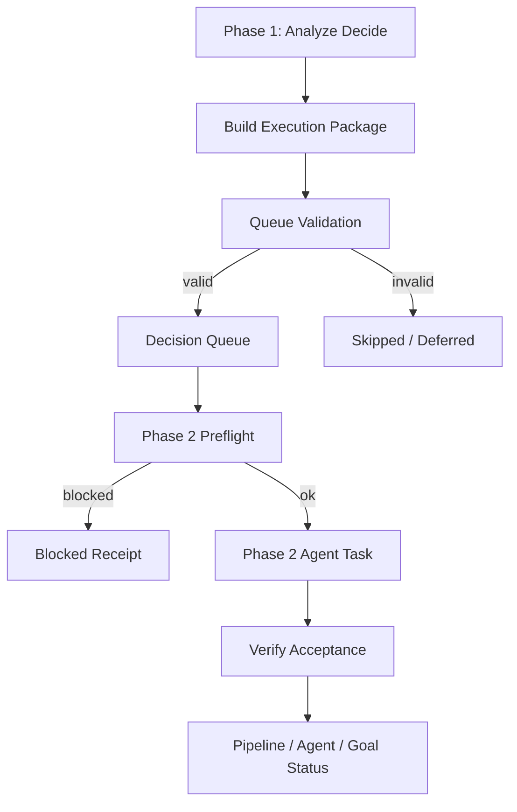

# Phase 2 执行工作包：别再让 Agent 在错误上下文里努力

> 日期：2026-05-21  
> 项目：js-evolution-agent  
> 类型：架构设计 / 功能实现 / 问题排查  
> 来源：Cursor Agent 对话

---

## 目录

1. [背景与动机](#1-背景与动机)
2. [分析过程](#2-分析过程)
3. [方案设计](#3-方案设计)
4. [实现要点](#4-实现要点)
5. [验证与测试](#5-验证与测试)
6. [后续演化](#6-后续演化)
7. [附：本轮对话问题—思考—方案—执行对照](#附本轮对话问题思考方案执行对照)

---

## 1. 背景与动机

这次工作的起点不是一个普通 bug，而是一次 10 轮进化复盘。

`agentank-tank` 的 10 轮 `evolve` 最终显示 `10/10 succeeded`，但从日记和终端日志看，真实目标并没有同步推进：候选有时能生成不同 `codeHash`，但评分不稳定，真实挑战管道长期断裂，最后一轮甚至出现 `execution_root=default_fallback` 指向宿主仓库的问题。

真正刺眼的不是“某一轮失败了”。

真正的问题是：Phase 2 agent 很努力，但它拿到的执行上下文不够硬。它可能在错误 root、弱约束、过期诊断、缺审批的状态下继续工作，最后产出一个看似完整的 receipt。流程跑完了，进化却没推进。

这暴露出一个系统性缺口：

> `agent_run` 不应该只是一个自然语言 action。它应该是一个可校验、可审计、可执行的工作包。

---

## 2. 分析过程

### 2.1 不是“提示词不够长”，而是执行契约不够硬

排查先看了三段链路：

| 阶段 | 关键文件 | 发现 |
| --- | --- | --- |
| Phase 1 决策提示 | [`src/intelligence/conversation-prompts.mjs`](../../src/intelligence/conversation-prompts.mjs) | 已要求输出 `agent_run.params.run_spec`，但主要依赖提示词约束 |
| Phase 1 入队 | [`src/intelligence/conversational-intel-pipeline.mjs`](../../src/intelligence/conversational-intel-pipeline.mjs)、[`src/intelligence/decision-queue.mjs`](../../src/intelligence/decision-queue.mjs) | 已保存完整报告和对话上下文，但入队时没有强校验 execution package |
| Phase 2 执行 | [`src/actions/agent-adapter.mjs`](../../src/actions/agent-adapter.mjs)、[`src/actions/handlers.mjs`](../../src/actions/handlers.mjs) | prompt 偏模板化；缺 root/审批/验收时仍可能 fallback 或产出 partial receipt |

一开始看起来像是“传给 Phase 2 的 prompt 不完整”。但继续分析后，结论更具体：

- Phase 2 并非完全没有上下文。
- 它有 objective、context、recent intelligence、agent context docs。
- 但关键执行信息没有变成不可绕过的结构化约束。

所以修复重点不是把 prompt 写得更长，而是让坏 action 根本进不了 Phase 2。

### 2.2 不能把 agentank 症状写死进核心

这次现象发生在 `agentank-tank`，但方案不能只服务 `agentank-evolver`。

需要泛化的是这个模型：

```text
resource_kind -> resource_scope -> authoritative_root
```

`agentank_evolver` 只是一个外部资源实例。未来可能还有：

- `external:webapp_repo`
- `external:model_workspace`
- `subject_runtime`
- `source_root`

核心系统只应该解决“这个 action 到底该在哪个权威 root 执行”。业务门禁，比如 agentank 的 `std < 40`，应该留给 subject policy / goal verifier，而不是写进 Phase 2 通用逻辑。

---

## 3. 方案设计

最终方案是把 `agent_run` 从松散 action 升级为 **Phase 2 执行工作包**。

工作包不是 system prompt，也不是单纯的用户提示词。它更像一个资深工程师发给另一个工程师的派工单：

- 本轮任务是什么。
- 在哪个 execution root 做。
- 属于哪个 resource scope。
- 本轮已知事实是什么。
- 哪些错路不要再走。
- 能做什么，不能做什么。
- 怎么验收。
- 最后返回哪些可验证字段。

### 关键决策

| 决策 | 选择 | 理由 |
| --- | --- | --- |
| 执行输入 | execution package | 比自然语言 action 更可审计，也比完整情报报告更聚焦 |
| root 机制 | resource registry + authoritative root | 泛化到任意主体和外部项目，不硬编码 agentank |
| 入队策略 | Phase 1 入队前校验 | 坏 action 不应该交给 Phase 2 agent 自救 |
| 执行前检查 | Phase 2 preflight | 阻断 missing root、root mismatch、default fallback、缺审批 |
| 情报报告 | 全文作为参考附录 | 保留完整上下文，但优先级低于 execution package 和 boundary |
| 成功语义 | 拆分 pipeline/agent/acceptance/goal progress | 避免“流程成功”冒充“目标推进” |

### 流程图



---

## 4. 实现要点

### 4.1 资源 registry 泛化

[`src/actions/resource-registry.mjs`](../../src/actions/resource-registry.mjs) 增加了 host/action 注入资源规则和外部 root alias 支持。

这让系统不只认识内置规则，还能从 `ctx.host.resourceRules`、`ctx.host.resourceRoots`、`ctx.host.externalRoots` 解析外部项目。

### 4.2 `agent_run` execution package 校验

[`src/actions/agent-run-spec.mjs`](../../src/actions/agent-run-spec.mjs) 新增 `validateAgentRunSpec()`。

它检查：

- `primary_cwd_kind`
- `primary_cwd`
- `permission_profile`
- `intent`
- `context`
- `expected_output`
- root mismatch
- 是否落入 `default_fallback`

这一步把原本靠 prompt 约束的内容变成机器可检查的契约。

### 4.3 Phase 1 入队前阻断

[`src/intelligence/conversational-intel-pipeline.mjs`](../../src/intelligence/conversational-intel-pipeline.mjs) 在入队前给 `agent_run` 补上 Phase 1 报告上下文，并调用校验函数。

[`src/intelligence/decision-queue.mjs`](../../src/intelligence/decision-queue.mjs) 支持 `validateAction` 和 `metadata`：

- 校验失败的 action 进入 `decisions_skipped`。
- 合格 action 才写入 hot queue。
- queue item 带上报告路径和对话上下文路径。

### 4.4 Phase 2 preflight

[`src/actions/handlers.mjs`](../../src/actions/handlers.mjs) 在 `agent_run` 调用 `runAgenticAction()` 之前做 preflight。

阻断条件包括：

- execution package 无效
- root mismatch
- 非宿主任务落入 `default_fallback`
- `requires_approval=true` 但没有 approval

preflight 失败时直接记录 `blocked` receipt，不调用 agent。

### 4.5 Phase 2 prompt 改为执行工作包

[`src/actions/agent-adapter.mjs`](../../src/actions/agent-adapter.mjs) 新增 execution package prompt builder。

`agent_run` 不再走普通 `Objective / Context / Boundary` 模板，而是生成目标化人话任务说明：

- 本轮任务
- 执行根
- 背景上下文
- 不要重复
- 具体目标
- 边界
- 验收标准
- 最终返回格式
- Phase 1 情报报告全文附录

注意：情报报告全文进入上下文，但只是参考。真正的授权和边界来自 execution package、preflight 和 verifier。

### 4.6 成功语义拆分

`agent_run` receipt 增加：

- `pipeline_status`
- `agent_status`
- `acceptance_status`
- `goal_progress_status`

`actionVerifiers.agent_run` 也按这些字段区分 `improved`、`partial`、`blocked`，避免 `agent_run: FAIL` 或 `requires_human_review` 被误读成目标推进。

---

## 5. 验证与测试

### 聚焦测试

```bash
npm test -- test/actions.test.mjs test/conversational-intel-pipeline.test.mjs
```

结果：

```text
Test Files  2 passed (2)
Tests       60 passed (60)
```

### 全量测试

```bash
npm test
```

结果：

```text
Test Files  4 passed (4)
Tests       183 passed (183)
```

### Lint

对本次修改文件运行 `ReadLints`，结果：无 linter errors。

新增测试覆盖了：

- 不完整 execution package 不调用 agent。
- 缺外部 root 的 `agent_run` 入队前被跳过。
- 未审批的 approval action 在 Phase 2 前被阻断。
- Phase 2 agent prompt 包含目标化执行包和 Phase 1 情报报告全文。
- 既有 `subject_runtime` 成功路径仍然可用。

---

## 6. 后续演化

### 近期可做

- 在 subject policy 中正式声明外部资源 alias、路径模式和业务门禁，减少硬编码规则残留。
- 让 evolve status 同步展示 `acceptance_status` / `goal_progress_status`，避免只看 `round succeeded`。
- 为具体主体增加 goal verifier，例如 agentank 的 avg/std、candidate/simulation 文件、真实挑战同步状态。
- 清理旧 pending decisions，把被证伪的假设写入 `do_not_repeat`，减少上下文噪声。

### 长期方向

- 把 execution package 做成稳定 schema，可独立导出、审计、重放。
- 将 resource registry 从代码规则逐步迁移到 subject 配置。
- 建立跨主体的资源寻址模型：`subject_runtime`、`source_root`、`external:<name>`、`remote:<name>`。

---

## 附：本轮对话问题—思考—方案—执行对照

| 阶段 | 内容 |
| --- | --- |
| 问题 | 10 轮进化显示成功，但实际目标没有推进，Phase 2 agent 可能在错误 root 和不完整上下文里执行 |
| 思考 | 问题不是 prompt 不够长，而是 `agent_run` 缺少可校验执行契约；完整情报报告应该可用，但不能替代工作包 |
| 方案 | 建立 execution package：入队前校验、Phase 2 preflight、目标化人话任务说明、完整 Phase 1 报告作为参考附录 |
| 执行 | 修改 resource registry、run spec、decision queue、conversational pipeline、agent adapter、handlers 和测试；全量 `npm test` 通过 |
