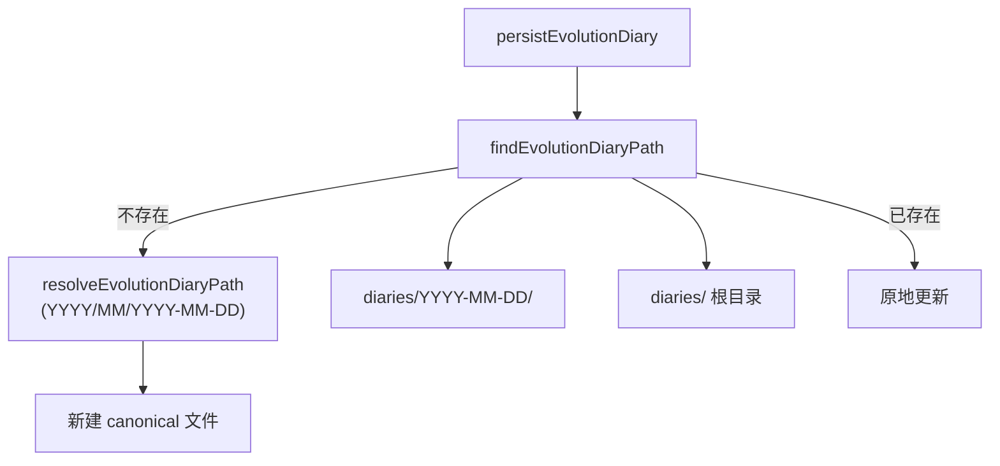

# 进化日记分层目录：从 300+ 平铺文件到可扩展的路径模型

> 日期：2026-05-25  
> 项目：js-evolution-agent（主体：agentank-tank）  
> 类型：架构设计 / 功能实现 / 升级迁移  
> 来源：Cursor Agent 对话  

---

## 目录

1. [背景与动机](#1-背景与动机)
2. [分析过程](#2-分析过程)
3. [方案设计](#3-方案设计)
4. [实现要点](#4-实现要点)
5. [验证与测试](#5-验证与测试)
6. [后续演化](#6-后续演化)

---

## 1. 背景与动机

`runtime/subjects/agentank-tank/data/evolution/diaries/` 里已经积累了 **300+** 篇进化日记，全部平铺在根目录。

文件名本身带日期（`exec-20260517-131747.md`、`cycle-20260520-140353.md`），但目录层面没有任何分组。随着 daemon 多轮进化继续跑，这个目录会越来越难浏览、难排查、难做批量维护。

用户先后提出三个递进需求：

1. **按日期分子目录** — 先把现有文件归类。
2. **按年 / 月继续分层** — 日记量继续增长后仍可读。
3. **兼容旧用法** — 仍支持把 `.md` 直接丢在 `diaries/` 根目录；并确认进化工作流在改路径后仍能正确读写。

真正的问题不是「文件能不能写进去」，而是：**路径布局变了之后，写入、发现、inbox、探针、事件元数据是否仍自洽**。

---

## 2. 分析过程

### 2.1 日记在进化流水线中的位置

Phase 5（`run.mjs` → `buildEvolutionDiary`）在 exec 与 verify 之后生成日记，是唯一**主动写入**入口。其余环节主要是**发现**或**引用元数据**：

| 环节 | 模块 | 与日记的关系 |
| --- | --- | --- |
| Phase 5 写入 | [`evolution-diary-builder.mjs`](../../src/intelligence/evolution-diary-builder.mjs) | 落盘 + 写 `evolution_events.diary_path` |
| Daemon inbox | [`subject-artifacts.mjs`](../../src/cli/utils/subject-artifacts.mjs) | 找 `latest_diary` |
| 资源寻址 | [`resource-registry.mjs`](../../src/actions/resource-registry.mjs) | `data/evolution/diaries/**` |
| 探针 | [`probe-runner.mjs`](../../src/actions/probe-runner.mjs) | keyword 搜索递归读文件；目录 listing 只列一层 |
| 情报 / 目标 | report-builder、goal-assessor | **不直接读**日记文件，靠 report / verify / events |
| 观测 guard | [`observation-guard.mjs`](../../src/intelligence/observation-guard.mjs) | 约束文件名模式，防止模型编造 `diary-YYYYMMDD-*.md` |

结论：改目录结构的主要风险集中在 **写入路径**、**latest 发现**、**按 cycle_id 查找**、**探针可见性**，而不是 Phase 1–4 的业务逻辑。

### 2.2 从 cycle_id 解析日期

日记文件名与 `cycle_id` 一致，格式为 `exec-YYYYMMDD-HHMMSS` 或 `cycle-YYYYMMDD-HHMMSS`。正则 `-(\d{4})(\d{2})(\d{2})-` 可稳定提取年、月、日；无嵌入日期时（如测试里的 `cycle-test-1`）回退到 `generatedAt`。

### 2.3 被否定的方案

| 备选 | 为何不选 |
| --- | --- |
| 仅按 `YYYY-MM-DD/` 一层目录 | 用户明确要求未来还能按**月、年**分层 |
| 按月平铺 `YYYY-MM/exec-*.md`（去掉日目录） | 单日可能有多篇 exec/cycle 日记，保留日目录更清晰 |
| 硬迁移后删除旧路径 | 需兼容根目录平铺、旧 `YYYY-MM-DD/` 中间态 |
| 在 probe listing 里默认递归展开全部 `.md` | 改动面大；keyword 搜索已递归，listing 单层是已知限制 |

---

## 3. 方案设计

### 核心原则

> **新日记默认进 canonical 层级目录；读 / 写时统一走路径解析器，兼容所有历史布局。**

### 支持的三种布局（可并存）

| 布局 | 路径示例 | 场景 |
| --- | --- | --- |
| **Canonical（新建默认）** | `diaries/2026/05/2026-05-20/exec-20260520-013239.md` | 新写入、批量迁移后的主体数据 |
| **Legacy 日目录** | `diaries/2026-05-20/exec-20260520-013239.md` | 第一次按日归类后的中间态 |
| **Legacy 根目录平铺** | `diaries/exec-20260520-013239.md` | 最早平铺、或人工直接丢文件 |

### 关键决策

| 决策 | 选择 | 理由 |
| --- | --- | --- |
| 路径逻辑集中 | 新建 [`diary-paths.mjs`](../../src/intelligence/diary-paths.mjs) | 避免 write / find / inbox 各写一套 join |
| 新建默认路径 | `YYYY/MM/YYYY-MM-DD/` | 年、月、日三级，可扩展 |
| 写入策略 | `resolveEvolutionDiaryWritePath`：先 find 已有，再 canonical | 避免根目录已有文件时重复写一份到子目录 |
| 读取策略 | `findEvolutionDiaryPath` 多候选依次 exists | 兼容 events 里存的旧绝对路径 |
| inbox 发现 | `latestFileInDir(..., { recursive: true })` | 不关心布局，按 mtime 取最新 |
| 观测 guard | 补充 layout 说明 | 防止模型仍假设 `diaries/*.md` 平铺 |



---

## 4. 实现要点

### 数据迁移（agentank-tank runtime）

对 `runtime/subjects/agentank-tank/data/evolution/diaries/` 执行了两步迁移：

1. 335 个文件从根目录迁入 `YYYY-MM-DD/` 日目录。
2. 日目录再迁入 `YYYY/MM/YYYY-MM-DD/` 层级。

迁移后根目录仅保留年份目录（如 `2026/`），其下为 `05/2026-05-17/` 等。

### 关键模块

| 文件 | 职责 |
| --- | --- |
| [`src/intelligence/diary-paths.mjs`](../../src/intelligence/diary-paths.mjs) | `EVOLUTION_DIARIES_REL`、日期解析、`resolve/find/write` 路径 |
| [`src/intelligence/evolution-diary-builder.mjs`](../../src/intelligence/evolution-diary-builder.mjs) | Phase 5 通过 `resolveEvolutionDiaryWritePath` 落盘 |
| [`src/cli/utils/subject-artifacts.mjs`](../../src/cli/utils/subject-artifacts.mjs) | inbox 递归找 `latest_diary` |
| [`src/intelligence/observation-guard.mjs`](../../src/intelligence/observation-guard.mjs) | schema guard 注明 canonical + legacy 布局 |
| [`test/diary-paths.test.mjs`](../../test/diary-paths.test.mjs) | 路径解析、写入兼容、inbox 集成测试 |
| [`test/actions.test.mjs`](../../test/actions.test.mjs) | 嵌套目录 keyword 探针 |
| [`test/intelligence.test.mjs`](../../test/intelligence.test.mjs) | `buildEvolutionDiary` 期望 canonical 路径 |

### `diary-paths.mjs` API 一览

```text
evolutionDiariesRoot(runtimeRoot)
diaryDatePartsFromCycleId(cycleId, { generatedAt })
resolveEvolutionDiaryPath(...)        # canonical 路径（新建默认）
findEvolutionDiaryPath(...)           # 任意布局下查找已有文件
resolveEvolutionDiaryWritePath(...)   # 写入：已有则原地，否则 canonical
candidateEvolutionDiaryPaths(...)     # 查找候选列表（测试 / 调试）
```

查找候选顺序：

1. `storedPath`（evolution event 里记录的旧路径）
2. canonical `YYYY/MM/YYYY-MM-DD/`
3. legacy `YYYY-MM-DD/`
4. legacy 根目录 `diaries/{cycleId}.md`

---

## 5. 验证与测试

已运行并通过：

```bash
npm test -- test/diary-paths.test.mjs test/actions.test.mjs test/intelligence.test.mjs \
  --test-name-pattern="diary-paths|diary|buildEvolutionDiary"

npm test -- test/cli.test.mjs --test-name-pattern="multi-subject artifact inbox"
```

覆盖点包括：

- 从 `cycle_id` / `generatedAt` 解析年月子路径
- canonical 写入路径
- 根目录平铺、legacy 日目录的 find / write 不重复建文件
- inbox 在嵌套与平铺布局下都能找到最新日记
- 探针对 `data/evolution/diaries/` 的 keyword 搜索能命中深层 `.md`
- `buildEvolutionDiary` 写入 `diaries/2026/05/2026-05-17/cycle-test-1.md`

### 已知限制（非回归）

对 `data/evolution/diaries/` 做 **无 keywords 的目录 listing 探针** 时，根层只会看到 `2026/` 等子目录，不会直接列出 `.md`。带 keywords 的 investigation 探针仍可通过递归搜索找到文件。若运维强依赖「列出全部日记文件名」，需单独加 `evolution_diary` 专用递归 inventory（当前未做）。

---

## 6. 后续演化

| 项 | 建议 |
| --- | --- |
| 探针 listing | 为 `evolution_diary` 资源在 listing 步骤附带递归 `.md` 样本或计数 |
| 历史 event 路径 | `evolution-events.jsonl` 里旧 `diary_path` 仍指向迁移前路径；仅元数据，不影响 find；可选批量修正 |
| verify_reports 分层 | 本次未动；若 verify 报告也平铺增多，可复用同类路径模块 |
| 文档链接 | journal 内引用的旧平铺路径（如 `execution-root-unification.md` 中的 diary 链接）仍有效需手动更新为 nested 路径 |

---

## 附：本轮对话问题—思考—方案—执行对照

| 阶段 | 内容 |
| --- | --- |
| **问题** | `diaries/` 平铺 300+ 文件难维护；需按日 / 月 / 年分层，且进化工作流与旧平铺布局都要能用 |
| **思考** | 写入只有 Phase 5 一处；风险在路径解析、inbox 发现、探针与 legacy 兼容；不应在多处硬编码 join |
| **方案** | 集中 `diary-paths.mjs`；canonical 为 `YYYY/MM/YYYY-MM-DD/`；find 兼容三种布局；write 先 find 再 canonical |
| **执行** | 迁移 agentank-tank 335 文件；改 builder / subject-artifacts / observation-guard；新增测试并全部通过 |
