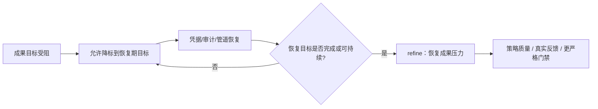

# 目标降标后的升标压力：让 Goal Assessor 不再停在恢复期

> 日期：2026-05-25  
> 项目：js-evolution-agent（主体：agentank-tank）  
> 类型：调研分析 / 架构设计 / 功能实现  
> 来源：Cursor Agent 对话  

---

## 目录

1. [背景与动机](#1-背景与动机)
2. [分析过程](#2-分析过程)
3. [方案设计](#3-方案设计)
4. [实现要点](#4-实现要点)
5. [验证与测试](#5-验证与测试)
6. [后续演化](#6-后续演化)

---

## 1. 背景与动机

这次问题不是“目标校准有没有运行”。

真正的问题是：**目标在多轮校准中不断降标，降到一个容易维持的恢复期标准后，系统就开始持续 `keep`，不再主动升标。**

`agentank-tank` 的目标演化路径很典型。最初的主目标是赢更多、提高策略表现、拿到真实远端反馈。随着模拟管道、凭据、远端 `freeze`、`matchCount` 停滞和 `standing_memory` 审计问题陆续出现，目标逐步被收缩为更可验证的恢复期任务：

- 凭据合规监控。
- 记忆审计收尾。
- 小规模发布并观察 `matchCount`。

这些降标不是错误。恢复期确实需要先保住同步、凭据、安全和可审计性。

问题在于，恢复期目标一旦变得“可维持”，Phase 4 `goal-assessor` 就倾向于继续 `keep`。它会认为目标仍可验证、仍符合文献、仍能继续执行。于是系统停在了一个低压力稳定点：管道活着，审计继续，发布可做，但“赢更多”的成果压力变弱了。

这不是模型偶然跑偏，而是 prompt 设计自然导向的结果。

---

## 2. 分析过程

### 2.1 校准管道没有坏

目标校准实际分成两段：

| 阶段 | 模块 | 职责 |
| --- | --- | --- |
| Phase 4 | [`src/intelligence/goal-assessor.mjs`](../../src/intelligence/goal-assessor.mjs) | 读取当前目标、报告、验证报告、证据和目标历史，输出 `keep/refine/...` |
| Phase 4.5 | [`src/cli/commands/goals.mjs`](../../src/cli/commands/goals.mjs) | 仅在 `refine + high + proposed_goal` 时写入 `active_goals.json` |

自动写入逻辑很保守：

```js
if (assessment.status !== 'refine') return { ...base, status: 'skipped', reason: 'status_not_refine' };
if (assessment.confidence !== 'high') return { ...base, status: 'skipped', reason: 'confidence_not_high' };
if (!proposedGoal) return { ...base, status: 'skipped', reason: 'no_proposed_goal' };
```

近期没有目标更新，并不是 Phase 4.5 失效，而是 Phase 4 连续输出 `keep`。因此 Phase 4.5 正确地跳过。

### 2.2 Report 和 Assessor 都看得到当前目标

排查时确认，Phase 1 情报报告 prompt 会注入当前目标：

- `## Goals` 中注入 `goalsText`。
- `Machine Context` 中包含 `active_goals`、`active_goals_flat`、`goal_events`。
- `Temporal Decision Brief` 的 `decision_constraints.active_goals` 也包含扁平目标树。

Phase 4 `goal-assessor` 也会收到：

- 当前 `active_goals`。
- 最新 intel report Markdown。
- 最新 verify report 摘要。
- 最近 goal history。
- `gatherEvidence()` 聚合的证据。
- `agentContextDocs` 全文。

所以问题不是“目标没进上下文”。

问题是：**prompt 要求审计的是目标是否可验证、是否需要收敛，而不是目标是否仍保留原始成果压力。**

### 2.3 原 prompt 的自然偏向

原来的中文硬约束里有一句关键话：

```text
能收敛，不扩展；目标越可验证越好；proposed_goal 必须仍符合文献与主体策略。
```

这句话本身合理。它能防止目标越改越大、越改越虚。

但在 `agentank-tank` 这种反复遇到阻塞的场景下，它会产生一个副作用：

> 当成果目标难以达成时，模型会把目标 refine 成更窄、更安全、更可验证的过程目标；等过程目标稳定后，又因为“仍可验证”而继续 keep。

也就是用户指出的现象：**降下去之后，没有升回来。**

### 2.4 真正缺少的是“目标压力回弹”

当前 prompt 缺少几条不变量：

| 缺失项 | 后果 |
| --- | --- |
| 降标只能是恢复期策略 | 恢复期目标可能永久化 |
| 成果目标不能被过程目标替代 | `win-more` 变成 `keep-pipeline-alive` |
| 过程目标稳定后必须评估升标 | 系统长期停在低标准 |
| 连续 keep 但成果指标停滞要触发再评估 | `matchCount` 不动也能一直 keep |
| refined goal 必须保留成果压力子目标 | 新目标可能只剩合规、审计、观察 |

这就是本次修改要补上的部分。

---

## 3. 方案设计

方案很小：只改 Phase 4 `goal-assessor` 的中英文 prompt，不改自动写入条件。

这样做有两个好处：

1. 不降低 Phase 4.5 的安全阈值。仍然只有 `refine + high + valid proposed_goal` 会自动写盘。
2. 把“是否应该升标”的判断前移到审计阶段，让目标审计员先显式识别 `goal_pressure_loss`。

### 关键决策

| 决策 | 选择 | 理由 |
| --- | --- | --- |
| 修复位置 | `goal-assessor` prompt | 问题源于审计标准，而不是写入机制 |
| 是否改 `autoCalibrateGoals` | 不改 | 自动写目标仍应保守，避免中置信误写 |
| 新规则核心 | 恢复期可降标，稳定后要升标 | 保留降标的合理性，同时防止低标准永久化 |
| 是否新增 schema 字段 | 暂不新增 | 先用 reason 中的 `goal_pressure_loss` 作为轻量标记 |
| 成果压力表达 | 要求 proposed_goal 至少有一个 outcome-pressure child | 避免新目标只剩合规、审计、观察 |

### 新的审计语义

修改后，目标审计员应按如下状态机理解目标：



这不会禁止降标。它只是要求降标不能成为终点。

---

## 4. 实现要点

修改文件：

| 文件 | 职责 |
| --- | --- |
| [`src/intelligence/goal-assessor.mjs`](../../src/intelligence/goal-assessor.mjs) | Phase 4 目标审计 prompt，中英文硬约束 |

### 中文 prompt 新增规则

在“能收敛，不扩展；目标越可验证越好”后新增：

- 降标或收缩目标只允许作为恢复期策略，不能永久替代原始主目标的成果压力。
- 恢复期子目标完成或连续多轮可维持时，不应仅因低标准目标仍可验证就继续 `keep`。
- 若子目标全是前置条件、合规、审计或观察类任务，且缺少直接衡量主体效果的成果指标，必须在 `reason` 中指出 `"goal_pressure_loss"`。
- `refine` 可以保留安全、凭据、审计类子目标作为守护条件，但 `proposed_goal` 必须至少包含一个成果压力子目标。
- 连续多个 cycle 为 `keep` 但顶层成果指标没有改善时，必须评估是否升标、收紧门禁或新增成果型子目标。

### 英文 prompt 同步更新

英文分支增加等价规则，保持双语行为一致：

- Downgrading/narrowing is recovery-phase only.
- Do not keep low-pressure goals merely because they remain testable.
- Mention `"goal_pressure_loss"` when all child goals are compliance/audit/observation.
- Refined goals must include at least one outcome-pressure child.
- Consecutive keep with stagnant outcome metrics must trigger assessment of stricter standards.

### 影响范围

这次修改不会直接改变：

- `active_goals.json`。
- Phase 4.5 自动写入条件。
- goal event schema。
- report 生成 prompt。

它只改变下一次 Phase 4 LLM 审计目标时的判断压力。

---

## 5. 验证与测试

运行测试：

```powershell
npm test -- test/cli.test.mjs
```

结果：

```text
Test Files  1 passed (1)
Tests  96 passed (96)
```

同时检查了编辑文件的 IDE diagnostics：

```text
src/intelligence/goal-assessor.mjs: no linter errors
```

验证结论：

- 目标 CLI 与自动校准相关测试通过。
- prompt 修改没有破坏 JSON schema、目标更新、自动跳过、历史读取等已有行为。
- 当前工作树仅修改 `src/intelligence/goal-assessor.mjs` 与本 journal 文件。

---

## 6. 后续演化

### 6.1 下一轮真实进化验证

下一轮 `agentank-tank` 进化会消耗已加入的 operator brief（同意修复 `standing_memory` 孤儿引用）。这轮之后应重点观察 Phase 4：

- 是否仍输出 `keep`。
- 若输出 `refine`，reason 是否包含 `goal_pressure_loss`。
- proposed_goal 是否新增策略质量、模拟质量或真实反馈类子目标。
- confidence 是否能达到 `high`，从而让 Phase 4.5 自动写入。

### 6.2 可能的下一步代码增强

如果仅靠 prompt 不够，可以考虑进一步机制化：

| 方向 | 说明 |
| --- | --- |
| `goal_pressure_loss` 结构化字段 | 不只写在 reason，而是 schema 中显式返回 |
| 连续 keep 计数器 | 在 context 中给出最近 N 轮 keep + outcome stagnation 摘要 |
| outcome-pressure 机械检查 | 检查 `active_goals.children` 是否包含成果指标 |
| 自动校准条件分层 | 对“升标型 refine”可采用不同阈值或人工确认流程 |
| report 阶段同步提示 | Phase 1 报告也提示识别过程目标替代成果目标的风险 |

### 6.3 当前判断

这次改动的目标不是让系统盲目追高标准。

它要做的是给目标校准加一根弹簧：

> 可以降标来恢复；但恢复后要有回弹，不能把“系统还活着”当作“目标已经够好”。

---

## 附：本轮对话问题—思考—方案—执行对照

| 阶段 | 内容 |
| --- | --- |
| 问题 | 当前目标不断降标，降到可维持标准后长期 `keep`，不再主动升标 |
| 思考 | Phase 4 看得到目标，但 prompt 更重“可验证/收敛”，缺少成果压力保持规则 |
| 方案 | 在 `goal-assessor` 中加入恢复期降标、稳定后升标、`goal_pressure_loss`、成果子目标要求 |
| 执行 | 修改 `src/intelligence/goal-assessor.mjs` 中英文 prompt，并通过 `npm test -- test/cli.test.mjs` 验证 |
