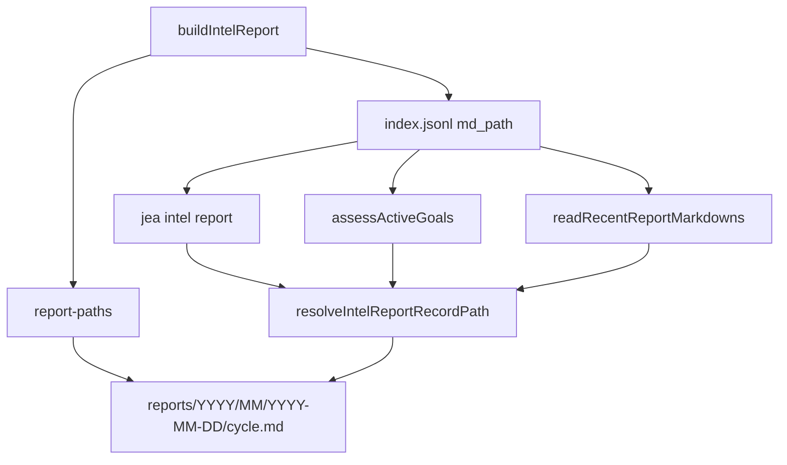

# Intelligence Reports 分层归档：索引型报告不能只移动文件

> 日期：2026-05-25  
> 项目：js-evolution-agent（主体：agentank-tank）  
> 类型：架构设计 / 功能实现 / 升级迁移  
> 来源：Cursor Agent 对话  

---

## 目录

1. [背景与动机](#1-背景与动机)
2. [分析过程](#2-分析过程)
3. [方案设计](#3-方案设计)
4. [实现要点](#4-实现要点)
5. [验证与测试](#5-验证与测试)
6. [后续演化](#6-后续演化)

---

## 1. 背景与动机

`diaries/` 完成分层归档后，用户把同一个问题抛给了 `runtime/subjects/agentank-tank/data/intelligence/reports/`。

表面看，这是同一类需求：文件多了，按日期、月份、年份分目录。  
但 reports 和 diaries 有一个关键差异：

**reports 不是纯文件目录，它是 `index.jsonl` 驱动的索引型数据。**

迁移前，`reports/` 根目录下平铺了 397 个 `cycle-*.md`，同时 `index.jsonl` 有 397 行，每行都保存绝对 `md_path`，且所有路径都存在。换句话说，如果只把 Markdown 文件挪到子目录，而不处理索引，系统会从「目录太乱」变成「索引指向不存在文件」。

真正的问题不是“怎么移动 397 个文件”。

真正的问题是：**报告路径变化后，下一轮情报、CLI 查看、目标评估和历史报告上下文还能不能沿着同一条证据链读到正文。**

---

## 2. 分析过程

### 2.1 reports 的读取链路比 diaries 更重

审计发现，reports 的关键读取入口集中依赖 `record.md_path`：

| 环节 | 模块 | 依赖方式 |
| --- | --- | --- |
| 报告写入 | [`src/intelligence/report-builder.mjs`](../../src/intelligence/report-builder.mjs) | 写 `reports/{cycleId}.md`，并记录 `index.jsonl.md_path` |
| 历史报告上下文 | [`src/intelligence/report-builder.mjs`](../../src/intelligence/report-builder.mjs) | `readRecentReportMarkdowns` 直接读 `record.md_path` |
| CLI 查看报告 | [`src/cli/commands/intel.mjs`](../../src/cli/commands/intel.mjs) | `jea intel report` 打印或打开 `record.md_path` |
| 目标评估 | [`src/cli/commands/goals.mjs`](../../src/cli/commands/goals.mjs) | `assessActiveGoals` 读取 `reportRecord.md_path` |
| daemon inbox | [`src/cli/utils/subject-artifacts.mjs`](../../src/cli/utils/subject-artifacts.mjs) | `latest_report` 来自 `index.jsonl`，不扫目录 |

这说明 reports 不能照搬 diaries 的迁移方式。diaries 可以更多依赖目录递归发现；reports 必须维护索引一致性。

### 2.2 迁移前状态

迁移前做了只读检查：

| 检查项 | 结果 |
| --- | --- |
| 根目录 `cycle-*.md` | 397 |
| 子目录数量 | 0 |
| `index.jsonl` 行数 | 397 |
| 缺失 `md_path` | 0 |
| 目标路径冲突 | 0 |

这个状态很适合做一次确定性迁移：文件数和索引行数一一对应，且没有已知缺失路径。

### 2.3 被否定的方案

| 备选 | 为什么不选 |
| --- | --- |
| 只移动 Markdown，不更新 `index.jsonl` | 多个主流程直接读 `md_path`，会导致 CLI / goals / historical context 失败 |
| 把 `latest_report` 改成扫目录 | 破坏 `intel_reports` 作为权威索引的模型，也无法提供 tldr、source、action_count 等结构字段 |
| 只靠兼容 finder，不重写索引 | 运行时能兜底，但排查时 `index.jsonl` 会长期指向旧路径 |
| 直接删除旧布局兼容 | 测试和历史数据仍可能包含平铺路径，不值得制造硬切换风险 |

---

## 3. 方案设计

### 核心原则

> **新报告默认写入 canonical 分层目录；索引同步指向真实文件；读取入口保留旧路径兜底。**

目标布局与 diaries 保持一致：

```text
reports/
└── 2026/
    └── 05/
        └── 2026-05-25/
            └── cycle-20260525-104338.md
```

canonical 路径：

```text
data/intelligence/reports/{YYYY}/{MM}/{YYYY-MM-DD}/{cycleId}.md
```

### 关键决策

| 决策 | 选择 | 理由 |
| --- | --- | --- |
| 路径逻辑集中 | 新增 [`src/intelligence/report-paths.mjs`](../../src/intelligence/report-paths.mjs) | 避免 builder、CLI、goals 各自拼路径 |
| 日期来源 | 优先从 `cycle_id` 解析，回退 `generated_at` | 与文件名一致，且支持测试里的非日期 cycle |
| 写入策略 | `resolveIntelReportWritePath` 先找已有文件，再用 canonical | 避免同一 cycle 在平铺和分层目录各有一份 |
| 读取策略 | `resolveIntelReportRecordPath` 优先 `storedPath`，缺失时找 canonical / legacy | 支持迁移后索引和旧测试数据 |
| 索引策略 | 迁移时重写 `index.jsonl.md_path` | reports 是索引型数据，索引应保持真实路径 |
| inbox 策略 | `latest_report` 仍来自 `index.jsonl` | 保留 `intel_reports` append_jsonl 的权威性 |



---

## 4. 实现要点

### 新增路径模块

[`src/intelligence/report-paths.mjs`](../../src/intelligence/report-paths.mjs) 提供了 reports 专用路径 API：

| API | 职责 |
| --- | --- |
| `INTELLIGENCE_REPORTS_REL` | canonical 相对根：`data/intelligence/reports` |
| `intelligenceReportsRoot(runtimeRoot)` | 计算 subject runtime 下 reports 根目录 |
| `reportDatePartsFromCycleId` | 从 `cycle_id` 或 `generatedAt` 得到 `YYYY/MM/YYYY-MM-DD` |
| `resolveIntelReportPath` | 新建默认 canonical 路径 |
| `candidateIntelReportPaths` | 生成 `storedPath → canonical → legacy root` 候选 |
| `findIntelReportPath` | 返回第一个真实存在的候选路径 |
| `resolveIntelReportWritePath` | 写入时已有则原地更新，否则 canonical |
| `resolveIntelReportRecordPath` | 从 index record 解析实际可读路径 |

### 接入写入与读取

| 文件 | 修改点 |
| --- | --- |
| [`src/intelligence/report-builder.mjs`](../../src/intelligence/report-builder.mjs) | 写报告时使用 `resolveIntelReportWritePath`；读 recent markdown 时用 `resolveIntelReportRecordPath` |
| [`src/cli/commands/intel.mjs`](../../src/cli/commands/intel.mjs) | `jea intel report` 打印 / 打开前解析实际路径 |
| [`src/cli/commands/goals.mjs`](../../src/cli/commands/goals.mjs) | `assessActiveGoals` 用解析后的路径读取正文，并把返回的 `report.md_path` 改成真实路径 |

### 数据迁移

对 `runtime/subjects/agentank-tank/data/intelligence/reports/` 执行迁移：

| 项 | 迁移后结果 |
| --- | --- |
| 根目录 `cycle-*.md` | 0 |
| 递归 `cycle-*.md` | 397 |
| `index.jsonl` 记录 | 397 |
| 缺失 `md_path` | 0 |
| 根目录子目录 | `2026/` |

迁移规则是从 `cycle_id` 解析日期，把文件移动到：

```text
reports/YYYY/MM/YYYY-MM-DD/{cycleId}.md
```

并同步重写 `index.jsonl` 每行的 `md_path` 为迁移后的绝对路径。

### 测试覆盖

新增 [`test/report-paths.test.mjs`](../../test/report-paths.test.mjs)，并扩展：

| 文件 | 覆盖内容 |
| --- | --- |
| [`test/report-paths.test.mjs`](../../test/report-paths.test.mjs) | canonical 路径、平铺兼容、stored path 优先、stale path fallback、写入路径 |
| [`test/intelligence.test.mjs`](../../test/intelligence.test.mjs) | `readRecentReportMarkdowns` 在旧 `md_path` 失效时能读 canonical 文件 |
| [`test/cli.test.mjs`](../../test/cli.test.mjs) | `intelReportCommand` 与 `assessActiveGoals` 能从 stale index 读新路径 |

---

## 5. 验证与测试

已运行：

```bash
npm test -- test/report-paths.test.mjs test/intelligence.test.mjs test/cli.test.mjs --test-name-pattern="report-paths|buildIntelReport|loads recent report markdowns|intel report cli helpers|assesses a canonical report|assesses latest report|assesses a specific report|multi-subject artifact inbox"
```

结果：

```text
Test Files  3 passed (3)
Tests       31 passed | 123 skipped (154)
```

数据一致性检查结果：

```text
root_cycle_md=0
recursive_cycle_md=397
index_records=397
missing_md_path=0
root_dirs=2026
```

同时对改动文件执行 linter 诊断，未发现 linter 错误。

---

## 6. 后续演化

| 项 | 建议 |
| --- | --- |
| `verify_reports` 分层 | 本轮未迁移；若数量继续增长，可复用 report/diary 路径模型 |
| 历史 journal 链接 | 旧文档中若直接链接 `reports/cycle-*.md`，需要单独批量更新 |
| 路径模块抽象 | `diary-paths` 与 `report-paths` 结构相似，未来可抽出通用 dated artifact helper |
| 数据迁移工具化 | 本次迁移由一次性脚本完成；长期可沉淀成 `jea data migrate` 子命令 |

---

## 附：本轮对话问题—思考—方案—执行对照

| 阶段 | 内容 |
| --- | --- |
| **问题** | `reports/` 平铺 397 个 Markdown，用户希望像 diaries 一样按年 / 月 / 日分层 |
| **思考** | reports 是 `index.jsonl` 驱动的数据源，不能只移动文件，必须维护 `md_path` 和读取入口 |
| **方案** | 新增 `report-paths.mjs`，canonical 写入分层目录，读取兼容 stored / canonical / legacy，迁移时同步重写索引 |
| **执行** | 改 builder、CLI、goals，补测试，迁移 397 个报告并验证索引路径全部存在 |
