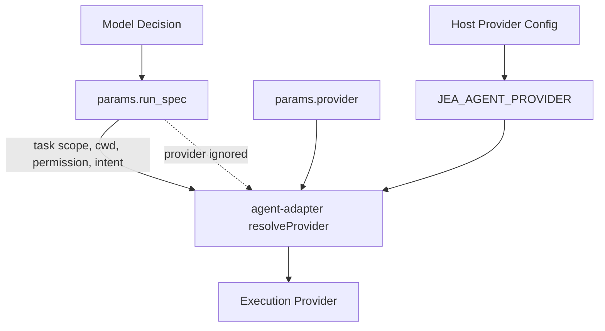

# 移除模型 Provider 选择权：把执行后端还给宿主配置

> 日期：2026-05-25  
> 项目：js-evolution-agent  
> 类型：架构设计 / 功能实现 / 问题排查  
> 来源：Cursor Agent 对话  

---

## 目录

1. [背景与动机](#1-背景与动机)
2. [分析过程](#2-分析过程)
3. [方案设计](#3-方案设计)
4. [实现要点](#4-实现要点)
5. [验证与测试](#5-验证与测试)
6. [后续演化](#6-后续演化)

---

## 1. 背景与动机

这次问题最初看起来像一个 provider 配置没有生效的问题。

用户检查最近几轮 `agentank-tank` 进化，想确认是否成功使用了 `cursor_agent`。运行时记录给出的答案很明确：没有。近期 `agent_run` 实际使用的是 `claude_code_sdk`，而不是 `.env` 中配置的 `JEA_AGENT_PROVIDER=cursor_sdk`。

真正的问题不是 Cursor SDK 能不能跑。

真正的问题是：**模型每轮生成的决策 JSON 里显式写了 `run_spec.provider=claude_code_sdk`，从而覆盖了宿主配置。**

这暴露出一个更深的边界问题：provider 是执行基础设施选择，还是 agent 的业务决策内容？

第一性原理下，答案应该很清楚：

> 模型决定“做什么”；宿主决定“用哪个执行后端做”。

如果让模型在每轮 `Analyze+Decide` 中选择 provider，那么 `.env`、CLI、部署策略和人工 operator 的控制权都会被一个历史 prompt 示例悄悄架空。

---

## 2. 分析过程

排查时先确认了三条证据链。

### 2.1 运行时确实没有走 Cursor

近期 `action_receipts` 和 verify report 中反复出现的是：

```json
"provider": "claude_code_sdk"
```

而 `cursor_sdk` / `cursor_agent` 在运行时数据中没有实际使用记录。

同时 `.env` 中已经配置：

```env
JEA_AGENT_PROVIDER=cursor_sdk
```

这说明问题不在默认配置缺失，而在默认配置被更高优先级输入覆盖。

### 2.2 执行器的优先级允许显式覆盖

[`src/actions/agent-adapter.mjs`](../../src/actions/agent-adapter.mjs) 原本的 provider 解析顺序是：

```js
runSpec.provider
  ?? getField(action, 'provider')
  ?? process.env.JEA_AGENT_PROVIDER
  ?? DEFAULT_PROVIDER
```

这个设计本身并不奇怪：显式 action override 优先于环境默认值。

问题在于 `runSpec.provider` 并不是真正的宿主配置。它来自模型生成的 `params.run_spec`，属于 decision payload 的一部分。

### 2.3 Prompt 正在诱导模型写死 provider

[`src/intelligence/conversation-prompts.mjs`](../../src/intelligence/conversation-prompts.mjs) 的 JSON shape 里原本直接写着：

```json
"provider": "claude_code_sdk | cursor_sdk"
```

这会让模型把 provider 理解为必填业务字段。于是它每轮都输出一个 provider，运行时就永远不会回落到 `JEA_AGENT_PROVIDER`。

### 2.4 只改 prompt 不够

如果只删 prompt 示例，历史 pending decision 或模型偶发输出的 `run_spec.provider` 仍可能继续覆盖配置。

因此修复不能停在“告诉模型别写”。执行层也必须把边界收紧：

```text
run_spec 描述任务规格
provider 来自宿主配置或人工/API override
```

---

## 3. 方案设计

最终方案不是“让 Cursor 优先级更高”，而是更彻底地移除模型选择权。

### 关键决策

| 决策 | 选择 | 理由 |
| --- | --- | --- |
| provider 所属层级 | 宿主配置层 | provider 是执行基础设施，不是模型的业务判断 |
| 模型输出 schema | 删除 `run_spec.provider` | 避免 prompt 继续诱导模型写死后端 |
| 历史残留处理 | 执行层忽略并剥离 `run_spec.provider` | 保护旧 pending action 和异常输出 |
| 人工覆盖能力 | 保留 `params.provider` / 顶层 provider | 操作者和 API 仍需要显式控制执行后端 |
| 默认 provider | 继续使用 `JEA_AGENT_PROVIDER` | 与现有部署配置模型一致 |

### 数据流调整

修复后的 provider 选择链路变成：

```text
人工/API action provider
  -> JEA_AGENT_PROVIDER
  -> llm_only fallback
```

而 `params.run_spec.provider` 不再参与选择。



---

## 4. 实现要点

### 关键模块

| 文件 | 职责 |
| --- | --- |
| [`src/intelligence/conversation-prompts.mjs`](../../src/intelligence/conversation-prompts.mjs) | 从 Analyze+Decide JSON shape 中移除 `provider`，并明确模型不得设置 `params.run_spec.provider` |
| [`src/actions/agent-run-spec.mjs`](../../src/actions/agent-run-spec.mjs) | 规范化 `AgentRunSpec` 时剥离 `provider`，避免模型字段被提升到 `params.provider` |
| [`src/actions/agent-adapter.mjs`](../../src/actions/agent-adapter.mjs) | `resolveProvider()` 忽略 `runSpec.provider`，只看宿主/人工 provider |
| [`test/actions.test.mjs`](../../test/actions.test.mjs) | 增加 provider 边界测试，并调整 Claude 诊断测试改用人工 `params.provider` 覆盖 |
| [`test/conversational-intel-pipeline.test.mjs`](../../test/conversational-intel-pipeline.test.mjs) | 增加 prompt 约束测试，确保不再出现 provider 示例 |

### 4.1 Prompt 层：不再教模型选择 provider

新增约束：

```text
不要在 `params.run_spec` 中设置 `provider`。
agent provider 是宿主执行配置，由 `JEA_AGENT_PROVIDER` 或人工/API action override 决定，不是模型决策内容。
```

同时 JSON shape 中删除：

```json
"provider": "claude_code_sdk | cursor_sdk"
```

### 4.2 RunSpec 层：剥离模型残留字段

[`src/actions/agent-run-spec.mjs`](../../src/actions/agent-run-spec.mjs) 新增 `omitModelControlledProvider()`，用于从 raw run spec 中移除 `provider`。

关键效果有两点：

- `normalizeAgentRunSpec()` 不再返回 `spec.provider`。
- `applyRunSpecToAction()` 不再把 `spec.provider` 写入 `params.provider`。

这让 `run_spec` 回到它本来的职责：描述 cwd、权限、意图、上下文和期望输出。

### 4.3 Adapter 层：provider 解析回到宿主边界

[`src/actions/agent-adapter.mjs`](../../src/actions/agent-adapter.mjs) 的解析逻辑收敛为：

```js
getField(action, 'provider')
  ?? process.env.JEA_AGENT_PROVIDER
  ?? DEFAULT_PROVIDER
```

这保留了人工/API override 能力，但彻底排除了模型生成的 `run_spec.provider`。

### 4.4 运行中数据：清理 pending 残留

当前 `pending_decisions.json` 中存在旧决策残留的 `run_spec.provider=claude_code_sdk`。修复后执行器已经会忽略这些字段，但为了避免后续排查混淆，本轮用结构化 JSON 方式清理了 pending 队列里的残留字段。

清理结果：

```text
removed run_spec provider fields: 110
```

没有批量改历史 records/diaries。它们是审计证据，应保持原样。

---

## 5. 验证与测试

运行聚焦测试：

```bash
npm test -- actions.test.mjs conversational-intel-pipeline.test.mjs
```

结果：

```text
Test Files  2 passed (2)
Tests       89 passed (89)
```

额外检查：

- `ReadLints` 检查修改文件，无 lint 错误。
- 搜索 `pending_decisions.json`，确认不再残留 `claude_code_sdk` / `cursor_sdk` / `cursor_agent` provider 字段。
- `git diff --stat` 显示源码和测试变更集中在 5 个文件。

测试覆盖了两个关键边界：

| 场景 | 期望 |
| --- | --- |
| 模型在 `run_spec.provider` 写 `claude_code_sdk`，但 `JEA_AGENT_PROVIDER=cursor_sdk` | 实际走 `cursor_sdk` |
| 人工/API 在 `params.provider` 写 provider | 仍可覆盖默认 provider |

---

## 6. 后续演化

1. **观察下一轮真实 receipt**

   下一轮 `agent_run` 应该在 `.env` 配置下走 `cursor_sdk`。需要检查 receipt 中的 `provider`，确认来源已经回到 `JEA_AGENT_PROVIDER`。

2. **考虑暴露 provider 来源**

   后续可以在 receipt 或 `agent.outputs` 中记录 provider 来源，例如：

   ```json
   {
     "provider": "cursor_sdk",
     "provider_source": "JEA_AGENT_PROVIDER"
   }
   ```

   这样后续排查时不用再从优先级链路反推。

3. **扩展到其它模型不应控制的宿主字段**

   `provider` 只是一个例子。类似 `permissionMode`、危险跳过权限、硬隔离声明等字段，也应该逐步区分：

   - 模型可以描述需求。
   - 宿主决定是否授权。

4. **保留历史审计数据**

   历史 records/diaries 中的 `provider=claude_code_sdk` 是当时系统行为的事实，不应为了“看起来干净”去重写。

---

## 附：本轮对话问题—思考—方案—执行对照

| 阶段 | 内容 |
| --- | --- |
| 问题 | 用户发现近期进化没有使用 `cursor_agent`，而是继续走 `claude_code_sdk` |
| 思考 | 根因不是 Cursor 配置缺失，而是模型生成的 `run_spec.provider` 覆盖了宿主默认配置 |
| 方案 | 移除模型 provider 选择权，让 provider 只来自 `params.provider` 人工/API override 或 `JEA_AGENT_PROVIDER` |
| 执行 | 修改 prompt、run_spec 规范化、provider 解析和测试；清理 pending decision 残留；聚焦测试 89 项通过 |
