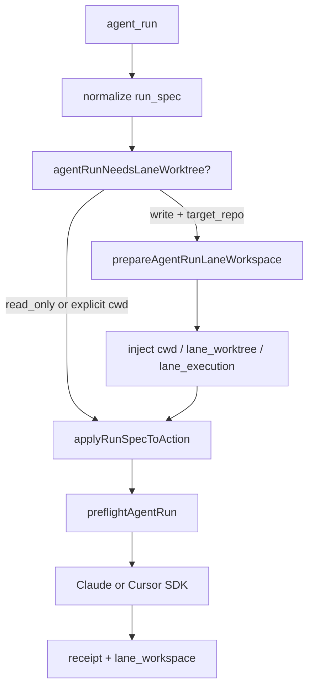

# Phase 2 Lane 修复：写入型 agent_run 不再落在目标仓库主目录

> 日期：2026-05-27
> 项目：js-evolution-agent
> 类型：问题排查 / 功能实现
> 来源：Cursor Agent 对话

---

## 目录

1. [背景与动机](#1-背景与动机)
2. [分析过程](#2-分析过程)
3. [方案设计](#3-方案设计)
4. [实现要点](#4-实现要点)
5. [验证与测试](#5-验证与测试)
6. [后续演化](#6-后续演化)
7. [附：本轮对话问题—思考—方案—执行对照](#附本轮对话问题思考方案执行对照)

---

## 1. 背景与动机

在 Subject Repo Lane 机制落地之后（见 [2026-05-23 subject-repo-lane-evolution](../2026-05-23/subject-repo-lane-evolution.md)），系统已经能为主体外部的目标仓库维护一条长期进化分支 `jea/<subject>/<lane>`，并用 `lane_observe` / `lane_verify` 在固定 lane worktree 里跑命令，用 `core_apply` 从 lane 派生每轮 work 分支。

但一次静态复盘发现：Phase 2 最常见的 `agent_run` 路径并没有接入这套语义。

用户观察到 Claude Code SDK 与 Cursor SDK 在「适用目标项目进化分支」上表现不一致。进一步分析后，结论不是 Cursor provider 本身忽略分支，而是 **宿主在派 agent 之前，把 `target_repo` 解析成了目标仓库主目录 checkout**，而主目录往往仍停在 `main`。Cursor SDK 的 `local.cwd` 和 Claude SDK 的 `cwd` 都忠实使用了这个错误的执行根，于是看起来只有部分路径「在用专属分支」。

真正的问题是：

> 写入型 `agent_run` 只保证了「权威 root」，没有保证「进化分支 root」。

---

## 2. 分析过程

### 2.1 三条执行路径并不一致

| 路径 | 执行目录来源 | 是否用 lane / work 分支 |
| --- | --- | --- |
| `lane_observe` / `lane_verify` | `ensureLaneWorktree()` 固定 lane worktree | 是 |
| `core_apply` | `prepareCoreApplyWorkspace()` 从 `repoLane.lane` 派生 worktree | 是 |
| 普通 `agent_run` | `run_spec.primary_cwd_kind` → `target_repo` → `repoRoot` | 否（写入时） |

`agent-adapter.mjs` 中 Claude 与 Cursor 的实现是对称的：都把 `roots.executionCwd` 传给各自 SDK。差异出在上游 `handlers.mjs` 的 `agent_run` handler，它在调用 provider 前没有做任何 lane worktree 准备。

### 2.2 `lane_worktree` scope 存在但未接通

[`src/actions/resource-registry.mjs`](../../src/actions/resource-registry.mjs) 已定义 `target_repo` 与 `lane_worktree` 两种 scope，但普通决策仍引导模型输出 `primary_cwd_kind=target_repo` 或 subject policy 中的外部 scope。宿主没有把「写入型目标项目 run」自动改写到 `lane_worktree`。

### 2.3 实现期还发现一个顺序陷阱

第一版实现若在 `applyRunSpecToAction()` **之后** 再判断是否需要 lane worktree，会失败：`applyRunSpec` 会把解析出的 `primary_cwd` 写入 `params.cwd`，而 `explicitWorkspace()` 会把这误判为「用户已显式指定 worktree」，从而跳过自动建 worktree。最终修复把 lane 准备移到 `applyRunSpecToAction` **之前**，只对原始 action 做判断。

---

## 3. 方案设计

采用 **host 侧统一改写**，不分别修补 Claude / Cursor provider。



### 关键决策

| 决策 | 选择 | 理由 |
| --- | --- | --- |
| 修复层级 | `handlers.mjs` host preflight | provider 已尊重 `executionCwd`，问题在根解析 |
| 触发条件 | `target_repo`（或同 repo 外部 scope）+ 写入 profile | 只读调查仍可走主目录，降低行为变更面 |
| worktree 创建 | 复用 `createBranchWorktree()` + `repoLane.workBranchPrefix` | 与 `core_apply` 分支命名一致，避免两套规则 |
| 显式 worktree | 不自动创建 | 尊重操作者或模型已给出的 `cwd` / `boundary.worktree` |
| lane 未就绪 | 阻断并提示 `jea subject lane init` | 不悄悄创建 lane，与现有 guard 一致 |
| Phase 1 提示 | 说明宿主会自动转入 lane-derived worktree | 模型仍声明 `target_repo` + 权限即可 |

---

## 4. 实现要点

### 4.1 `agent_run` 执行顺序

[`src/actions/handlers.mjs`](../../src/actions/handlers.mjs) 中 `agent_run` 新流程：

1. `normalizeAgentRunSpec(action)`（**尚未** `applyRunSpecToAction`）
2. `prepareAgentRunLaneWorkspace()`：必要时 `checkLaneStatus` + `createBranchWorktree`
3. `applyRunSpecToAction(workspacePrep.action)`
4. `preflightAgentRun` → `runAgenticAction`

写入型 run 注入字段包括：

- `params.cwd` / `boundary.worktree` → worktree 路径
- `resource_scope` → `lane_worktree`
- `run_spec.primary_cwd_kind` → `lane_worktree`
- `run_spec.context.lane_execution` → `target_repo_root`、`lane_branch`、`work_branch`、`worktree_path`

回执增加 `lane_workspace` 与 `evidence.lane_workspace`，便于审计「本轮实际在哪个分支/worktree 执行」。

### 4.2 关键模块

| 文件 | 职责 |
| --- | --- |
| [`src/actions/handlers.mjs`](../../src/actions/handlers.mjs) | `agentRunNeedsLaneWorktree`、`prepareAgentRunLaneWorkspace`、`actionWithAgentRunWorkspace`；调整 `agent_run` 顺序 |
| [`src/actions/resource-registry.mjs`](../../src/actions/resource-registry.mjs) | `lane_worktree` scope 优先使用 action 上显式 `cwd` |
| [`src/actions/agent-adapter.mjs`](../../src/actions/agent-adapter.mjs) | Claude/Cursor `options` 附带 `lane_execution` 元数据 |
| [`src/intelligence/conversation-prompts.mjs`](../../src/intelligence/conversation-prompts.mjs) | Phase 1 说明写入型目标项目 run 由宿主转入 lane worktree |
| [`test/actions.test.mjs`](../../test/actions.test.mjs) | 自动建 worktree、只读跳过、显式 worktree、lane 未就绪阻断、options cwd 一致 |

测试可通过 `ctx.host.createAgentRunWorktree` 与 `ctx.host.checkLaneStatus` 注入，避免 ESM spy 无法穿透 handler 静态 import 的问题。

### 4.3 行为对照

| 场景 | 行为 |
| --- | --- |
| `target_repo` + `read_only` | 仍在目标 repo 主目录执行 |
| `target_repo` + `workspace_write` | 自动进入 `lane/work/*` worktree |
| 显式 `cwd` / `boundary.worktree` | 不自动建 worktree |
| lane 分支不存在 | `blocked`，提示 `jea subject lane init` |

---

## 5. 验证与测试

```powershell
npm test -- --run test/actions.test.mjs
npm test -- --run
```

结果：

- `test/actions.test.mjs`：83 项通过（含 6 条新增 lane / agent_run 相关用例）
- 全量：`259` 项通过

新增测试覆盖要点：

- `workspace_write` + `target_repo` 调用 `createAgentRunWorktree`
- `read_only` + `target_repo` 不建 worktree
- 显式 worktree 不重复创建
- lane 未就绪时阻断且不调 agent
- `buildClaudeOptions` / `buildCursorOptions` 对 `lane_worktree` 的 `cwd` 一致

---

## 6. 后续演化

1. 评估只读 `agent_run` 是否也应统一走固定 lane worktree（避免主目录停在 `main` 时只读证据错位），与 [lane 命令执行修正](../2026-05-23/subject-repo-lane-evolution.md) 对齐。
2. 在 daemon/evolve 每轮 exec 前可选插入 `lane_status` / `lane_observe`，把目标仓库状态变成常规证据。
3. 真实演化一轮后检查 receipt 中 `lane_workspace`、`outputs.claude/cursor.options.lane_execution` 是否与 git 状态一致。

---

## 附：本轮对话问题—思考—方案—执行对照

| 阶段 | 内容 |
| --- | --- |
| 问题 | Phase 2 写入型 `agent_run` 在目标项目上未使用 subject 专属进化分支；Claude 与 Cursor SDK 表现不一致 |
| 思考 | provider 对称；缺口在 `target_repo`→主目录解析；`core_apply` 已有 lane worktree 而 `agent_run` 没有；`applyRunSpec` 顺序会导致跳过自动建 worktree |
| 方案 | host 在 `applyRunSpec` 前为写入型 run 从 lane 派生 worktree，注入 `lane_worktree`；Claude/Cursor 共用同一 `execution_cwd` |
| 执行 | 改 `handlers`、`resource-registry`、`agent-adapter`、`conversation-prompts` 与测试；259 tests 通过 |
