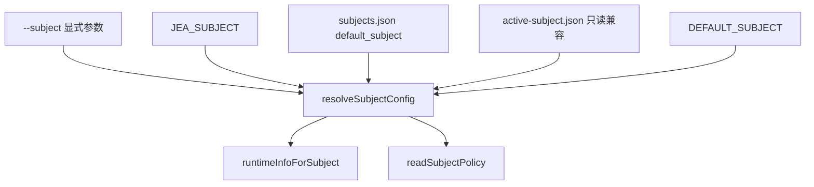

# Subject Registry：从全局 active 到显式主体选择

> 日期：2026-05-27  
> 项目：js-evolution-agent  
> 类型：架构设计 / 升级迁移 / 功能实现  
> 来源：Cursor Agent 对话

---

## 目录

1. [背景与动机](#1-背景与动机)
2. [分析过程](#2-分析过程)
3. [方案设计](#3-方案设计)
4. [实现要点](#4-实现要点)
5. [验证与测试](#5-验证与测试)
6. [后续演化](#6-后续演化)

---

## 1. 背景与动机

真正的问题不是「能不能切换主体」。

真正的问题是：**系统里同时存在「全局当前主体」和「运行时显式指定主体」两套语义**，而多主体并行演化已经在 `evolve`、`daemon` 上落地，单轮 `run` 和一批 data/intel/goals 命令却仍默认读 `policies/active-subject.json`。

对话从两条线汇合：

1. **分析线**：梳理 `policies/subjects/agentank-tank.md` 在进化执行工作流中的用法——全文作为 `agentContextDocs` 权威文献，结构化段落解析为 `subjectRepoLane`、`externalRoots`、`resourceRules`，并在 lane 门禁、exec 路径解析、决策 prompt 中生效。
2. **设计线**：用户提出 `active-subject.json` 应改为 `subjects.json` 注册表；主体不应有全局「激活态」，而应在运行时通过 `--subject`、`JEA_SUBJECT` 或多 worker 并行显式选择。

本地当时状态：

- `policies/active-subject.json` 指向 `agentank-tank`
- 已有 `agentank-tank.md`、`js-evolution-agent.md` 两份 policy
- 尚无 `policies/subjects.json`

目标：消除隐式全局 active，引入 registry + 统一 resolver，并保留短期兼容。

---

## 2. 分析过程

### 2.1 现有 subject 解析链

旧链路集中在 [`src/cli/utils/subjects.mjs`](../../src/cli/utils/subjects.mjs)：

```text
JEA_SUBJECT env
  └─> readActiveSubject()
        └─> policies/active-subject.json
              └─> getActiveSubjectRuntimeInfo() / readActiveSubjectPolicy()
```

`oada.config.mjs`、`run.mjs`、data/intel/goals/actions 等 CLI 均走这条链。

### 2.2 已具备的多主体能力

| 入口 | 显式 subject | 说明 |
| --- | --- | --- |
| `jea evolve` | `--subject` / `--subjects` | 已有，但 fallback 旁路读 active 文件 |
| `jea daemon` | `--subject` / `--subjects` / `--all` | 已有 |
| `jea run` | 无 | 迁移前只能依赖 env 或 active 文件 |

`evolve-runs.mjs` 里还存在**旁路读取** `active-subject.json`，与 `readActiveSubject()` 不同步，是迁移时的主要回归风险点。

### 2.3 policy 文档的双重角色（上下文）

`agentank-tank.md` 在进化循环中承担：

- **AI 权威**：与 CONSTITUTION、SKILL 并列注入 intel / goals / diary prompt
- **机器配置**：`Subject Repo Lane`、`Runtime Boundary Model` 解析为 lane、external scope、resource rules

本次迁移**不**把 repo/lane 等字段迁入 JSON，Markdown 继续作策略全文；registry 只负责「有哪些主体、默认是谁、policy 路径与 namespace」。

---

## 3. 方案设计

### 3.1 目标形态

```json
{
  "default_subject": "agentank-tank",
  "subjects": {
    "agentank-tank": {
      "policy": "subjects/agentank-tank.md",
      "data_namespace": "agentank-tank"
    }
  }
}
```

- `default_subject`：交互便利与旧命令兼容，**不代表全局运行态**
- 单次运行：`--subject` 或 `JEA_SUBJECT` 显式选择
- 多 worker：各进程自带 subject，不读写共享 active 文件

### 3.2 解析优先级



### 关键决策

| 决策 | 选择 | 理由 |
| --- | --- | --- |
| 配置形态 | `subjects.json` registry | 表达「有哪些主体」，而非「当前激活谁」 |
| default 语义 | `default_subject` 可省略 `--subject` | 保留交互便利，但不作为并行运行的全局状态 |
| 旧 API | 保留 `readActiveSubject` 等 wrapper | 降低一次性改动面，内部转调 resolver |
| policy 内容 | 仍用 Markdown | 避免把 repo/lane 结构化迁移扩 scope |
| 旧文件 | `active-subject.json` 只读兼容一版 | 平滑迁移；两者并存时以 registry 为准 |
| `jea subject use` | 改为写 `default_subject` | 语义与 registry 一致，CLI 提示已更新 |

### 3.3 未采纳方案

- **删除 default，所有命令强制 `--subject`**：对交互不友好，留作后续收紧选项
- **把 Repo/Lane 迁入 JSON**：属于另一轮配置结构化，不在本次范围

---

## 4. 实现要点

### 4.1 核心模块

| 文件 | 职责 |
| --- | --- |
| [`src/cli/utils/subjects.mjs`](../../src/cli/utils/subjects.mjs) | `readSubjectsRegistry`、`resolveSubjectConfig`、`runtimeInfoForSubject`、`readSubjectPolicy`、`setDefaultSubject`、`ensureSubjectsRegistry`（含 legacy 自动迁移） |
| [`src/cli/utils/evolve-runs.mjs`](../../src/cli/utils/evolve-runs.mjs) | `normalizeEvolveSubjects` / `runtimeForSubject` 统一走 registry |
| [`src/cli/utils/subject-selection.mjs`](../../src/cli/utils/subject-selection.mjs) | daemon/evolve 的 fallback 改为 `default_subject` |
| [`src/cli/utils/subject-lane-guard.mjs`](../../src/cli/utils/subject-lane-guard.mjs) | lane 预检支持显式 subject |
| [`src/cli/commands/run.mjs`](../../src/cli/commands/run.mjs) | 新增 `--subject`，注入 `JEA_SUBJECT` |
| [`oada.config.mjs`](../../oada.config.mjs) | 启动时 `resolveSubjectConfig` + `readSubjectPolicy` |
| [`src/cli/commands/subject.mjs`](../../src/cli/commands/subject.mjs) | `list/show/check/lane/init/use/default` 基于 registry |
| data / intel / goals / actions / policy 命令 | 接入 `--subject` + `resolveSubjectFromFlags` |

### 4.2 本地落地

迁移后本地 registry：

```text
policies/
  subjects.json          # default: agentank-tank；注册 agentank-tank + js-evolution-agent
  subjects/
    agentank-tank.md
    js-evolution-agent.md
```

`policies/active-subject.json` 已从工作区删除；功能由 `subjects.json` 完全承接。

首次 `ensureSubjectsRegistry` 会把 legacy active 文件内容写入 `subjects.json`（若 registry 不存在）。

### 4.3 CLI 变化摘要

```powershell
jea run --subject agentank-tank
jea data status --subject agentank-tank
jea subject list
jea subject default agentank-tank    # 原 use 语义
jea subject show --subject js-evolution-agent
```

---

## 5. 验证与测试

实现完成后运行：

```powershell
npm test
```

结果：**265 tests passed**（含新增 legacy `active-subject.json` 兼容用例、`subjects.json` init 断言）。

手动确认项（对话中已执行）：

- 从 `active-subject.json` 生成 `policies/subjects.json`，注册两个主体、default 为 `agentank-tank`
- 删除 `policies/active-subject.json`

未在本轮 journal 覆盖的验证（建议操作者自行 smoke）：

```powershell
jea subject list
jea run --mock --subject agentank-tank
jea data status --subject agentank-tank
```

---

## 6. 后续演化

| 方向 | 说明 |
| --- | --- |
| 收紧默认行为 | 写入/执行型命令在无 `--subject` 时要求显式指定，而非静默用 default |
| policy 结构化 | 将 `Subject Repo Lane`、resource scope 等机器字段逐步迁入 registry 或 sidecar JSON，减少 Markdown 解析脆弱性 |
| 文档同步 | 操作者 habit：并行演化始终 `jea run --subject X` / 各开一 daemon worker |
| 清理兼容层 | 一个版本周期后移除 `active-subject.json` 只读路径与 `readActiveSubject` 命名 |

---

## 附：本轮对话问题—思考—方案—执行对照

| 阶段 | 内容 |
| --- | --- |
| 问题 | `active-subject.json` 表达全局「当前主体」，与 evolve/daemon 多主体并行模型冲突；操作者需要 registry + 运行时显式选择 |
| 思考 | 梳理 policy 在工作流中的用法；定位 `readActiveSubject` 与 `evolve-runs` 旁路双读；区分 registry（索引）与 policy（权威+部分机器配置） |
| 方案 | 引入 `subjects.json` + `resolveSubjectConfig`；`default_subject` 仅作便利；CLI/运行时统一 resolver；短期兼容 legacy active 文件 |
| 执行 | 改 subjects 工具链与各 CLI；补测试与 README/AGENTS；生成本地 `subjects.json`；删除 `active-subject.json` |
