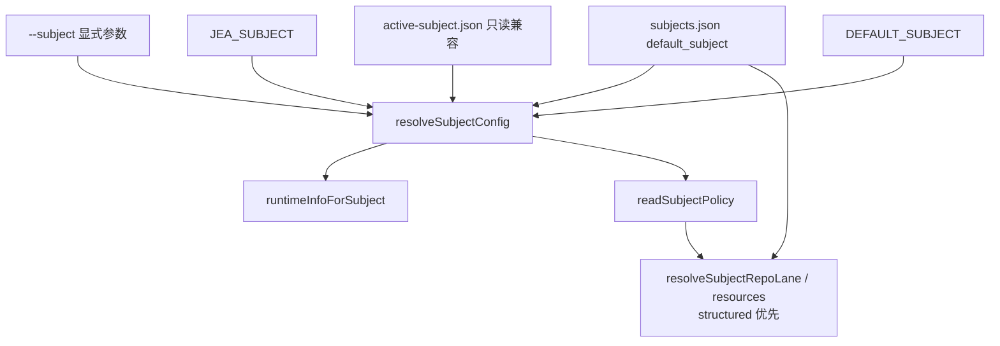

# Subject Registry：从全局 active 到显式主体选择

> 日期：2026-05-27  
> 项目：js-evolution-agent  
> 类型：架构设计 / 升级迁移 / 功能实现  
> 来源：Cursor Agent 对话  
> **状态：已落地**；同日跟进 [policy 结构化](./policy-structured-runtime-fields.md)，并通过正式演化验证

---

## 目录

1. [背景与动机](#1-背景与动机)
2. [分析过程](#2-分析过程)
3. [方案设计](#3-方案设计)
4. [实现要点](#4-实现要点)
5. [验证与测试](#5-验证与测试)
6. [运行态复盘（2026-05-27 晚）](#6-运行态复盘2026-05-27-晚)
7. [后续演化](#7-后续演化)

---

## 1. 背景与动机

真正的问题不是「能不能切换主体」。

真正的问题是：**系统里同时存在「全局当前主体」和「运行时显式指定主体」两套语义**，而多主体并行演化已经在 `evolve`、`daemon` 上落地，单轮 `run` 和一批 data/intel/goals 命令却仍默认读 `policies/active-subject.json`。

对话从两条线汇合：

1. **分析线**：梳理 `policies/subjects/agentank-tank.md` 在进化执行工作流中的用法——全文作为 `agentContextDocs` 权威文献，结构化段落解析为 `subjectRepoLane`、`externalRoots`、`resourceRules`，并在 lane 门禁、exec 路径解析、决策 prompt 中生效。
2. **设计线**：用户提出 `active-subject.json` 应改为 `subjects.json` 注册表；主体不应有全局「激活态」，而应在运行时通过 `--subject`、`JEA_SUBJECT` 或多 worker 并行显式选择。

本地当时状态：

- `policies/active-subject.json` 指向 `agentank-tank`
- 已有 `agentank-tank.md`、`js-evolution-agent.md` 两份 policy
- 尚无 `policies/subjects.json`

目标：消除隐式全局 active，引入 registry + 统一 resolver，并保留短期兼容。

---

## 2. 分析过程

### 2.1 现有 subject 解析链

旧链路集中在 [`src/cli/utils/subjects.mjs`](../../src/cli/utils/subjects.mjs)：

```text
JEA_SUBJECT env
  └─> readActiveSubject()
        └─> policies/active-subject.json
              └─> getActiveSubjectRuntimeInfo() / readActiveSubjectPolicy()
```

`oada.config.mjs`、`run.mjs`、data/intel/goals/actions 等 CLI 均走这条链。

### 2.2 已具备的多主体能力

| 入口 | 显式 subject | 说明 |
| --- | --- | --- |
| `jea evolve` | `--subject` / `--subjects` | 已有，但 fallback 旁路读 active 文件 |
| `jea daemon` | `--subject` / `--subjects` / `--all` | 已有 |
| `jea run` | 无（迁移前） | 迁移后支持 `--subject` |

`evolve-runs.mjs` 里还存在**旁路读取** `active-subject.json`，与 `readActiveSubject()` 不同步，是迁移时的主要回归风险点。迁移后已统一走 `readSubjectsRegistry` / `resolveSubjectConfig`。

### 2.3 policy 文档的双重角色（迁移时的上下文）

迁移**当时**，`agentank-tank.md` 在进化循环中承担：

- **AI 权威**：与 CONSTITUTION、SKILL 并列注入 intel / goals / diary prompt
- **机器配置**：`Subject Repo Lane`、`Runtime Boundary Model` 等段落解析为 lane、external scope、resource rules

Registry 迁移**只**解决主体索引与默认选择，**不**迁移 repo/lane 机器字段——该工作在同日由 [policy 结构化](./policy-structured-runtime-fields.md) 完成：`lane` / `resources` 写入 `subjects.json`，`resolveSubjectRepoLane` 等 resolver **结构化优先、Markdown fallback**，`agentank-tank.md` 收敛为 37 行纯主体语义。

---

## 3. 方案设计

### 3.1 目标形态

```json
{
  "default_subject": "agentank-tank",
  "subjects": {
    "agentank-tank": {
      "policy": "subjects/agentank-tank.md",
      "data_namespace": "agentank-tank"
    }
  }
}
```

- `default_subject`：交互便利与旧命令兼容，**不代表全局运行态**
- 单次运行：`--subject` 或 `JEA_SUBJECT` 显式选择
- 多 worker：各进程自带 subject，不读写共享 active 文件

落地后 `agentank-tank` entry 已扩展 `lane` / `resources`（见 [policy 结构化](./policy-structured-runtime-fields.md)）；可提交形态见 `policies/subjects.example.json`。

### 3.2 解析优先级



### 关键决策

| 决策 | 选择 | 理由 |
| --- | --- | --- |
| 配置形态 | `subjects.json` registry | 表达「有哪些主体」，而非「当前激活谁」 |
| default 语义 | `default_subject` 可省略 `--subject` | 保留交互便利，但不作为并行运行的全局状态 |
| 旧 API | 重命名为 `*DefaultSubject*` / `runtimeInfoForSubject` | 消除「active」语义；legacy 文件仍只读兼容 |
| policy 全文 | 仍用 Markdown | AI / 人类阅读的权威策略文本 |
| 机器字段（跟进） | 迁入 registry `lane` / `resources` | 同日另文落地；见 [policy 结构化](./policy-structured-runtime-fields.md) |
| 旧文件 | `active-subject.json` 只读兼容一版 | 平滑迁移；两者并存时以 registry 为准 |
| `jea subject use` | 改为写 `default_subject` | 语义与 registry 一致，CLI 提示已更新 |

### 3.3 未采纳方案

- **删除 default，所有命令强制 `--subject`**：对交互不友好，留作后续收紧选项
- **registry 吞并全部 policy 正文**：会膨胀配置、削弱 Markdown 可读性，未采纳

---

## 4. 实现要点

### 4.1 核心模块

| 文件 | 职责 |
| --- | --- |
| [`src/cli/utils/subjects.mjs`](../../src/cli/utils/subjects.mjs) | `readSubjectsRegistry`、`resolveSubjectConfig`、`runtimeInfoForSubject`、`readSubjectPolicy`、`setDefaultSubject`、`ensureSubjectsRegistry`（含 legacy 自动迁移）；跟进：`resolveSubjectRepoLane`、`diagnoseSubjectRuntimeConfig` |
| [`src/cli/utils/evolve-runs.mjs`](../../src/cli/utils/evolve-runs.mjs) | `normalizeEvolveSubjects` / `runtimeForSubject` 统一走 registry |
| [`src/cli/utils/subject-selection.mjs`](../../src/cli/utils/subject-selection.mjs) | daemon/evolve 的 fallback 改为 `default_subject` |
| [`src/cli/utils/subject-lane-guard.mjs`](../../src/cli/utils/subject-lane-guard.mjs) | lane 预检支持显式 subject |
| [`src/cli/commands/run.mjs`](../../src/cli/commands/run.mjs) | 新增 `--subject`，注入 `JEA_SUBJECT` |
| [`oada.config.mjs`](../../oada.config.mjs) | 启动时 `resolveSubjectConfig` + `readSubjectPolicy` + structured lane |
| [`src/cli/commands/subject.mjs`](../../src/cli/commands/subject.mjs) | `list/show/check/lane/init/use/default` 基于 registry |
| data / intel / goals / actions / policy 命令 | 接入 `--subject` + `resolveSubjectFromFlags` |

### 4.2 本地落地

```text
policies/
  subjects.json          # gitignore 本地实例；default: agentank-tank
  subjects.example.json  # 可提交的结构化示例（lane + resources）
  subjects/
    agentank-tank.md     # 37 行，纯主体语义（机器字段已迁出）
    js-evolution-agent.md
```

`policies/active-subject.json` 已从工作区删除；功能由 `subjects.json` 完全承接。

`agentank-tank` 结构化 lane 要点（本地 `subjects.json`）：

| 字段 | 值 | 说明 |
| --- | --- | --- |
| `repo` | `D:\github\My\agentank-evolver` | 远端演化仓库 |
| `lane_branch` | `jea/agentank-tank/local` | lane 集成分支 |
| `work_branch_prefix` | `jea/agentank-tank/work` | **非嵌套** work 前缀；修复历史 `local/work/` 与 lane ref 冲突 |

首次 `ensureSubjectsRegistry` 会把 legacy active 文件内容写入 `subjects.json`（若 registry 不存在）。

### 4.3 CLI 变化摘要

```powershell
jea run --subject agentank-tank
jea data status --subject agentank-tank
jea subject list
jea subject default agentank-tank    # 原 use 语义
jea subject show --subject js-evolution-agent
jea subject check --subject agentank-tank --json
```

### 4.4 API 命名清理（迁移后补完）

运行时代码已从「active subject」命名切到 registry 语义：

| 旧名 | 新名 |
| --- | --- |
| `getActiveSubjectRuntimeInfo` | `runtimeInfoForDefaultSubject` |
| `readActiveSubjectPolicy` | `readDefaultSubjectPolicy` |
| `setActiveSubject` / `ensureDefaultSubject` | `setDefaultSubject` / `ensureSubjectsRegistry` |

涉及文件：`oada.config.mjs`、`run.mjs`、`scripts/reset-data.mjs`、`src/actions/configured-actions.mjs`、`src/cli/utils/subjects.mjs` 及对应测试。

`subjects.mjs` 内仍保留 `legacyActiveSubjectFile()` 只读路径：registry 不存在时可从旧 `active-subject.json` 引导生成 `subjects.json`；两者并存时以 registry 为准。

### 4.5 文档

- [`README.md`](../../README.md)、[`AGENTS.md`](../../AGENTS.md)：registry、`--subject`、`subjects.example.json`
- 新 subject 模板（[`src/cli/utils/i18n.mjs`](../../src/cli/utils/i18n.mjs)）：不再生成 `Subject Repo Lane` / `Probe Requirements` 段落

---

## 5. 验证与测试

### 5.1 自动化测试

```powershell
npm test
```

结果：**272 tests passed**（含 legacy `active-subject.json` 兼容、`subjects.json` init、structured lane/resources resolver 与 `subject check` 诊断）。

### 5.2 本地 registry 落地

- 从 `active-subject.json` 生成 `policies/subjects.json`，注册 `agentank-tank` + `js-evolution-agent`，default 为 `agentank-tank`
- 删除 `policies/active-subject.json`
- `agentank-tank` 补充结构化 `lane` / `resources`（详见 [policy 结构化](./policy-structured-runtime-fields.md)）

### 5.3 Smoke 与 lane 检查

```powershell
jea subject list
jea subject check --subject agentank-tank --json
jea data status --subject agentank-tank
jea subject lane status --subject agentank-tank --json
```

当前（结构化配置 + lane 修复后）：

| 检查项 | 结果 |
| --- | --- |
| `subject list` | default `agentank-tank`，两主体已注册 |
| `subject check` | `ok: true`，`diagnostics: []`，`runtime_ok: true` |
| `data status` | namespace `agentank-tank`，路径 `runtime/subjects/agentank-tank/` |
| `lane status` | `ok: true`（`work_branch_prefix` 修正后 worktree 可创建） |

### 5.4 Mock 演化端到端

```powershell
npm run jea -- run --mock --subject agentank-tank --skip-goals-assess
```

Cycle `cycle-20260527-161654` 完整跑通：intel → exec（2 条）→ verify → diary，说明 registry + `--subject` 与 mock 管道兼容。

### 5.5 正式 DeepSeek 演化（agentank-tank）

```powershell
npm run jea -- run --deepseek --subject agentank-tank
```

| Cycle | Exec | 耗时 | 结果摘要 |
| --- | --- | --- | --- |
| `cycle-20260527-225217` | `exec-20260527-225652` | ~12 min | 1× `agent_run` 只读诊断；lane 阻塞根因确认为 ref 嵌套；standing_memory 32 条未达标 |
| `cycle-20260527-231603` | `exec-20260527-232041` | ~13.5 min | 1× `agent_run` 综合修复：lane `ok=true`；`typed_evidence_refs` 32→37；`free_text_clean=true` |

两轮均 **exit 0**，verify semantic ok，goals **keep**（medium）。共性警告：`目标 bootstrap 未找到`（×3）、`human_guidance file not found`——与 registry 无关，属 goals/bootstrap 配置缺口。

产出路径（agentank-tank runtime）：

```text
runtime/subjects/agentank-tank/data/intelligence/reports/2026/05/2026-05-27/cycle-*.md
runtime/subjects/agentank-tank/data/evolution/verify_reports/exec-*.json
runtime/subjects/agentank-tank/data/evolution/diaries/2026/05/2026-05-27/exec-*.md
```

### 5.6 决策队列清理

正式演化前 `pending_decisions.json` 积压大量 completed / failed / stale in_progress 项，拉长 exec inspect 输出。已执行：

```powershell
jea audit queue --subject agentank-tank --archive --yes
jea audit queue --subject agentank-tank --archive --yes --statuses failed,in_progress
```

共归档 **148** 条 → `archived_decisions.json`；当前 **total: 0，queue healthy**。

---

## 6. 运行态复盘（2026-05-27 晚）

Registry 迁移与 policy 结构化在运行时的实际效果：

| 维度 | 状态 |
| --- | --- |
| 主体选择 | `jea run --subject agentank-tank` 稳定；不再依赖 `active-subject.json` |
| 机器配置来源 | `subjects.json` 结构化 `lane` / `resources` 优先；Markdown 仅 AI 语义 |
| Lane | `work_branch_prefix=jea/agentank-tank/work` 解除嵌套 ref 冲突；`lane_status ok=true` |
| 记忆审计 | 第二轮正式演化后达标（≥35 typed refs，`free_text_clean=true`） |
| 成果迭代 | **尚未**恢复 agentank_evolver scope 生产级 agent_run（候选/模拟/发布） |
| 凭据 | source_root 探测符合预期；权威 scope 验证留待下轮 |

与 registry **直接相关**的阻塞已解除；剩余工作属于主体业务演化（凭据权威验证、生产 pipeline、远端翻页），见各 cycle 情报报告与 exec 日记。

---

## 7. 后续演化

| 方向 | 状态 | 说明 |
| --- | --- | --- |
| policy 结构化 | ✅ 同日完成 | [policy-structured-runtime-fields.md](./policy-structured-runtime-fields.md) |
| 队列卫生 | ✅ 已归档 148 条 | 下轮 exec 输出更干净 |
| 提交未提交改动 | ⏳ | registry 迁移、API 重命名、example、journal、i18n、tests 等待 commit |
| 收紧默认行为 | 待定 | 写入/执行型命令在无 `--subject` 时要求显式指定 |
| 文档与习惯 | 进行中 | README/AGENTS 已更新；并行演化仍推荐显式 `--subject` / 每主体独立 daemon |
| 清理兼容层 | 待定 | 一个版本周期后移除 `legacyActiveSubjectFile` |
| `schema_version` | 待定 | 见 policy 结构化文档 §7 |
| `js-evolution-agent` 结构化 lane | 待定 | 仅索引 entry，尚无 `lane` / `resources` |

---

## 附：本轮对话问题—思考—方案—执行对照

| 阶段 | 内容 |
| --- | --- |
| 问题 | `active-subject.json` 表达全局「当前主体」，与 evolve/daemon 多主体并行模型冲突；操作者需要 registry + 运行时显式选择 |
| 思考 | 梳理 policy 在工作流中的用法；定位 `readActiveSubject` 与 `evolve-runs` 旁路双读；区分 registry（索引）与 policy（权威文本）；机器字段另文结构化 |
| 方案 | 引入 `subjects.json` + `resolveSubjectConfig`；`default_subject` 仅作便利；CLI/运行时统一 resolver；短期兼容 legacy active 文件 |
| 执行 | 改 subjects 工具链与各 CLI；补测试与 README/AGENTS；生成本地 `subjects.json`；删除 `active-subject.json`；重命名 active API；mock + 两轮 DeepSeek 演化 + 队列清理验证通过 |
