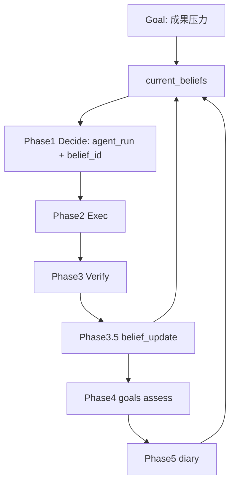

# Beliefs 驱动进化闭环：从报告驱动到信念驱动的下一次交易

> 日期：2026-05-28  
> 项目：js-evolution-agent  
> 类型：架构设计 / 功能实现 / 验证复盘  
> 来源：Cursor Agent 对话

---

## 目录

1. [背景与动机](#1-背景与动机)
2. [分析过程](#2-分析过程)
3. [方案设计](#3-方案设计)
4. [实现要点](#4-实现要点)
5. [验证与测试](#5-验证与测试)
6. [后续演化](#6-后续演化)

---

## 1. 背景与动机

现有 `js-evolution-agent` 已有完整演化流水线：`goal -> intel -> decide -> exec -> verify -> goals assess -> diary`，并具备 standing memory、probe、retrospective、goal assessment 等能力。

真正的问题不是「系统不会进化」。

真正的问题是：**系统知道如何诊脉、如何写报告，但缺少一个稳定的「当前我相信什么、下一步要验证什么」的结构化状态。** 每轮决策 largely 依赖 LLM 从报告、记忆、receipt 里重新综合，缺少可审计、可迭代的中间层。

对话从 Cyber-Taoist《应用指南》视角出发，指出宏观流程（感知 → 分析 → 分形守破）与微观交易（假设 → 执行 → 复盘 → 迭代）之间存在缺口。原计划中的 `R_current` 战术引擎，经第一性原理收敛后，被简化为更小的内核：

```text
Belief -> Action -> Evidence -> Update
```

对应关系：

| 概念 | 职责 |
| --- | --- |
| Goal | 定义成果压力：想要什么、什么算进步/退步 |
| Belief | 当前行动假设：为什么这样行动、下一步怎么验证 |
| Action | 围绕 belief 的一次交易（主要是 `agent_run`） |
| Evidence | receipt + verify report |
| Update | post-verify 更新 belief，长期再反馈 goal assessment |

本轮目标：在不重写主流水线的前提下，落地最小可用的 beliefs 闭环。

---

## 2. 分析过程

### 2.1 现有系统里有什么、缺什么

| 已有能力 | 与 beliefs 的关系 | 缺口 |
| --- | --- | --- |
| `propose_probe`（hypothesis / success_signal / failure_signal） | 接近「交易假设」 | 未与下一轮 Decide 强绑定 |
| `write_retrospective` / evolution diary | 接近「结构化复盘」 | 不是固定流水线阶段，不更新结构化信念 |
| `standing_memory` | 跨轮摘要缓存 | 不是可执行策略状态，混有叙事 |
| `goal-assessor` | 目标假设校准 | 不管「当前战术信念」 |
| Temporal Decision Brief | Seen / Remembered 分层 | 没有 beliefs 生命周期 |

结论：系统有「假设-执行-反馈」的材料流，但没有显式的 `current_beliefs` 状态层。

### 2.2 第一性原理收敛

原计划的四模块（`R_baseline`、`T_hypothesis`、Structured Review、`R_update`）可压成一个状态表：

```text
belief.claim
belief.confidence
belief.evidence_refs
belief.next_test
belief.status
```

被否定的过度设计：

| 备选 | 为何不选（第一版） |
| --- | --- |
| 完整 `R_current` 策略卡 / 晋升机制 | 复杂度高，先验证闭环是否运转 |
| 用 standing_memory 承担策略状态 | 叙事缓存与可执行假设职责混淆 |
| intel 阶段 pre-verify 写 beliefs | 证据未验证前不应固化信念 |
| 删除 `claim_ledger` 或重构 standing_memory | 并行运行，待 beliefs 稳定后再收敛 |

### 2.3 Belief 生命周期与上下文策略

beliefs 分四种状态，进入下一轮上下文的方式不同：

| 状态 | 含义 | 上下文策略 |
| --- | --- | --- |
| `active` | 正在验证 | 完整进入 Decide constraints |
| `validated` | 已有证据，可作行动前提 | 摘要进入 operating assumptions |
| `refuted` | 已证伪 | 进入 avoid list，禁止无证据复活 |
| `retired` | 过期/无关 | 不进常规 TDB，只留事件历史 |

变化必须可追溯：`cycle_id`、`reason`、`evidence_refs`、`before/after` 写入 `belief_events`。

---

## 3. 方案设计

### 3.1 目标闭环



主流水线插入点：

```text
Phase 3 verify
Phase 3.5 belief_update   ← 新增
Phase 4 goals assess
Phase 4.5 goals calibrate
Phase 5 evolution diary
```

### 关键决策

| 决策 | 选择 | 理由 |
| --- | --- | --- |
| 核心状态对象 | `current_beliefs` + `belief_events` | 当前态供 Decide 快速读取；事件流供审计 |
| 存储形态 | `single_json` + `append_jsonl` | 对齐 standing_memory / goal_events 模式 |
| Decide 绑定方式 | `params.run_spec.context.belief_id` | 不改 action schema，兼容现有 `agent_run` |
| 更新时机 | post-verify Phase 3.5 | 证据经 verify 后再改 beliefs |
| 失败策略 | 非致命 | 保留旧 beliefs，记录 error，后续阶段继续 |
| standing_memory | 本轮不重构 | 与 beliefs 并行，避免双写混乱 |
| CLI | `jea beliefs show/events/update` | 运维可见性；支持 `--skip-belief-update` |

### 3.2 数据 schema（最小）

`current_beliefs.json`：

```json
{
  "schema_version": 1,
  "updated_at": "...",
  "source_cycle_id": "...",
  "beliefs": [{
    "id": "belief-feedback-loop",
    "goal_id": "improve-real-match-performance",
    "claim": "当前最大瓶颈是缺少真实 match/rank 反馈闭环",
    "status": "active",
    "confidence": "medium",
    "evidence_refs": [],
    "next_test": "验证是否能获得真实 match/rank 信号",
    "last_change": null,
    "recheck_trigger": null
  }]
}
```

`belief-events.jsonl` 每行记录：`change`、`reason`、`evidence_refs`、`before`、`after`、`source`。

---

## 4. 实现要点

### 4.1 新增与修改文件

| 文件 | 职责 |
| --- | --- |
| [`src/intelligence/specs.mjs`](../../src/intelligence/specs.mjs) | 注册 `current_beliefs`、`belief_events` 数据源 |
| [`src/intelligence/store.mjs`](../../src/intelligence/store.mjs) | `readCurrentBeliefs` / `recordCurrentBeliefs` / `readBeliefEvents` / `recordBeliefEvent` |
| [`src/intelligence/beliefs.mjs`](../../src/intelligence/beliefs.mjs) | schema 常量、`normalizeCurrentBeliefs`、`partitionBeliefs` |
| [`src/intelligence/belief-updater.mjs`](../../src/intelligence/belief-updater.mjs) | post-verify AI 更新、`applyBeliefUpdates`、写回 store |
| [`src/intelligence/report-builder.mjs`](../../src/intelligence/report-builder.mjs) | `gatherReportContext` 注入 beliefs |
| [`src/intelligence/decision-brief.mjs`](../../src/intelligence/decision-brief.mjs) | TDB 分层 `decision_constraints.current_beliefs` |
| [`src/intelligence/conversation-prompts.mjs`](../../src/intelligence/conversation-prompts.mjs) | Report/Decide 阅读顺序与 belief 绑定约束 |
| [`run.mjs`](../../run.mjs) | Phase 3.5 belief_update |
| [`src/intelligence/evolution-diary-builder.mjs`](../../src/intelligence/evolution-diary-builder.mjs) | `phase3_5.belief_update` 进 diary context |
| [`src/intelligence/goal-assessor.mjs`](../../src/intelligence/goal-assessor.mjs) | assessment context 附带 beliefs 分区 |
| [`src/cli/commands/beliefs.mjs`](../../src/cli/commands/beliefs.mjs) | `jea beliefs show/events/update` |
| [`src/cli/jea.mjs`](../../src/cli/jea.mjs) | CLI 路由与 help |
| [`AGENTS.md`](../../AGENTS.md) | 操作指引 |

数据路径：

```text
runtime/subjects/<namespace>/data/intelligence/beliefs/
├── current_beliefs.json
└── belief-events.jsonl
```

### 4.2 Decide 约束（Phase 1）

每个 `agent_run` 在 `params.run_spec.context` 中声明：

```json
{
  "belief_id": "belief-feedback-loop",
  "belief_relation": "test_belief",
  "expected_belief_update": "如果拿不到 match/rank，则将瓶颈判断改为反馈链路阻塞"
}
```

`belief_relation` 限定为：`test_belief` / `strengthen_belief` / `refute_belief` / `create_belief` / `recover_blocker`。

### 4.3 CLI 与跳过开关

```powershell
jea beliefs show [--json]
jea beliefs events [--limit N] [--json]
jea beliefs update [--cycle ID] [--json]

jea run --skip-belief-update
jea evolve --skip-belief-update
```

环境变量：`JEA_SKIP_BELIEF_UPDATE=1`（evolve / daemon 透传）。

---

## 5. 验证与测试

```powershell
npm test -- test/intelligence.test.mjs
npm test -- test/conversational-intel-pipeline.test.mjs
npm test -- test/cli.test.mjs
npm test
```

结果：

| 命令 | 结果 |
| --- | --- |
| targeted tests | 通过 |
| `npm test`（全量） | **280 passed** |

新增测试覆盖：

- intelligence specs 含 `current_beliefs` / `belief_events`
- store 读写 current 状态与 event append
- TDB 分层 active / validated / refuted
- `gatherReportContext` source_counts
- `applyBeliefUpdates` before/after
- Decide prompt 含 Belief constraints
- `buildCycleEnv` 透传 `JEA_SKIP_BELIEF_UPDATE`

未在本轮验证：

- 真实 DeepSeek 跑 1–3 cycle 后，Decide 是否稳定绑定 `belief_id`、Phase 3.5 是否产出合理 belief events（需 `jea run --mock` 或真实演化观察）。

---

## 6. 后续演化

1. **观察 1–3 轮真实/mock 演化**：检查 `jea beliefs show` 与 diary 中 `phase3_5` 是否一致；Decide 是否仍出现无 `belief_id` 的 `agent_run`。
2. **belief update 质量**：若 AI 更新不稳定，可增加 schema repair 或部分机械规则（blocked receipt → weaken/refute）。
3. **standing_memory 职责收敛**：beliefs 稳定后，减少 standing_memory 承载策略性结论，避免双源漂移。
4. **claim_ledger 关系**：决定是否由 `belief_events` 替代或双写。
5. **daemon inbox**：汇总 latest beliefs 状态，便于多主体总览。

---

## 附：本轮对话问题—思考—方案—执行对照

| 阶段 | 内容 |
| --- | --- |
| 问题 | 《应用指南》缺微观「下一次交易」闭环；现有系统有 report/exec/verify，但无稳定的当前法则/信念状态 |
| 思考 | 第一性原理收敛为 `Belief -> Action -> Evidence -> Update`；goal 管方向，belief 管行动假设；变化需 event 审计 |
| 方案 | 新增 `current_beliefs` + `belief_events`；TDB/Decide 分层注入；Phase 3.5 post-verify 更新；diary/goals 消费；CLI 可见 |
| 执行 | 新增 3 模块、改 14 文件；280 tests passed；`jea beliefs` 与 `--skip-belief-update` 可用 |
