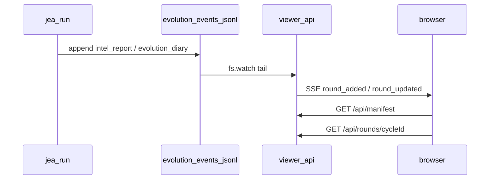
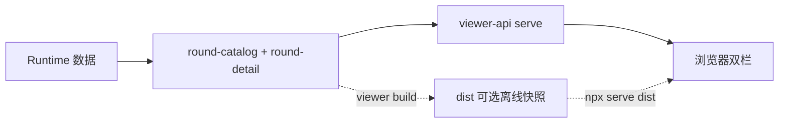

# Evolution Viewer：情报报告与进化日记对照浏览器（静态 build → API + SSE）

> 日期：2026-05-28  
> 项目：js-evolution-agent（主体：agentank-tank）  
> 类型：架构设计 / 功能实现  
> 来源：Cursor Agent 对话  

---

## 目录

1. [背景与动机](#1-背景与动机)
2. [分析过程](#2-分析过程)
3. [方案设计](#3-方案设计)
4. [实现要点](#4-实现要点)
5. [验证与测试](#5-验证与测试)
6. [后续演化](#6-后续演化)

---

## 1. 背景与动机

每轮演化会产出两类长文 Markdown，路径深、命名规则不同：

- **情报报告**：`data/intelligence/reports/.../cycle-*.md`（Intel 阶段）
- **进化日记**：`data/evolution/diaries/.../exec-*.md`（Exec 之后）

CLI 已有 `jea intel report --cycle X` 可单篇查看报告，但**无法在一屏内对照**「本轮判断」与「本轮实际推进」。用户希望有一个**本地页面**，能按 `cycle_id` 浏览时间线，并并排阅读报告与关联日记（例如 `cycle-20260528-132353` 与 `exec-20260528-132631`）。

真正的问题不是「能不能打开 Markdown 文件」。

真正的问题是：**两类产物的 ID 体系不同（`cycle-*` vs `exec-*`），关联信息散落在日记正文和事件流里**，人工在目录树里配对成本高。

---

## 2. 分析过程

### 2.1 现有数据与索引

| 数据源 | 机器可读索引 | 关联线索 |
| --- | --- | --- |
| 情报报告 | `data/intelligence/reports/index.jsonl`（`store.readIntelReports`） | `cycle_id`、`md_path`、`tldr` |
| 进化日记 | 无同级 index | 正文常见 `基于 intel cycle-…`；`evolution-events.jsonl` 中 `type: evolution_diary` 含 `diary_path` |
| 路径解析 | [`report-paths.mjs`](../../src/intelligence/report-paths.mjs)、[`diary-paths.mjs`](../../src/intelligence/diary-paths.mjs) | 兼容 Windows 绝对 `md_path` 与 `YYYY/MM/YYYY-MM-DD/` 层级 |

`jea daemon inbox` 仅暴露 `latest_report` / `latest_diary`（按 mtime），不适合历史轮次对照。

### 2.2 浏览器与托管约束（两阶段认知）

| 阶段 | 约束 | 应对 |
| --- | --- | --- |
| MVP（静态 build） | 纯 `file://` 不能随意 `fetch` runtime 下的 `.md` | 构建期 marked → HTML，写入 `dist/`，再用 HTTP 打开 |
| **当前（API + SSE）** | 仍需 HTTP（`fetch` + `EventSource`） | `serve` 托管 `public/` 并**直读 runtime**，不依赖、不写入 `dist/`；离线场景仍可用 `viewer build` + 任意静态服务器 |

中间曾实现 **watch 全目录 → 防抖 rebuild dist → SSE `manifest_updated`**，在 `jea run` 与 `JEA_AUTO_VIEWER_BUILD` 叠加时显得笨重且重复；已收敛为 **仅 tail `evolution-events.jsonl` + 按需渲染**。

### 2.3 被否定的方案

| 备选 | 为何不选 |
| --- | --- |
| Docsify / VitePress | 默认按文档树导航，难做「按 intel cycle 聚合 + 双栏」 |
| 11ty 每轮一页 HTML | 轮次上百时构建慢、dist 体积大 |
| serve 时 watch 报告/日记目录并整包 rebuild | 与 run 结束 auto-build 重复；marked 全量成本高 |
| 内嵌单文件 `file://` | 可作后续变体；MVP 优先本地 HTTP |

---

## 3. 方案设计

### 核心原则（当前）

> **以 `cycle_id` 为轮次主键；catalog 在服务端按 runtime 计算关联；浏览器通过 REST + SSE 增量刷新，无需整包 rebuild。**





### 关键决策

| 决策 | 选择 | 理由 |
| --- | --- | --- |
| 在线浏览 | `public/` + runtime API + SSE | 无需先 `viewer build`；`jea run` 时浏览器可跟上新轮/新日记 |
| 离线/分享 | `viewer build` → `dist/` | 预渲染 HTML，用 `npx serve tools/evolution-viewer/dist` 等打开 |
| 默认范围 | 最近 50 轮（`--limit` / `JEA_VIEWER_BUILD_LIMIT`） | 报告索引已 400+，全量非必需 |
| Markdown | 按需 `marked`（API）或构建期（dist） | API 路径对 `buildRoundDetail` 做 LRU（默认 30 轮） |
| 日记关联 | 正文正则 + `evolution_diary` 事件 + **event-pairing** | 覆盖正文未写 intel cycle 的 exec 轮 |
| SSE 触发源 | **仅** `evolution-events.jsonl` | `intel_report` → `round_added`；`evolution_diary`（ok）→ pairing → `round_updated` |
| 已删除 | `JEA_AUTO_VIEWER_BUILD`、`--viewer-build`、`--no-live`、live-server rebuild | 减少重复构建与双模式复杂度 |

### 关联规则（与 MVP 一致，并增强）

1. 递归扫描 `data/evolution/diaries/**/*.md`，读前 2KB 解析 `intel cycle-(cycle-…)`。
2. 读取 store / `evolution-events`，补全 `diary_path` / `tldr`。
3. [`event-pairing.mjs`](../../src/intelligence/evolution-viewer/event-pairing.mjs)：按时间序将 `exec-*` 事件挂到最近 `cycle-*` intel 事件。

在线时：`GET /api/manifest` 返回元数据时间线；`GET /api/rounds/:cycleId` 返回 `report_html` + `diaries[].html`。

离线时：仍写 `dist/manifest.json` + `dist/rounds/<cycle_id>.json`（`viewer build` 专用）。

---

## 4. 实现要点

### 项目结构

```text
tools/evolution-viewer/
├── public/           # index.html, app.js, styles.css（serve 直接托管）
└── dist/             # viewer build 产物（gitignore，可选离线）

src/intelligence/evolution-viewer/
├── diary-link.mjs      # 解析 intel cycle 引用
├── event-pairing.mjs   # intel ↔ exec 时间序配对
├── round-catalog.mjs   # buildManifest、indexDiariesByIntelCycle
├── round-detail.mjs    # buildRoundDetail（marked）
├── build-manifest.mjs  # 仅写 dist（调用 catalog + detail）
├── viewer-api.mjs      # HTTP API、SSE tail、LRU
└── runtime-build.mjs   # build 辅助、parseViewerBuildLimit

src/cli/commands/
└── intel-viewer.mjs    # build / serve（serve → createViewerApiServer）
```

已删除：[`live-server.mjs`](../../src/intelligence/evolution-viewer/live-server.mjs)（watch + rebuild + `manifest_updated`）。

### 关键模块

| 文件 | 职责 |
| --- | --- |
| [`round-catalog.mjs`](../../src/intelligence/evolution-viewer/round-catalog.mjs) | 报告索引 + 日记索引 → manifest 形 `rounds[]`（无 HTML） |
| [`round-detail.mjs`](../../src/intelligence/evolution-viewer/round-detail.mjs) | 单轮 `report_html` + `diaries[].html` |
| [`viewer-api.mjs`](../../src/intelligence/evolution-viewer/viewer-api.mjs) | `GET /api/manifest`、`GET /api/rounds/:id`、`GET /events`；tail events |
| [`build-manifest.mjs`](../../src/intelligence/evolution-viewer/build-manifest.mjs) | 离线 dist：写 manifest + rounds JSON |
| [`intel-viewer.mjs`](../../src/cli/commands/intel-viewer.mjs) | CLI：`build` / `serve` |
| [`public/app.js`](../../tools/evolution-viewer/public/app.js) | `fetch('/api/*')`；SSE `round_added` / `round_updated` |

### HTTP / SSE 路由

| 路由 | 行为 |
| --- | --- |
| `GET /api/manifest?limit=N` | JSON 时间线元数据 |
| `GET /api/rounds/:cycleId` | JSON 双栏 HTML 载荷 |
| `GET /events` | SSE：`hello`（subject、round_count）、`round_added`、`round_updated`、`ping` |
| 其它 | 静态 `public/` |

### 前端行为

- 左侧：时间线；`round_added` 刷新 manifest、新轮 `is-new` 标记，**不自动切换**当前轮。
- 右侧：`/api/rounds/:id`；`round_updated` 若匹配 `activeCycleId` 则重载详情，并更新 `has_diary`。
- 筛选：对 `cycle_id` / `tldr` 子串过滤。
- 已移除：`?static=1`、`manifest_updated`、`rebuild_error` 处理。

### CLI 与文档

```bash
# 在线（无需先 build）
jea intel viewer serve [--subject NAME] [--port 4173] [--open] [--limit 50]

# 离线快照
jea intel viewer build [--subject NAME] [--limit 50] [--out PATH]
npx serve tools/evolution-viewer/dist

npm run viewer:serve    # 默认 --open
npm run viewer:build
```

[`AGENTS.md`](../../AGENTS.md) 已更新：serve = API + SSE；无 `JEA_AUTO_VIEWER_BUILD` / `--viewer-build`。`run.mjs` **不再**有 Phase 6 viewer build。

### 实现细节备忘

- 日记关联正则：`\bintel\s+(cycle-[…])`（初版 `cycle[-\s](cycle-…)` 无法匹配 `intel cycle-20260528-132353`）。
- 时间线左栏与右栏滚动已解耦（`public/styles.css` 改 `align-items: start`；serve 读 `public/` 即生效，不必同步 dist）。
- `package.json`：`marked` 为 `devDependencies`。

---

## 5. 验证与测试

### 单元 / 集成测试

```bash
npm test
# 或聚焦：
npm test -- test/evolution-viewer-manifest.test.mjs
npm test -- test/evolution-viewer-live.test.mjs
```

| 测试文件 | 覆盖 |
| --- | --- |
| `evolution-viewer-manifest.test.mjs` | 日记解析、dist build、`parseViewerBuildLimit` |
| `evolution-viewer-live.test.mjs` | `/api/manifest`、`/api/rounds/:id`、SSE `round_added` / `round_updated`、catalog/detail 单元 |

全量 `npm test`：299 项通过（含方案 3 改造后）。

### agentank-tank 冒烟

```bash
# serve 无需先 build
npm run viewer:serve
# 或
curl http://127.0.0.1:4173/api/manifest

# 离线仍可用
npm run viewer:build -- --subject agentank-tank --limit 50
```

验收轮次 `cycle-20260528-132353`：

- API manifest 中 `has_diary: true`，关联 `exec-20260528-132631`。
- `/api/rounds/cycle-20260528-132353` 含报告与日记 HTML。

浏览器：`http://127.0.0.1:4173/#cycle-20260528-132353`。跑着 `jea run` 时，日记写入后应收到 `round_updated` 并刷新当前轮（无需 F5、无 dist rebuild）。

---

## 6. 后续演化

| 方向 | 说明 |
| --- | --- |
| 第三 Tab | verify JSON、records/meta（注意敏感信息勿打进可分享 dist） |
| 增量 offline build | manifest 记录 content hash，只处理新 index 行与新日记 |
| per-subject dist | 输出到 `runtime/subjects/<ns>/viewer/` |
| 单文件离线版 | 内嵌 manifest，支持 `file://` 只看最近 N 轮 |
| SSE 去重 / 背压 | 高频 evolve 时合并 `round_updated` 通知 |

**已完成（原「后续」项）**：

- ~~`jea run` 后 auto viewer build~~ → 改为 serve 直读 runtime + SSE，已删除 auto-build。
- ~~serve 时 watch 并 rebuild~~ → 改为 API + events tail only。

---

## 附：对话问题—思考—方案—执行对照

| 阶段 | 内容 |
| --- | --- |
| 问题 | 需要方便对照每轮情报报告与进化日记；两类文件路径深、ID 不同。 |
| 思考（MVP） | 报告有 index.jsonl，日记靠正文与 evolution 事件；浏览器不能直接读 runtime。 |
| 方案（MVP） | manifest + 构建时 marked → `dist/` + 单页双栏；`jea intel viewer build/serve`。 |
| 执行（MVP） | diary-link、build-manifest、public UI、测试与 agentank-tank 冒烟。 |
| 痛点 | serve/live 模式整包 rebuild dist 笨；与 auto-build 重复。 |
| 方案（方案 3） | serve = `public/` + runtime API + SSE tail events；build 仅离线快照。 |
| 执行（方案 3） | round-catalog、round-detail、viewer-api；删 live-server / auto-build / `--no-live`；前端改 `/api/*` + `round_*` SSE；测试与文档更新。 |
