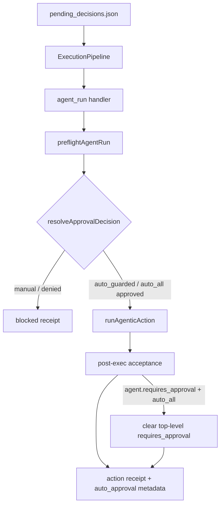

# JEA_APPROVAL_MODE：用 .env 分层自动审批，而不是一个「永久免审」开关

> 日期：2026-05-28  
> 项目：js-evolution-agent  
> 类型：架构设计 / 功能实现  
> 来源：Cursor Agent 对话

---

## 目录

1. [背景与动机](#1-背景与动机)
2. [分析过程](#2-分析过程)
3. [方案设计](#3-方案设计)
4. [实现要点](#4-实现要点)
5. [验证与测试](#5-验证与测试)
6. [后续演化](#6-后续演化)

---

## 1. 背景与动机

对话从一次 `agentank-tank` 的 5 轮演化复盘开始：rankScore 不动、连续发布无改善、后两轮进入人工介入阻塞后只做凭据探针——操作者体感「一点进展都没有」。

随后用户提出：能否在 `.env` 里配一个参数，让系统不用等人类审批、自动放行？

真正的问题不是「有没有 approve 命令」，而是 **Phase 2 的硬门与软意图混用**：

| 机制 | 入口 | 硬/软 |
| --- | --- | --- |
| Operator Intent Brief | `jea intel brief put` | 软（只影响 Decide LLM） |
| `approval_granted` + `requires_approval` | Decide → 队列 action 字段 | 硬（`preflightAgentRun` 执行前拦截） |
| `JEA_CORE_APPLY_POLICY` | env | 硬（仅 `core_apply`） |
| 外部 `approvalFlag` → `--force` | configured external action | 硬（子进程层） |

在 `manual` 模式下，Decide 若漏写 `approval_granted`，或操作者未及时 `intel brief put`，只读探针、记录型 action 也会被 `approval_required` 卡住——这与「长期 daemon 演化、守护类任务应自动跑」的诉求冲突。

但对话里也明确：**最近 5 轮的问题不主要是审批太严，而是模拟门禁与真实 rank 脱节**。因此 env 审批策略必须是**分层放行**，不能做成「一键永久免审」。

---

## 2. 分析过程

### 2.1 审批硬门在哪

代码阅读确认：`js-evolution-engine` 的 `ExecutionPipeline` **不含**审批逻辑；宿主 [`src/actions/handlers.mjs`](../../src/actions/handlers.mjs) 的 `preflightAgentRun` 才是 `agent_run` 唯一执行前硬门：

```text
requires_approval && !approved  →  blocked（agent 不被调用）
approved = approval_granted || approved（action 字段）
```

`record_observation` / `propose_probe` / `write_retrospective` 走各自 handler；若走 agent 路径且 agent 返回 `requires_approval`，同样会被 `agentBlockedResult` 拦住。

### 2.1.1 第二个卡点：执行后的验收门

后续运行 3 轮演化后，操作者发现 `.env` 已经设置 `JEA_APPROVAL_MODE=auto_all`，但日记仍显示「宿主审批门未通过」。排查发现这不是 preflight 仍在卡，而是 **agent 已经执行完成，执行后验收又读取了 agent receipt 里的 `requires_approval: true`**。

也就是说，审批链实际有两段：

```text
preflight approval gate        → agent 是否能启动
post-exec acceptance gate      → agent 完成后是否算 passed / progressed
```

旧实现只覆盖第一段。若 Cursor agent 在最终 JSON receipt 中自报 `requires_approval: true` 或 `status: requires_human_review`，宿主会把顶层 receipt 标成：

```text
success=false
acceptance_status=requires_human_review
goal_progress_status=not_progressed
```

这就是 `exec-20260528-225808` 的现象：凭据探针实际完成，schema 也 valid，但因为 agent 回执自带 `requires_approval`，顶层仍被判为待审。这个问题后来单独修复：`auto_all` 不只放行 preflight，也会在 post-exec 阶段覆盖 agent 自报的人工审批请求。

### 2.2 与 core_apply、外部工具的关系

[`JEA_CORE_APPLY_POLICY`](../../journal/2026-05-14/evolution-safety-core-apply-protocol.md) 已独立控制 `core_apply`（`disabled|review|auto`），不应被新的 env 审批策略间接放宽——除非操作者显式选择 `auto_all`。

[`configured-external-runner.mjs`](../../src/actions/configured-external-runner.mjs) 在 action 字段为真时追加 `--force`；发布类外部工具（如 `AGENTANK_ALLOW_PUBLISH` 路径）是**第三层**硬门，与 JEA preflight 不对齐时可能产生「JEA 拦了但 force 已开」或相反的混乱。

### 2.3 被否定的方案

| 备选 | 为何不选 |
| --- | --- |
| 单一 `JEA_AUTO_APPROVE=1` 全放行 | 会把远端发布、baseline 更新、人工介入解除一并放开，与 agentank-tank 近期连续 miss 后的阻塞设计冲突 |
| 只改 Decide prompt「记得写 approval_granted」 | 软约束，不能替代 Phase 2 硬门；LLM 仍可能漏写 |
| 在 Phase 1 自动伪造 `approval_granted` | 破坏审计链，且无法区分「策略批准」与「操作者批准」 |
| 改 engine 层 ExecutionPipeline | 成本高，与宿主策略重复 |

选定方案：**新增集中策略模块 + env 三档模式**，默认 `manual` 保持现状。

---

## 3. 方案设计

### 3.1 三档 `JEA_APPROVAL_MODE`

| 值 | 行为 | 适用场景 |
| --- | --- | --- |
| `manual` | 现状；`requires_approval` 且无显式批准 → blocked | 生产主体、需人工把关发布 |
| `auto_guarded` | 仅自动批准低风险动作 | 本地长期演化、守护探针 |
| `auto_all` | 自动批准所有需审批动作（含发布、`workspace_write` / `remote_write_review`） | 沙盒 / 完全无人值守实验 |

非法值回退 `manual`。

### 3.2 auto_guarded 判定（保守）

自动批准需同时满足：

- action 类型为 `record_observation` / `propose_probe` / `write_retrospective`，或
- `agent_run` 且 `permission_profile=read_only`，或
- 显式 `safety_class: guarded_probe|guarded_record`

始终拒绝：

- `workspace_write` / `remote_write_review`
- intent/description 命中 publish、release、baseline、人工介入、`.env` 等敏感词
- `core_apply`（仍只走 `JEA_CORE_APPLY_POLICY`）

### 3.3 auto_all 扩展

用户后续要求增加 `auto_all`：

- `resolveApprovalDecision` 对任意需审批 action 返回 `approved: true`
- `core_apply` 在 `JEA_CORE_APPLY_POLICY=review` 时视为已批准；`disabled` 仍硬拦截
- `allowsExternalForceAutoApproval()` 为真时，外部 `approvalFlag` 自动追加 `--force`
- 若 agent 执行完成后仍在 receipt 中自报 `requires_approval: true`，`auto_all` 会覆盖顶层验收，不再把宿主 receipt 标成 `requires_human_review`

### 关键决策

| 决策 | 选择 | 理由 |
| --- | --- | --- |
| 策略集中化 | 新模块 `approval-policy.mjs` | 避免 prompt / handler / external runner 三套规则分叉 |
| 默认模式 | `manual` | 不改变现有 operator brief + approval_granted 工作流 |
| 第一版边界 | 先 `auto_guarded`，后加 `auto_all` | 先解决守护探针空转，再按需开放全免审 |
| 审计 | receipt 写 `auto_approval` | 区分策略批准与显式 `approval_granted` |
| core_apply | `auto_guarded` 不碰；`auto_all` 才放宽 | 与 2026-05-14 核心变更协议一致 |
| 外部 `--force` | 仅 `auto_all` 自动追加 | 发布类工具保持显式批准或全免审二选一 |
| post-exec 审批 | `auto_all` 覆盖 agent 自报 `requires_approval` | 否则会出现“agent 已跑完但顶层仍 not_progressed”的假卡住 |

### 数据流



---

## 4. 实现要点

### 关键模块

| 文件 | 职责 |
| --- | --- |
| [`src/actions/approval-policy.mjs`](../../src/actions/approval-policy.mjs) | 解析 `JEA_APPROVAL_MODE`；`resolveApprovalDecision` / `getApprovalMode` / `allowsExternalForceAutoApproval` |
| [`src/actions/handlers.mjs`](../../src/actions/handlers.mjs) | `preflightAgentRun` 合并显式批准与策略批准；post-exec 阶段让 `auto_all` 覆盖 agent 自报 `requires_approval`；receipt 写入 `auto_approval`；`auto_all` 下 `core_apply` 视为已批准 |
| [`src/actions/configured-external-runner.mjs`](../../src/actions/configured-external-runner.mjs) | `auto_all` 时 `approvalFlag` 自动 `--force` |
| [`.env.example`](../../.env.example) | 三档模式说明 |
| [`AGENTS.md`](../../AGENTS.md) | 「人工审批与操作者意图」章节补充 env 策略 |
| [`src/cli/commands/doctor.mjs`](../../src/cli/commands/doctor.mjs) | 启动诊断显示当前 `JEA_APPROVAL_MODE` |
| [`test/approval-policy.test.mjs`](../../test/approval-policy.test.mjs) | 策略单元测试 |
| [`test/actions.test.mjs`](../../test/actions.test.mjs) | preflight / core_apply 集成测试 |

### 配置示例

```dotenv
# 推荐：本地 daemon 长期演化
JEA_APPROVAL_MODE=auto_guarded

# 沙盒无人值守（慎用）
# JEA_APPROVAL_MODE=auto_all
```

`auto_approval` receipt 示例字段：

```json
{
  "mode": "auto_guarded",
  "reason": "read_only_agent_run",
  "guardrails": ["read_only_profile", "no_sensitive_signal"]
}
```

---

## 5. 验证与测试

```powershell
npm test -- test/approval-policy.test.mjs test/actions.test.mjs
npm run doctor
```

结果（2026-05-28 实现会话）：

| 项 | 结果 |
| --- | --- |
| 单元 + 集成测试 | **106 passed** |
| `manual` + 无 `approval_granted` | 仍 blocked |
| `auto_guarded` + `read_only` + `requires_approval` | 通过 preflight，agent 被调用 |
| `auto_guarded` + `workspace_write` / publish intent | 仍 blocked |
| `auto_guarded` + `core_apply` + `JEA_CORE_APPLY_POLICY=review` | 仍 `requires_human_review` |
| `auto_all` + `workspace_write` | 通过 preflight |
| `auto_all` + `core_apply` + review 策略 | 执行 agent，非 blocked |
| 非法 `JEA_APPROVAL_MODE` | 回退 `manual` |

补充修复后再次验证：

| 项 | 结果 |
| --- | --- |
| 单元 + 集成测试 | **107 passed** |
| `auto_all` + agent 执行后自报 `requires_approval` | 顶层 `requires_approval=false`、`acceptance_status=passed`、`goal_progress_status=progressed` |
| `npm run doctor` | 显示 `JEA_APPROVAL_MODE - auto_all (auto-approves all actions; use with caution)` |

未在本 journal 覆盖的验证：`agentank-tank` 生产主体在 `auto_guarded` 下跑完整 5 轮 evolve 的行为变化（需操作者自行 `.env` 开启后观察）。

---

## 6. 后续演化

1. **与目标阻塞联动**：`iterate-skill` 人工介入阻塞目前靠 goal 语义 + Decide 行为；`auto_all` 不会自动解除该阻塞，但若 Decide 仍 queue 发布类 `agent_run`，env 策略会放行——生产主体应坚持 `auto_guarded` 或 `manual`。
2. **per-subject 策略**：当前 env 是进程级；多 subject 并行 daemon 时可能需要 `subjects.json` 级 override。
3. **外部工具第三层对齐**：`AGENTANK_ALLOW_PUBLISH` 等与 JEA preflight 的联合文档可再补一条 decision tree。
4. **模拟失真仍是主瓶颈**：审批自动化只减少「守护探针被卡」；rank 改善仍依赖 agentank-evolver 门禁/replay 改造（见同日前后 agentank-tank 演化复盘）。
5. **队列积压**：`auto_guarded` 不清理历史 `pending_decisions.json`；长期 evolve 仍建议 `jea audit queue --archive` 治理陈旧项。

---

## 附：本轮对话问题—思考—方案—执行对照

| 阶段 | 内容 |
| --- | --- |
| 问题 | 演化体感无进展；能否用 `.env` 跳过人工审批？ |
| 思考 | 硬门在 `preflightAgentRun`；全放行危险；应先分层 `auto_guarded`，模拟失真才是 rank 不涨的根因 |
| 方案 | `JEA_APPROVAL_MODE=manual\|auto_guarded\|auto_all`；集中策略模块；receipt 审计；core_apply / 外部 force 分边界 |
| 执行 | 新增 `approval-policy.mjs`，接入 handlers / external runner / doctor / AGENTS.md；后续补齐 post-exec 验收覆盖；107 测试通过；用户追加并验证 `auto_all` |
