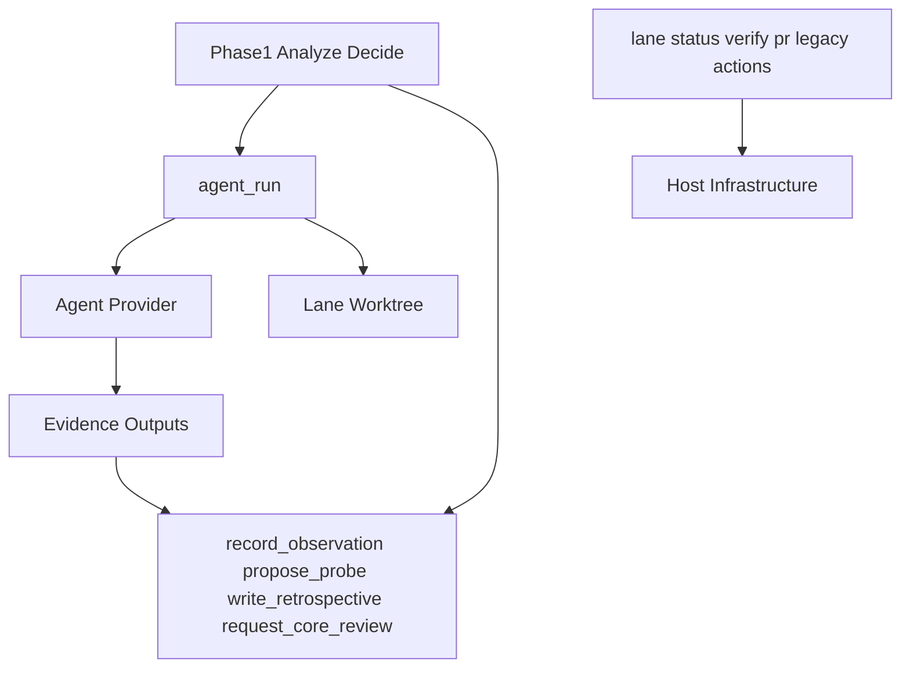

# Phase 2 Action 收敛：从并列动作菜单回到 agent_run 主路径

> 日期：2026-05-28  
> 项目：js-evolution-agent  
> 类型：架构设计 / 功能实现 / 验证复盘  
> 来源：Cursor Agent 对话

---

## 目录

1. [背景与动机](#1-背景与动机)
2. [分析过程](#2-分析过程)
3. [方案设计](#3-方案设计)
4. [实现要点](#4-实现要点)
5. [验证与测试](#5-验证与测试)
6. [后续演化](#6-后续演化)

---

## 1. 背景与动机

Phase 2（exec）当前注册了 11 种内置 action type，再加上 subject 级 configured external actions。对操作者和模型来说，这套列表越来越像「历史层叠」：`run_probe` 既像探针又像 agent 调查；`record_observation` 有时本地写、有时走 agent；`lane_observe` 与 `agent_run` 都能跑 `npm run sync`；`agent_execute` 又与 `agent_run` 抢「开放委托」入口。

真正的问题不是 action 数量本身。

真正的问题是：**action type 同时表达了「意图产物」和「执行方式」**，Intel 阶段很难稳定选对。

对话里先梳理了 `agentank-tank` subject policy 各字段在演化工作流中的用途，再对照 Phase 2 handler 实现，确认混乱来自三层语义混排：

| 层级 | 应有职责 | 当时实际表现 |
| --- | --- | --- |
| 主执行 | 调查、改代码、模拟、发布准备 | `agent_run`、`run_probe`、`agent_execute` 并列 |
| 记录型 | 落 observation / 提案 / 复盘 / 审批请求 | 部分 handler 仍承担调查或 agent 执行 |
| 系统/兼容 | lane 检查、机械命令、旧队列 | 与业务动作同层暴露给模型 |

本轮目标：不改 `ExecutionPipeline`，只收敛 **模型选择面** 与 **receipt 可解释性**，让 Intel 默认走 `agent_run + 记录型动作`，同时保留旧 action handler 兼容已有队列。

---

## 2. 分析过程

### 2.1 Phase 2 实际执行模型

exec 仍由 `ExecutionPipeline` 从 `pending_decisions.json` claim 决策，按 `action.type` 调用 `host.actionHandlers[type]`。11 种内置 handler 大致分三类：

| 执行后端 | Action types |
| --- | --- |
| 纯本地 | `lane_status`、`lane_observe`、`lane_verify`、`github_open_lane_pr` |
| 默认本地 / 条件 agent | `record_observation`、`write_retrospective` |
| Agent 优先 | `propose_probe`、`run_probe`、`request_core_review`、`core_apply`、`agent_run`、`agent_execute` |

Intel prompt 虽已写「默认输出 `agent_run`」，但 registry 里每个 action 的 `promptHint` 仍各自强调能力边界，模型容易把 subject 业务步骤拆成 `sync/generate/simulate/publish` 式 action 菜单。

### 2.2 与 subject policy 的分工

前一轮 subject registry 迁移已把 repo/lane/resources 迁到 `policies/subjects.json`；Markdown policy 只承载语义边界。action 收敛是同一思路的延伸：

- **subject policy**：告诉模型「是谁、什么算进展、什么不能碰」。
- **subjects.json lane/resources**：告诉机器「在哪写、跑什么 test/sync」。
- **action taxonomy**：告诉 Intel「Phase 2 该 queue 什么类型的决策」。

三者不应再混在一个 action 列表里表达。

### 2.3 被否定的方案

| 备选 | 为何不选 |
| --- | --- |
| 删除 `run_probe` / `agent_execute` 等旧 type | 会破坏已有 `pending_decisions.json`、历史 diary 与 verify 解释 |
| 把所有调查/写入统一成一个新 type | 改动面过大，需重写 handler 与 verifier |
| 只在文档里写「优先 agent_run」 | 模型仍看到 11 个并列 registry 条目，误选概率高 |

选定方案：**保留全部 handler，重构 registry hint + Decide prompt + receipt 标记**。

---

## 3. 方案设计

### 3.1 三层 action taxonomy



| 层级 | Action types | Intel 用法 |
| --- | --- | --- |
| 主执行 | `agent_run` | 调查、候选、模拟、改代码、发布准备；subject 业务命令作为 run 内 tool 能力 |
| 记录型 | `record_observation`、`propose_probe`、`write_retrospective`、`request_core_review` | 只落已有结论/提案/审批请求，不读文件、不调查 |
| 系统/兼容 | `lane_*`、`github_open_lane_pr`、`run_probe`、`agent_execute`、`core_apply` | 机械 lane 操作、旧队列、core 审批；选用时须在 rationale 说明原因 |

### 关键决策

| 决策 | 选择 | 理由 |
| --- | --- | --- |
| 是否删除旧 action type | 否 | 兼容已有队列与历史 receipt |
| 主执行入口 | `agent_run` | 已有 lane worktree、run_spec、preflight 完整链路 |
| 记录型默认路径 | 本地 host 写入 | 降低 latency；agent 分支仅作高级/兼容 |
| 兼容动作识别 | receipt 增加 `compatibility_action` | diary/verify 能区分主路径与 legacy |
| configured external action | 本轮不纳入 registry 重构 | exec handler 已有 Proxy，Intel 注册仍不完整，留后续 |

---

## 4. 实现要点

### 4.1 Registry 决策暴露面

[`src/actions/registry.mjs`](../../src/actions/registry.mjs) 更新全部 `description` / `promptHint`，用前缀标签分层：

- `[PRIMARY EXECUTION]` → `agent_run`
- `[RECORDING ONLY]` → 四个记录型 action
- `[COMPAT]` → `run_probe`、`agent_execute`
- `[SYSTEM]` → lane 与 PR 动作
- `[CORE ONLY]` → `core_apply`

### 4.2 Intel Decide prompt

[`src/intelligence/conversation-prompts.mjs`](../../src/intelligence/conversation-prompts.mjs) 在 `buildDecideUserPrompt` 增加 **Action taxonomy** 段落：

- 明确三层选择规则。
- 禁止把 agentank-tank 等业务拆成 subject-specific action 菜单。
- 使用 `run_probe`、`agent_execute`、`core_apply`、`lane_observe` 时须在 `rationale` 说明为何不用 `agent_run` 或记录型动作。

### 4.3 Handler 与 receipt 语义

[`src/actions/handlers.mjs`](../../src/actions/handlers.mjs) 主要变更：

| 模块 | 变更 |
| --- | --- |
| `compatibilityReceiptFields()` | 为 `run_probe`、`agent_execute` 打 `compatibility_action: true` |
| `record_observation` | 本地直写默认；缺 `writes.observations` 时阻断并提示先用 `agent_run` |
| `propose_probe` | 缺 `writes.probe_proposals` 时同样阻断，提示实验执行走 `agent_run` |
| `write_retrospective` | 本地记录加 hint：补证据请先用 `agent_run` |
| `core_apply` | disabled 时 hint：普通 repo 改动应走 `agent_run + lane worktree` |
| `actionVerifiers` | `value` 透出 `compatibility_action`、`escape_hatch_reason` |

### 4.4 文档

| 文件 | 变更 |
| --- | --- |
| [`AGENTS.md`](../../AGENTS.md) | 「审计与动作」补充 Phase 2 三层 action 口径 |
| [`policies/README.md`](../../policies/README.md) | subject policy 不应维护 subject-specific action 菜单 |

### 4.5 测试

| 文件 | 新增/更新断言 |
| --- | --- |
| [`test/actions.test.mjs`](../../test/actions.test.mjs) | registry 标签、`compatibility_action`、record_observation 无 silent fallback |
| [`test/conversational-intel-pipeline.test.mjs`](../../test/conversational-intel-pipeline.test.mjs) | Decide prompt 含 Action taxonomy |

---

## 5. 验证与测试

```powershell
npm test -- test/actions.test.mjs
npm test -- test/cli.test.mjs
npm test -- test/conversational-intel-pipeline.test.mjs
npm test
npm run jea -- actions list
npm run jea -- actions check --subject agentank-tank
```

结果：

| 命令 | 结果 |
| --- | --- |
|  targeted tests | 206 passed |
| `npm test`（全量） | 274 passed |
| `jea actions list` | 新 hint 标签（`[PRIMARY EXECUTION]` 等）已生效 |
| `jea actions check --subject agentank-tank` | 队列 action 均合法 |

未在本轮验证：

- 真实 DeepSeek 演化一轮后 diary 是否稳定少选 `run_probe` / `lane_observe`（需运行 `jea run` 观察 1–3 cycle）。

---

## 6. 后续演化

1. **观察 agentank-tank diary 1–3 轮**：若模型仍频繁 queue `run_probe` 或 `lane_observe`，考虑从 Intel 可见 registry 中进一步弱化或隐藏兼容/系统 action（handler 仍保留）。
2. **configured external action 注册对齐**：`registerConfiguredActionSpecs` 尚未在 `oada.config.mjs` 默认调用，Intel 与 exec 对 subject 自定义 action 的暴露不一致，应单独收敛。
3. **`propose_probe` 本地 fast path**：与 `record_observation` 类似，可考虑默认本地写提案、仅 enrich 时走 agent，进一步减少 Phase 2 agent 包装开销。
4. **verify/diary 展示**：利用 receipt 中 `compatibility_action`，在 evolution diary 或 verify report 中显式标注「本轮使用了兼容动作及原因」。

---

## 附：本轮对话问题—思考—方案—执行对照

| 阶段 | 内容 |
| --- | --- |
| 问题 | Phase 2 有 11 种 action，模型易误选；同一 type 兼具「意图」与「执行方式」，与 subject policy / lane 配置分工不清 |
| 思考 | 不应删旧 type；应像 subject registry 一样把「语义选择面」与「机器执行面」分层；主路径应是 `agent_run` + 记录型落库 |
| 方案 | 三层 taxonomy；registry hint 标签；Decide prompt 规则；receipt `compatibility_action`；文档口径统一 |
| 执行 | 改 7 个文件；274 tests passed；`actions list/check` 通过；旧 handler 与队列兼容保留 |
