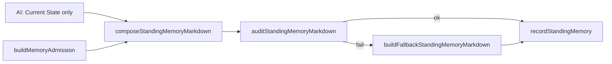

# Standing Memory 收缩：从「小报告」到可审计的工作记忆索引

> 日期：2026-05-28  
> 项目：js-evolution-agent  
> 类型：架构设计 / 功能实现 / 问题排查  
> 来源：Cursor Agent 对话（agentank-tank 记忆审计退化循环）

---

## 目录

1. [背景与动机](#1-背景与动机)
2. [分析过程](#2-分析过程)
3. [方案设计](#3-方案设计)
4. [实现要点](#4-实现要点)
5. [验证与测试](#5-验证与测试)
6. [后续演化](#6-后续演化)

---

## 1. 背景与动机

agentank-tank 主体在多轮演化中反复出现同一类故障：**记忆审计法则**（`typed_evidence_refs≥35` 且 `free_text_clean`）与 **report_builder 每轮自动重写 standing_memory** 互相打架。

典型现象：

- agent_run 内部声称已修到 `35 refs / clean`；
- 下一周期独立探针又看到 `refs=32`、Remembered 区孤儿引用、文本被 `...(truncated)` 截断；
- 主体大量周期消耗在「清理 standing_memory」而非发布策略、获取排名反馈。

情报报告（如 `cycle-20260528-043152`）将根因归结为：`report_builder` 自动填充 Inferred/Remembered，加上约 12000 字符整体截断，使高层审计法则与低层 intel 产出规则形成**无法自闭环的修复循环**。

本轮目标：在**保留 Markdown 人类可读形态**的前提下，把 `standing_memory` 从叙事型缓存改成短小、代码可控、可结构审计的工作记忆索引。

---

## 2. 分析过程

### 2.1 代码侧事实

关键链路在 [`src/intelligence/report-builder.mjs`](../../src/intelligence/report-builder.mjs)：

| 环节 | 旧行为 | 问题 |
| --- | --- | --- |
| `updateStandingMemoryWithAi()` | AI 生成四段 Markdown，再 `enforceStandingMemoryGates()` 重写 Seen/Remembered，最后 **整体 `clipText(maxChars)`** | 可能在 bullet 中间截断，产生 orphan / truncated |
| `buildMemoryAdmission()` | `remembered` 最多 **40 条** | 历史 agent claim 被复制进长期记忆，放大 free-text 审计失败面 |
| `typed_evidence_refs` | 从 admitted Seen 推导，但 subject 用 **≥35** 当硬门槛 | admitted 不足 35 时「结构上合格」仍被判 dirty |
| 职责 | `Seen` + `Inferred` + `Remembered` 混由 AI 与代码共同维护 | AI 写、代码改、再截断，审计口径不清晰 |

[`src/intelligence/conversation-context.mjs`](../../src/intelligence/conversation-context.mjs) 已明确：`typed_evidence_refs` **只用于 Seen（现 Evidence）**，Remembered 的 `agent_claim` 不应算作结构缺口——但 standing_memory 写入形态仍在复制大量 Remembered 叙事。

### 2.2 第一性原理

跨周期系统真正需要从 `standing_memory` 拿到的只有两类东西：

1. **事实索引**：哪些证据可重开（`[source_type:id]`）。
2. **少量当前判断**：当前态势与禁止复活的旧结论。

`Remembered` 作为大段历史背景，源数据已在 report、belief、receipt、diary 中；**不应在 standing_memory 里再复制一份「小报告」**。

被否定的方向：

| 备选 | 为何不选 |
| --- | --- |
| 每轮继续手工清理 `standing_memory.json` | 下一轮 report_builder 仍会覆盖，无法持久 |
| 完全删除 standing_memory | 失去跨周期压缩层，上下文成本过高 |
| 改成 JSON schema | 用户倾向保留 Markdown；索引逻辑用代码生成即可 |
| 继续用 `typed_evidence_refs≥35` 作 dirty 硬门槛 | 是 KPI 不是不变量；与 admitted 数量天然冲突 |

---

## 3. 方案设计

### 3.1 新 Markdown schema

固定四个小节（顺序固定）：

| 小节 | 谁写 | 职责 |
| --- | --- | --- |
| `## Current State` | AI，最多 5 条 | 当前判断；每条应引用 Evidence 地址 |
| `## Evidence` | **代码** | `memory_admission.seen` 的可重开索引 |
| `## Remembered` | **代码** | 固定连续性提示 + 最多 5 条可追溯 lead |
| `## Do Not Treat As Seen` | **代码** | refuted/stale/forbidden 线索 |

不再要求 AI 维护 Seen/Inferred 全文；**取消写入前对整段文本的 `clipText` 硬截断**，超预算时按条目省略并注明 `omitted N items`，不写 `...(truncated)`。

### 3.2 审计不变量（替代 ≥35 / free_text_clean）

| 不变量 | 含义 |
| --- | --- |
| `typed_evidence_refs.length === Evidence 条数` | refs 与 Evidence 一一对应 |
| 每条 Evidence 含完整 `[source_type:id]` | 可重开 |
| 无 `...(truncated)`、无半截 bracket | 结构完整 |
| Evidence 不含 agent_claim / receipt summary 污染 | 与 admission 规则一致 |
| `35` | 仅记录为 `memory_policy.evidence_depth_target`，**不作为写入失败条件** |

### 3.3 写入流程



### 关键决策

| 决策 | 选择 | 理由 |
| --- | --- | --- |
| 形态 | 保留 Markdown | 操作者可读；结构化部分由代码生成 |
| 事实区命名 | `Evidence`（替代 `Seen`） | 与 TDB Seen 语义对齐，避免与报告三栏混淆 |
| Remembered | 固定提示 + ≤5 lead | 降叙事复制；仍保留高价值 agent_claim 线索 |
| 截断 | 按条目预算 | 消灭半条 bullet 导致的 audit 失败 |
| 写入门禁 | deterministic audit + fallback | 禁止写入已知坏结构 |
| `source_role` | `working_memory_index` | observation-guard 与 normalize 一致 |

---

## 4. 实现要点

### 主要文件

| 文件 | 变更 |
| --- | --- |
| [`src/intelligence/report-builder.mjs`](../../src/intelligence/report-builder.mjs) | 新常量、`composeStandingMemoryMarkdown`、`auditStandingMemoryMarkdown`、`buildFallbackStandingMemoryMarkdown`；prompt 仅要求 AI 写 Current State；`updateStandingMemoryWithAi` 写前审计 |
| [`src/intelligence/observation-guard.mjs`](../../src/intelligence/observation-guard.mjs) | standing_memory `source_role` → `working_memory_index` |
| [`test/intelligence.test.mjs`](../../test/intelligence.test.mjs) | 用例迁移至 Evidence/Current State；新增 refs 对齐、depth&lt;35、compose+audit 测试 |
| [`test/conversational-intel-pipeline.test.mjs`](../../test/conversational-intel-pipeline.test.mjs) | memory prompt 与 fake AI 输出适配新 schema |

### 导出 API（供测试与后续探针）

- `buildMemoryAdmission`
- `composeStandingMemoryMarkdown`
- `auditStandingMemoryMarkdown`
- `buildTypedEvidenceRefsFromAdmission`
- `enforceStandingMemorySeenGate`（兼容：映射到 Evidence）

### memory_policy 新字段示例

```json
{
  "standing_memory_role": "working_memory_index",
  "sections": ["Current State", "Evidence", "Remembered", "Do Not Treat As Seen"],
  "evidence_depth_target": 35,
  "evidence_depth": 12,
  "evidence_depth_ok": false,
  "audit_ok": true,
  "used_fallback": false
}
```

---

## 5. 验证与测试

```powershell
cd d:\github\My\js-evolution-agent
npm test
```

结果：**6** 个测试文件、**282** 项测试全部通过（含 `test/intelligence.test.mjs` standing memory 系列与 `test/conversational-intel-pipeline.test.mjs`）。

重点覆盖：

- AI 污染的 Evidence 被 admission 重写；
- partial receipt 不进入 Evidence；
- Remembered 过滤 refuted / path-scope mismatch；
- `typed_evidence_refs` 与 Evidence 地址集合一致；
- admitted &lt; 35 时仍可通过 audit，仅 `evidence_depth_ok: false`。

未在本轮执行的运行时验证：

- agentank-tank 真实 subject 跑一轮 `jea run --mock` 后检查 `data/intelligence/memory/standing_memory.json` 新 schema；
- 外部探针若仍检查 `≥35`，需与 subject 目标/信念口径对齐（见后续演化）。

---

## 6. 后续演化

| 项 | 建议 |
| --- | --- |
| Subject 审计口径 | 将 agentank 探针/目标中的 `typed_evidence_refs≥35` 改为「结构 audit 通过 + evidence_depth 健康指标」 |
| 运行时迁移 | 下一轮 intel 写入后，旧版 `## Seen` / `## Inferred` memory 会被新四段格式覆盖 |
| Current State 质量 | 可增加「每条必须含 `[...]` 地址」的轻量校验，不合格时清空 Current State 而非整份 fallback |
| standing_memory 与 beliefs | beliefs 承担可执行假设后，standing_memory 应进一步避免重复 belief 叙事 |
| 文档 | 在 AGENTS.md 或 subject 操作说明中注明 standing_memory 新 schema，避免操作者手工改 Evidence 段 |

---

## 附：本轮对话问题—思考—方案—执行对照

| 阶段 | 内容 |
| --- | --- |
| 问题 | 记忆审计（≥35 refs / clean）与 report_builder 自动填充、整体截断冲突，形成修→写坏→再修循环 |
| 思考 | standing_memory 应是跨周期索引而非小报告；Remembered 不应主导 dirty 判定；35 是 KPI 不是不变量 |
| 方案 | Markdown 四段式；Evidence/Remembered/Do Not Treat As Seen 由代码生成；写前 audit + fallback |
| 执行 | 改 report-builder、observation-guard、测试；全量 `npm test` 282 passed |
