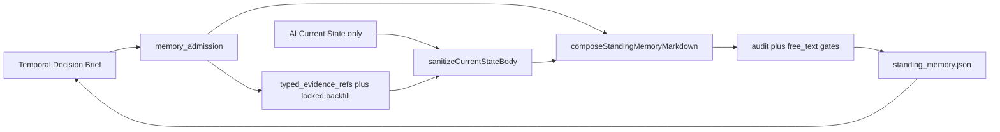

# Standing Memory Free-Text 门禁：refs 稳住之后，叙事层终于也被管住了

> 日期：2026-05-29  
> 项目：js-evolution-agent  
> 类型：问题排查 / 功能实现  
> 来源：Cursor Agent 对话（agentank-tank 记忆审计：receipt-58d68cf9 修复后单周期干净、下周期再退化）

---

## 目录

1. [背景与动机](#1-背景与动机)
2. [分析过程](#2-分析过程)
3. [方案设计](#3-方案设计)
4. [实现要点](#4-实现要点)
5. [验证与测试](#5-验证与测试)
6. [后续演化](#6-后续演化)

---

## 1. 背景与动机

2026-05-28 已将 `standing_memory` 收成四段式 Markdown 工作记忆索引（见 [`standing-memory-markdown-simplify.md`](../2026-05-28/standing-memory-markdown-simplify.md)）：Evidence/Remembered 由代码生成、写入前 `audit_ok`、取消整段 `clipText` 硬截断。

agentank-tank 上仍出现另一类退化：

- `receipt-58d68cf9` 修复后，`typed_evidence_refs=43`、`memory_policy.audit_ok=true` 可维持约一个干净周期；
- 下一轮 `report_builder` 自动摘要后，`text`（操作者/探针所称 **free_text**）再次含 `agent_claim:`、审计元叙事（`free_text_clean=`）、Unicode 省略号 `…`、或 Do Not Treat 嵌入整段旧 Current State；
- **`_locked:true` backfill 保住了 refs 数量与 Evidence 对齐，但没有锁住叙事层。**

真正的问题不是「refs 又掉到 32」，而是 **结构审计与 free_text 清洁口径脱节**：内置 `auditStandingMemoryMarkdown` 只严审 Evidence，Current State 仍由 LLM 每轮重写并吸收高污染上下文。

---

## 2. 分析过程

### 2.1 字段与链路

仓库内没有 `free_text` 字段；运行时与探针口径对应 `standing_memory.json` 的 **`text`**（四段 Markdown）。



### 2.2 根因归纳

| 根因 | 说明 |
| --- | --- |
| `_locked` 作用域不对称 | 仅在 `applyRollingTypedEvidenceRefs` 保护 ref 对象；`text` 每轮全量重写 |
| 内置 audit 偏结构 | `audit_ok` 检查 Evidence 与 refs 对齐、Evidence 无 `agent_claim:`；不审 Current State / Remembered 叙事 |
| Remembered 复制 receipt summary | TDB 将 `result.summary` 标为 `agent_claim`；旧 compose 写成 `agent_claim: …` 长句，探针判脏 |
| 旧 memory 回灌 | `standingMemoryClaim` 把整段 `text` 送入 claims → Do Not Treat 曾嵌入 `## Current State` 摘录 |
| 读路径 clip | `normalizeStandingMemory` 读时 `clipText(12000)` 与写路径不截断不对称，易诱发半截叙事 |

### 2.3 与 05-28 方案的关系

05-28 解决的是「小报告 + 整体截断 + Seen 混写」。本轮补的是 **同一写入管线上的 free-text 不变量**，不推翻四段 schema，也不动 `_locked` backfill 语义。

---

## 3. 方案设计

目标：**refs 滚动逻辑不变**；在 `recordStandingMemory` 前把叙事层纳入确定性门禁。

### 关键决策

| 决策 | 选择 | 理由 |
| --- | --- | --- |
| free-text 审计入口 | 新增 `auditStandingMemoryFreeText`，由 `auditStandingMemoryMarkdown` 调用 | 与结构 audit 分层；失败项带 `free_text:` 前缀 |
| Current State 污染 | `sanitizeCurrentStateBody` 按 bullet 过滤，非整份失败 | 降低「一过严就全空」风险；不合格 bullet 丢弃，全无则 `- (none)` |
| Remembered 形态 | 仅 `地址 (remembered_policy)` | 索引而非小报告；原文靠 source address 回源 |
| Do Not Treat / standing_memory | 固定短句 + 地址，不嵌旧正文 | 阻断 meta-narrative 跨轮复制 |
| audit 失败回退 | 仍 fallback Current State 为 `- (none)`，保留 Evidence 代码段 | 与 05-28 fallback 一致 |

### 被否定的备选

| 备选 | 为何不选 |
| --- | --- |
| 锁定整段 `text` 像 refs 一样 `_locked` | 无法反映新证据；与「工作记忆索引」职责冲突 |
| 禁止 AI 写 Current State | 失去态势判断层；改为 sanitize + 引用约束 |
| 把 `free_text_clean` 写回 `memory_policy` 作硬门槛 | 探针/主体口径不一；先统一**写入侧**门禁，再对齐外部探针 |

### free-text 审计范围（写入前）

- 全文：`...(truncated)`、`…`、半截词（如 `fallba…`）
- `Evidence` 以外出现 `agent_claim:`、`free_text_clean` 等污染模式
- Current State 每条须引用当前 `typed_evidence_refs` 中的地址
- Remembered 中 bracket 地址须在 refs 或 `admission.remembered` 内
- Do Not Treat：不得含嵌入的 `## Current State`；`standing_memory` 行过长

---

## 4. 实现要点

主文件：[`src/intelligence/report-builder.mjs`](../../src/intelligence/report-builder.mjs)

| 符号 | 职责 |
| --- | --- |
| `FREE_TEXT_POLLUTION_PATTERNS` | 叙事污染检测（含 `agent_claim:`、`free_text_clean`、`remote.matchCount` 等） |
| `sanitizeCurrentStateBody` | 过滤 AI Current State；要求地址 ∈ 当前 refs |
| `auditStandingMemoryFreeText` | 审 Current State / Remembered / Do Not Treat |
| `auditStandingMemoryMarkdown` | 结构 audit + 调用 free-text audit（可传 `admission`） |
| `buildRememberedSectionBody` | `- [type:id] (policy)`，不再拼 receipt summary |
| `summarizeDoNotTreatItem` | `standing_memory` 来源只输出短说明 |
| `updateStandingMemoryWithAi` | rolling refs → sanitize → compose → audit（带 `extendedAdmission`） |

`updateStandingMemoryWithAi` 核心顺序：

```text
rawCurrentState → applyRollingTypedEvidenceRefs → sanitizeCurrentStateBody(allowedAddresses)
→ composeStandingMemoryMarkdown → auditStandingMemoryMarkdown({ admission })
→ 失败则 Current State 回退 - (none) 后重审
```

相关但本轮未改：`decision-brief.mjs` 仍产出 `agent_claim` 进 TDB Remembered；写入侧不再把其全文复制进 `standing_memory.text`。

### 测试

| 文件 | 增补 |
| --- | --- |
| [`test/intelligence.test.mjs`](../../test/intelligence.test.mjs) | sanitize、free-text audit、Do Not Treat 短说明、Current State 过滤；Remembered 断言改为 `agent_claim_lead_not_fact` |
| [`test/conversational-intel-pipeline.test.mjs`](../../test/conversational-intel-pipeline.test.mjs) | standing memory 假 AI 输出须带有效 `[evolution_events:…]` 地址 |

---

## 5. 验证与测试

```powershell
cd d:\github\My\js-evolution-agent
npm test -- test/intelligence.test.mjs
npm test
```

结果（实现当日）：

| 命令 | 结果 |
| --- | --- |
| `test/intelligence.test.mjs` | 65 passed |
| 全量 `npm test` | 9 files，**323** passed |

未在本篇执行的运行时验证：

- agentank-tank 跑一轮真实 `jea run` 后检查 `data/intelligence/memory/standing_memory.json` 是否无 `agent_claim:`、无 `…` 截断；
- 外部记忆审计探针若仍查 `free_text_clean`，需与 `operator-fact-standing-memory-audit-contract` 及写入侧 `audit_ok` 对齐口径。

---

## 6. 后续演化

| 项 | 建议 |
| --- | --- |
| 探针/目标口径 | 将主体侧 `free_text_clean` 与 `memory_policy.audit_ok` + free-text issues 对齐，避免双标准 |
| Evidence 摘要 | `shortText` 产生的 `…` 仅应在 Evidence 结构化行；若探针扫全文，可再收紧 backfill summary |
| TDB 回灌 | 考虑 `standingMemoryClaim` 只传 hash/周期 id，不传整段 `text`，进一步切断 meta 环 |
| Current State 质量 | 可选：无合格 bullet 时在 receipt 记 `used_fallback: true` 供 daemon inbox 提示 |
| 读路径 clip | 评估 `normalizeStandingMemory` 读时 12k clip 是否仍必要，或改为仅索引字段进 prompt |

---

## 附：本轮对话问题—思考—方案—执行对照

| 阶段 | 内容 |
| --- | --- |
| 问题 | `_locked` backfill 修复（receipt-58d68cf9）后 refs 干净仅维持一轮，`report_builder` 摘要再次污染 free text |
| 思考 | 根因不是 refs 数量，而是叙事层无 lock、内置 audit 只审 Evidence、Remembered/Do Not Treat 复制 agent 叙事 |
| 方案 | 写入前 free-text audit + Current State sanitize + Remembered/Do Not Treat 索引化输出 |
| 执行 | 改 `report-builder.mjs`，扩测试，`npm test` 323 passed |
