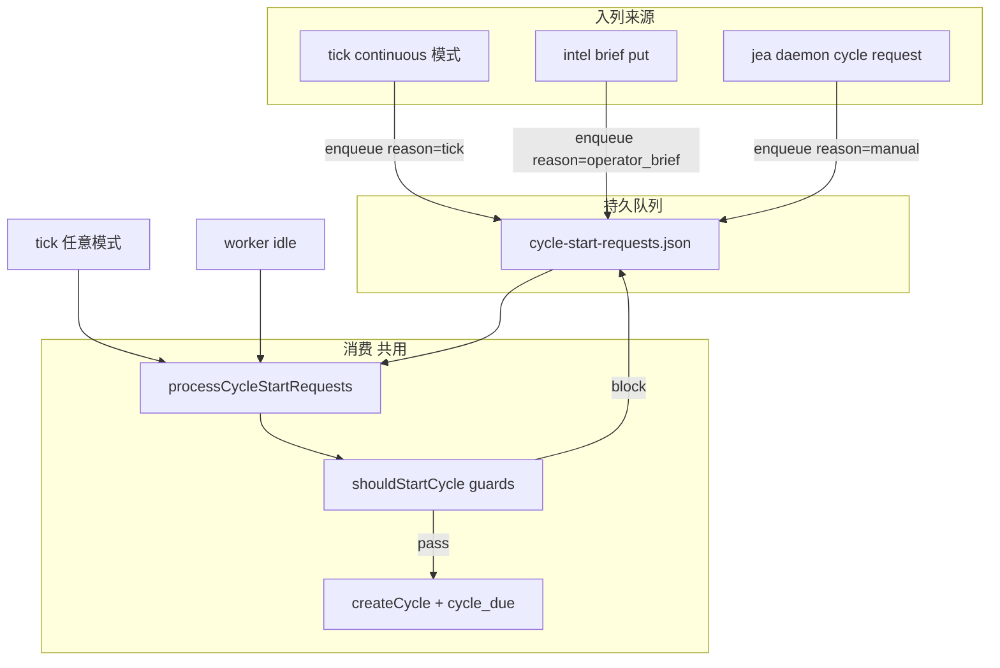

# Cycle 启动请求与演化模式：把「tick 到了」和「该不该开轮」拆开

> 日期：2026-05-30  
> 项目：js-evolution-agent  
> 类型：架构设计 / 功能实现  
> 来源：Cursor Agent 对话（daemon 心跳分析 → 驱动模式讨论 → 最小增量方案 → 落地实现）

---

## 目录

1. [背景与动机](#1-背景与动机)
2. [分析过程](#2-分析过程)
3. [方案设计](#3-方案设计)
4. [实现要点](#4-实现要点)
5. [验证与测试](#5-验证与测试)
6. [后续演化](#6-后续演化)
7. [附：问题—思考—方案—执行对照](#附问题思考方案执行对照)

---

## 1. 背景与动机

2026-05-30 同日，[`single-heartbeat-event-driven-steps.md`](./single-heartbeat-event-driven-steps.md) 已把 daemon 从「整轮 `run_cycle`」推进到 **step 级事件驱动**：5 分钟 tick 做 reconcile + 开新 cycle，step 完成即时 dispatch 下一步。

操作者在复盘 daemon 行为时提出一个更根本的问题：

**真正驱动 intel 的，是「时间到了」，还是「有事情要做」？**

当时实现里，tick 几乎等价于「尝试开一轮」：`runHeartbeatTick` → `startCycleFromTick` → 前提满足即 `cycle_due` → enqueue `intel`。Step 链内部已是事件因果（`intel_ready` → `exec` → …），但 **cycle 的诞生仍绑在节律 tick 上**。

这与项目其它层的语义并不同构：

- **Operator Intent Brief** 表达的是「下一轮请这样排优先级」，不是「每 5 分钟请 orient 一遍」。
- **`ai-researcher`** 等调研型主体更适合按需演化，而非持续空转 intel。
- **`pending_decisions`** 积压意味着「该 exec」，不一定意味着「该重新 intel」。

因此需要在 **不大改 reducer / step 链** 的前提下，增加「何时值得尝试开 cycle」的可配置策略，并把 tick 从「开轮指令」降级为「节律 + 补偿 +（可选）自动入队」。

---

## 2. 分析过程

### 2.1 现有机制实际在优化什么

| 层 | 行为 | 本质 |
| --- | --- | --- |
| **开新轮**（`startCycleFromTick`） | 无 open cycle、无 pending task → 开 cycle | 节律驱动的空轮探测 |
| **漏步补偿**（`reconcileOpenCycles`） | 按 cycle-state 补 enqueue 缺失 step | 状态机与队列的一致性修复 |

Reconcile 是工程自愈，不负责回答「该不该演化」。Health 里的 `evolution_stalled` 也默认「超过 tick 窗口没开新轮 = 不健康」，强化了持续进化假设。

### 2.2 对话中的方案演进

1. **第一轮分析**：梳理 tick → `cycle_due` → intel 的完整链路；区分「5min 节律 tick」与「任务租约 heartbeat」。
2. **驱动模式讨论**：项目里已有 brief、ingest、decisions 队列、审批流等多种「意图/证据」入口，但 **未接到 cycle 诞生逻辑**；tick 应作兜底，不应是唯一主驱动力。
3. **最小增量**：不重构 reducer，只加「信号检测 + 空闲时复用开轮流程」——brief 入列后 worker idle 即可消费。
4. **最终收敛**：用户明确两种模式——
   - **持续进化**（`continuous`）：tick 到点 → **产生** cycle 启动请求 → 前提检查 → 开轮。
   - **按需进化**（`on_demand`）：tick 到点 → **只消费**已有请求，不产生 tick 请求；请求由 brief / CLI 等入列。

### 2.3 关键约束（落地时保留）

- 单 subject 串行：open cycle 或 pending task 时不开新轮（现有 `shouldStartCycleFromTick` 守卫不变）。
- Reconcile 与演化模式无关，始终执行。
- `jea run` / `run_cycle` 旁路不变，不经过请求队列。
- 默认 **`continuous`**，与改造前行为兼容。

---

## 3. 方案设计

### 3.1 核心模型：请求队列 + 统一消费



| 模式 | tick 行为 | 默认 |
| --- | --- | --- |
| `continuous` | reconcile → **入队** `reason=tick` → **尝试消费** | 是 |
| `on_demand` | reconcile → **仅尝试消费** | 否 |

**不变**：[`cycle-reducer.mjs`](../../src/cli/utils/cycle-reducer.mjs)、[`run.mjs`](../../run.mjs)、各 step 执行器、reconcile 漏步补偿语义。

### 3.2 三层职责划分

```text
策略层：该不该演化、开哪种轮次（continuous / on_demand + 入列来源）
调度层：reducer + dispatch（已有）
可靠性层：reconcile + 租约（已有，漏步补偿留在这里）
```

### 关键决策

| 决策 | 选择 | 理由 |
| --- | --- | --- |
| 请求持久化 | 单文件 `cycle-start-requests.json`，每 subject 最多 1 条 pending | 简单、可审计；合并 reasons 避免 tick 风暴堆叠 |
| 与 `pending_tasks` 分离 | 独立队列 | 「想开轮」≠「step 任务」；职责清晰 |
| 消费时机 | tick + worker idle | on_demand 下 brief 入列不必等 5 分钟 |
| 阻塞时请求 | 保留 pending，记 `cycle_start_deferred` | open cycle / pending task 时不丢意图 |
| 模式解析优先级 | subjects.json > CLI > env > 默认 continuous | 主体可差异化；默认向后兼容 |
| brief 入列位置 | [`intel-briefs.mjs`](../../src/cli/commands/intel-briefs.mjs) 而非 intelligence 层 | 避免 intelligence → cli 反向依赖 |
| P2 暂缓 | inbox 扫描、pending_decisions 触发、drop-in 文件 | 控制改动面；首版覆盖 brief + CLI + tick |

---

## 4. 实现要点

### 4.1 运行时结构

```text
runtime/subjects/<ns>/data/evolution/
├── cycle-start-requests.json      # pending + history
├── cycle-start-requests.lock
├── tasks/pending_tasks.json       # step 任务（不变）
└── cycle-state/<cycleId>.json
```

pending 请求结构示例：

```json
{
  "pending": {
    "request_id": "...",
    "reasons": ["tick", "operator_brief"],
    "created_at": "...",
    "updated_at": "...",
    "meta": { "brief_ids": ["brief-abc"] }
  },
  "history": []
}
```

### 4.2 关键模块

| 文件 | 职责 |
| --- | --- |
| [`cycle-start-requests.mjs`](../../src/cli/utils/cycle-start-requests.mjs) | enqueue / read / consume / defer；锁 + 原子写 |
| [`evolution-mode.mjs`](../../src/cli/utils/evolution-mode.mjs) | `continuous` \| `on_demand` 解析 |
| [`cycle-dispatch.mjs`](../../src/cli/utils/cycle-dispatch.mjs) | `processCycleStartRequests`、`startCycleFromRequest`、`runHeartbeatTick` 分模式入队/消费 |
| [`daemon.mjs`](../../src/cli/commands/daemon.mjs) | idle 消费、`jea daemon cycle request`、`--evolution-mode` |
| [`intel-briefs.mjs`](../../src/cli/commands/intel-briefs.mjs) | `brief put` 后入队 `operator_brief` |
| [`daemon-projection.mjs`](../../src/cli/utils/daemon-projection.mjs) | `evolution_mode`、pending 请求摘要；on_demand 下调整 stall 判定 |

### 4.3 数据流

**`runHeartbeatTick`（改造后）**

```text
1. record daemon_tick
2. reconcileOpenCycles（不变）
3. if evolution_mode === continuous:
     enqueueCycleStartRequest(reason=tick)
4. processCycleStartRequests()
```

**`processCycleStartRequests`**

```text
读 pending → shouldStartCycleFromTick 守卫
  → 通过：startCycleFromRequest（写入 trigger meta）→ consume → cycle_start_consumed
  → 阻塞：defer → cycle_start_deferred（同 blocked_reason debounce）
```

**Worker 主循环**

- tick 窗口：`safeRunHeartbeatTick`（含 reconcile + 模式相关入队 + process）
- `workOnce` idle：`safeProcessCycleStartRequests`（仅 process，不入队 tick）

### 4.4 配置与命令

| 入口 | 说明 |
| --- | --- |
| `JEA_EVOLUTION_MODE=continuous\|on_demand` | 全局 env（见 [`.env.example`](../../.env.example)） |
| `jea daemon start --evolution-mode on_demand` | CLI 覆盖 env |
| `subjects.json` → `evolution.mode` |  per-subject 覆盖（见 [`subjects.example.json`](../../policies/subjects.example.json)） |
| `jea daemon cycle request [--reason TEXT]` | 显式入队 |
| `jea intel brief put` | 自动入队 `operator_brief` |

审计事件（`evolution-events.jsonl`）：`cycle_start_requested`、`cycle_start_deferred`、`cycle_start_consumed`；`cycle_due` 增加 `trigger` / `trigger_reasons`。

---

## 5. 验证与测试

| 项 | 命令 / 文件 | 结果 |
| --- | --- | --- |
| 请求队列单测 | `test/cycle-start-requests.test.mjs` | enqueue 合并、consume、defer、continuous/on_demand tick、open cycle 阻塞保留请求 |
| 演化模式解析 | `test/evolution-mode.test.mjs` | 默认 continuous、subject/env/CLI 优先级 |
| dispatch 回归 | `test/cycle-state-dispatch.test.mjs` | 通过 |
| 全量 | `npm test` | **409/409** 通过（2026-05-30 实施日） |

建议操作者本地冒烟：

```bash
# 按需模式 + 显式请求
JEA_EVOLUTION_MODE=on_demand npm run jea -- daemon cycle request --subject ai-researcher
npm run jea -- daemon start --evolution-mode on_demand --subject ai-researcher --max-iterations 3 --mock

# brief 自动入队
echo '{"summary":"verify X","claims_to_verify":["Y"]}' | npm run jea -- intel brief put --stdin
npm run jea -- daemon status --json
```

---

## 6. 后续演化

| 优先级 | 项 | 说明 |
| --- | --- | --- |
| P2 | `_inbox` 非空 → 入队 | 外部证据到达时唤醒，仍走同一请求队列 |
| P2 | `cycle-request.json` drop-in | 脚本/自动化友好入口 |
| P2 | `pending_decisions` 触发策略 | 需区分 exec-only 续链 vs 完整 intel，避免重复 Decide |
| P3 | Viewer 展示 pending 请求与 `evolution_mode` | status JSON 已有字段，UI 未接 |
| P3 | 请求 TTL / 过期审计 | 长期 deferred 除 `cycle_start_blocked` 外可主动 expire |

与 [`single-heartbeat-event-driven-steps.md`](./single-heartbeat-event-driven-steps.md) 的关系：该 journal 解决 **step 链内** 的事件驱动；本篇解决 **cycle 诞生** 的策略层，二者叠加后 tick 角色更清晰——**兜底 + reconcile +（可选）自动入队**，而非唯一的演化意图来源。

---

## 附：问题—思考—方案—执行对照

| 阶段 | 内容 |
| --- | --- |
| **问题** | Daemon tick 直接开 cycle，与 brief/按需主体语义冲突；「漏步补偿」与「该不该演化」混在一起。 |
| **思考** | 开轮与 step 推进应分层；tick 不应等于开轮指令；项目已有多种入列来源但未接到 cycle 诞生；改动应限于请求队列 + 消费，不动 reducer。 |
| **方案** | `cycle-start-requests.json` + `continuous`/`on_demand`；tick 在 continuous 下入队 `tick` 请求；统一 `processCycleStartRequests`；idle 快速消费；brief/CLI 入列。 |
| **执行** | 新增 `cycle-start-requests.mjs`、`evolution-mode.mjs`；改 `cycle-dispatch`、`daemon`、`daemon-projection`、`intel-briefs`；更新 `AGENTS.md` / `.env.example` / `subjects.example.json`；测试 409 通过。 |
