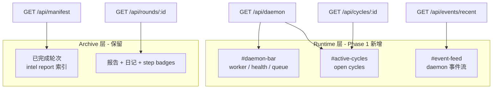

# Evolution Viewer Daemon 控制台：从报告浏览器到 step 调度观测面

> 日期：2026-05-30  
> 项目：js-evolution-agent  
> 类型：功能实现 / 架构设计（Viewer Phase 1）  
> 来源：Cursor Agent 对话（思路讨论 → 计划 → 实施 → 本地 serve 验证）

---

## 目录

1. [背景与动机](#1-背景与动机)
2. [分析过程](#2-分析过程)
3. [方案设计](#3-方案设计)
4. [实现要点](#4-实现要点)
5. [验证与测试](#5-验证与测试)
6. [后续演化](#6-后续演化)

---

## 1. 背景与动机

同日早些时候，[`single-heartbeat-event-driven-steps.md`](./single-heartbeat-event-driven-steps.md) 已把 daemon 推进力拆成 **5min 心跳兜底 + step 完成即时 dispatch**，并在 Viewer 第三轮收尾里补了 cycle-state step 徽章与 SSE 对 `cycle_step_completed` 的识别。

但操作者打开 Evolution Viewer 时仍有一个明显落差：**看得见 intel report 和日记，却看不见 daemon 正在干什么**。

典型盲区包括：

- worker 是否在跑、队列里有没有 pending/running task；
- 尚未产出 intel report 的 **open cycle** 不在时间线里；
- `daemon_tick`、`task_claimed`、`cycle_step_enqueued` 等调度事件被 SSE 忽略；
- 要查运行态只能回 CLI 跑 `jea daemon status` / `doctor`。

真正的问题不是「Viewer 信息不够多」，而是 **观测模型仍绑定在「报告归档轮次」上**，与 daemon 的 **任务队列 + cycle-state 状态机** 不在同一层。

用户明确要求：**主视角对齐 daemon 模式（心跳 + 事件驱动）**，先做 Phase 1 MVP，不做 Viewer 内 enqueue/retry，也不改离线 build 的归档语义。

---

## 2. 分析过程

### 2.1 现有 Viewer 的数据模型

| 层级 | 当前行为 | 与 daemon 的错位 |
| --- | --- | --- |
| 时间线 [`round-catalog.mjs`](../../src/intelligence/evolution-viewer/round-catalog.mjs) | 只索引 intel report | open cycle 不可见 |
| 详情 [`round-detail.mjs`](../../src/intelligence/evolution-viewer/round-detail.mjs) | 无 report 则 404 | 进行中 cycle 无法点开 |
| SSE [`viewer-api.mjs`](../../src/intelligence/evolution-viewer/viewer-api.mjs) | `round_added` / `round_updated` | daemon 事件被丢弃 |
| 投影 [`daemon-projection.mjs`](../../src/cli/utils/daemon-projection.mjs) | CLI `status` 已可用 | Viewer serve 未接入 |

### 2.2 daemon 运行时已有、但未暴露的数据

```text
worker-state.json          → worker 心跳、current task
pending_tasks.json         → step 任务队列与租约
cycle-state/<cycleId>.json → 8 step 状态机
evolution-events.jsonl     → 业务事件 + daemon 事件（同一文件）
buildDaemonProjection()    → 与 jea daemon status --json 同源
```

关键约束：`buildDaemonProjection(root, subject)` 需要 **projectRoot + subject**，而 `createViewerApiServer` 原先只传 `runtime`，必须补 `projectRoot`（[`intel-viewer.mjs`](../../src/cli/commands/intel-viewer.mjs) 已有 `root`）。

### 2.3 方案讨论中的核心判断

- **不要**把 daemon 状态硬塞进「报告轮次」模型；应增加 **Runtime 层**，与 Archive 层并列。
- **应**复用 `buildDaemonProjection` 实时计算，而非只读可能陈旧的 `views/current-state.json`。
- **应**扩展同一条 `evolution-events.jsonl` tail，对白名单 daemon 事件发 `daemon_event` SSE。
- **Phase 1 边界**：tick 倒计时、checkpoint 面板、Attention 区、多 subject 聚合留 Phase 2–4。

---

## 3. 方案设计

### 3.1 双轨信息架构（Archive + Runtime）



### 3.2 API 与 SSE 扩展

| 端点 / 事件 | 作用 |
| --- | --- |
| `GET /api/daemon` | 实时 `buildDaemonProjection` + `tick_ms` / `last_tick_at`（2s TTL 缓存） |
| `GET /api/cycles/:cycleId` | cycle-state + 关联 tasks；**不要求** intel report |
| `GET /api/events/recent?limit=N` | daemon 事件白名单，供 Event Feed 初次加载 |
| SSE `daemon_event` | tail jsonl 中的调度事件 |
| SSE `runtime_updated` | watch `pending_tasks` / `worker-state` / `cycle-state`（debounce 1s） |

### 关键决策

| 决策 | 选择 | 理由 |
| --- | --- | --- |
| 观测 vs 控制 | **只读** | 避免 Viewer 变成第二个 CLI；retry/cancel 仍走 `jea daemon` |
| 投影来源 | 实时 `buildDaemonProjection` | 不依赖 heartbeat 是否刚写过 `current-state.json` |
| 事件管道 | 扩展现有 jsonl tail | 与 daemon 写入路径一致，无需新 MQ |
| 离线 build | **不变** | dist 仍只快照报告；daemon UI 仅 live serve |
| 交付节奏 | **Phase 1 MVP** | 顶栏 + open cycles + 事件流；因果链/checkpoint 后续迭代 |

---

## 4. 实现要点

### 4.1 新增模块

| 文件 | 职责 |
| --- | --- |
| [`daemon-sse.mjs`](../../src/intelligence/evolution-viewer/daemon-sse.mjs) | `DAEMON_SSE_EVENT_TYPES` 白名单；`formatDaemonEventForApi`；`readRecentDaemonEvents`；tick 辅助字段 |
| [`cycle-detail.mjs`](../../src/intelligence/evolution-viewer/cycle-detail.mjs) | `buildCycleDetail`：无 report 也可返回 steps / tasks / 可选 report_html |

### 4.2 主要改动

| 文件 | 变更 |
| --- | --- |
| [`viewer-api.mjs`](../../src/intelligence/evolution-viewer/viewer-api.mjs) | 接收 `projectRoot`；新 API 路由；`createRuntimeWatcher`；tailer 广播 `daemon_event` |
| [`intel-viewer.mjs`](../../src/cli/commands/intel-viewer.mjs) | `createViewerApiServer({ projectRoot: root, ... })` |
| [`tools/evolution-viewer/public/index.html`](../../tools/evolution-viewer/public/index.html) | `#daemon-bar`、`#active-cycles`、`#event-feed` |
| [`tools/evolution-viewer/public/app.js`](../../tools/evolution-viewer/public/app.js) | `loadDaemon`、Event Feed、active/round 双选、`selectById` hash 路由 |
| [`tools/evolution-viewer/public/styles.css`](../../tools/evolution-viewer/public/styles.css) | health/worker 色、step-dots、event-feed 布局 |
| [`AGENTS.md`](../../AGENTS.md) | live serve API 与 SSE 事件说明 |
| [`test/evolution-viewer-live.test.mjs`](../../test/evolution-viewer-live.test.mjs) | daemon/cycle/SSE 用例；fixture 对齐 `runtime/subjects/<ns>` 布局 |

### 4.3 数据流（live serve）

```text
jea intel viewer serve
  → createViewerApiServer(projectRoot, runtime)
  → GET /api/daemon → buildDaemonProjection + readTickHints
  → GET /api/cycles/:id → readCycleState + readTaskQueue filter
  → tail evolution-events.jsonl → daemon_event + round_* SSE
  → watch cycle-state / tasks / worker-state → runtime_updated
```

### 4.4 本地启动命令

```powershell
# 离线快照（不含 daemon 控制台）
npm run viewer:build -- --subject ai-researcher

# live serve（含 daemon 控制台）
npm run jea -- intel viewer serve --subject ai-researcher --open --port 4173
```

---

## 5. 验证与测试

### 5.1 自动化测试

```powershell
npm test -- test/evolution-viewer-live.test.mjs
```

结果：**17/17 通过**（含 `daemon-sse` 单元、`GET /api/daemon`、`GET /api/cycles/:id` 无 report、`daemon_tick` → SSE `daemon_event`）。

### 5.2 本地 serve 冒烟

对 `ai-researcher` subject：

1. `npm run viewer:build -- --subject ai-researcher` → dist 7 轮。
2. 重启 `intel viewer serve --port 4173`（需先释放占用端口的旧进程）。
3. `GET /api/daemon` 返回 `health: healthy`、`worker: true`、`open_cycles >= 1`。

### 5.3 已知未覆盖

- 浏览器端 UI 交互未做 E2E（依赖人工打开 http://127.0.0.1:4173/）。
- 多 subject 并行 serve 未在本轮验证。
- `runtime_updated` 的文件 watch 在 Windows 上仅做了功能接线，未单独压测 debounce 频率。

---

## 6. 后续演化

与计划中的 Phase 2–4 对齐，近期可优先：

| Phase | 内容 |
| --- | --- |
| 2 | tick 倒计时；Event Feed 因果链分组；`cycle_step_enqueued.reason` 标注 reconcile |
| 3 | checkpoint 存在性面板；archive timeline step 摘要；report/diary Tab 统一 |
| 4 | Attention 区（stuck/expired/failed）；对齐 `jea daemon doctor` 文案 |

长期：Viewer 继续做 **evolve manifest（轮级）与 cycle-state（step 级）之间的关联层**，而不是替代 CLI 控制面。

---

## 附：本轮对话问题—思考—方案—执行对照

| 阶段 | 内容 |
| --- | --- |
| 问题 | Evolution Viewer 看不见 daemon 运行态；时间线只认 intel report，与 step 调度模型错位 |
| 思考 | 观测面应绑定 worker/queue/cycle-state + jsonl 调度事件；Archive 与 Runtime 分层；复用 `buildDaemonProjection` |
| 方案 | Phase 1：`/api/daemon`、`/api/cycles/:id`、`/api/events/recent` + SSE `daemon_event`/`runtime_updated` + 前端 daemon-bar/active-cycles/event-feed |
| 执行 | 落地 2 个新模块、扩展 viewer-api 与 public 前端、17 项测试通过；AGENTS.md 更新；本地 build + serve 验证 ai-researcher |
