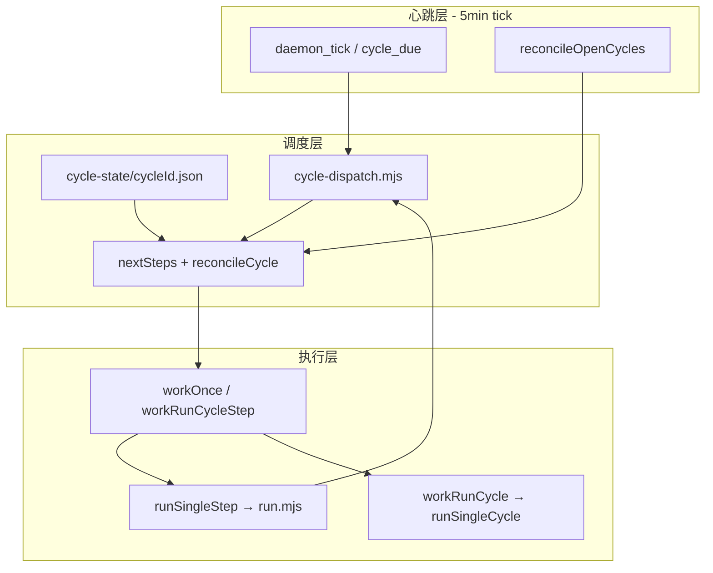

# 单一心跳 + 分步事件驱动：从整轮同步链到 step 级调度

> 日期：2026-05-30  
> 项目：js-evolution-agent  
> 类型：架构设计 / 功能实现（含 parity 补全、Viewer daemon 控制台与阅读体验）
> 来源：Cursor Agent 对话（设计 → 实施 → 审查 → Viewer 四轮迭代）

---

## 目录

1. [背景与动机](#1-背景与动机)
2. [分析过程](#2-分析过程)
3. [方案设计](#3-方案设计)
4. [实现要点](#4-实现要点)
5. [验证与测试](#5-验证与测试)
6. [已知差距与风险](#6-已知差距与风险)
7. [后续演化](#7-后续演化)
8. [Parity 补全（同日第二轮）](#8-parity-补全同日第二轮)
9. [全面收尾（同日第三轮）](#9-全面收尾同日第三轮)
10. [Evolution Viewer Daemon 控制台（同日第四轮）](#10-evolution-viewer-daemon-控制台同日第四轮)
11. [Viewer 阅读体验 A+B（同日第五轮）](#11-viewer-阅读体验-ab同日第五轮)

---

## 1. 背景与动机

2026-05-18 已落地 [`jea daemon`](../../src/cli/commands/daemon.mjs) 任务队列与 `run_cycle` worker，把「整轮演化」从一次性 CLI 进程里拆出来，交给可租约、可重试的后台调度。但 **daemon 的 loop 仍是忙轮询 dispatcher**（`interval-ms` / `idle-interval-ms` 拉队列），**调度的最小单位仍是整轮** [`run.mjs`](../../run.mjs) Phase 1→5 同步链。

操作者提出第二阶段架构升级：

- **只保留一个核心心跳 loop**，固定每 **5 分钟** 执行一次；
- 工作流里其它步骤改成 **异步、事件驱动** 的 step，不再绑在同一条同步调用栈上。

真正的问题不是「有没有 daemon」，而是 **推进力与因果链仍写在 `runCycle` 的代码顺序里**。要把演化系统做成可持续后台运转的形态，需要把 **「代码顺序粘连」换成「事件因果粘连」**，并把 worker 从「执行整轮」降级为「执行一个 step」。

**同日进展**：先产出设计 journal，随后按渐进式五小步完成首版落地；审查确认基础设施可用，但 step 逐步路径尚不能完整替代整轮 `run.mjs`。

---

## 2. 分析过程

### 2.1 耦合点（设计时 vs 落地后）

| 部位 | 设计时现状 | 落地后 |
| --- | --- | --- |
| [`run.mjs`](../../run.mjs) | Phase 1→5 同步链 | 整轮路径保留；支持 `JEA_CYCLE_STEP` + `JEA_CYCLE_ID` 单 step 入口；Phase 逻辑抽到 [`cycle-steps.mjs`](../../src/evolution/cycle-steps.mjs) |
| [`daemon.mjs#runDaemonWorker`](../../src/cli/commands/daemon.mjs) | 忙轮询 + 整轮 `run_cycle` | 默认 **5min tick**（`--tick-ms`）+ reconcile；step 完成 **即时 dispatch**；`run_cycle` 兼容保留 |
| [`daemon-tasks.mjs`](../../src/cli/utils/daemon-tasks.mjs) | 仅 `run_cycle` | 扩展 8 种 step type；`idempotency_key = subject:cycleId:step`；同 cycle step 顺序约束 |
| 阶段间数据 | 磁盘副作用 + 代码顺序 | 新增 `cycle-state/<cycleId>.json` + reducer 显式 guard |
| [`jea evolve`](../../src/cli/commands/evolve.mjs) | manifest 轮级断点 | **未改**；与 cycle-state **分层并存** |

[`journal/2026-05-18/jea-daemon-event-driven-foundation.md`](../2026-05-18/jea-daemon-event-driven-foundation.md) 第一版不拆 Phase；本次是在其上的 **第二阶段首版实现**。

### 2.2 关键发现（设计阶段，仍成立）

1. 心跳与业务推进不应混在同一 busy loop。
2. 失败 / skip 语义须从 `run.mjs` if 分支迁入 reducer。
3. 单 subject 串行不变量不能丢（subject lock + 未关闭 cycle 不开新轮）。
4. 事件总线不必上 MQ：复用 `evolution-events.jsonl` + `pending_tasks.json` + 租约即可。

### 2.3 已确认决策

| 决策 | 选择 | 状态 |
| --- | --- | --- |
| 心跳角色 | **兜底力**：step 完成即时推进；5min tick 做 reconcile + 开新 cycle | ✅ 已落地 |
| 迁移节奏 | 渐进式五小步，每步可回滚 | ✅ 已按此执行 |
| `exec_failed` 下游 | skip belief/goals，仍 enqueue `diary` | ✅ reducer 已实现；逐步路径 artifact 尚弱 |
| evolve manifest vs cycle-state | **分层**（轮 vs step），尚未打通 | ⏳ 待做 |

---

## 3. 方案设计

### 3.1 三层划分（已落地）



### 3.2 Phase → step 映射

| 现状 Phase | step 类型 | 触发 | 完成事件 |
| --- | --- | --- | --- |
| 节律 | — | `tick` | `cycle_due` |
| Phase 1 | `intel` | `cycle_due` | `intel_ready` |
| Phase 1.5 | `intel_report` | `intel_ready` | `report_ready` |
| Phase 2 | `exec` | `intel_ready`（reducer：decisions>0 才 enqueue） | `exec_done` / `exec_failed` |
| Phase 3 | `verify` | `exec_done` / `exec_skipped` | `verify_done` |
| Phase 3.5 | `belief_update` | `verify_done` | `beliefs_*` |
| Phase 4 / 4.5 | `goals_assess` / `goals_calibrate` | `verify_done` + report 就绪 | `goals_*` |
| Phase 5 | `diary` | 关键 step 收敛 | `cycle_closed` |

**实现注记**：daemon 的 `intel` step 子进程内 **合并执行** `intel_report`（与 ConversationalIntelPipeline 一体），reducer 仍保留独立 `intel_report` step 以兼容分步调度；若 state 已为 `done` 则不会重复 enqueue。

### 3.3 正确性约束（落地情况）

| 约束 | 做法 | 状态 |
| --- | --- | --- |
| 幂等 | `subject:cycleId:stepType` | ✅ |
| 恰好推进一次 | reducer 读 cycle-state 再 enqueue | ✅ |
| 单 subject 串行 | open cycle + pending 任务时不开新 cycle；subject lock | ✅ |
| 崩溃恢复 | reconcile + 租约回收 | ✅ 基础路径 |
| 长任务 | step 内 watchdog 续租（沿用 `workRunCycle` 模式） | ✅ |

### 关键决策

| 决策 | 选择 | 理由 |
| --- | --- | --- |
| 因果模型 | 事件 + reducer | 可测试、可恢复 |
| 心跳职责 | tick + reconcile；业务以 step 完成 dispatch 为主 | 5min 纯轮询过慢 |
| 任务队列 | 扩展 `pending_tasks.json`，不复用 `pending_decisions.json` | 与 2026-05-18 奠基一致 |
| 兼容 | 保留 `run_cycle` | 可回滚、可对比 |
| 双路径 | `jea run` 整轮 + daemon step 逐步 | 渐进迁移，降低一刀切风险 |

---

## 4. 实现要点

### 4.1 运行时结构

```text
runtime/subjects/<ns>/data/evolution/
├── tasks/pending_tasks.json       # type: intel | exec | ... | run_cycle
├── cycle-state/<cycleId>.json     # per-cycle step 状态机
├── views/current-state.json       # 含 cycles / step_tasks 投影
└── ...

src/
├── cli/utils/cycle-reducer.mjs    # nextSteps, reconcileCycle, stepIdempotencyKey
├── cli/utils/cycle-state.mjs      # 读写 cycle-state，markStepStatus
├── cli/utils/cycle-dispatch.mjs   # dispatchCycleEvent, runHeartbeatTick, startCycleFromTick
├── cli/commands/daemon.mjs        # workRunCycleStep, 5min tick loop
├── cli/commands/evolve.mjs        # runSingleStep, parseStepResult
├── evolution/cycle-steps.mjs    # Phase 执行器（整轮与单 step 共用）
└── run.mjs                        # JEA_CYCLE_STEP 入口 + 整轮 runCycle
```

### 4.2 关键模块

| 文件 | 职责 |
| --- | --- |
| [`cycle-reducer.mjs`](../../src/cli/utils/cycle-reducer.mjs) | 纯函数 reducer；单测覆盖 skip/fail guard |
| [`cycle-state.mjs`](../../src/cli/utils/cycle-state.mjs) | lockfile + 原子写；`open` / `closed` cycle |
| [`cycle-dispatch.mjs`](../../src/cli/utils/cycle-dispatch.mjs) | 事件 → reducer → 条件 enqueue；心跳 tick |
| [`cycle-steps.mjs`](../../src/evolution/cycle-steps.mjs) | `runIntelStep` … `runDiaryStep`；旁路写 cycle-state |
| [`daemon.mjs`](../../src/cli/commands/daemon.mjs) | `runDaemonWorker`：`runHeartbeatTick` + `workOnce`；step / `run_cycle` 分派 |
| [`daemon-tasks.mjs`](../../src/cli/utils/daemon-tasks.mjs) | step 顺序 claim；step 幂等键 |
| [`daemon-projection.mjs`](../../src/cli/utils/daemon-projection.mjs) | `cycles`、`tasks.step_tasks` |
| [`run.mjs`](../../run.mjs) | `JEA_CYCLE_STEP` / `JEA_CYCLE_ID`；整轮 `runCycle` 仍可用 |

### 4.3 数据流（daemon step 模式）

```text
runHeartbeatTick
  → reconcileOpenCycles（补缺失 enqueue）
  → startCycleFromTick（无 open cycle 且无 pending 时）
  → cycle_due → enqueue intel

workOnce → workRunCycleStep
  → runSingleStep(step, cycleId)
  → dispatchAfterStepCompletion → nextSteps → enqueue 下一步（即时）

每 5min tick 兜底；有 pending 任务时不自动开新 cycle（避免抢占 run_cycle）。
```

### 4.4 操作入口

```bash
# step 化 daemon（默认 5min tick + 即时推进）
jea daemon start

# 可调 tick 间隔（毫秒）
jea daemon start --tick-ms 300000

# 兼容整轮
jea daemon enqueue --type run_cycle
jea run --mock

# 查看 step / cycle 投影
jea daemon status --json
```

---

## 5. 验证与测试

### 5.1 已执行

| 项 | 命令 / 文件 | 结果 |
| --- | --- | --- |
| reducer 单测 | [`test/cycle-reducer.test.mjs`](../../test/cycle-reducer.test.mjs) | ✅ 通过 |
| cycle-state + dispatch | [`test/cycle-state-dispatch.test.mjs`](../../test/cycle-state-dispatch.test.mjs) | ✅ 通过 |
| daemon 回归 | [`test/cli.test.mjs`](../../test/cli.test.mjs) daemon 段 | ✅ 130/130（含 tick 与 run_cycle 共存） |
| 全量 | `npm test` | **349/352**；失败 3 个在 `actions.test.mjs` lane worktree git，**与本次无关** |

### 5.2 尚未自动化

| 项 | 说明 |
| --- | --- |
| `jea run --mock` vs daemon step 事件序列对比 | 未做集成对比测试 |
| mock 端到端单 step worker | 未覆盖 |
| 杀 worker mid-step → reconcile 恢复 | 未自动化 |
| evolve + daemon 并发 | 依赖既有 subject lock，无新增用例 |

---

## 6. 已知差距与风险

> **2026-05-30 第二轮 parity 补全后**：§6.1、§6.2 中 P0 项已修复；本节保留历史审查记录，当前状态见 [§8](#8-parity-补全同日第二轮)。

审查结论（第一轮）：**基础设施层已按计划落地，step 逐步路径尚不能完整替代整轮 `run.mjs`。**

### 6.1 与同步链的语义偏差（已修复）

| 点 | 原 `run.mjs` | 第一轮实现 | 第二轮 |
| --- | --- | --- | --- |
| `decisions_queued = 0` | 仍跑 exec | 标记 exec skipped | **始终 enqueue exec** ✅ |
| `exec_failed` | throw | skip belief/goals + diary | 不变 ✅ |

### 6.2 单 step 子进程 artifact（已修复）

第一轮 [`run.mjs#runSingleStepMode`](../../run.mjs) 使用占位对象。第二轮引入 **per-step checkpoint**（`cycle-state/<cycleId>/<step>.json`），[`cycle-checkpoints.mjs`](../../src/cli/utils/cycle-checkpoints.mjs) 的 `loadCycleStepContext` 重建 `intelResult` / `execResult` / assess 等上游产物。

### 6.3 仍待完成

- ~~evolve manifest 与 cycle-state **未打通**~~ → ✅ 第三轮：`round.cycle_id` best-effort 关联
- ~~evolution viewer 未做 step 级 UI~~ → ✅ 第三轮（详情 step 徽章）；✅ 第四轮（daemon 运行态控制台）；✅ 第五轮（live 更新不闪屏）
- ~~mock 端到端 step 链测试~~ → ✅ 第三轮 [`test/cycle-e2e.test.mjs`](../../test/cycle-e2e.test.mjs)

### 6.4 双路径并存（当前推荐）

| 路径 | 适用 |
| --- | --- |
| **`jea daemon start` step 模式** | **后台长期演化（推荐主路径）** |
| `jea run` / `run_cycle` | 本地调试、兼容 fallback |

---

## 7. 后续演化

### 7.1 优先级

| 优先级 | 项 | 状态 |
| --- | --- | --- |
| ~~**P0**~~ | exec 空队列语义对齐 | ✅ |
| ~~**P0**~~ | checkpoint + loadCycleStepContext | ✅ |
| ~~**P1**~~ | goals_calibrate 读 assess checkpoint | ✅ |
| ~~**P1**~~ | mock 整轮 vs step 链事件序列对比测试 | ✅ [`test/cycle-e2e.test.mjs`](../../test/cycle-e2e.test.mjs) |
| ~~**P2**~~ | evolve manifest 可选 `cycle_id`；viewer step 级展示 | ✅ |
| ~~**P2**~~ | 卡住 step 可观测（doctor / status / inbox） | ✅ |
| ~~**P2**~~ | viewer daemon 运行态控制台（Archive + Runtime 双轨） | ✅ 第四轮 |
| **P3** | viewer tick 倒计时、checkpoint 面板、Attention 区 | ⏳ Phase 2–4 |
| **P3** | viewer 侧栏 incremental diff、「暂停 live」 | ⏳ Phase 1.5+ |

### 7.2 机制化改进

- ~~viewer / `daemon inbox` step 级时间线与卡住告警~~ → ✅ 第三轮（step 徽章 + inbox attention）；✅ 第四轮（daemon-bar / active cycles / event feed）
- ~~viewer live 更新导致报告区闪烁、滚动回顶~~ → ✅ 第五轮（fingerprint diff + 详情 patch）
- 与 [beliefs-driven loop](../2026-05-28/beliefs-driven-evolution-loop.md) 对齐：belief_update 仍在 verify 之后
- 长跑 `agent_run` 与 5min reconcile 窗口：首版保留 step 内 watchdog

---

## 8. Parity 补全（同日第二轮）

### 8.1 动机

第一轮审查发现 step 链在 **exec 空队列语义** 与 **跨子进程 artifact 传递** 两处无法达到整轮 parity。操作者确认：采用 **显式 checkpoint** 落盘，**step 为主路径**。

### 8.2 实现摘要

| 模块 | 变更 |
| --- | --- |
| [`cycle-state.mjs`](../../src/cli/utils/cycle-state.mjs) | `writeStepArtifact` / `readStepArtifact` → `cycle-state/<cycleId>/<step>.json` |
| [`cycle-checkpoints.mjs`](../../src/cli/utils/cycle-checkpoints.mjs) | `loadCycleStepContext` 从 checkpoint 重建上游产物 |
| [`cycle-steps.mjs`](../../src/evolution/cycle-steps.mjs) | 各 step 成功后写 checkpoint |
| [`cycle-reducer.mjs`](../../src/cli/utils/cycle-reducer.mjs) | `intel_ready` 始终 enqueue `exec` |
| [`run.mjs`](../../run.mjs) | 单 step 模式经 `loadCycleStepContext` 加载真实上游；缺 checkpoint 抛 `checkpoint_missing` |
| [`AGENTS.md`](../../AGENTS.md) | Daemon 章节：step 主路径、`--tick-ms`、checkpoint 目录说明 |

### 8.3 验证

| 项 | 结果 |
| --- | --- |
| [`test/cycle-checkpoint.test.mjs`](../../test/cycle-checkpoint.test.mjs) | checkpoint 读写、exec 重建、reconcile 补 verify ✅ |
| cycle-reducer / dispatch / cli daemon | ✅ |
| 全量 `npm test` | **352/355**（3 失败为无关 lane worktree） |

---

## 9. 全面收尾（同日第三轮）

### 9.1 范围

验证 + 可观测 + 关联 + 可视：使 step 主路径**可信、可运维、可视**。

### 9.2 实现摘要

| 模块 | 变更 |
| --- | --- |
| [`test/cycle-e2e.test.mjs`](../../test/cycle-e2e.test.mjs) | mock 下 `startCycleFromTick` + `workOnce` 循环至 `cycle closed`；断言 checkpoint 与 evolution events |
| [`test/cycle-checkpoint.test.mjs`](../../test/cycle-checkpoint.test.mjs) | stale `running` step + 缺失下游 task 的 reconcile 恢复且不重复 |
| [`cycle-state.mjs`](../../src/cli/utils/cycle-state.mjs) | `findStuckSteps`、`summarizeCycleState` 增 `running_steps` / `stuck_steps` |
| [`daemon-projection.mjs`](../../src/cli/utils/daemon-projection.mjs) | `cycles.stuck_steps`、`oldest_open_cycle_age_ms` |
| [`daemon.mjs`](../../src/cli/commands/daemon.mjs) | doctor 诊断 `stuck_cycle_step` |
| [`subject-artifacts.mjs`](../../src/cli/utils/subject-artifacts.mjs) | inbox `attention.open_cycles` / `stuck_steps` |
| [`evolve-runs.mjs`](../../src/cli/utils/evolve-runs.mjs) | `round.cycle_id`、`attachCycleIdToRound`、`resolveClosedCycleIdSince` |
| [`evolve.mjs`](../../src/cli/commands/evolve.mjs) | 轮次成功后 best-effort 关联 closed cycle |
| [`round-detail.mjs`](../../src/intelligence/evolution-viewer/round-detail.mjs) | API 详情合入 cycle-state steps |
| [`viewer-api.mjs`](../../src/intelligence/evolution-viewer/viewer-api.mjs) | SSE 识别 `cycle_step_completed` / `cycle_event_dispatched` |
| [`tools/evolution-viewer/public/app.js`](../../tools/evolution-viewer/public/app.js) | step 状态徽章 UI |
| [`AGENTS.md`](../../AGENTS.md) | stuck 诊断与 `cycles.*` 字段说明 |

### 9.3 验证

| 项 | 结果 |
| --- | --- |
| E2E mock step 链 | `test/cycle-e2e.test.mjs` |
| reconcile 恢复 | `test/cycle-checkpoint.test.mjs` |
| stuck step / SSE / manifest link | 单元测试覆盖 |

---

## 10. Evolution Viewer Daemon 控制台（同日第四轮）

> 详述见 [`evolution-viewer-daemon-console-phase1.md`](./evolution-viewer-daemon-console-phase1.md)

### 10.1 动机

第三轮 Viewer 只在 **已有 intel report 的详情页** 展示 cycle-state step 徽章，时间线仍以报告为索引。daemon step 主路径下，操作者仍无法回答：**worker 是否在跑、队列里有什么、open cycle 走到哪一步**——必须回 CLI。

### 10.2 实现摘要

| 模块 | 变更 |
| --- | --- |
| [`daemon-sse.mjs`](../../src/intelligence/evolution-viewer/daemon-sse.mjs) | daemon 事件白名单；`formatDaemonEventForApi` |
| [`cycle-detail.mjs`](../../src/intelligence/evolution-viewer/cycle-detail.mjs) | 无 intel report 也可返回 cycle-state + tasks |
| [`viewer-api.mjs`](../../src/intelligence/evolution-viewer/viewer-api.mjs) | `GET /api/daemon`、`/api/cycles/:id`、`/api/events/recent`；SSE `daemon_event` / `runtime_updated`；watch tasks/worker/cycle-state |
| [`intel-viewer.mjs`](../../src/cli/commands/intel-viewer.mjs) | serve 传入 `projectRoot` 供 `buildDaemonProjection` |
| [`tools/evolution-viewer/public/`](../../tools/evolution-viewer/public/) | `#daemon-bar`、`#active-cycles`、`#event-feed`；Archive（已完成轮次）与 Runtime 并列 |

Live API 示例：

```bash
jea intel viewer serve --subject ai-researcher --open --port 4173
# GET /api/daemon  GET /api/cycles/:id  GET /api/events/recent
# SSE: daemon_event, runtime_updated（保留 round_added/updated）
```

离线 `viewer build` 仍为报告快照，**不含** daemon 控制台。

### 10.3 验证

| 项 | 结果 |
| --- | --- |
| [`test/evolution-viewer-live.test.mjs`](../../test/evolution-viewer-live.test.mjs) | 17/17（含 daemon API、cycle 无 report、SSE daemon_event） |
| 本地 serve | `ai-researcher` subject，`/api/daemon` 返回 worker/queue/open cycles |

---

## 11. Viewer 阅读体验 A+B（同日第五轮）

### 11.1 动机

第四轮接入 live SSE 与 15s 轮询后，前端对 **当前详情** 调用 `refreshActiveView()` → 全量 `selectCycle`/`selectRound`，先清空为「加载中…」再重建 report DOM，导致 **闪烁** 与 **报告 scrollTop 归零**。读长报告时被 periodic `runtime_updated` 打断。

### 11.2 方案与实现

**分区更新**：Live 区（顶栏、active cycles、event feed）可频繁刷新；Reading 区（report/diary 正文）默认不动。

| 项 | 做法 |
| --- | --- |
| **A** | 去掉 SSE 路径上的 `refreshActiveView`；`patchActiveDetailIfNeeded()` 仅更新 header steps、status、tasks；diary 0→1 时只 patch diary `.content` |
| **B** | [`live-state.js`](../../tools/evolution-viewer/public/live-state.js) fingerprint；`loadDaemon` diff 后无变化不重绘；400ms debounce |

SSE 行为（改后）：

| 事件 | 行为 |
| --- | --- |
| `runtime_updated` | 仅 `scheduleLoadDaemon()` |
| `daemon_event` | feed + loadDaemon；同 cycle 且 step 相关 → `schedulePatchActiveDetail()` |
| `round_updated` | timeline badge + loadDaemon；同 cycle 有 diary → patch diary，**不重建 report** |

### 11.3 验证

| 项 | 结果 |
| --- | --- |
| [`test/evolution-viewer-live-state.test.mjs`](../../test/evolution-viewer-live-state.test.mjs) | fingerprint / detailCacheNeedsPatch 单测 |
| 与 live.test 合计 | **22/22** |
| 手工 | 长报告滚至中部，daemon 运行 30s+ 无「加载中…」、scroll 保持 |

### 11.4 已知残留

- `round_added` 仍全量重建 timeline（可接受）
- 侧栏 timeline 未做 incremental diff（Phase C）
- 无「暂停 live」开关（Phase D）

---

## 附：问题—思考—方案—执行对照

| 阶段 | 内容 |
| --- | --- |
| 问题 | 如何只保留 5min 心跳，并把 Phase 1→5 改为事件驱动 step，且达到整轮 parity？ |
| 思考 | 瓶颈在同步链与 exec 产物未落盘；heartbeat 作兜底；step 间需 checkpoint。 |
| 方案 | 三层架构 + checkpoint + reducer 对齐 + step 为主路径。 |
| 执行 | 五轮同日落地：基础设施 → parity → 可观测/viewer 徽章 → **daemon 控制台** → **阅读体验 A+B**；viewer 相关测试 22/22。 |
