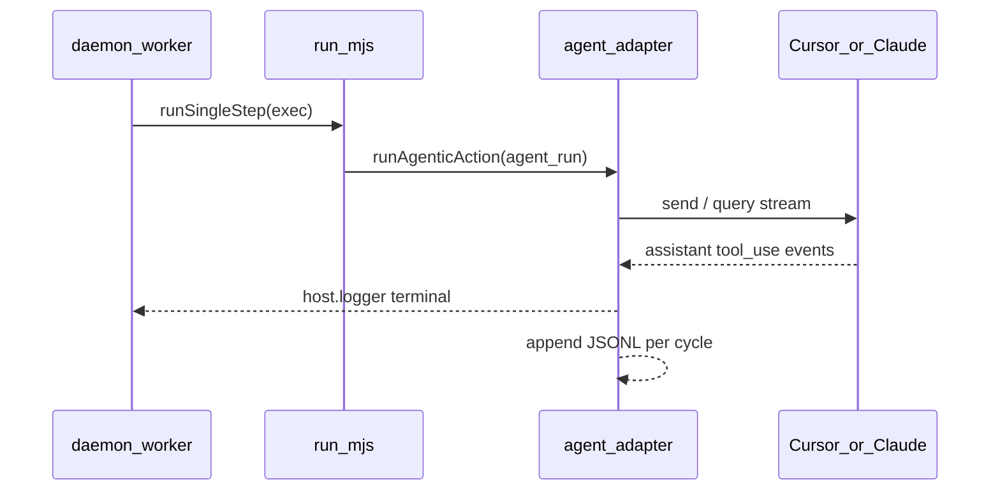

# agent_run 可观测：从 exec 黑盒到终端实时日志与 JSONL 落盘

> 日期：2026-05-31  
> 项目：js-evolution-agent  
> 类型：问题排查 / 功能实现  
> 来源：Cursor Agent 对话（daemon exec hang 排查 → 监控需求收敛 → 实施 → JSONL 补全）

---

## 目录

1. [背景与动机](#1-背景与动机)
2. [分析过程](#2-分析过程)
3. [方案设计](#3-方案设计)
4. [实现要点](#4-实现要点)
5. [验证与测试](#5-验证与测试)
6. [后续演化](#6-后续演化)
7. [附：本轮对话问题—思考—方案—执行对照](#附本轮对话问题思考方案执行对照)

---

## 1. 背景与动机

在 `agentank-tank` 上跑 daemon 持续演化时，操作者多次遇到 **exec 阶段长时间无进展**：终端停在 `[exec] executing decision … type=agent_run`，`run.mjs` 子进程 CPU 很低、无子进程，也没有 `Decision completed` 或 `exec.json`。

真正的问题不是「daemon 又坏了」（此前 tick / reconcile 韧性已单独修过）。

真正的问题是：**Phase 2 把 `agent_run` 委托给 Cursor / Claude Code SDK 后，宿主侧几乎看不到 agent 在做什么**。hang 时无法判断是卡在哪个 tool、哪一轮 verify，还是 SDK 本身无响应。

操作者诉求很明确：

- 不要第一版就上统一事件平台、viewer SSE、自动 cancel；
- **只要在 `agent_run` 执行期间**，在 daemon 终端看到 tool 调用、assistant 片段、run_id、耗时；
- 事后能回顾，而不是只靠当时终端 scrollback。

---

## 2. 分析过程

### 2.1 hang 时的观测链

| 层级 | 能看到什么 | 盲区 |
| --- | --- | --- |
| daemon `[exec]` | decision id、action type | 无 agent 内部步骤 |
| [`runCursorSdk`](../../src/actions/agent-adapter.mjs) | 仅 `send()` → `wait()` | **未消费 `run.stream()`** |
| exec checkpoint | 跑完后 `run_results`、receipt | 运行中无增量 |
| evolution viewer | 轮次/report/diary | 无 live agent tool 流 |

同 provider 成功 run 的 receipt 里 `duration_ms` 约 26s～292s；失败 hang 约 40 分钟无产出，说明 **阻塞在 SDK 调用链内**，外部完全盲区。

### 2.2 stdio 路径已满足终端输出

[`runCycleProcess`](../../src/cli/commands/evolve.mjs) 对 `run.mjs` 使用 `stdio: ['ignore','pipe','pipe']`，并把 stdout/stderr **写回父进程**。因此 [`oada.config.mjs`](../../oada.config.mjs) 的 `consoleLogger` 会出现在 `jea daemon start` 终端，**无需改 daemon** 即可看到 agent 明细。

### 2.3 需求收敛（v1 边界）

| 要做 | 不做（v1） |
| --- | --- |
| Cursor + Claude stream/loop 日志 | viewer SSE、daemon-projection |
| `llm_only` 起止 + 耗时 | 超时自动 cancel |
| 优先改 [`agent-adapter.mjs`](../../src/actions/agent-adapter.mjs) | 改 `js-evolution-engine` ExecutionPipeline |
| JSONL 落盘（Phase 6 补全） | 改 `run.mjs` 强制 exit |

---

## 3. 方案设计

### 3.1 数据流



### 3.2 关键决策

| 决策 | 选择 | 理由 |
| --- | --- | --- |
| 改动面 | [`agent-adapter.mjs`](../../src/actions/agent-adapter.mjs) + 小模块 [`agent-run-log.mjs`](../../src/actions/agent-run-log.mjs) | 所有 provider 入口集中，不扩散到 daemon/viewer |
| Cursor 并发模型 | `Promise.all([run.wait(), consume(stream)])` | 与 SDK 推荐用法一致；hang 时至少保留最后一条 stream 日志 |
| Claude 日志点 | 现有 `for await (query)` 循环内 | messages 已在收集，只缺输出 |
| 终端 vs 文件 | 同一 `logAgentRun()` 双写 | 避免两套格式漂移 |
| JSONL 路径 | `data/evolution/agent-runs/<cycle-id>.jsonl` | 与 evolution 数据同域，按 cycle 回顾 |
| cycle_id 解析 | `JEA_CYCLE_ID` → `action.cycle_id` → `ctx.cycleId` | daemon step 模式有真实 evolution cycle |
| 关闭开关 | `JEA_AGENT_RUN_LOG=0` 全关；`JEA_AGENT_RUN_JSONL=0` 仅关文件 | CI/本地可分别控制 |

### 3.3 日志事件（终端与 JSONL 一致）

| event | 含义 |
| --- | --- |
| `provider_start` / `provider_finished` | 整次 agent 执行起止 |
| `turn_start` / `turn_finished` | 每轮 prompt（initial / verify-N） |
| `run_id` | Cursor run id |
| `tool_call` | tool 名 + input 摘要 |
| `assistant_text` | assistant 文本摘要 |
| `result` | Claude session_id / subtype |
| `jsonl_path` | 落盘路径（仅终端，避免 JSONL 自引用） |

默认截断：assistant 200 字符、tool input 120 字符；`JEA_AGENT_RUN_VERBOSE=1` 输出全文。

---

## 4. 实现要点

### 4.1 文件结构

```
src/actions/
├── agent-adapter.mjs      # logAgentRun、stream 消费、三 provider 埋点
└── agent-run-log.mjs      # JSONL 路径解析与 append

runtime/subjects/<namespace>/data/evolution/agent-runs/
└── <cycle-id>.jsonl       # 运行时追加，每行一条 JSON
```

### 4.2 关键模块

| 文件 | 职责 |
| --- | --- |
| [`agent-adapter.mjs`](../../src/actions/agent-adapter.mjs) | `logAgentRun`、`consumeCursorRunStream`、`logClaudeAssistantMessage`；`runCursorSdk.sendTurn` 并行 wait+stream；`withAgentRunLogMeta` 绑定 cycle/action |
| [`agent-run-log.mjs`](../../src/actions/agent-run-log.mjs) | `resolveAgentRunCycleId`、`resolveAgentRunLogPath`、`appendAgentRunLogRecord` |
| [`test/actions.test.mjs`](../../test/actions.test.mjs) | mock `run.stream()`、logger spy、JSONL 断言 |
| [`test/agent-run-log.test.mjs`](../../test/agent-run-log.test.mjs) | JSONL 模块单元测试 |

### 4.3 JSONL 行示例

```json
{"ts":"2026-05-31T07:00:00.000Z","provider":"cursor_sdk","event":"tool_call","level":"info","cycle_id":"cycle-20260531055438-bd5013c2","action_id":null,"action_type":"agent_run","name":"Read","input":"{\"path\":\"src/index.mjs\"}"}
```

### 4.4 环境变量

| 变量 | 默认 | 作用 |
| --- | --- | --- |
| `JEA_AGENT_RUN_LOG` | 开启 | `0` 关闭终端 + JSONL |
| `JEA_AGENT_RUN_JSONL` | 开启 | `0` 仅关闭 JSONL |
| `JEA_AGENT_RUN_VERBOSE` | 关闭 | `1` 完整 assistant / tool input |

### 4.5 事后查看命令

```powershell
# 按 cycle 查看
Get-Content runtime/subjects/<namespace>/data/evolution/agent-runs/cycle-xxx.jsonl

# exec 运行中 tail
Get-Content runtime/subjects/<namespace>/data/evolution/agent-runs/cycle-xxx.jsonl -Wait
```

---

## 5. 验证与测试

```powershell
npm test -- test/actions.test.mjs test/agent-run-log.test.mjs
```

| 项 | 结果 |
| --- | --- |
| 测试文件 | 2 passed |
| 用例数 | 105 passed |
| Cursor | logger 含 `[agent:cursor]`、`run_id`、`tool_call`；JSONL 含同 event |
| Claude | logger 含 `[agent:claude]`、`tool_call`、`assistant_text` |
| `JEA_AGENT_RUN_LOG=0` | 无 terminal、无 JSONL |
| `JEA_AGENT_RUN_JSONL=0` | 有 terminal、无 JSONL 文件 |

**未在本机 journal 写作时验证**：真实 `JEA_AGENT_PROVIDER=cursor_sdk` 长时 hang 下最后一条 stream 是否足够定位（依赖现场 Cursor SDK 行为）。

---

## 6. 后续演化

| 方向 | 说明 |
| --- | --- |
| evolution viewer | 读取 `agent-runs/*.jsonl` 做 cycle 内 agent 时间线（live serve） |
| 超时 cancel | hang 超过阈值 abort SDK run，需与审批策略联动 |
| retention | agent-runs 目录按天/按条数清理，避免无限增长 |
| exec cycle id | `ActionExecutor.cycleId` 为 `exec-*` 前缀；daemon step 下 `JEA_CYCLE_ID` 优先，文档可在 AGENTS.md 补一句 |
| hang 根因 | 可观测性解决「看见」；SDK 不退出 / 进程僵死仍依赖 daemon watchdog 与 reconcile |

---

## 附：本轮对话问题—思考—方案—执行对照

| 阶段 | 内容 |
| --- | --- |
| 问题 | daemon exec 跑 `agent_run` 长时间 hang，终端只见 `[exec] executing`，看不见 Cursor/Claude 在做什么；事后也无法回放 stream 明细 |
| 思考 | 根因在 `runCursorSdk` 只 `wait()` 不消费 `stream()`；daemon stdio 已转发，改 adapter 即可达终端；receipt/exec.json 只有跑完后的摘要 |
| 方案 | v1：`agent-adapter` 统一 `logAgentRun` + Cursor 并行 stream + Claude loop 日志 + `llm_only` 起止；Phase 6 补 JSONL 至 `data/evolution/agent-runs/<cycle>.jsonl` |
| 执行 | 实现 [`agent-adapter.mjs`](../../src/actions/agent-adapter.mjs)、[`agent-run-log.mjs`](../../src/actions/agent-run-log.mjs)；扩展测试 105 通过；刻意未做 viewer/cancel/run.mjs exit |
