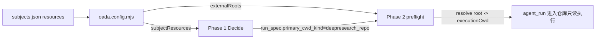

# 给只读主体接一个外部仓库：配置只是"开门"，真正难的是让它"愿意进门"

> 日期：2026-05-31
> 项目：js-evolution-agent
> 类型：功能实现 / 调研分析
> 来源：Cursor Agent 对话

---

## 目录

1. [背景与动机](#1-背景与动机)
2. [分析过程](#2-分析过程)
3. [方案设计](#3-方案设计)
4. [实现要点](#4-实现要点)
5. [验证与测试](#5-验证与测试)
6. [后续演化](#6-后续演化)

---

## 1. 背景与动机

需求很朴素：把本地的 `js-deepresearch-agent` 仓库，作为一个**资源**挂给 `ai-researcher` 主体，让它在演化过程中能去读、去对比这个仓库的调研方法学。

但 `ai-researcher` 是个特殊主体：

- 它是 `read_only`、**无 lane** 的情报调研员（见 [`policies/subjects/ai-researcher.md`](../../policies/subjects/ai-researcher.md)）。
- 它的本职是 web 搜索 + `record_observation` 落盘，从不碰外部代码仓库。

所以问题不是"能不能配一个资源"，而是两个更尖锐的问题：

1. 这个系统里"资源"到底是什么抽象？只读主体怎么合法地读一个外部 repo？
2. **配好资源之后，daemon 进化流程会不会真的去用它？** 还是说它会静静躺在配置里，永远不被触发？

第二个问题才是关键。很多人配完资源就以为完事了——但在一个由 LLM 自主决策（Decide）驱动的进化系统里，"可用"和"会用"是两回事。

## 2. 分析过程

### 2.1 资源是怎么被解析和消费的

顺着代码读了一遍资源的生命周期，落在 [`src/cli/utils/subjects.mjs`](../../src/cli/utils/subjects.mjs) 和 [`oada.config.mjs`](../../oada.config.mjs)：

资源配置的唯一机器可读入口是 [`policies/subjects.json`](../../policies/subjects.json) 的 `subjects.<name>.resources`，分四块：

| 字段 | 作用 | 关键约束 |
| --- | --- | --- |
| `items` | 资源清单 `id → {kind, handle, note, fallback}` | 只有 `repo`/`root` 能当"执行根"；`document` 不行 |
| `roots` | `scope名 → 资源id`，把资源域绑到一个根资源 | 根资源 handle 必须是本地绝对路径 |
| `aliases` | `别名scope → 目标scope` | 方便 Decide 用自然名引用 |
| `rules` | `[{kind, scope, patterns}]`，声明写边界归类 | **服务于写主体**，每条 scope 必须有 root |

数据流是这样的：



两条支路：

- `buildSubjectResourceSummary()` → `host.subjectResources`，注入 Phase 1 Decide 的 `subject_resources` 上下文，让 Decide **看得见**这个资源。
- `normalizeStructuredResourceRoots()` → `host.externalRoots`（`scope → 绝对路径`），Phase 2 执行时把 `primary_cwd_kind` 解析成真正的 `executionCwd`。若解析不到根，preflight 直接 block（`resource root could not be resolved`，见 [`src/actions/handlers.mjs`](../../src/actions/handlers.mjs) 第 407 行）。

### 2.2 真正的问题：可见 ≠ 会用

这是整次分析的转折点。

读 Decide prompt（[`src/intelligence/conversation-prompts.mjs`](../../src/intelligence/conversation-prompts.mjs) 第 228 行）发现，它对 `subject_resources` 的措辞是"**优先使用**声明的 resource id / root scope / alias"——这是"当你要定位资源时用规范命名"，**不是"每轮都要去碰每个资源"**。

再看 `ai-researcher` 当前的驱动信号：

- [`active_goals.json`](../../runtime/subjects/ai-researcher/data/goals/active_goals.json)：子目标 `agent-run-activation` 要求每轮做一次 web 搜索 + 入库。
- [`human_guidance.md`](../../runtime/subjects/ai-researcher/data/evolution/human_guidance.md)：角色定为"web 搜索 / 深度调研"。

两者都没提这个仓库。

> 真正的问题不是"资源配没配对"。
>
> 真正的问题是：在一个 Decide 由目标、指导、brief、信念共同驱动的系统里，如果没有任何信号给 Decide 一个"去读它"的理由，这个资源就会一直闲置。

所以结论是：**配资源是必要前置（打开门），但要让它被用起来，必须额外给 Decide 一个动机。**

## 3. 方案设计

最终方案分两层：**配置资源（开门）+ 给动机（让它进门）**。动机这一层，和用户确认后采用"长期 guidance + 一轮 brief 试跑"的组合。

### 关键决策

| 决策 | 选择 | 理由 |
| --- | --- | --- |
| 资源 kind | `repo` | 只有 `repo`/`root` 能当执行根，被解析为 `primary_cwd_kind`；`document` 读不进去 |
| 要不要加 `rules` | 不加 | rules 服务于写边界/pattern 归类，只读引用不需要，且会要求配套 root、可能与 markdown 冲突 |
| 机器字段放哪 | 只放 `subjects.json` | markdown 里再写 `Repo:`/`resource_scope=` 会触发 `diagnoseSubjectRuntimeConfig` 的一致性 warning |
| 使用动机 | 长期 guidance + 单轮 brief | guidance 给稳定动机但不强制；brief 单轮快速验证链路通不通 |
| 不动 goals 树 | 暂不加子目标 | 先用最轻的方式验证，避免过早把外部仓库"硬"绑进目标结构 |
| 安全边界 | `read_only` + 明确"禁止写入" | 当前 provider 无文件系统硬隔离，靠 profile + 预检 + 行为协议约束 |

被否定的备选：

- **直接写 `pending_decisions.json`**：绕过 Decide，破坏 OADA 闭环，AGENTS.md 明令不建议。
- **只配资源不给动机**：分析已证明会闲置。
- **一上来就改 goals 树**：太"硬"，且未验证链路前不宜固化。

## 4. 实现要点

### 关键改动

| 文件 | 改动 | 解决什么 |
| --- | --- | --- |
| [`policies/subjects.json`](../../policies/subjects.json) | `ai-researcher` 下加 `resources` 块：item `deepresearch_repo`（kind=repo，绝对路径 handle，带 note/fallback）+ root scope + alias `deepresearch` | 让资源可解析、可作 `primary_cwd_kind` |
| [`policies/subjects/ai-researcher.md`](../../policies/subjects/ai-researcher.md) | `Runtime Boundary Model` 声明只读外部资源：可读不可写，写入仍限 runtime | 语义层说明边界，机器字段不重复 |
| [`human_guidance.md`](../../runtime/subjects/ai-researcher/data/evolution/human_guidance.md) | `## Current` 加一条：可 `read_only` 分析该仓库作交叉印证、严禁写入、按字段约定落盘、非每轮必用 | 给 Decide 稳定但不强制的动机 |

资源块核心配置：

```json
"resources": {
  "items": {
    "deepresearch_repo": {
      "kind": "repo",
      "handle": "D:\\github\\my\\js-deepresearch-agent",
      "note": "只读参考仓库：js-deepresearch 的代码、AGENTS.md/README、results 等，供调研方法学与产出交叉印证。",
      "fallback": "无法访问时跳过该资源，仅用公开网络与本主体情报库继续调研。"
    }
  },
  "roots": { "deepresearch_repo": "deepresearch_repo" },
  "aliases": { "deepresearch": "deepresearch_repo" }
}
```

## 5. 验证与测试

### 配置校验

```bash
npm run jea -- subject check --subject ai-researcher   # ok: true
npm run jea -- doctor                                   # healthy；DEEPSEEK_API_KEY set
```

### 试跑 brief

```bash
# 通过 stdin 投放单轮意图 brief
cat brief.json | npm run jea -- intel brief put --stdin
npm run jea -- intel brief list        # 确认入队
npm run jea -- intel brief processed   # 确认被消费
```

### 端到端：daemon 自然消费

验证时发现已有 daemon worker（pid=22712，continuous 模式）在跑该主体，所以前台 `jea run` 会因抢锁失败——正确做法是让 daemon 在下一轮 intel step 自然消费 brief，然后观测产物。

`cycle-20260531111038-1bc0c330` 的链路证据：

| 阶段 | 证据 |
| --- | --- |
| brief 消费 | `outcome=consumed_with_decisions`，已归档 `processed/` |
| Decide 产出 | 决策 `:0` = `agent_run`（`primary_cwd_kind: deepresearch_repo`，read_only），决策 `:1` = `record_observation`（source=deepresearch_repo） |
| 根解析 | `primary_cwd: D:\github\my\js-deepresearch-agent`，`root_resolution_source: resourceRoots.deepresearch_repo`（**非** default_fallback） |
| exec 回执 | `success: true` / `acceptance_status: passed` / `execution_root: D:\github\my\js-deepresearch-agent` / `root_mismatch: null` |

也就是说：**资源被正确解析、Decide 主动选用、preflight 放行、agent 只读进入仓库并通过验收，未被拦截。** 第二个核心问题（会不会真用）得到了肯定回答——前提是有动机驱动。

### 未验证 / 需注意

- `daemon status` 里有一条历史 `failed` 任务（task-d48b6754），是我中途尝试前台 `jea run` 与 daemon 抢锁产生的，纯审计保留、不影响健康（`ok=true`）；可用 `jea daemon tasks acknowledge` 清理提示。
- 本次只验证了**一轮**（brief 驱动）。长期 guidance 是否能稳定让 Decide 周期性碰这个仓库，需要观察后续多轮——因为 guidance 是参考性的，不强制。

## 6. 后续演化

- **观察 guidance 的实际拉动力**：连续看几轮 Decide 是否在没有 brief 的情况下仍主动选用 `deepresearch_repo`。如果几乎不碰，说明参考性动机太弱。
- **需要更"硬"时再上目标**：用 `jea goals patch` 加一个"方法学对比"子目标，把读取该仓库纳入 good_signal，让每轮有稳定的目标压力。
- **资源能力可复用**：这套"item + roots + alias，read_only profile，不加 rules"的模式，可作为给任何只读主体接外部参考仓库的模板。
- **写入边界仍是软约束**：当前靠 `read_only` + 预检 + 行为协议，没有文件系统级硬隔离。若未来要接敏感仓库，需评估 provider 层的硬隔离。

---

## 附：本轮对话问题—思考—方案—执行对照

| 阶段 | 内容 |
| --- | --- |
| 问题 | 把 `js-deepresearch-agent` 作为只读资源挂给 `ai-researcher`，且要确认 daemon 进化流程会真的用它 |
| 思考 | 资源经 `subjects.json` → `oada.config.mjs` 注入 Decide 上下文与 externalRoots；但"可见 ≠ 会用"——Decide 受目标/指导/brief 驱动，当前信号全指向 web 搜索，资源会闲置 |
| 方案 | 配只读资源（item+roots+alias，不加 rules）+ 长期 guidance 给动机 + 单轮 brief 试跑；机器字段只放 subjects.json |
| 执行 | 改 3 个文件；`subject check` ok；daemon 自然消费 brief，`cycle-20260531111038` 的 exec 回执确认 agent 以 `deepresearch_repo` 为根只读执行、acceptance passed、未 block |
