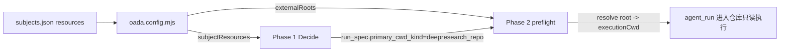

# 给只读主体接一个外部仓库：从"只读参考"到"工具型资源"的两步走

> 日期：2026-05-31
> 项目：js-evolution-agent
> 类型：功能实现 / 调研分析
> 来源：Cursor Agent 对话

> 更新说明：本文最初记录的是把 `js-deepresearch-agent` 配成**只读参考资源**（第 1–6 节）。但只读跑通后产出价值不及预期，于是又做了 **Route A：把它升级成"工具型资源"**，让主体能在边界内直接运行调研工具（第 7–9 节）。两段一起读，才是完整的演进。

---

## 目录

1. [背景与动机](#1-背景与动机)
2. [分析过程](#2-分析过程)
3. [方案设计](#3-方案设计)
4. [实现要点](#4-实现要点)
5. [验证与测试](#5-验证与测试)
6. [后续演化（只读阶段）](#6-后续演化只读阶段)
7. [转折：只读跑通了，却被判"差"](#7-转折只读跑通了却被判差)
8. [Route A：把资源升级成工具](#8-route-a把资源升级成工具)
9. [Route A 的端到端验证](#9-route-a-的端到端验证)

---

## 1. 背景与动机

需求很朴素：把本地的 `js-deepresearch-agent` 仓库，作为一个**资源**挂给 `ai-researcher` 主体，让它在演化过程中能去读、去对比这个仓库的调研方法学。

但 `ai-researcher` 是个特殊主体：

- 它是 `read_only`、**无 lane** 的情报调研员（见 [`policies/subjects/ai-researcher.md`](../../policies/subjects/ai-researcher.md)）。
- 它的本职是 web 搜索 + `record_observation` 落盘，从不碰外部代码仓库。

所以问题不是"能不能配一个资源"，而是两个更尖锐的问题：

1. 这个系统里"资源"到底是什么抽象？只读主体怎么合法地读一个外部 repo？
2. **配好资源之后，daemon 进化流程会不会真的去用它？** 还是说它会静静躺在配置里，永远不被触发？

第二个问题才是关键。很多人配完资源就以为完事了——但在一个由 LLM 自主决策（Decide）驱动的进化系统里，"可用"和"会用"是两回事。

## 2. 分析过程

### 2.1 资源是怎么被解析和消费的

顺着代码读了一遍资源的生命周期，落在 [`src/cli/utils/subjects.mjs`](../../src/cli/utils/subjects.mjs) 和 [`oada.config.mjs`](../../oada.config.mjs)：

资源配置的唯一机器可读入口是 [`policies/subjects.json`](../../policies/subjects.json) 的 `subjects.<name>.resources`，分四块：

| 字段 | 作用 | 关键约束 |
| --- | --- | --- |
| `items` | 资源清单 `id → {kind, handle, note, fallback}` | 只有 `repo`/`root` 能当"执行根"；`document` 不行 |
| `roots` | `scope名 → 资源id`，把资源域绑到一个根资源 | 根资源 handle 必须是本地绝对路径 |
| `aliases` | `别名scope → 目标scope` | 方便 Decide 用自然名引用 |
| `rules` | `[{kind, scope, patterns}]`，声明写边界归类 | **服务于写主体**，每条 scope 必须有 root |

数据流是这样的：



两条支路：

- `buildSubjectResourceSummary()` → `host.subjectResources`，注入 Phase 1 Decide 的 `subject_resources` 上下文，让 Decide **看得见**这个资源。
- `normalizeStructuredResourceRoots()` → `host.externalRoots`（`scope → 绝对路径`），Phase 2 执行时把 `primary_cwd_kind` 解析成真正的 `executionCwd`。若解析不到根，preflight 直接 block（`resource root could not be resolved`，见 [`src/actions/handlers.mjs`](../../src/actions/handlers.mjs) 第 407 行）。

### 2.2 真正的问题：可见 ≠ 会用

这是整次分析的转折点。

读 Decide prompt（[`src/intelligence/conversation-prompts.mjs`](../../src/intelligence/conversation-prompts.mjs) 第 228 行）发现，它对 `subject_resources` 的措辞是"**优先使用**声明的 resource id / root scope / alias"——这是"当你要定位资源时用规范命名"，**不是"每轮都要去碰每个资源"**。

再看 `ai-researcher` 当前的驱动信号：

- [`active_goals.json`](../../runtime/subjects/ai-researcher/data/goals/active_goals.json)：子目标 `agent-run-activation` 要求每轮做一次 web 搜索 + 入库。
- [`human_guidance.md`](../../runtime/subjects/ai-researcher/data/evolution/human_guidance.md)：角色定为"web 搜索 / 深度调研"。

两者都没提这个仓库。

> 真正的问题不是"资源配没配对"。
>
> 真正的问题是：在一个 Decide 由目标、指导、brief、信念共同驱动的系统里，如果没有任何信号给 Decide 一个"去读它"的理由，这个资源就会一直闲置。

所以结论是：**配资源是必要前置（打开门），但要让它被用起来，必须额外给 Decide 一个动机。**

## 3. 方案设计

最终方案分两层：**配置资源（开门）+ 给动机（让它进门）**。动机这一层，和用户确认后采用"长期 guidance + 一轮 brief 试跑"的组合。

### 关键决策

| 决策 | 选择 | 理由 |
| --- | --- | --- |
| 资源 kind | `repo` | 只有 `repo`/`root` 能当执行根，被解析为 `primary_cwd_kind`；`document` 读不进去 |
| 要不要加 `rules` | 不加 | rules 服务于写边界/pattern 归类，只读引用不需要，且会要求配套 root、可能与 markdown 冲突 |
| 机器字段放哪 | 只放 `subjects.json` | markdown 里再写 `Repo:`/`resource_scope=` 会触发 `diagnoseSubjectRuntimeConfig` 的一致性 warning |
| 使用动机 | 长期 guidance + 单轮 brief | guidance 给稳定动机但不强制；brief 单轮快速验证链路通不通 |
| 不动 goals 树 | 暂不加子目标 | 先用最轻的方式验证，避免过早把外部仓库"硬"绑进目标结构 |
| 安全边界 | `read_only` + 明确"禁止写入" | 当前 provider 无文件系统硬隔离，靠 profile + 预检 + 行为协议约束 |

被否定的备选：

- **直接写 `pending_decisions.json`**：绕过 Decide，破坏 OADA 闭环，AGENTS.md 明令不建议。
- **只配资源不给动机**：分析已证明会闲置。
- **一上来就改 goals 树**：太"硬"，且未验证链路前不宜固化。

## 4. 实现要点

### 关键改动

| 文件 | 改动 | 解决什么 |
| --- | --- | --- |
| [`policies/subjects.json`](../../policies/subjects.json) | `ai-researcher` 下加 `resources` 块：item `deepresearch_repo`（kind=repo，绝对路径 handle，带 note/fallback）+ root scope + alias `deepresearch` | 让资源可解析、可作 `primary_cwd_kind` |
| [`policies/subjects/ai-researcher.md`](../../policies/subjects/ai-researcher.md) | `Runtime Boundary Model` 声明只读外部资源：可读不可写，写入仍限 runtime | 语义层说明边界，机器字段不重复 |
| [`human_guidance.md`](../../runtime/subjects/ai-researcher/data/evolution/human_guidance.md) | `## Current` 加一条：可 `read_only` 分析该仓库作交叉印证、严禁写入、按字段约定落盘、非每轮必用 | 给 Decide 稳定但不强制的动机 |

资源块核心配置：

```json
"resources": {
  "items": {
    "deepresearch_repo": {
      "kind": "repo",
      "handle": "D:\\github\\my\\js-deepresearch-agent",
      "note": "只读参考仓库：js-deepresearch 的代码、AGENTS.md/README、results 等，供调研方法学与产出交叉印证。",
      "fallback": "无法访问时跳过该资源，仅用公开网络与本主体情报库继续调研。"
    }
  },
  "roots": { "deepresearch_repo": "deepresearch_repo" },
  "aliases": { "deepresearch": "deepresearch_repo" }
}
```

## 5. 验证与测试

### 配置校验

```bash
npm run jea -- subject check --subject ai-researcher   # ok: true
npm run jea -- doctor                                   # healthy；DEEPSEEK_API_KEY set
```

### 试跑 brief

```bash
# 通过 stdin 投放单轮意图 brief
cat brief.json | npm run jea -- intel brief put --stdin
npm run jea -- intel brief list        # 确认入队
npm run jea -- intel brief processed   # 确认被消费
```

### 端到端：daemon 自然消费

验证时发现已有 daemon worker（pid=22712，continuous 模式）在跑该主体，所以前台 `jea run` 会因抢锁失败——正确做法是让 daemon 在下一轮 intel step 自然消费 brief，然后观测产物。

`cycle-20260531111038-1bc0c330` 的链路证据：

| 阶段 | 证据 |
| --- | --- |
| brief 消费 | `outcome=consumed_with_decisions`，已归档 `processed/` |
| Decide 产出 | 决策 `:0` = `agent_run`（`primary_cwd_kind: deepresearch_repo`，read_only），决策 `:1` = `record_observation`（source=deepresearch_repo） |
| 根解析 | `primary_cwd: D:\github\my\js-deepresearch-agent`，`root_resolution_source: resourceRoots.deepresearch_repo`（**非** default_fallback） |
| exec 回执 | `success: true` / `acceptance_status: passed` / `execution_root: D:\github\my\js-deepresearch-agent` / `root_mismatch: null` |

也就是说：**资源被正确解析、Decide 主动选用、preflight 放行、agent 只读进入仓库并通过验收，未被拦截。** 第二个核心问题（会不会真用）得到了肯定回答——前提是有动机驱动。

### 未验证 / 需注意

- `daemon status` 里有一条历史 `failed` 任务（task-d48b6754），是我中途尝试前台 `jea run` 与 daemon 抢锁产生的，纯审计保留、不影响健康（`ok=true`）；可用 `jea daemon tasks acknowledge` 清理提示。
- 本次只验证了**一轮**（brief 驱动）。长期 guidance 是否能稳定让 Decide 周期性碰这个仓库，需要观察后续多轮——因为 guidance 是参考性的，不强制。

## 6. 后续演化（只读阶段）

- **观察 guidance 的实际拉动力**：连续看几轮 Decide 是否在没有 brief 的情况下仍主动选用 `deepresearch_repo`。如果几乎不碰，说明参考性动机太弱。
- **需要更"硬"时再上目标**：用 `jea goals patch` 加一个"方法学对比"子目标，把读取该仓库纳入 good_signal，让每轮有稳定的目标压力。
- **资源能力可复用**：这套"item + roots + alias，read_only profile，不加 rules"的模式，可作为给任何只读主体接外部参考仓库的模板。
- **写入边界仍是软约束**：当前靠 `read_only` + 预检 + 行为协议，没有文件系统级硬隔离。若未来要接敏感仓库，需评估 provider 层的硬隔离。

---

## 7. 转折：只读跑通了，却被判"差"

只读链路技术上完全成功——资源被解析、Decide 主动选用、agent 进入仓库、acceptance passed。但复盘那一轮的实际产出时，发现一个尴尬的事实：

> 链路通了，价值没出来。

问题出在两处错位：

1. **意图和目标错位**。那条 brief 想做的是"方法学对比"，而 `ai-researcher` 的核心目标是"外部 web 搜索采集 AI 前沿情报"。Decide 虽然跑了 `agent_run` 进仓库读源码，但这件事不在任何 good_signal 上。
2. **`record_observation` 预填了占位**。Decide 在调度时把 `record_observation` 的内容写成了占位模板，`agent_run` 真正读到的方法学分析反而没有被结构化落盘。一轮下来，宝贵的分析被一句占位抹平。

后果更糟：goals calibrate 把这次"读源码但没产出"判为偏离，反而**强化了"`deepresearch_repo` 不算外部搜索有效 scope"的排除规则**。只读模式越跑，目标树越排斥它。

这就是转折点：

> 真正的问题不是"能不能读这个仓库"，而是"读它到底算什么"。
>
> 把一个**调研工具**当成**参考文档**来读，本身就用错了姿势。`js-deepresearch-agent` 的价值不在它的源码，而在它能跑出一份带 12 条来源的研究报告。

所以方向从"读资源"转向"用工具"——这就是 Route A。

## 8. Route A：把资源升级成工具

核心目标：建立一套可复用的**"工具型资源"范式**。资源默认只读，但当 policy / goals / guidance / belief 明确允许时，可由 `agent_run` 直接进入资源根、以 `workspace_write` 执行受限工具命令，再读取产物沉积为情报。

关键约束想清楚了一件事：

> `resources` 永远只负责 root 解析，它不会自己变成工具。工具化必须靠四件套：`agent_run` 的 `workspace_write` + policy 能力声明 + 目标/指导里的触发条件 + 明确的验收契约。

而且这次特别强调：**不只限于 operator brief 驱动**。brief 只是首轮试跑入口，长期要让主体在自身目标和边界内自主调度。

### 关键决策

| 决策 | 选择 | 理由 |
| --- | --- | --- |
| 升级路线 | Route A（agent_run 直接跑工具） | 比做 configured external action 快；先验证链路，不稳再收敛成固定命令契约 |
| 权限边界 | 仅对该资源开 `workspace_write` | 作为 `ai-researcher` 默认 `read_only` 的**唯一例外**，写在 policy 里 |
| 写入范围 | 只允许 `work_dir/**`、`results/**` | 工具产物目录；源码/配置/git/发布一律禁止 |
| 不和外部搜索混用 | 新增独立子目标 `deepresearch-assisted-research` | 避免重蹈只读阶段被 `agent-run-activation` 判违规的覆辙 |
| 触发方式 | brief 首轮试跑 + 目标/信念自主触发 | 不依赖一次性人工 brief，长期靠目标拉动 |
| 不加 lane | 不变成目标项目 worktree | 它是工具执行根，不是要改写的目标仓库 |

被否定的备选：

- **继续在只读模式打补丁**：分析已证明姿势错了，读源码本就不是它的价值所在。
- **直接上 configured external action**：更稳但更慢；边界先用 Route A 跑通，不稳再收敛。
- **复用 `agent-run-activation` 目标**：会和外部搜索 quota 抢占、再次触发违规判定。

### 关键改动

| 文件 | 改动 | 解决什么 |
| --- | --- | --- |
| [`policies/subjects.json`](../../policies/subjects.json) | `deepresearch_repo` 的 `note/fallback` 从"只读参考仓库"改写为**工具型资源**语义：默认只读，允许时作受限执行根，写入仅限 `work_dir/**`/`results/**`，明确禁止源码/配置/git/发布/密钥 | 让资源注释本身承载工具化语义，可被其他 subject 复用 |
| [`policies/subjects/ai-researcher.md`](../../policies/subjects/ai-researcher.md) | 新增 `Deepresearch Tool Capability` 小节（`workspace_write` 禁令的唯一例外）；同步改 `Off-Limits` 和 `Runtime Boundary Model` | 在 policy 层授权并限定触发条件、权限、写入边界、receipt 要求 |
| [`human_guidance.md`](../../runtime/subjects/ai-researcher/data/evolution/human_guidance.md) | 把资源拆成**参考模式（只读）**和**工具模式（workspace_write）**，给出命令形态、产物消费契约、禁止占位、可自主触发但不替代每轮外部搜索 | 给 Decide 区分两种用法的稳定指导 |
| 目标树（`jea goals patch`） | 新增子目标 `deepresearch-assisted-research`，写入 `goal-events.jsonl` | 把工具化使用和外部搜索 quota 解耦 |

policy 里的能力声明是这次的核心，摘录要点：

```markdown
## Deepresearch Tool Capability
- 触发条件：目标/信念/guidance/brief 给出明确深度调研需求；不得为"覆盖资源"而跑
- 权限：agent_run，primary_cwd_kind=deepresearch_repo，permission_profile=workspace_write
- 允许写入：仅 work_dir/**、results/**
- 禁止：改 src/**、配置、git commit/push、发布、config set、读取/输出密钥
- 产物消费：跑完读 report.md/findings.json/sources.json/meta.json，再据真实产物落 observation，禁止占位
- receipt 要求：记录 execution_root、实际命令、产物路径、来源 URL 数量
```

## 9. Route A 的端到端验证

实施后投了一条 `tool_run_request` brief 验证链路（不直接写 `pending_decisions.json`），由 continuous daemon 在下一轮自然消费。`cycle-20260531134015-0bf30a98` 的完整证据：

| 验证点 | 结果 |
| --- | --- |
| `jea subject check` | `ok: true` |
| brief 消费 | `outcome=consumed_with_decisions`，已归档 `processed/` |
| Decide 决策 | `agent_run` + `primary_cwd_kind=deepresearch_repo` + `permission_profile=workspace_write`，`serves_goal=deepresearch-assisted-research`，`belief_relation=create_belief` |
| 实际执行 | `npm exec jdr -- research "...MCP、A2A、Connectors 对比分析" --strategy rapid --work-dir work_dir/jea-ai-researcher/cycle-20260531134015`；`execution_root=D:\github\my\js-deepresearch-agent`，`acceptance_status=passed`，`fallback_used=false` |
| artifact | `work_dir/jea-ai-researcher/cycle-20260531134015/rapid/2026-05-31_135046/` 下 `report.md`(4.6KB)/`findings.json`(6.4KB)/`sources.json`(5.7KB)/`meta.json` 全部生成，`sources_url_count=12` |
| 写入边界 | 只写 gitignored 的 `work_dir/**`；`git status` 里的 `src/cli.mjs`、`tmp/` 经 mtime 核对均早于本次运行，是既有改动，非本次造成 |
| 目标归属 | 归到 `deepresearch-assisted-research`，未被 `agent-run-activation` 判为外部搜索违规 |

也就是说，这次姿势对了：

> policy / 目标 / guidance / brief → Decide 生成 `workspace_write` 工具决策 → 真实跑 `jdr research` → 产出 artifact → 给出带真实外部来源 URL（a2a-protocol.org）的 `proposed_observation`。

复用命令：

```bash
npm run jea -- subject check --subject ai-researcher
npm run jea -- goals patch --file <patch.json> --reason "..." --subject ai-researcher
npm run jea -- intel brief put --file <brief.json> --subject ai-researcher
npm run jea -- intel brief processed --subject ai-researcher
# work_dir 被 gitignore，用 shell ls 而非 Glob 查看产物
```

### 未验证 / 需注意

- 本轮 `agent_run` 生成了 artifact 和 `proposed_observation` 候选，但 `record_observation` 真正入库是**下一轮**的后续动作（产物→读取→落盘），本轮 `writes.observations` 为空——符合设计，但"基于真实产物落盘、不写占位"这一步要看后续轮次。
- 只验证了 **brief 驱动的一轮**。"无 brief 时能否基于目标/信念自主触发"还需观察 2–3 轮；若不触发，再收紧 goal/guidance。
- 写入边界仍是软约束（`workspace_write` 下 agent 理论上能 Edit/Write 任意文件），靠 policy/guidance/预检约束，没有文件系统级硬隔离。

## 后续演化（工具阶段）

- **观察自主触发**：连续看几轮，确认 Decide 能在没有 brief 时基于 `deepresearch-assisted-research` 或信念测试自主调度工具。
- **确认产物→observation 闭环**：验证下一轮 `record_observation` 真的基于 artifact 内容、带外部 URL 落盘，而不是又写占位。
- **不稳则收敛为 configured external action**：若 `workspace_write` 边界不够稳，把它收敛成固定命令、固定参数、stdout/JSON 约定的外部 action。
- **范式复用**：这套"工具型资源 = 只读默认 + policy 能力声明 + 独立辅助目标 + workspace_write 限定写入"的模式，可作为给任何主体接可执行工具的模板。

---

## 附：本轮对话问题—思考—方案—执行对照

### 只读阶段

| 阶段 | 内容 |
| --- | --- |
| 问题 | 把 `js-deepresearch-agent` 作为只读资源挂给 `ai-researcher`，且要确认 daemon 进化流程会真的用它 |
| 思考 | 资源经 `subjects.json` → `oada.config.mjs` 注入 Decide 上下文与 externalRoots；但"可见 ≠ 会用"——Decide 受目标/指导/brief 驱动，当前信号全指向 web 搜索，资源会闲置 |
| 方案 | 配只读资源（item+roots+alias，不加 rules）+ 长期 guidance 给动机 + 单轮 brief 试跑；机器字段只放 subjects.json |
| 执行 | 改 3 个文件；`subject check` ok；daemon 自然消费 brief，`cycle-20260531111038` 的 exec 回执确认 agent 以 `deepresearch_repo` 为根只读执行、acceptance passed、未 block |

### 工具阶段（Route A）

| 阶段 | 内容 |
| --- | --- |
| 问题 | 只读跑通但产出被判"差"：姿势错了——把调研工具当参考文档读，还预填了占位 observation，反被目标校准排斥 |
| 思考 | `resources` 只解析 root，不会自己变工具；工具化需要 `workspace_write` + policy 能力声明 + 独立目标 + 验收契约；且要解耦外部搜索 quota，不能只靠一次性 brief |
| 方案 | Route A：资源升级为工具型；policy 开 `workspace_write` 唯一例外 + 写入仅限 `work_dir/**`；新增 `deepresearch-assisted-research` 子目标；guidance 区分参考/工具两模式 |
| 执行 | 改 subjects.json/policy/guidance + `goals patch` 加子目标；投 `tool_run_request` brief；`cycle-20260531134015` 验证：Decide 生成 workspace_write 工具决策、真实跑 `jdr research`、产出 4 个 artifact（12 来源）、未越界写入、归属正确子目标 |
