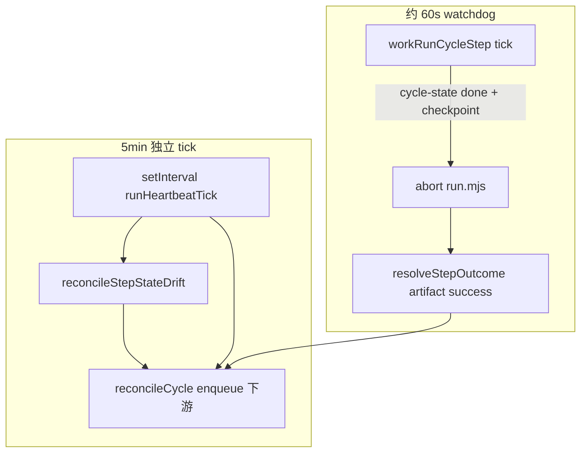

# Daemon Tick 韧性：产物为准、独立对账、不再假健康

> 日期：2026-05-31  
> 项目：js-evolution-agent  
> 类型：问题排查 / 架构设计 / 功能实现  
> 来源：Cursor Agent 对话（daemon 启动 → 卡住诊断 → 第一性原理方案 → 实施）

---

## 目录

1. [背景与动机](#1-背景与动机)
2. [分析过程](#2-分析过程)
3. [方案设计](#3-方案设计)
4. [实现要点](#4-实现要点)
5. [验证与测试](#5-验证与测试)
6. [后续演化](#6-后续演化)
7. [附：本轮对话问题—思考—方案—执行对照](#附本轮对话问题思考方案执行对照)

---

## 1. 背景与动机

操作者在 `agentank-tank` 主体上通过 `jea daemon start` 启动持续演化。worker 心跳正常、`jea daemon doctor` 报 healthy，但 open cycle 长时间停在 `exec=done、verify=pending`，演化像「卡住」了一样。

真正的问题不是 worker 死了，也不是 LLM 或 Decide 逻辑错了。

真正的问题是：**系统把「子进程退出」当成了「step 完成」**，而 `run.mjs` 在 exec checkpoint 写完后可能因 SDK 残留 handle 不退出；同时 **5 分钟 tick 绑在 `await workOnce()` 之前**，step 阻塞期间 reconcile 根本跑不到。heartbeat 续租让 doctor 误以为一切正常。

本次工作要在 **不改 `run.mjs` 强制 exit** 的前提下（操作者选定 daemon-only 范围），把 tick 变成可靠的保底时钟，并以 checkpoint 作为 step 完成的权威依据。

---

## 2. 分析过程

### 2.1 现场现象（`agentank-tank` runtime）

| 观测项 | 值 |
| --- | --- |
| Open cycle | `cycle-20260530212011-ab5a3ceb`，open ~6.5h |
| cycle-state | `intel/exec=done`，`verify` 及下游 `pending` |
| Daemon task | `task-edbd0473`（type=`exec`）仍为 `running`，lease 每 5min 续租 |
| 子进程 | `run.mjs` PID 14836 存活，无子进程，但 exec 约 3min 前已完成 |
| doctor | `healthy`（worker fresh + lease 有效） |

手动 `Stop-Process` 终止僵死 `run.mjs` 后，pipeline 快速推进到 verify → diary；exec task 被标为 `failed`（输出里已有 `JEA_STEP_RESULT ok:true`），说明 **产物成功路径尚未落地** 是待修点之一。

### 2.2 已有机制为何不够

| 机制 | 能做什么 | 本次为何失效 |
| --- | --- | --- |
| [`reconcileOpenCycles`](../../src/cli/utils/cycle-dispatch.mjs) + [`reconcileCycle`](../../src/cli/utils/cycle-reducer.mjs) | `exec=done` 时 enqueue verify | tick 在 step 阻塞时不执行 |
| [`findStuckSteps`](../../src/cli/utils/cycle-state.mjs) | cycle-state `running` 且无有效 lease | 本次 exec 在 state 已是 `done`，task 仍 `running` → **检测盲区** |
| watchdog lease renew | 证明 worker 还活着 | 不等于 cycle 在进展 |
| 单 worker `await runSingleStep` | 执行一步 | 阻塞期间无法 claim verify，也无法跑 tick |

### 2.3 对话中的方案收敛

1. **K8s 式思路**（controller / probe / Job 语义）→ 提炼为三条第一性原理：
   - 完成以 **产物** 为准，不以进程 exit 为准；
   - **调度（tick）** 不能被 **执行（step）** 拖住；
   - **健康 = 有进展**，不是有心跳。
2. **5 分钟 tick** 仍是系统对账主时钟：continuous 负责 reconcile + 自动开轮；on_demand 只做 reconcile + 消费已有 `cycle request`，long idle 不误报 stalled。
3. 刻意 **不改** [`run.mjs`](../../run.mjs) `process.exit(0)`，用 daemon 侧 watchdog + reconcile 双层防护。

---

## 3. 方案设计

### 3.1 双层恢复



| 路径 | 触发 | 作用 |
| --- | --- | --- |
| Fast | step watchdog（`heartbeat-ms`，默认 ~60s） | 产物已就绪则 abort 子进程，按 artifact 完成 task |
| Slow | 独立 `setInterval(tickMs)` | drift 修复、补 enqueue verify、continuous 开轮 / on_demand 消费 request |

### 3.2 关键决策

| 决策 | 选择 | 理由 |
| --- | --- | --- |
| tick 与 workOnce 关系 | `setInterval` 独立跑 tick，主循环只 workOnce | step hang 时 tick 仍能 reconcile |
| step 完成判定 | checkpoint + cycle-state，非仅 exit code | 复现 bug：exec.json 已有但进程不退出 |
| drift 定义 | cycle-state terminal + task `running` | 补齐 `findStuckSteps` 盲区 |
| 非零 exit 成功 | `resolveStepOutcome`：JEA_STEP_RESULT 或 checkpoint → complete | 避免 manual kill 误标 failed |
| 健康态 | 新增 `cycle_progress_stalled` + `drift_steps` | on_demand 无 open cycle 仍 idle/healthy |
| 开新轮 | stalled/drift → `stalled_open_cycle` | 避免 cycle 债务堆积 |
| run.mjs | **不改** | 操作者选定 daemon-only 范围 |

### 3.3 continuous vs on_demand（tick 分工）

| tick 行为 | continuous | on_demand |
| --- | --- | --- |
| reconcile / drift 修复 | 是 | 是 |
| 自动 `cycle request` | 是 | 否 |
| 消费 pending request | 是 | 是 |
| 无 open cycle long idle | 可能 `evolution_stalled` | **idle = healthy** |
| 有 open cycle 无进展 | `cycle_progress_stalled` | 同左 |

---

## 4. 实现要点

### 4.1 主要文件

| 文件 | 职责 |
| --- | --- |
| [`src/cli/commands/daemon.mjs`](../../src/cli/commands/daemon.mjs) | `runDaemonWorker` 独立 tick；`workRunCycleStep` watchdog abort + `resolveStepOutcome`；doctor 新增 drift/stalled 诊断 |
| [`src/cli/utils/cycle-state.mjs`](../../src/cli/utils/cycle-state.mjs) | `isStepArtifactComplete`、`findStepStateDrift`、`isCycleProgressStalled`；`summarizeCycleState.drift_steps` |
| [`src/cli/utils/cycle-dispatch.mjs`](../../src/cli/utils/cycle-dispatch.mjs) | `reconcileStepStateDrift`；`stalled_open_cycle` 开轮拦截；`buildCycleProjection` 带 root 汇总 drift |
| [`src/cli/utils/daemon-projection.mjs`](../../src/cli/utils/daemon-projection.mjs) | `cycle_progress_stalled` 健康态；`cycles.drift_steps` / `progress_stalled` |
| [`src/cli/commands/evolve.mjs`](../../src/cli/commands/evolve.mjs) | 导出 `resolveStepOutcome` |
| [`AGENTS.md`](../../AGENTS.md) | tick 独立、drift、stalled 语义 |

### 4.2 数据流（drift 修复）

1. tick 或 step 完成后调用 `reconcileOpenCycles`。
2. `findStepStateDrift`：terminal step + running task。
3. 若 `isStepArtifactComplete` → `completeTask({ source: 'artifact_reconcile' })`，emit `step_state_drift_resolved`。
4. `reconcileCycle` 照常 enqueue verify 等下游（幂等 idempotency key）。

### 4.3 观测字段（`jea daemon status --json`）

| 字段 | 含义 |
| --- | --- |
| `cycles.drift_steps[]` | state terminal 但 task running |
| `cycles.progress_stalled` | open cycle 无进展 |
| `health.status=cycle_progress_stalled` | 应介入，非 healthy |
| `cycles.stuck_steps[]` | 原有：state running 且无 lease（不变） |

---

## 5. 验证与测试

### 5.1 针对性单测（通过）

```powershell
npx vitest run test/cycle-state-dispatch.test.mjs test/daemon-step-outcome.test.mjs test/daemon-resilience.test.mjs test/cycle-start-requests.test.mjs test/cycle-checkpoint.test.mjs
```

覆盖场景：

- `findStepStateDrift`：done + valid lease 仍检出；
- reconcile drift → complete exec task + enqueue verify；
- `resolveStepOutcome`：非零 exit + JEA_STEP_RESULT / checkpoint → ok；
- `cycle_progress_stalled` 健康投影；
- on_demand idle 仍 healthy；
- `stalled_open_cycle` 阻止 consume cycle request。

### 5.2 全量测试

```powershell
npm test
```

438 测试中 436 通过。2 个失败与本次改动无直接关联：

- `test/actions.test.mjs` lane 初始化超时；
- `test/cycle-e2e.test.mjs` 临时目录缺 `CONSTITUTION.md`。

### 5.3 生产侧人工验证（对话中已做）

- 终止僵死 `run.mjs` 后 pipeline 恢复；
- 实施后 daemon 相关 40 项单测全部通过。

---

## 6. 后续演化

| 项 | 说明 |
| --- | --- |
| `run.mjs` 显式 exit | 根因层防护（cursor_sdk handle）；本次刻意未做，可按需加 |
| `cycle-e2e` 测试 | e2e 临时项目应复制 `policies/authority/`，避免 CONSTITUTION 缺失 |
| viewer | 在 evolution viewer 展示 `drift_steps` / `cycle_progress_stalled` |
| 并行 executor | 单 worker 仍串行 claim；tick 可 enqueue 但执行仍排队——若 exec 极长，可考虑 step 子进程与 worker 解耦 |

### 操作者常用命令

```powershell
npm run jea -- daemon status --json
npm run jea -- daemon doctor
npm run jea -- daemon events --limit 20
npm run jea -- daemon evolution-mode show
```

stalled 时：先等 1～2 个 watchdog 周期；仍无进展则 `daemon doctor` 看 `step_state_drift`，必要时 `daemon stop` 后重启 worker。

---

## 附：本轮对话问题—思考—方案—执行对照

| 阶段 | 内容 |
| --- | --- |
| **问题** | daemon 启动后 evolution 假死：exec 已完成但 verify 不进；doctor 仍 healthy |
| **思考** | 完成定义错误（等进程而非 checkpoint）；tick 被 workOnce 阻塞；stuck 检测只看 state=running |
| **方案** | 独立 5min tick + 产物为准 drift 修复 + 60s watchdog abort + progress stalled 健康态；on_demand tick 只 reconcile/消费 request |
| **执行** | 改 `daemon.mjs`、`cycle-state.mjs`、`cycle-dispatch.mjs`、`daemon-projection.mjs`、`evolve.mjs`、`AGENTS.md`；新增/扩展 5 个测试文件；40 项相关单测通过 |
