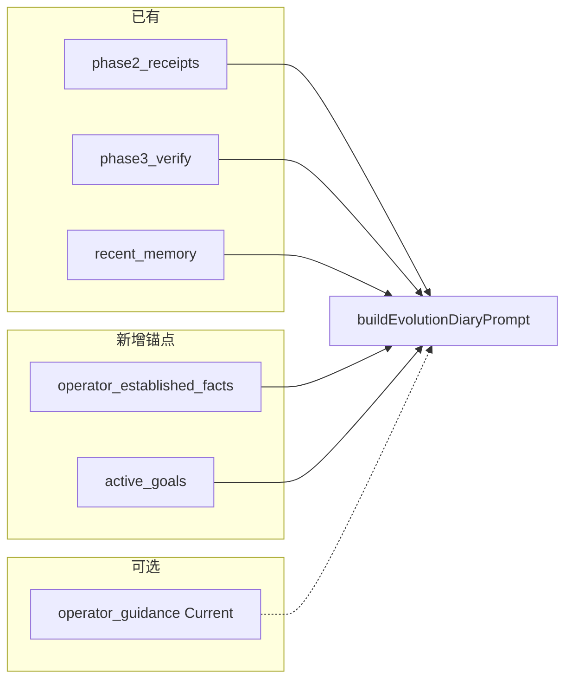

# 进化日记解读锚点：rank 读反不是幻觉，是上下文缺了两块砖

> 日期：2026-05-31  
> 项目：js-evolution-agent（典型主体 agentank-tank）  
> 类型：问题排查 / 功能实现  
> 来源：Cursor Agent 对话  

---

## 目录

1. [背景与动机](#1-背景与动机)
2. [分析过程](#2-分析过程)
3. [方案设计](#3-方案设计)
4. [实现要点](#4-实现要点)
5. [验证与测试](#5-验证与测试)
6. [后续演化](#6-后续演化)

---

## 1. 背景与动机

操作者在阅读一轮进化日记时发现「没有推进的地方」写错了 rank 方向：

| 现象 | 内容 |
| --- | --- |
| 数值 | 发布后 rank=2615，发布前 claim=2616 |
| 日记结论 | 「改善 -1 位（即恶化 1 位）」 |
| 操作者口径 | `standing.rank lower is better`（已通过 `operator_fact` 写入 intelligence store） |

同一篇日记前文又写过 `rank_delta = -1`，说明模型**部分**读到了 receipt，但在写「未达标」段落时用了裸算术 `2615 - 2616 = -1`，把负号当成「恶化」。

真正的问题不是「模型不够聪明」。

真正的问题是：**Phase 5 进化日记生成时，没有像 Phase 1 情报报告那样注入「怎么读数字」和「什么叫推进」的锚点**——operator fact 与 active goals 在 report/decide 管线里有，在 diary 管线里没有。

---

## 2. 分析过程

### 2.1 报告 vs 日记：上下文不对称

对比 [`gatherReportContext`](../../src/intelligence/report-builder.mjs) 与 [`buildEvolutionDiaryContext`](../../src/intelligence/evolution-diary-builder.mjs)：

| 上下文 | Phase 1 报告 | Phase 5 日记（改前） |
| --- | --- | --- |
| operator fact → Seen | ✅ `buildTemporalDecisionBrief` | ❌ |
| active_goals | ✅ | ❌ |
| human_guidance | ✅ | ❌ |
| phase 执行/验证产物 | 部分 | ✅ |
| standing_memory / beliefs | ✅ | ✅（`recent_memory`） |

报告 prompt 还显式要求按 Temporal Decision Brief 的 Seen/Inferred 分层读；日记 prompt 只有 Subject Policy + Machine Context JSON。

### 2.2 第一性原理：日记需要什么

日记职责是 **post-execution 复盘**，不是重做 decide。因此只需要三类输入：

```text
发生了什么  → phase2/phase3/receipt（已有）
怎么读数字  → operator_established_facts（缺）
什么叫推进  → active_goals good/bad_signal（缺）
```

不需要把 report 整包搬过来：`gatherReportContext`、operator briefs、`buildContextSummary`、历史报告 markdown 都是 Phase 1 决策叙事用的；日记本轮权威仍是 verify semantic + receipt。

### 2.3 被否定的修法

| 备选 | 未采纳原因 |
| --- | --- |
| 复用完整 `gatherReportContext` + `buildTemporalDecisionBrief` | scope 膨胀，日记不需要 Seen/Inferred 全框架 |
| 只改 prompt 不写 context | 没有 `rank lower is better` 事实，约束无效 |
| 导出 decision-brief 公共模块 | 最小补丁原则；diary 内局部实现 + 注释注明与 decision-brief 规则一致即可 |

---

## 3. 方案设计

在 `buildEvolutionDiaryContext` 增加顶层字段 `interpretation_anchors`，由新函数 `gatherDiaryAnchors({ store, runtime })` 填充。



### 关键决策

| 决策 | 选择 | 理由 |
| --- | --- | --- |
| 锚点结构 | `interpretation_anchors` 单对象 | 与 phase 产物区分，语义上「先读锚点、再读机器事实」 |
| operator fact 规则 | 与 decision-brief `operatorFacts` 一致 | 高置信或缺省 confidence；`kind/source === operator_fact` |
| operator fact 窗口 | 90 天 / 上限 10 条 | 口径是长期事实，比 report 的 7 天更宽 |
| active goals | 读 `data/goals/active_goals.json` + flat 摘要 | 与 report-builder `safeReadGoals` 同路径，不 export 整个 report-builder |
| human_guidance | 读 `## Current` 段，空则 null | diary step 无 engine.guidanceReader；文件读足够 |
| prompt | 中英文各加一条约束 | 禁止裸 delta 推断方向；锚点不覆盖 receipt |
| 调用链 | 不改 `runDiaryStep` | 已传 `store` + `runtime` |

### `interpretation_anchors` 形状

```json
{
  "operator_established_facts": [
    { "id": "obs-...", "content": "standing.rank lower is better; ..." }
  ],
  "active_goals": { "id": "...", "children": [] },
  "active_goals_flat": [
    { "id": "...", "name": "...", "good_signal": "...", "bad_signal": "..." }
  ],
  "operator_guidance": "..." 
}
```

---

## 4. 实现要点

### 关键模块

| 文件 | 职责 |
| --- | --- |
| [`src/intelligence/evolution-diary-builder.mjs`](../../src/intelligence/evolution-diary-builder.mjs) | 新增 `gatherDiaryAnchors`；`buildEvolutionDiaryContext` 写入 `interpretation_anchors`；prompt 增加解读约束 |
| [`test/intelligence.test.mjs`](../../test/intelligence.test.mjs) | 锚点 inclusion、confidence 过滤、guidance 读取、context/prompt 断言 |
| [`src/evolution/cycle-steps.mjs`](../../src/evolution/cycle-steps.mjs) | 无改动（已传 store/runtime） |

### 数据流

```text
runDiaryStep
  → buildEvolutionDiary
    → buildEvolutionDiaryContext
        → gatherDiaryAnchors(store, runtime)
            → readRecentIntel (operator_fact filter)
            → active_goals.json
            → human_guidance.md ## Current
    → buildEvolutionDiaryPrompt (含 interpretation_anchors 约束)
```

`interpretation_anchors` 放在 Machine Context JSON 的 `files` 与 `phase1` 之间，便于模型在读 phase 产物前先看到口径与目标阈值。

---

## 5. 验证与测试

```powershell
npm test -- test/intelligence.test.mjs -t "buildEvolutionDiary"
```

结果：**6 passed**（含新增 3 个用例 + 原有 3 个）。

覆盖点：

| 用例 | 断言 |
| --- | --- |
| 高置信 operator fact | `content` 出现在 `operator_established_facts` |
| medium confidence | **不**进入锚点 |
| human_guidance | `## Current` 正文可读 |
| context + prompt | 含 `interpretation_anchors` 与「裸数值 delta」约束 |

**未在本轮验证**：对 agentank-tank 真实 cycle 重跑 diary，观察 rank 2616→2615 是否写为「改善 1 位但未达 ≥5 阈值」。需在下一轮 daemon cycle 或手动 `jea run` 后读新日记确认。

---

## 6. 后续演化

| 项 | 说明 |
| --- | --- |
| Phase 4 goal-assessor | 同类缺口：assessor 有 goals 但无 operator fact Seen 框架；可另开任务 |
| 真实 cycle 验收 | 对 agentank-tank 跑一轮完整 cycle，检查新日记 rank 段落 |
| 文档 | 若需操作者知晓，可在 AGENTS.md Phase 5 小节补一句「日记 context 含 interpretation_anchors」 |
| 去重 | 若 decision-brief 与 diary 的 operator fact 过滤再次分叉，可抽 `listOperatorEstablishedFacts()` 小模块 |

---

## 附：本轮对话问题—思考—方案—执行对照

| 阶段 | 内容 |
| --- | --- |
| 问题 | 进化日记把 rank 2616→2615 写成「恶化 1 位」；操作者确认 fact 未进入 diary 上下文 |
| 思考 | 日记只需「执行事实 + 解读锚点 + 成功标准」；不必复制 report 全量管线 |
| 方案 | `gatherDiaryAnchors` → `interpretation_anchors`；prompt 禁止裸 delta 推断方向 |
| 执行 | 改 `evolution-diary-builder.mjs` + 3 个测试；`npm test -t buildEvolutionDiary` 通过 |
