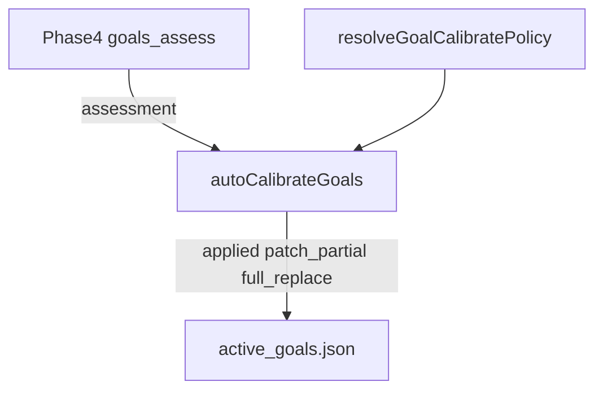

# Phase 4.5 最小限制执行器：refine 不再死在 invariant_fail

> 日期：2026-05-31  
> 项目：js-evolution-agent（典型主体 agentank-tank / `win-more-agentank-refined-v28`）  
> 类型：问题排查 / 架构设计 / 功能实现  
> 来源：Cursor Agent 对话  

---

## 目录

1. [背景与动机](#1-背景与动机)
2. [分析过程](#2-分析过程)
3. [方案设计](#3-方案设计)
4. [实现要点](#4-实现要点)
5. [验证与测试](#5-验证与测试)
6. [后续演化](#6-后续演化)

---

## 1. 背景与动机

操作者看到一轮演化日记里出现矛盾组合：

| 阶段 | 现象 |
| --- | --- |
| Phase 4 | `status: refine`、`confidence: high`，`written: 1`（assessment 已入库） |
| Phase 4.5 | `status: skipped`、`reason: invariant_fail`、`written: 0`，子目标 id 前后完全一致 |

Phase 4 的 `reason` 写得很充分（排名恶化、必须 refine、建议加基线子目标等），但 **`active_goals.json` 没有变**。

真正的问题不是「评估器不敢 refine」。

真正的问题是：**语义链（该改）和结构链（写不进去）在 4.5 断开了**——高置信 refine 只等于写了一条 assessment 事件，对下游 Decide / 信念 / 验证等于「目标树没变」。

对话随后沿三条线推进：

1. **根因分析**：`invariant_fail` 来自哪条机械规则？
2. **第一性原理**：执行器最少应保留什么限制？
3. **产品取向**：操作者倾向**放宽执行器、给 agent 更大自主性**，而非继续收紧 assessor prompt 猜规则。

2026-05-31 同日已落地 **goal_patches** 增量通道（见 [`goal-patch-calibration.md`](./goal-patch-calibration.md)）。本次是在该能力之上，把 Phase 4.5 从「保守编译器」改为默认 **liberal 最小限制执行器**。

---

## 2. 分析过程

### 2.1 `invariant_fail` 只来自结构预览

代码路径：`autoCalibrateGoals` → `buildPartialPatchApply` / 整批预览 → `checkGoalInvariants`。

不变量仅两条（strict 下生效）：

- 至少 1 个成果型（outcome）子目标；
- 至多 2 个 outcome（`MAX_OUTCOME_CHILDREN = 2`）。

对 `agentank-tank` v28 树（1 个 iterate outcome + 2 个 guard），assessor 若在未 `remove` iterate 的情况下再 **`add_child` 两个 `role: outcome`**，预览会得到 3 个 outcome → **`at most 2 outcome children`** → 整批 skip。

Phase 4 长 `reason` **不会**进入 4.5；只有 `goal_patches` / `proposed_goal` 会。

### 2.2 限制分层（第一性原理）

| 层级 | 内容 | 是否必需 |
| --- | --- | --- |
| L0 | JSON 形状、`child_id` 引用、去重 | **是**（否则文件/下游解析坏掉） |
| L1 | `remove_child` 后 retire 信念 | **是**（写成功后维护，不应挡预览） |
| L2 | outcome 个数 1–2 | **否**（产品收敛偏好） |
| L3 | add/remove 仅 `high` | **否**（Phase 4 已给 status/confidence） |
| L4 | 整批原子（一条坏 patch 拖死全部） | **否**（实现省事） |

「尽量减少限制」= **默认只保留 L0（+ L1 事后）**；L2–L4 改为 **opt-in strict**。

### 2.3 与用户取向的对齐

用户明确表示倾向放宽执行器。因此默认策略选 **liberal**，`JEA_GOAL_CALIBRATE_MODE=strict` 用于回滚旧行为（outcome 上限、整批预览、add/remove 需 high）。

未采纳的方向：

| 备选 | 未采纳原因 |
| --- | --- |
| 只改 assessor prompt、不改 4.5 | 限制只是前移到 Phase 4，dead-letter 仍在 |
| 取消「≥1 outcome」 | 易永久 `goal_pressure_loss`；留给 assessor/主体策略 |
| 无审计地自动删多余 patch | 操作者需要 `skipped_patches` / `detail` 复盘 |

---

## 3. 方案设计

### 3.1 总体模型



| 模式 | 默认 | 行为摘要 |
| --- | --- | --- |
| **liberal** | 是 | 无 outcome 上限；`refine/split/replace` + medium+ 可改结构；逐条部分应用；patch 失败可 fallback `proposed_goal` |
| **strict** | env 显式 | outcome 1–2；add/remove 需 high；整批预览；无 fallback |

### 关键决策

| 决策 | 选择 | 理由 |
| --- | --- | --- |
| 默认模式 | `liberal` | 对齐「执行器少否决、agent 多自主」；strict 显式回滚 |
| outcome 上限 | liberal 默认不 enforce | 直接消除 v28 类 `invariant_fail`；需要时用 `JEA_GOAL_MAX_OUTCOME_CHILDREN` 或 strict |
| patch 应用 | `buildPartialPatchApply` 逐条累积预览 | 一条坏 patch 不拖死合法 `update_child` |
| patches + proposed_goal | 解析保留两者；执行先 patch 后 fallback | prompt 仍建议互斥，执行器可恢复 |
| 关闭写盘 | `JEA_GOAL_AUTO_APPLY=0` | 只留 assessment，便于 A/B |

环境变量（已写入 [`AGENTS.md`](../../AGENTS.md)）：

| 变量 | 含义 |
| --- | --- |
| `JEA_GOAL_CALIBRATE_MODE` | `liberal`（默认）/ `strict` |
| `JEA_GOAL_MAX_OUTCOME_CHILDREN` | 显式 cap；`0` = 无上限 |
| `JEA_GOAL_AUTO_APPLY` | `0` 跳过 4.5 写盘 |

---

## 4. 实现要点

### 4.1 新增与主要修改文件

| 文件 | 职责 |
| --- | --- |
| [`src/intelligence/goal-calibrate-policy.mjs`](../../src/intelligence/goal-calibrate-policy.mjs) | `getGoalCalibrateMode`、`resolveGoalCalibratePolicy`、`isGoalAutoApplyEnabled` |
| [`src/intelligence/goal-patches.mjs`](../../src/intelligence/goal-patches.mjs) | `checkGoalInvariants(goal, policy)`；`buildPartialPatchApply`；`selectPatchesForApply` |
| [`src/cli/commands/goals.mjs`](../../src/cli/commands/goals.mjs) | `autoCalibrateGoals` 重构；`tryApplyProposedGoal`；`commitGoalPatch` 按 policy 校验 |
| [`src/intelligence/goal-assessor.mjs`](../../src/intelligence/goal-assessor.mjs) | `parseGoalAssessment` 不再因 patches 清空 `proposed_goal` |
| [`src/evolution/cycle-steps.mjs`](../../src/evolution/cycle-steps.mjs) | `goals_calibrate` 事件增加 `detail`、`warnings`、`calibrate_mode` |
| [`src/intelligence/evolution-diary-builder.mjs`](../../src/intelligence/evolution-diary-builder.mjs) | `phase4_5` 与 diary prompt 支持 `patch_partial`、`detail` |
| [`src/cli/commands/doctor.mjs`](../../src/cli/commands/doctor.mjs) | 输出校准策略摘要 |

### 4.2 Phase 4.5 决策顺序（liberal）

```text
1. JEA_GOAL_AUTO_APPLY=0 → skip auto_apply_disabled
2. status ∉ {refine, split, replace} → skip status_not_actionable
3. 若有 goal_patches:
   - buildPartialPatchApply（逐条，不 enforce outcome cap）
   - applicable 非空 → commitGoalPatch → applied | patch_partial
   - 否则若 fallback 且 proposed_goal → full_replace
4. 否则 proposed_goal 路径（medium+，shape 合法）
```

`calibrateResult` 扩展字段：`calibrate_mode`、`detail`、`warnings`、`mode: patch_partial`。

人工 `jea goals patch` 仍走 `commitGoalPatch`；无 policy 时不 enforce outcome 计数（仅 L0/L1）。

---

## 5. 验证与测试

| 项 | 命令 | 结果 |
| --- | --- | --- |
| 策略模块 | `npm test -- --run test/goal-calibrate-policy.test.mjs` | 6 passed |
| patch 逻辑 | `npm test -- --run test/goal-patches.test.mjs` | 8 passed |
| goals CLI | `npm test -- --run test/cli.test.mjs -t "goals command"` | 21 passed |
| parse | `npm test -- --run test/intelligence.test.mjs -t "parses goal"` | 2 passed |

覆盖要点：

- v28 风格：保留 iterate + 2×`add_child` outcome → liberal **applied**
- 同场景 + `JEA_GOAL_CALIBRATE_MODE=strict` → **invariant_fail** skip
- patch 全失败 + `proposed_goal` → **full_replace** fallback
- `JEA_GOAL_AUTO_APPLY=0` → skip
- `refine` + `medium` + `proposed_goal` → liberal applied；strict skip

操作者复现：

```powershell
jea doctor
# 查看 JEA_GOAL_CALIBRATE_MODE / JEA_GOAL_AUTO_APPLY 摘要

$env:JEA_GOAL_CALIBRATE_MODE = "strict"   # 恢复旧保守行为
jea goals history --limit 5
```

**未做**：真实 `agentank-tank` daemon 连续多轮冒烟（与 goal-patch-calibration 日记中的遗留项一致）。

---

## 6. 后续演化

| 优先级 | 项 | 说明 |
| --- | --- | --- |
| 中 | agentank-tank 实跑 1–2 轮 | 确认 liberal 下 4.5 `applied` / `patch_partial` 与 diary `children_ids_after` 变化 |
| 中 | assessor 注入 `goal_calibration_executor` 上下文 | 减少无效 patch，与执行器放宽正交 |
| 低 | `subjects.json` per-subject calibrate mode | 主体级 strict/liberal |
| 低 | Viewer 展示 `phase4_5.detail` | 非阻塞 |

---

## 附：本轮对话问题—思考—方案—执行对照

| 阶段 | 内容 |
| --- | --- |
| **问题** | Phase 4 `refine+high` 已写入，Phase 4.5 `invariant_fail` 导致目标树不变；操作者希望减少执行器限制、增大 agent 自主性。 |
| **思考** | 断层在 L2–L4 机械规则（outcome≤2、整批原子、置信门禁），非 assessor 未 refine；限制应可配置，默认尽量只保留 L0。 |
| **方案** | 新增 `goal-calibrate-policy`，默认 `liberal`：无 outcome cap、部分 patch、`proposed_goal` fallback；`strict` env 回滚。 |
| **执行** | 落地 policy + `buildPartialPatchApply` + `autoCalibrateGoals` 重构；观测字段进 cycle/diary/doctor；AGENTS.md 更新；单元/CLI 测试通过。 |
