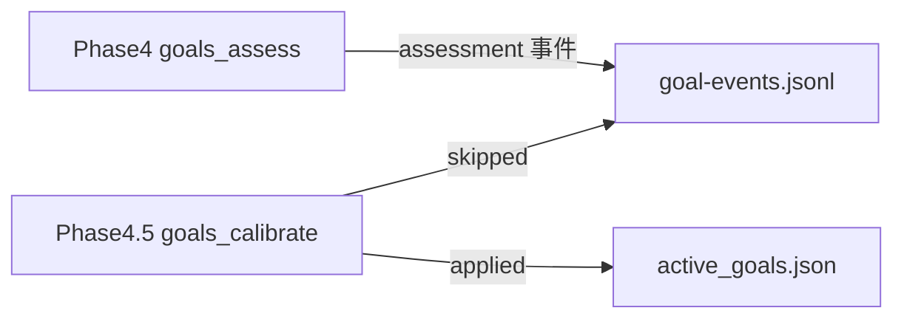
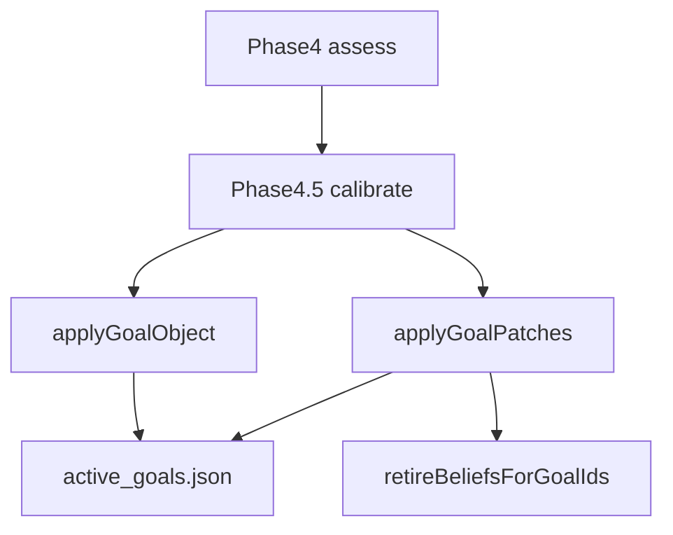

# 单子目标 Goal Patches：Phase 4.5 不再只能整棵换目标

> 日期：2026-05-31  
> 项目：js-evolution-agent（主体 agentank-tank 为典型场景）  
> 类型：调研分析 / 架构设计 / 功能实现  
> 来源：Cursor Agent 对话  

---

## 目录

1. [背景与动机](#1-背景与动机)
2. [分析过程](#2-分析过程)
3. [方案设计](#3-方案设计)
4. [实现要点](#4-实现要点)
5. [验证与测试](#5-验证与测试)
6. [后续演化](#6-后续演化)

---

## 1. 背景与动机

对话从三个层次递进：

1. **操作者视角**：当前默认主体 `agentank-tank` 的活跃目标（`win-more-agentank-refined-v28`）实际推进得怎样？守护子目标是否稳定？成果子目标是否达标？
2. **机制视角**：Phase 4 / 4.5 目标校准会不会根据运行情况**真的改** `active_goals.json`？
3. **改造视角**：整棵替换与信念按 `goal_id` 绑定的粒度不一致；大量 `refine` + `medium` 只进 `goal-events.jsonl` 而不落盘，需要**增删改单个子目标**的通道。

真正的问题不是「评估有没有跑」。

真正的问题是：**评估建议与活跃目标文件长期脱节**——要么赌一次 `refine` + `high` 全树替换，要么永远停在 `keep`；改一个子目标（例如删掉 v27 遗留 child、加一个成果型 child）也要重写整棵树，顺带把信念 `goal_id` 漂移风险放大。

2026-05-19 已落地 Phase 4.5 整棵自动校准（见 [`journal/2026-05-19/auto-goal-calibration-phase45.md`](../2026-05-19/auto-goal-calibration-phase45.md)）；2026-05-25 又加强 assessor 的 `goal_pressure_loss` 升标语义（见 [`journal/2026-05-25/goal-pressure-calibration.md`](../2026-05-25/goal-pressure-calibration.md)）。本次在**不改变 OADA 阶段划分**的前提下，补上 **goal_patches** 增量写盘路径。

---

## 2. 分析过程

### 2.1 当时 agentank-tank 目标态势（对话结论摘要）

| 维度 | 观察 |
| --- | --- |
| 活跃主目标 | `win-more-agentank-refined-v28`（约 2026-05-29 由 v27 整棵升级） |
| 守护子目标 | 凭据合规、记忆审计多轮评估为稳定 |
| 成果子目标 | 连续发布未达 ≥5 位 rank 改善；阻塞/自恢复机制尚未完整跑通一轮 |
| 评估 vs 执行 | v28 落地后多轮 `keep`；近期存在 defer，verify/diary 时间可能落后于 intel |
| 结构性风险 | 排名基线 2116 与当前 rank≈1669 并存，自证循环可能误拦发布；信念仍部分绑 v27 `goal_id` |

这些现象说明：**需要局部 patch（删旧 child、改 intent、加 outcome child）**，而不一定是再一次全树 `proposed_goal`。

### 2.2 既有校准管道在做什么



| 阶段 | 行为 |
| --- | --- |
| Phase 4 | LLM 输出 `status` / `confidence` / `proposed_goal`；**只写** `type: assessment` 事件 |
| Phase 4.5（改造前） | 仅当 `refine` + `high` + 合法 `proposed_goal` 时 **整棵替换** |
| 人工 | `jea goals update --file` 整文件替换 |

`machine_assessment`（`report-builder.mjs` 关键词匹配）只作 prompt 辅助，**不能**触发写盘。Phase 1 的 `goal_suggestions` **不被** Phase 4.5 消费。

### 2.3 与项目其它机制的对齐点

| 机制 | 粒度 |
| --- | --- |
| 信念 `current_beliefs` | 单条，`goal_id` 绑定子目标 |
| 决策队列 | 单条 action |
| 目标（改造前） | 整棵 `active_goals.json` |

因此增量 patch 比「每轮赌 high 全树替换」更符合系统其它层的演化单位。

---

## 3. 方案设计

### 3.1 总体模型

Phase 4 可输出 **`goal_patches`** 数组；Phase 4.5 机械校验、合并、写盘，记 **`type: patched`** 的 goal_event。整棵 `proposed_goal` 路径保留，与 patches **互斥**（解析与运行时均为 **patches 优先**）。



### 关键决策

| 决策 | 选择 | 理由 |
| --- | --- | --- |
| 语义 vs 机械 | Phase 4 LLM 判断；Phase 4.5 只门禁+合并 | 与 2026-05-19 Phase 4.5 原则一致 |
| 自动写盘门槛 | **balanced**：add/remove 要 `refine`+`high`；update_child 允许 `medium`+ | 局部改措辞风险低于增删 child；与对话中用户确认一致 |
| remove 时信念 | **auto-retire** active/validated，写 `belief_event` | 避免 Decide 继续绑已删 `goal_id`；用户明确选择，非 skip |
| 同轮双填 | patches 优先，`proposed_goal` 忽略 | 防止 assessor 两套都填导致歧义 |
| 原子性 | 首期整批 patch 全过才写盘，否则 skip | 避免半棵目标树；二期可部分 applied |
| 树深度 | 仅根下平铺 `children` | 与现有 `flattenGoals` 一致 |
| 不变量 | 至少 1 个 outcome 子目标；outcome 最多 2 个 | 防 goal_pressure_loss 永久化；可配置 `MAX_OUTCOME_CHILDREN` |

### 3.2 Patch 操作契约

| op | 含义 | 自动门槛 |
| --- | --- | --- |
| `add_child` | `parent_id: null` 挂根下；child 含 `role: outcome\|guard` | `refine` + `high` |
| `update_child` | 仅 `intent` / `good_signal` / `bad_signal` | `refine` + `medium` 或 `high` |
| `remove_child` | 按 `child_id` 删除 | `refine` + `high` |

`update_child` **禁止**改 `id` / `name`（改 id 视为 remove + add）。

### 3.3 未采纳方案

| 备选 | 未采纳原因 |
| --- | --- |
| 中置信自动 add_child | 易膨胀子目标树；balanced 仅放开 update |
| remove 遇信念则 skip | 会留下 orphan 信念；用户选择 auto-retire |
| 逐条部分写盘 | 首期复杂度高；先整批原子 |
| 消费 Phase 1 `goal_suggestions` | 范围外；与 assess 重复 |

---

## 4. 实现要点

### 4.1 新增与主要修改文件

| 文件 | 职责 |
| --- | --- |
| [`src/intelligence/goal-patches.mjs`](../../src/intelligence/goal-patches.mjs) | normalize/validate/apply patches；outcome 不变量；`gatePatchForAutoApply` |
| [`src/intelligence/belief-updater.mjs`](../../src/intelligence/belief-updater.mjs) | `retireBeliefsForGoalIds()` |
| [`src/cli/commands/goals.mjs`](../../src/cli/commands/goals.mjs) | `autoCalibrateGoals` 重构；`commitGoalPatch` / `patchGoals`；`validateGoalShape` 改由 goal-patches 提供 |
| [`src/intelligence/goal-assessor.mjs`](../../src/intelligence/goal-assessor.mjs) | prompt/schema；`parseGoalAssessment` 支持 `goal_patches` |
| [`src/evolution/cycle-steps.mjs`](../../src/evolution/cycle-steps.mjs) | `runGoalsCalibrateStep` 传入 `store`；evolution_event 扩展字段 |
| [`src/intelligence/evolution-diary-builder.mjs`](../../src/intelligence/evolution-diary-builder.mjs) | `phase4_5` 含 mode、patches、children_ids、belief_retirements |
| [`AGENTS.md`](../../AGENTS.md) | 目标管理：patch CLI、自动门槛、信念 retire |
| [`src/cli/jea.mjs`](../../src/cli/jea.mjs) | `goals patch` 帮助文案 |

### 4.2 Phase 4.5 决策顺序（实现）

```text
1. 无 assessment → skip
2. goal_patches 非空：
   - selectPatchesForAutoApply → 空则 no_applicable_patches
   - validate + checkGoalInvariants（预览）
   - remove 前 retireBeliefsForGoalIds
   - commitGoalPatch → goal_event type=patched
3. 否则 refine+high+proposed_goal → 整棵 apply（mode=full_replace）
4. 否则 skip（status_not_refine / confidence_not_high / …）
```

### 4.3 CLI 与事件类型

```powershell
# 人工增量 patch（JSON 数组或 { goal_patches: [] }）
jea goals patch --file patches.json --reason "remove stale v27 child" --cycle <id>

# 查看历史（含 patched）
jea goals history --limit 20

# 评估（输出含 goal_patches）
jea goals assess --cycle <id> --json
```

| goal_event.type | 含义 |
| --- | --- |
| `assessment` | Phase 4 建议（含 patches 或 proposed_goal） |
| `patched` | Phase 4.5 或 `jea goals patch` 增量应用成功 |
| `updated` | 整棵替换 |

---

## 5. 验证与测试

| 项 | 命令 / 范围 | 结果 |
| --- | --- | --- |
| goal-patches 单元测试 | `npm test -- --run test/goal-patches.test.mjs` | 6 passed |
| goals CLI 集成 | `npm test -- --run test/cli.test.mjs -t "goals command"` | 17 passed（含 patch 自动应用、medium update、belief retire） |
| parseGoalAssessment | `test/intelligence.test.mjs` patches 互斥用例 | 通过 |
| 全量 | `npm test -- --run` | 429 passed；1 failed |

**未通过项说明**：`test/cycle-e2e.test.mjs` 因临时目录缺少 `policies/authority/CONSTITUTION.md` 失败，与本次 goal patches 改动无直接因果关系；**未**在真实 `agentank-tank` daemon 上跑 PR4 冒烟（计划中的可选验证）。

覆盖要点：

- add/update/remove 组合与排序（remove → update → add）
- 重复 id、删光 outcome 子目标 → invariant_fail
- balanced 门禁（add 需 high，update 允许 medium）
- patches 与 `proposed_goal` 同轮时仅 patches 生效
- `remove_child` + active belief → retired + `patched` 事件

---

## 6. 后续演化

| 优先级 | 项 | 说明 |
| --- | --- | --- |
| 高 | agentank-tank 真实跑 1–2 轮 | 观察 assessor 是否在 `goal_pressure_loss` 场景产出 `add_child` outcome，4.5 是否 `patched` |
| 中 | 整棵 `proposed_goal` 替换时按 flat id diff retire 消失子目标信念 | 本期仅 remove_child 路径 retire |
| 中 | 部分 patch 应用（applied 子集 + skipped 明细） | 降低整批原子 skip 率 |
| 低 | Viewer 展示 `patched` diff | 首期仅 JSON 字段 |
| 低 | `JEA_AUTO_GOAL_CALIBRATE=0` | 与 2026-05-19 journal 建议一致 |
| 低 | `update_child` 允许改 `name` | 二期 |

---

## 附：本轮对话问题—思考—方案—执行对照

| 阶段 | 内容 |
| --- | --- |
| 问题 | agentank-tank 目标是否偏离执行现实；校准是否会改活跃目标；整棵替换粒度过粗 |
| 思考 | Phase 4 有建议、Phase 4.5 门槛过高；信念按 child `goal_id` 绑定；应 patches 优先、整棵保留 |
| 方案 | `goal_patches` + balanced 自动门槛 + remove 时 auto-retire 信念 + `patched` 事件 |
| 执行 | 落地 goal-patches 模块、goals/assessor/cycle/diary/AGENTS；测试 429+ 通过；e2e 1 项环境失败待单独修 |
