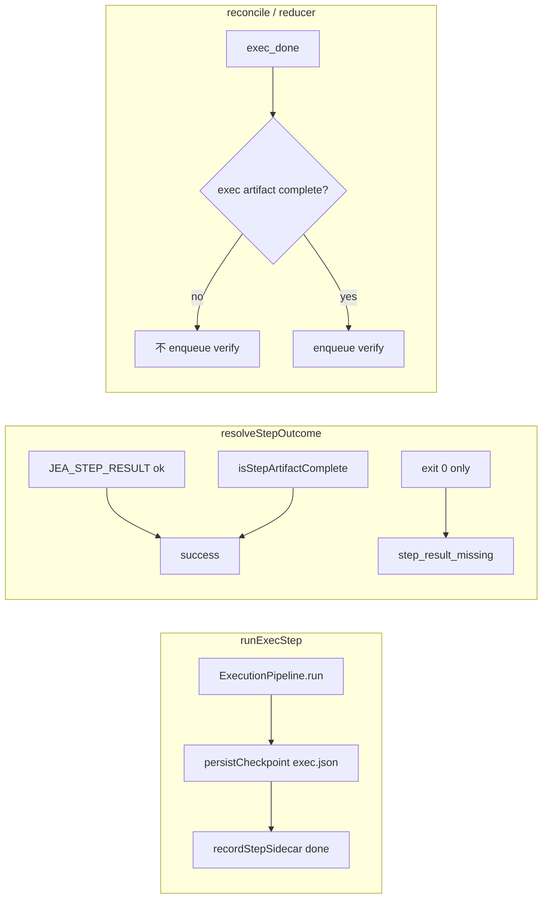

# Step 完成不变量：done 必须有 checkpoint，并抢救卡死的 open cycle

> 日期：2026-05-31  
> 项目：js-evolution-agent（`agentank-tank` 主体 runtime）  
> 类型：问题排查 / 架构设计 / 功能实现  
> 来源：Cursor Agent 对话（卡住诊断 → 不变量方案 → 代码修复 → 中文 diary prompt → runtime repair）

---

## 目录

1. [背景与动机](#1-背景与动机)
2. [分析过程](#2-分析过程)
3. [方案设计](#3-方案设计)
4. [实现要点](#4-实现要点)
5. [验证与测试](#5-验证与测试)
6. [后续演化](#6-后续演化)
7. [附：本轮对话问题—思考—方案—执行对照](#附本轮对话问题思考方案执行对照)

---

## 1. 背景与动机

`agentank-tank` 上出现 open cycle `cycle-20260531123649-3cca5618`：`exec` 在 cycle-state 里已是 **done**，但 `verify` 反复失败，报错 `checkpoint missing for exec`；continuous 模式因此被 open cycle 挡住，新轮启动请求大量 deferred。

表面上是 verify 坏了。

真正的问题是：**`step.status === "done"` 不再保证下游能重建上下文**。本轮 `exec` 子进程以 exit 0 结束，cycle-state 先标了 `exec: done`，`exec.json` 却从未写入；调度层仍按「exec 已完成」入队 verify，于是 verify 注定失败，并留下决策 `cycle-20260531123649-3cca5618:0` 长期 **`in_progress`**、lane 里已有完整 receipt 却未进 intelligence store。

本次工作分两层：

1. **防复发**：收紧 step 成功语义、checkpoint 写失败显式失败、先写 checkpoint 再标 done、调度层对 `exec` artifact 做 gate。
2. **清债务**：对历史脏状态执行一次性 runtime repair，并把步骤沉淀为可复用脚本。

（与同日 [`daemon-tick-resilience.md`](./daemon-tick-resilience.md) 互补：那篇侧重 tick 不被 step 阻塞、产物为准的 watchdog；本篇侧重 **「done ⇒ checkpoint 存在」** 不变量在 step 收尾与 reducer 上的落地。）

---

## 2. 分析过程

### 2.1 现场快照（repair 前）

| 观测项 | 值 |
| --- | --- |
| cycle-state | `intel` / `intel_report` / `exec` = done；`verify` = failed；`belief_update` / `goals_assess` = skipped |
| `cycle-state/.../exec.json` | **不存在**（仅有 `intel.json`） |
| `pending_decisions` | `cycle-20260531123649-3cca5618:0` = **in_progress** |
| lane worktree | `exec-20260531-204334-...` 已完成；receipt 在 `agentank-evolver/.worktrees/.../actions/receipts/` |
| daemon tasks | `exec` task `completed`（`exit_code=0`，`source: exit_code`）；十余个 `verify` task **failed**（`checkpoint_missing`） |

### 2.2 机制破坏点

| 位置 | 旧行为 | 后果 |
| --- | --- | --- |
| [`resolveStepOutcome()`](../../src/cli/commands/evolve.mjs) | `exitCode === 0` 可单独判成功 | 无 `JEA_STEP_RESULT`、无 artifact 仍完成 exec task |
| [`persistCheckpoint()`](../../src/evolution/cycle-steps.mjs) | 写失败静默吞掉 | `exec: done` 与 `exec.json` 可脱节 |
| [`runExecStep()`](../../src/evolution/cycle-steps.mjs) | 先 `recordStepSidecar done`，再写 checkpoint | 中断时 state 领先于产物 |
| [`cycle-reducer`](../../src/cli/utils/cycle-reducer.mjs) | `exec_done` 后无条件允许 verify | 对脏 state 反复 enqueue 必败 verify |

### 2.3 第一性原理（对话收敛）

```text
step.status === "done"  =>  下游可重建的 checkpoint 已存在
```

尤其是 `exec: done` 必须意味着 `cycle-state/<cycleId>/exec.json` 可读且 `success === true`。

---

## 3. 方案设计

### 3.1 四条修复（防复发）



### 3.2 关键决策

| 决策 | 选择 | 理由 |
| --- | --- | --- |
| step 成功依据 | `JEA_STEP_RESULT ok` **或** `isStepArtifactComplete` | 与不变量一致；exit 0  alone 不足 |
| 失败 exit 0 | `code: step_result_missing`，`retryable: true` | 可诊断、可重试 |
| 关键 checkpoint | `intel` / `intel_report` / `exec` / `verify` 写失败 **throw** | 不再假进展 |
| exec 收尾顺序 | 先 checkpoint，再标 done | 缩小 state/产物窗口 |
| verify 入队 | `isExecArtifactComplete === false` 时不入队 | 避免 verify 风暴 |
| reducer ↔ cycle-state | 经 `dispatchOptionsFromInput` 注入 `isExecArtifactComplete` | 避免循环依赖导致测试 suite 崩溃 |
| 历史 open cycle | **不**在代码里自动 repair | 与防复发分离；用脚本 + 手工步骤 |

### 3.3 路径 A vs 路径 B（runtime repair）

| 路径 | 适用 | 要点 |
| --- | --- | --- |
| **A 抢救** | lane receipt 完整、要保留本轮发布证据 | 补 `exec.json`、决策改 `completed`、ingest receipt、重置 verify 等 step、ack failed verify、再 `work --once` |
| **B 放弃** | 不确定 result 结构 / 只想 unblock | `diary` failed + `abandoned` meta，清理队列，再 `daemon cycle request` |

本次对 `3cca5618` 执行的是 **路径 A**。

---

## 4. 实现要点

### 4.1 代码变更（防复发）

| 文件 | 职责 |
| --- | --- |
| [`src/cli/commands/evolve.mjs`](../../src/cli/commands/evolve.mjs) | `resolveStepOutcome()` 去掉 exit 0 单独成功路径 |
| [`src/evolution/cycle-steps.mjs`](../../src/evolution/cycle-steps.mjs) | `persistCheckpoint` 关键 step 失败抛错；intel/exec/verify 等先 checkpoint 后 done |
| [`src/cli/utils/cycle-reducer.mjs`](../../src/cli/utils/cycle-reducer.mjs) | `exec_done` / reconcile 时校验 exec artifact |
| [`src/cli/utils/cycle-dispatch.mjs`](../../src/cli/utils/cycle-dispatch.mjs) | `dispatchOptionsFromInput()` 提供 `isExecArtifactComplete` |
| [`src/intelligence/evolution-diary-builder.mjs`](../../src/intelligence/evolution-diary-builder.mjs) | 中文 diary prompt 补上 interpretation anchors 指引（与英文 parity） |

### 4.2 测试

| 文件 | 覆盖 |
| --- | --- |
| [`test/daemon-step-outcome.test.mjs`](../../test/daemon-step-outcome.test.mjs) | exit 0 无 artifact/step_result → 失败；有 `JEA_STEP_RESULT ok` → 成功 |
| [`test/cycle-checkpoint.test.mjs`](../../test/cycle-checkpoint.test.mjs) | `exec: done` 但无 `exec.json` → reconcile **不** enqueue verify |
| [`test/cycle-state-dispatch.test.mjs`](../../test/cycle-state-dispatch.test.mjs) | 调度与 reducer 回归 |
| [`test/cycle-reducer.test.mjs`](../../test/cycle-reducer.test.mjs) | 循环依赖修复后 reducer 用例恢复 |

### 4.3 一次性 repair 工具

[`tools/repair-stuck-cycle.mjs`](../../tools/repair-stuck-cycle.mjs)（默认针对 `cycle-20260531123649-3cca5618`）：

```bash
node tools/repair-stuck-cycle.mjs
node tools/repair-stuck-cycle.mjs --cycle <id> --subject agentank-tank --dry-run
```

脚本行为：备份 `pending_decisions.json` → `writeStepArtifact(exec)` → 决策 `completed` + `result` → `recordActionReceipt` → 重置 `verify` / `belief_update` / `goals_assess` → ack 该 cycle 全部 failed verify。

repair 后推进 pipeline：

```bash
npm run jea -- daemon work --once   # 按需重复：verify → belief_update → goals_assess → goals_calibrate → diary
```

---

## 5. 验证与测试

### 5.1 单元 / 集成测试（代码修复）

```powershell
npm test -- test/daemon-step-outcome.test.mjs test/cycle-checkpoint.test.mjs test/cycle-state-dispatch.test.mjs test/cycle-reducer.test.mjs
```

结果：**38 passed**。

全量 `npm test`：曾有一处与本次无关的失败（中文 diary 缺 anchors 行）；已通过 [`evolution-diary-builder.mjs`](../../src/intelligence/evolution-diary-builder.mjs) 修补，`test/intelligence.test.mjs` 对应用例通过。

### 5.2 Runtime repair（`3cca5618`）

| 步骤 | 结果 |
| --- | --- |
| `node tools/repair-stuck-cycle.mjs` | `isStepArtifactComplete(exec): true`；ack 18 个 failed verify |
| `reconcileOpenCycles` | enqueue `verify` |
| `daemon work --once` ×5 | verify → belief_update → goals_assess → goals_calibrate → diary 均 `JEA_STEP_RESULT ok:true` |
| cycle-state | **`status: closed`**，`closed_at` 2026-05-31T14:26:24Z |
| `jea daemon status` | `open_count: 0`，`ok: true` |
| `pending_decisions` | `cycle-20260531123649-3cca5618:0` → **completed** |

产物示例：

- `runtime/subjects/agentank-tank/data/evolution/cycle-state/cycle-20260531123649-3cca5618/exec.json`
- `runtime/subjects/agentank-tank/data/evolution/verify_reports/exec-20260531-204334-t-888b98db-1780231414357.json`

---

## 6. 后续演化

| 方向 | 建议 |
| --- | --- |
| 正式 repair CLI | 将 `tools/repair-stuck-cycle.mjs` 升为 `jea cycle repair --cycle ID`（参数化 receipt 路径、dry-run） |
| 决策队列 | repair 后可用 `jea audit queue --archive --yes` 清理大量 completed |
| 监控 | `jea daemon doctor` / inbox 对「`exec: done` 且无 `exec.json`」显式告警（与 `drift_steps` 并列） |
| 与 watchdog 协同 | 新 invariant + [`daemon-tick-resilience`](./daemon-tick-resilience.md) 的 artifact 完成路径应一起观察，避免两套语义打架 |
| 操作者 | rank 发布无改善等仍走 `jea intel brief put`，不要手改 `pending_decisions.json` |

---

## 附：本轮对话问题—思考—方案—执行对照

| 阶段 | 内容 |
| --- | --- |
| **问题** | open cycle `3cca5618` 在 `exec: done` 后 verify 反复 `checkpoint_missing`；决策 `in_progress`；continuous 无法开新轮。 |
| **思考** | 根因是「done 无 checkpoint」；exit 0 与 state 机脱节；应用「done ⇒ 可消费 checkpoint」不变量，历史数据单独 repair。 |
| **方案** | 收紧 `resolveStepOutcome`；checkpoint 必写且先写；reducer/dispatch gate verify；中文 diary anchors；路径 A 抢救 + `repair-stuck-cycle.mjs`。 |
| **执行** | 上述代码与测试落地；执行 repair + 5 次 `work --once` 关闭 cycle；daemon 重启，`open_count=0`。 |
