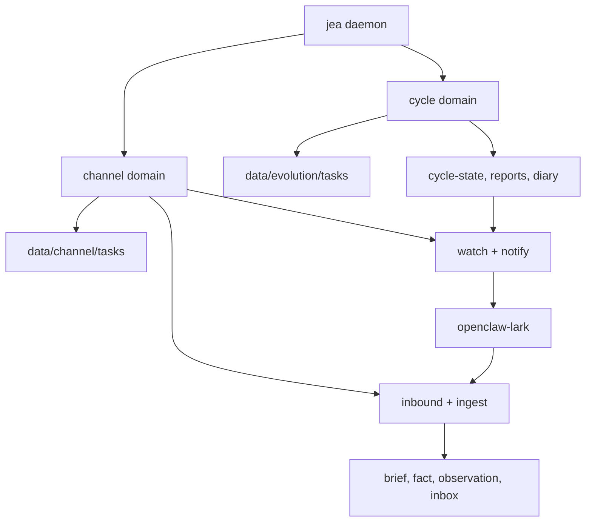

# Daemon Channel：把飞书通道做成与 Cycle 平级的并行事件域

> 日期：2026-06-01  
> 项目：js-evolution-agent / openclaw-lark  
> 类型：架构设计 / 功能实现 / 调研分析  
> 来源：Cursor Agent 对话

---

## 目录

1. [背景与动机](#1-背景与动机)
2. [分析过程](#2-分析过程)
3. [方案设计](#3-方案设计)
4. [实现要点](#4-实现要点)
5. [验证与测试](#5-验证与测试)
6. [后续演化](#6-后续演化)
7. [附：本轮对话问题—思考—方案—执行对照](#附本轮对话问题思考方案执行对照)

---

## 1. 背景与动机

这次工作的起点，是一个看似简单的需求：让当前项目的 agent 能连接 `openclaw-lark`，通过飞书机器人收发消息。

但很快问题就变了。

真正的问题不是“怎么发一条飞书通知”。

真正的问题是：飞书消息进入一个自演化系统以后，到底应该成为事实、意图、审批请求，还是普通证据？系统什么时候应该主动发消息，又不能把通知逻辑塞进每轮 cycle 里？

用户连续校准了几个关键边界：

- 通知判断不要耦合在 cycle 里。
- 接收消息和发送消息都由同一个通信系统负责。
- 名字最终定为 `channel`，以便和 OpenClaw 的 channel 插件生态对齐。
- `openclaw-lark` 是 OpenClaw 的通道插件，JEA 应该兼容它，而不是重写一套飞书 SDK。
- `channel` 和 `cycle` 应该在 daemon 里平级，并且可以并行运行。

这使得目标从“加一个 adapter”升级为：在 daemon 下新增一个与 cycle 平级的通信闭环。

## 2. 分析过程

### 2.1 现有 daemon 已经具备事件驱动骨架

先阅读了 daemon 与 cycle 相关代码，重点看任务队列、worker、tick 和 cycle reducer：

| 文件 | 发现 |
| --- | --- |
| [`src/cli/commands/daemon.mjs`](../../src/cli/commands/daemon.mjs) | `runDaemonWorker()` 已有 5 分钟 tick、worker heartbeat、lease renew、`workOnce()` 领取任务。 |
| [`src/cli/utils/daemon-tasks.mjs`](../../src/cli/utils/daemon-tasks.mjs) | 任务队列已支持 pending/running/completed/failed、租约、重试、幂等 key，但路径固定在 `data/evolution/tasks`。 |
| [`src/cli/utils/cycle-dispatch.mjs`](../../src/cli/utils/cycle-dispatch.mjs) | cycle tick 与 step completion 通过 reducer 入队下一步。 |
| [`src/cli/utils/cycle-reducer.mjs`](../../src/cli/utils/cycle-reducer.mjs) | `CYCLE_STEP_TYPES` 只应该描述演化步骤，不能把 channel task 混进去。 |

结论很明确：`channel` 可以复用 daemon 的队列和 worker 模型，但不能进入 cycle reducer。

### 2.2 同队列平级不等于运行时并行

最初可以把 `channel_watch`、`channel_notify` 等 task 放进现有 daemon queue。

但这只做到“语义平级”，不能做到“运行时并行”。如果某个 `exec` 或 `intel` step 运行很久，同一个 worker 仍会被长任务占住，飞书入站消息无法及时处理。

所以必须引入 domain 概念：

```text
jea daemon
├── cycle domain
│   ├── evolution task queue
│   └── evolution worker-state
└── channel domain
    ├── channel task queue
    └── channel worker-state
```

这不是为了抽象而抽象。它直接对应用户的要求：cycle 和 channel 都在 daemon 里事件驱动，但必须能并行。

### 2.3 飞书消息不能绕过 OADA 边界

入站消息最危险的点，是把“聊天里的话”误当成系统动作。

比如用户在飞书里说“同意发布”。这句话不能直接改 `pending_decisions.json`，也不能直接伪造 `approval_granted`。它应该进入现有的 Operator Intent Brief 机制，让下一轮 Decide 在完整上下文中产出正式 action。

因此 channel 的写入边界必须复用现有入口：

| 消息语义 | 写入位置 | 原因 |
| --- | --- | --- |
| 下一轮关注、核实、审批 | operator brief | 一次性意图，不污染长期记忆 |
| “同意发布” | `approval_request` brief | 仍需 Decide 产出正式 `approval_granted` |
| 已确认口径 | `operator_fact` | 高置信事实可进入 Seen |
| 普通外部观测 | `intel_observations` | 可推翻 evidence |

## 3. 方案设计

最终方案是把 `channel` 做成 daemon 下的第二个事件域，与 `cycle` 平级。



### 关键决策

| 决策 | 选择 | 理由 |
| --- | --- | --- |
| 架构位置 | `channel` 与 `cycle` 都在 daemon 下 | 两者都是事件驱动闭环，但职责不同 |
| 并行方式 | 独立 queue + 独立 worker-state + 独立 loop | 长 cycle step 不阻塞飞书收发 |
| cycle 关系 | 不修改 `CYCLE_STEP_TYPES`，不进入 cycle reducer | 避免把通信逻辑塞进演化状态机 |
| openclaw-lark | 作为 adapter contract 复用 | JEA 不重写飞书 SDK，不维护飞书权限细节 |
| 入站写入 | brief / fact / observation / inbox | 保持 OADA 输入边界 |
| 出站通知 | `watch -> signals -> outbox -> notify` | 通知决策独立审计，不污染 cycle receipt |
| 第一版分类 | 规则化启发式 | 先打通机制；后续可替换为 LLM 分类 |

## 4. 实现要点

### 4.1 项目结构

```text
js-evolution-agent/
├── src/
│   ├── channel/
│   │   ├── adapters/openclaw-lark.mjs
│   │   ├── audit.mjs
│   │   ├── dispatch.mjs
│   │   ├── ingest.mjs
│   │   ├── notify.mjs
│   │   ├── paths.mjs
│   │   ├── projection.mjs
│   │   ├── state.mjs
│   │   ├── task-queue.mjs
│   │   ├── tasks.mjs
│   │   ├── types.mjs
│   │   └── worker-state.mjs
│   └── cli/
│       ├── commands/channel.mjs
│       ├── commands/daemon.mjs
│       └── utils/daemon-tasks.mjs
├── test/channel.test.mjs
└── AGENTS.md
```

### 4.2 关键模块

| 文件 | 职责 |
| --- | --- |
| [`src/cli/utils/daemon-tasks.mjs`](../../src/cli/utils/daemon-tasks.mjs) | 把原本固定到 `data/evolution/tasks` 的队列工具改成 domain-aware；默认路径保持兼容。 |
| [`src/cli/commands/daemon.mjs`](../../src/cli/commands/daemon.mjs) | 新增 `runChannelDomainWorker()`、`channelWorkOnce()`、`runDaemonDomains()`；`daemon start` 支持 `--domain all|cycle|channel`。 |
| [`src/channel/task-queue.mjs`](../../src/channel/task-queue.mjs) | 将通用 daemon queue 包装成 channel queue，路径落到 `data/channel/tasks`。 |
| [`src/channel/worker-state.mjs`](../../src/channel/worker-state.mjs) | 独立维护 channel worker 的 heartbeat、stop request、zombie 检测状态。 |
| [`src/channel/dispatch.mjs`](../../src/channel/dispatch.mjs) | channel tick dispatcher；根据 pending inbound、attention signals、outbox 入队 channel task。 |
| [`src/channel/tasks.mjs`](../../src/channel/tasks.mjs) | 执行 `channel_inbound`、`channel_ingest`、`channel_watch`、`channel_notify`、`channel_retry`。 |
| [`src/channel/adapters/openclaw-lark.mjs`](../../src/channel/adapters/openclaw-lark.mjs) | 将 openclaw-lark `MessageContext` / 飞书事件转为 `ChannelEnvelope`；出站调用 `sendMessageFeishu` / `sendCardFeishu`。 |
| [`src/channel/ingest.mjs`](../../src/channel/ingest.mjs) | 将入站消息分类并写入 operator brief、operator fact 或 observation。 |
| [`src/channel/notify.mjs`](../../src/channel/notify.mjs) | 从 daemon projection、failed task、pending brief 等生成 attention signals，并写入 outbox。 |
| [`src/cli/commands/channel.mjs`](../../src/cli/commands/channel.mjs) | 新增 `jea channel status/events/inbox/outbox/send/tick/work/doctor` 命令族。 |
| [`src/cli/utils/daemon-projection.mjs`](../../src/cli/utils/daemon-projection.mjs) | `daemon status --json` 中汇总 channel projection。 |
| [`AGENTS.md`](../../AGENTS.md) | 增加 channel 的运行时目录、命令和边界说明。 |

### 4.3 Runtime 目录

新增 subject 级目录：

```text
runtime/subjects/<data_namespace>/data/channel/
├── worker-state.json
├── tasks/
│   ├── pending_tasks.json
│   └── pending_tasks.lock
├── events.jsonl
├── inbound/
│   ├── dedup.json
│   ├── pending/
│   ├── processed/
│   └── failed/
├── outbox/
│   ├── pending/
│   ├── sent/
│   └── failed/
└── cooldown.json
```

cycle 仍使用 `data/evolution/`。channel 可以读取 evolution 和 intelligence，但不直接改 `cycle-state` 或 `pending_decisions.json`。

### 4.4 命令入口

新增命令：

```bash
jea channel status
jea channel events
jea channel inbox put --file message.json
jea channel outbox
jea channel send --to CHAT_ID --text "hello" --dry-run
jea channel tick
jea channel doctor
```

daemon domain：

```bash
jea daemon start --domain all
jea daemon start --domain cycle
jea daemon start --domain channel
jea daemon work --once --domain channel
```

## 5. 验证与测试

### 5.1 通过的验证

本次做了几类验证：

```bash
node --preserve-symlinks -e "await import('./src/cli/jea.mjs'); await import('./src/channel/tasks.mjs'); await import('./src/channel/projection.mjs'); console.log('imports-ok')"
```

结果：通过，确认新增模块可 import。

```bash
npm run jea -- channel status --json
npm run jea -- channel send --to oc_test --text hello --dry-run
npm run jea -- daemon status --json
npm run jea -- help
```

结果：均通过，CLI 能加载 channel 命令，`daemon status` 也能展示 `channel` projection。

还运行了两个直接 smoke：

- channel 入站审批消息 → `approval_request` brief → `channel_watch` 生成 outbox。
- `runChannelDomainWorker()` 单轮处理 `channel_watch` task，验证 channel worker loop 可独立运行。

此外：

```bash
git diff --check
```

结果：通过。

`ReadLints` 对新增和修改文件检查无 linter error。

### 5.2 Vitest 的未决问题

尝试运行：

```bash
npm run test -- test/channel.test.mjs
npm run test -- test/daemon-resilience.test.mjs
npm run test -- test/cycle-reducer.test.mjs
```

结果不是业务断言失败，而是在未改动测试上也出现：

```text
Vitest failed to find the current suite
TypeError: Cannot read properties of undefined (reading 'config')
```

这说明当前 Vitest 运行环境存在独立问题，导致无法用常规 Vitest 命令确认新增测试。为避免把未验证内容写成事实，本次只记录：新增 `test/channel.test.mjs` 已补充，但尚未通过正常 Vitest runner 验证。

## 6. 后续演化

1. 修复当前 Vitest runner 的 suite context 问题，让 `test/channel.test.mjs` 进入常规测试闭环。
2. 将 `classifyChannelEnvelope()` 从启发式规则升级为 LLM 分类，但输出 schema 仍必须落在 brief / fact / observation / inbox。
3. 补真实 `openclaw-lark` 配置装载方式，不长期依赖 `JEA_CHANNEL_LARK_CONFIG_JSON`。
4. 把 channel projection 接入 viewer / SSE，让操作者能看到 inbound、outbox、发送失败与冷却状态。
5. 增加 outbox retry 策略的时间窗口与最大重试次数，避免失败消息永久堆积或刷屏。
6. 为多 subject 配置 channel 路由，例如不同 subject 发到不同飞书群。

---

## 附：本轮对话问题—思考—方案—执行对照

| 阶段 | 内容 |
| --- | --- |
| 问题 | 希望 JEA 连接 `openclaw-lark`，既能接收飞书消息写入情报，也能根据运行态主动发飞书消息。 |
| 思考 | 通知不能耦合 cycle；飞书消息不能绕过 OADA；同队列平级不等于运行时并行。 |
| 方案 | 在 daemon 下新增与 cycle 平级的 `channel domain`，独立 queue、worker-state、tick、审计和 outbox。 |
| 执行 | 新增 `src/channel/`、`jea channel` CLI、daemon domain 并行入口、openclaw-lark adapter、入站分类、出站 watch/notify 和文档。 |
