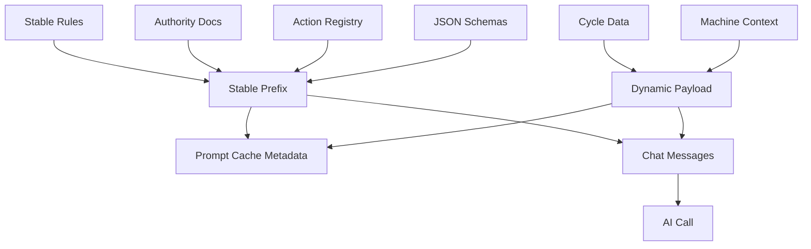

# DeepSeek 前缀缓存：把提示词稳定性变成可观测不变量

> 日期：2026-06-01  
> 项目：js-evolution-agent  
> 类型：调研分析 / 架构设计 / 功能实现  
> 来源：Cursor Agent 对话

---

## 目录

1. [背景与动机](#1-背景与动机)
2. [分析过程](#2-分析过程)
3. [方案设计](#3-方案设计)
4. [实现要点](#4-实现要点)
5. [验证与测试](#5-验证与测试)
6. [后续演化](#6-后续演化)

---

## 1. 背景与动机

这次工作的起点不是一次常规 prompt 调优。

用户给出了一篇关于 DeepSeek-Reasonix 的文章，核心观点很明确：DeepSeek 的输入缓存不是一个“能命中就命中”的优化项，而应该成为 agent 循环结构中的不变量。Reasonix 把上下文拆成 `Immutable Prefix`、`Append-Only Log`、`Volatile Scratch`，用前缀稳定性换取 DeepSeek cache hit 的成本优势。

这对当前项目有直接启发。

`js-evolution-agent` 的 Phase 1 会频繁生成情报报告和 Analyze+Decide JSON，而且 prompt 很长。此前结构里，`cycleId`、Machine Context、Operator Brief 等动态字段较早出现，后面大量稳定规则、schema、路径语义和 action taxonomy 很难形成稳定前缀。

真正的问题不是“prompt 是否够短”。

真正的问题是：每一轮请求开头是不是足够稳定，能不能让 DeepSeek 复用前缀缓存。

## 2. 分析过程

分析时先阅读了用户提供的 `work_dir/deepseek_kv.md`，提炼出 Reasonix 的关键模式：

- 稳定系统提示词和工具列表要作为 `Immutable Prefix`。
- 历史只能追加，不能悄悄改写。
- 当前轮临时上下文应靠后放，不能污染缓存前缀。
- 前缀变化要可检测，不能只靠 best-effort。

随后检查当前项目的提示词入口，重点落在这些文件：

| 文件 | 发现 |
| --- | --- |
| [`src/intelligence/conversation-prompts.mjs`](../../src/intelligence/conversation-prompts.mjs) | Phase 1 report / decide prompt 规则很长，但动态字段和稳定规则混在同一字符串中。 |
| [`src/intelligence/conversational-intel-pipeline.mjs`](../../src/intelligence/conversational-intel-pipeline.mjs) | Phase 1 已经是 report → decide 的连续对话结构，适合保留，但缺少 prompt cache metadata。 |
| [`src/ai/deepseek-client.mjs`](../../src/ai/deepseek-client.mjs) | DeepSeek 请求出口只负责发送消息，不适合承载业务级 prompt 切分逻辑。 |
| [`src/intelligence/goal-assessor.mjs`](../../src/intelligence/goal-assessor.mjs)、[`src/intelligence/belief-updater.mjs`](../../src/intelligence/belief-updater.mjs)、[`src/intelligence/evolution-diary-builder.mjs`](../../src/intelligence/evolution-diary-builder.mjs) | 后续阶段也有长 prompt，适合第二批推广观测。 |

关键判断是：当前项目不是完全没有机会命中缓存。`system` message 中的权威文档和 action registry 本身有稳定性。

但这种稳定性没有被设计成协议，也没有被 hash 观测。只要动态字段靠前，DeepSeek 的前缀缓存收益就会被削弱。

## 3. 方案设计

最终方案分两层。

第一层是结构重排：让 Phase 1 prompt 显式拆成 `stablePrefix` 和 `dynamicPayload`。稳定规则、JSON schema、action taxonomy、路径/权限约束放前面；`cycleId`、goals、operator brief、Machine Context、observation report 放到 `Dynamic Cycle Payload` 或 `Dynamic Decision Payload`。

第二层是观测：新增 prompt cache metadata，记录稳定前缀 hash、动态载荷 hash、完整 messages hash、字符数、消息角色和 profile。这样即使 DeepSeek API 不返回真实 cache hit 指标，项目也能知道“本轮前缀有没有变”。

### 关键决策

| 决策 | 选择 | 理由 |
| --- | --- | --- |
| 优化优先级 | 先做 Phase 1 report / decide | 这是最长、最频繁、最影响成本的 AI 调用链。 |
| 改造方式 | 保留旧 `build*Prompt()`，新增 `build*PromptParts()` | 保持调用兼容，同时为 hash 观测暴露稳定/动态边界。 |
| 观测位置 | 在 pipeline 组装 messages 后生成 metadata | 这里能同时看到 system/user/assistant 消息，比 DeepSeek client 更懂业务 profile。 |
| 不变量策略 | 先 warning + checkpoint，不 hard fail | 避免刚引入时因正常文档更新打断生产流程。 |
| 后续阶段 | 先加入 metadata 观测，不大规模重写所有 prompt | 降低行为回归风险，先拿到稳定性基线。 |

整体数据流如下：



## 4. 实现要点

### 项目结构

```text
js-evolution-agent/
├── src/
│   ├── ai/
│   │   └── prompt-cache-metadata.mjs
│   └── intelligence/
│       ├── conversation-prompts.mjs
│       ├── conversational-intel-pipeline.mjs
│       ├── conversation-context.mjs
│       ├── goal-assessor.mjs
│       ├── belief-updater.mjs
│       └── evolution-diary-builder.mjs
└── test/
    └── conversational-intel-pipeline.test.mjs
```

### 关键模块

| 文件 | 职责 |
| --- | --- |
| [`src/ai/prompt-cache-metadata.mjs`](../../src/ai/prompt-cache-metadata.mjs) | 新增 hash 与长度统计工具，生成 `stable_prefix_hash`、`dynamic_payload_hash`、`messages_hash`，并维护进程内稳定前缀 baseline。 |
| [`src/intelligence/conversation-prompts.mjs`](../../src/intelligence/conversation-prompts.mjs) | 新增 `buildConversationSystemPromptParts()`、`buildReportUserPromptParts()`、`buildDecideUserPromptParts()`，把 Phase 1 prompt 拆成稳定前缀与动态载荷。 |
| [`src/intelligence/conversational-intel-pipeline.mjs`](../../src/intelligence/conversational-intel-pipeline.mjs) | 在 report / decide 调用前生成 prompt cache metadata，并写入 logger phase outputs 与 conversation context。 |
| [`src/intelligence/conversation-context.mjs`](../../src/intelligence/conversation-context.mjs) | 持久化 Phase 1 prompt cache metadata，并给语义验证阶段加入同类 metadata。 |
| [`src/intelligence/goal-assessor.mjs`](../../src/intelligence/goal-assessor.mjs) | 为 goal assessment prompt 增加 `goal_assess` profile 的稳定性观测。 |
| [`src/intelligence/belief-updater.mjs`](../../src/intelligence/belief-updater.mjs) | 为 belief update prompt 增加 `belief_update` profile 的稳定性观测。 |
| [`src/intelligence/evolution-diary-builder.mjs`](../../src/intelligence/evolution-diary-builder.mjs) | 为 evolution diary prompt 增加 `diary` profile 的稳定性观测，并写入 diary event。 |
| [`test/conversational-intel-pipeline.test.mjs`](../../test/conversational-intel-pipeline.test.mjs) | 增加 prompt 不变量测试，确认动态字段变化只影响 dynamic hash，不影响 stable prefix hash。 |

这次实现中特意没有把逻辑塞进 `DeepSeekOpenAIClient`。原因是 client 层只知道“消息”，不知道某一段文本在业务上属于 authority、schema、operator brief 还是 machine context。缓存稳定性是 prompt 架构问题，不是 HTTP client 问题。

## 5. 验证与测试

本次做了两层验证。

第一层是 IDE 诊断：

```text
ReadLints: no linter errors found
```

第二层是全量测试：

```bash
npm test
```

结果：

```text
Test Files  27 passed (27)
Tests       484 passed (484)
```

测试覆盖了几个关键点：

- `cycleId`、goals、Machine Context 变化时，report 的 `stablePrefix` 不变。
- Analyze+Decide 的 schema、action taxonomy、belief constraints 保持在稳定前缀中。
- Phase 1 的 conversation context 会持久化 `phase1_report` 和 `phase1_decide` 的 prompt cache metadata。
- 原有 report → decision 的连续对话结构没有破坏。

## 6. 后续演化

这次完成的是“让缓存稳定性可见，并修正 Phase 1 的前缀结构”。后续还有三类值得继续做。

第一，接入真实 DeepSeek 用量观测。当前 metadata 能证明项目前缀是否稳定，但还不能证明服务端真实 cache hit 率。后续如果 DeepSeek 返回 cache hit/miss token，可把它并入同一份 `prompt_cache` 记录。

第二，把 warning 升级成可配置策略。现在 `markPromptCacheInvariant()` 只在前缀变化时记录 warning。等稳定运行一段时间后，可以增加 `JEA_PROMPT_CACHE_INVARIANT=strict`，在测试或特定环境下让未知前缀变更直接失败。

第三，继续清理后续阶段的 prompt 结构。`goal_assess`、`belief_update`、`diary`、`semantic_verification` 已经有 metadata 观测，但部分阶段仍是“稳定模板 + 动态上下文”混合字符串。下一步可以像 Phase 1 一样，为它们补齐真正的 `*PromptParts()`。

---

## 附：本轮对话问题—思考—方案—执行对照

| 阶段 | 内容 |
| --- | --- |
| 问题 | 用户指出当前项目可能几乎没用到 DeepSeek 缓存，希望基于 Reasonix 的思路优化提示词。 |
| 思考 | 根因不是 prompt 太长，而是动态字段过早出现，稳定规则没有被指纹化，也没有前缀稳定性观测。 |
| 方案 | 把 prompt 拆成稳定前缀和动态载荷，记录 hash 与字符数，先优化 Phase 1，再推广 metadata 到后续阶段。 |
| 执行 | 新增 `prompt-cache-metadata.mjs`，重排 Phase 1 prompt，写入 conversation context，补充测试并通过 `npm test`。 |
