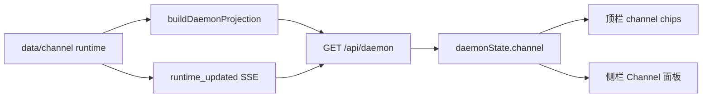

# Evolution Viewer Channel 面板：飞书通道运行态终于能看见了

> 日期：2026-06-01  
> 项目：js-evolution-agent  
> 类型：功能实现（Evolution Viewer / live serve）  
> 来源：Cursor Agent 对话（计划 → 实施 → 本地验证）

---

## 目录

1. [背景与动机](#1-背景与动机)
2. [分析过程](#2-分析过程)
3. [方案设计](#3-方案设计)
4. [实现要点](#4-实现要点)
5. [验证与测试](#5-验证与测试)
6. [后续演化](#6-后续演化)
7. [附：本轮对话问题—思考—方案—执行对照](#附本轮对话问题思考方案执行对照)

---

## 1. 背景与动机

同日 [`daemon-channel-parallel-domain.md`](./daemon-channel-parallel-domain.md) 已把 **channel** 做成与 **cycle** 平级的 daemon 域：独立队列、worker、inbound/outbox、openclaw-lark 适配，并在 `ai-researcher` 上跑通「入站 → `channel_ingest` → operator brief」。

但操作者打开 Evolution Viewer 时，仍然只能看到 **cycle daemon** 的健康条、open cycle 和 evolution 事件流。

飞书通道在跑，brief 也写进去了，Viewer 里却像没发生过——这不是数据缺失，而是 **观测面还没接上 channel 投影**。

用户要求：在 Viewer 里能看到 channel 信息，且 **UI 要考虑用户体验**——一眼判断健康、待处理入站/出站、最近发生了什么，同时不打断「看演化轮次报告」的主流程。

---

## 2. 分析过程

### 2.1 后端其实已经有了 channel 块

阅读 [`src/cli/utils/daemon-projection.mjs`](../../src/cli/utils/daemon-projection.mjs) 与 [`src/channel/projection.mjs`](../../src/channel/projection.mjs) 后发现：

- `buildDaemonProjection()` 已返回 `channel: buildChannelProjection(...)`。
- live serve 的 `GET /api/daemon` 经 [`viewer-api.mjs`](../../src/intelligence/evolution-viewer/viewer-api.mjs) 的 `buildDaemonApiResponse()` 原样透出。
- channel 投影含：`health`、`worker`、`tasks.counts`、`inbound/outbox.pending_count`、`recent_events`（来自 `data/channel/events.jsonl`）。

结论：**不必新增 `/api/channel`**，缺的是前端渲染与 runtime 变更触发刷新。

### 2.2 Viewer 现有 live 架构的缺口

对照 Phase 1 daemon 控制台日记 [`evolution-viewer-daemon-console-phase1.md`](../2026-05-30/evolution-viewer-daemon-console-phase1.md)：

| 部位 | 现状 | 对 channel 的影响 |
| --- | --- | --- |
| `renderDaemonBar()` | 只画 cycle worker / 队列 / 演化模式 | channel 健康不可见 |
| 侧栏 | 进行中 cycle + 已完成轮次 + Daemon 事件 | 无 channel 专区 |
| `createRuntimeWatcher()` | 只 watch evolution 路径 | channel tick/ingest 后 UI 不自动更新 |
| `daemonBarFingerprint()` | 不含 channel 字段 | 即使拉取到数据也可能不重绘 |

### 2.3 UX 约束

- **信息分层**：顶栏 = 健康 + 数量摘要；侧栏 Channel 面板 = 统计 + 最近事件 + 失败任务。
- **主内容区不动**：report/diary/cycle detail 不塞 channel，避免和「读一轮演化」抢注意力。
- **事件展示**：channel 审计用字段 `type`（非 evolution 的 `event_type`），只显示中文标签 + 时间，不展开长 payload。
- **无 channel runtime**：显示「Channel 未初始化」，不报错。

---

## 3. 方案设计

### 3.1 数据流（复用 daemon API）



### 关键决策

| 决策 | 选择 | 理由 |
| --- | --- | --- |
| API | 复用 `GET /api/daemon` 的 `channel` 字段 | 与 CLI `daemon status` 同源，零重复投影逻辑 |
| 离线 build | **不扩展** | channel 是运行态，仅 live serve 有意义 |
| 布局 | 顶栏 chip + 侧栏独立 section | 符合「一眼健康 / 细看事件」分层 |
| 刷新 | 扩展 runtime watcher + fingerprint | 与现有 `runtime_updated` / 15s poll 一致 |
| 事件源 | `channel.recent_events` | 独立 `events.jsonl`，不与 evolution 事件流混排 |

---

## 4. 实现要点

### 4.1 Runtime 监听（live 刷新）

[`src/intelligence/evolution-viewer/viewer-api.mjs`](../../src/intelligence/evolution-viewer/viewer-api.mjs) 的 `createRuntimeWatcher()` 增加：

```text
data/channel/worker-state.json
data/channel/tasks/pending_tasks.json
data/channel/events.jsonl
data/channel/inbound
data/channel/outbox
```

变更经 debounce 后广播 `runtime_updated`，前端 `scheduleLoadDaemon()` 重拉 `/api/daemon`。

### 4.2 前端

| 文件 | 职责 |
| --- | --- |
| [`tools/evolution-viewer/public/index.html`](../../tools/evolution-viewer/public/index.html) | 「进行中」与「已完成轮次」之间增加 `#channel-panel` |
| [`tools/evolution-viewer/public/app.js`](../../tools/evolution-viewer/public/app.js) | 顶栏 channel chips；`renderChannelPanel()`；`CHANNEL_EVENT_LABELS`；`applyDaemonState()` 按 fingerprint 重绘 |
| [`tools/evolution-viewer/public/live-state.js`](../../tools/evolution-viewer/public/live-state.js) | `daemonBarFingerprint` 纳入 channel 摘要；新增 `channelPanelFingerprint` |
| [`tools/evolution-viewer/public/styles.css`](../../tools/evolution-viewer/public/styles.css) | `.channel-panel`、`.channel-stats`、`.channel-attention` 等 |

顶栏 channel chip 示例语义：`Ch: healthy`、`Ch Worker: 运行`、`Ch 队列 0/0`、`入 0 · 出 0`（有待处理时 `channel-attention` 高亮）。

侧栏展示：健康、worker、队列计数、入站/出站 pending、运行中/失败任务（各最多几条）、最近 10 条 channel 事件。

### 4.3 测试补充

| 文件 | 内容 |
| --- | --- |
| [`test/evolution-viewer-live-state.test.mjs`](../../test/evolution-viewer-live-state.test.mjs) | channel fingerprint 变更检测 |
| [`test/evolution-viewer-live.test.mjs`](../../test/evolution-viewer-live.test.mjs) | `GET /api/daemon` 断言含 `channel` 结构 |

---

## 5. 验证与测试

### 5.1 投影与入站链路（本地 `ai-researcher`）

```bash
# 确认 projection 含 channel
node --input-type=module -e "
import { buildDaemonProjection } from './src/cli/utils/daemon-projection.mjs';
const p = buildDaemonProjection(process.cwd(), 'ai-researcher');
console.log(p.channel?.health?.status, p.channel?.inbound?.pending_count);
"

# 触发 ingest 后事件更新
printf '{"messageId":"m-viewer-ui-1","chatId":"oc_test","content":"测试 viewer"}' \
  | npm run jea -- channel inbox put --stdin
npm run jea -- daemon work --once --domain channel
```

结果：`channel health: healthy`，ingest 后 `recent_events` 含 `channel_message_ingested` / `channel_task_completed`，inbound pending 回到 0。

### 5.2 Viewer 人工查看

```bash
npm run jea -- intel viewer serve --subject ai-researcher
```

打开页面应见：顶栏 channel chips + 左侧 **Channel** 面板；入站或 tick 后数秒内因 `runtime_updated` 或轮询更新。

### 5.3 自动化测试

执行 `npm run test -- --run test/evolution-viewer-live-state.test.mjs` 时，当前环境存在 Vitest suite `config` 未定义的既有问题（单文件 0 test），**与本次改动无直接关系**。逻辑断言已写入上述两个测试文件，待 runner 修复后可回归。

---

## 6. 后续演化

| 方向 | 说明 |
| --- | --- |
| 出站联调 | 配置 `JEA_CHANNEL_LARK_CHAT_ID` 或 `subjects.json` 的 `channels.lark.default_chat_id`，用 `JEA_CHANNEL_LARK_MOCK=1` 验证 outbox → notify |
| 事件直达 SSE | 可选 tail `channel/events.jsonl` 发 `channel_event`，减少仅靠 `runtime_updated` 的延迟 |
| 消息详情 | 点击事件展开 envelope 摘要（message_id、ingest_kind），仍不展示全文以免噪声/泄露 |
| Daemon 事件流合并 | 侧栏「Daemon 事件」仍只含 evolution jsonl；若需 channel 与 cycle 统一时间线，需白名单与排序策略 |
| AGENTS.md | 可在 `intel viewer serve` 小节注明 live UI 含 channel 面板 |

---

## 附：本轮对话问题—思考—方案—执行对照

| 阶段 | 内容 |
| --- | --- |
| **问题** | channel 域已上线，Viewer 看不到飞书通道运行态；需要 UX 友好的观测面。 |
| **思考** | `/api/daemon` 已有 `channel`；缺口在前端与 watcher；不能把 channel 塞进 cycle 详情。 |
| **方案** | 顶栏摘要 chip + 侧栏 Channel 面板；扩展 runtime watch；fingerprint 最小重绘；仅 live serve。 |
| **执行** | 改 `viewer-api.mjs`、`index.html`、`app.js`、`live-state.js`、`styles.css` 与测试；本地 ingest 与 projection 验证通过。 |
