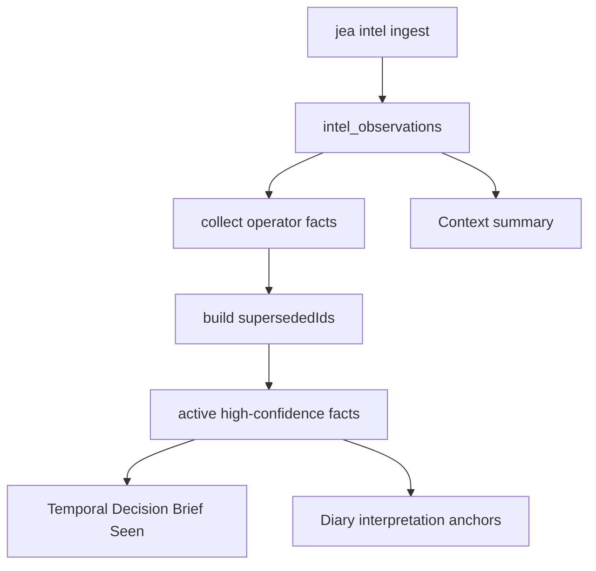

# Operator Fact 不用删：用 `supersedes` 让旧口径退出 Seen

> 日期：2026-06-01  
> 项目：js-evolution-agent  
> 类型：架构设计 / 功能实现  
> 来源：Cursor Agent 对话  

---

## 目录

1. [背景与动机](#1-背景与动机)
2. [分析过程](#2-分析过程)
3. [方案设计](#3-方案设计)
4. [实现要点](#4-实现要点)
5. [验证与测试](#5-验证与测试)
6. [后续演化](#6-后续演化)

---

## 1. 背景与动机

真正的问题不是「operator fact 能不能改」。

真正的问题是：**操作者已确认的口径写进情报库之后，如果错了，系统该怎么让它不再当事实用，同时又不破坏证据链？**

`operator_fact` 经 `jea intel ingest` 写入 `intel_observations`，在 Phase 1 会被升格为 **Seen**（`operator_established_fact`），影响 report、decide、diary 的 interpretation anchors 和 `buildContextSummary()`。这是长期、高置信的领域口径（例如 rank 方向、术语定义）。

但实现上长期只有 **append-only**：

- 没有 `jea intel fact update/delete`
- 同 `id` 的 `dedupKey` 在 ingest 路径上**未**用于拦截重复
- 读取侧按 `operator_fact && high confidence` 取最新若干条，**不会**自动让旧口径失效

于是操作者一旦写错或基线过期，只能：

- 再 ingest 一条新 fact，希望「更新优先」——旧条仍在 store，仍可能被其他窗口读到
- 手改 JSONL 或 `jea data reset`——破坏 OADA 审计，文档也明确不推荐

对话里先讨论了要不要做完整的删除/修改能力；用第一性原理收敛后，认定最小必要能力是：**让旧口径不再生效**，而不是物理删除。

---

## 2. 分析过程

### 2.1 第一性原理：两个原子能力就够

| 原子能力 | 含义 |
| --- | --- |
| 写入新口径 | 已有：`jea intel ingest` |
| 让旧口径不再生效 | 缺失：读取侧需识别「已被替换」 |

「修改」「删除」都是派生概念：

- **修改** ≈ 新 fact + 声明替换谁
- **删除** ≈ 新 fact（withdrawal 文案）+ 声明替换谁，无新领域口径

### 2.2 现有机制为什么不够

| 机制 | 能否解决口径修正 |
| --- | --- |
| 再 ingest 一条新 fact | 部分：newest-first 可能让新条先进 Seen，但旧条仍在，summary/diary 长窗口仍可能混入 |
| `confidence: medium/low` | 仅阻止升格，不表达「作废旧 id」 |
| `human_guidance.md` | 长期约束，不是确立事实 |
| `operator brief` | 单轮意图，不是持久 Seen |
| 手改 JSONL / reset | 运维兜底，违反 append-only 与 OADA |
| 物理删除 API | 破坏历史 report/diary 对 fact id 的可追溯性 |

### 2.3 与证据治理的一致性

Temporal Decision Brief 强调 **Seen 不可静默撤回**：历史轮次引用过的 fact 应留在 store 供审计；当前轮次则不应再把已作废 id 当 `operator_established_fact`。

`decision-brief.mjs` 里 `future_claim_ledger` 已预留 `superseded_by` 字段，但此前未接到 operator fact 生命周期上。本次把 **`supersedes`（新 fact 指向旧 id）** 作为最小闭环，与 append-only 存储兼容。

### 2.4 方案收敛过程

| 阶段 | 结论 |
| --- | --- |
| 初版想法 | 增加 fact list/replace/revoke/delete CLI + 可选 tombstone 存储 |
| 简化 | 只做 `supersedes` 字段语义 + 读取过滤，继续用 `intel ingest` |
| 明确不做 | 物理删除、原地改 JSONL、新 storage type、改 brief/guidance/belief 模型 |

---

## 3. 方案设计

### 3.1 核心模型：替换，不删除

```text
操作者 ingest 新 operator_fact（带 supersedes: [old_id]）
    → 旧记录仍在 intel_observations（审计）
    → 读取侧 buildSupersededIds → 排除 old_id
    → 仅 active high-confidence facts 升格为 operator_established_fact
```



### 关键决策

| 决策 | 选择 | 理由 |
| --- | --- | --- |
| 生命周期动作 | `supersedes` 替换 | 一个字段同时覆盖「改口径」和「撤回」；append-only |
| CLI | 不新增，沿用 `intel ingest` | 减少命令面；与 observation 共用写入路径 |
| 存储 | 不改 `js-intel-store` | 仍是 `daily_jsonl` + 90 天 retention |
| 谁可声明 supersede | 仅 `operator_fact` 记录的 `supersedes` | 普通 observation 同名字段不影响 fact 生命周期 |
| 升格条件 | high/缺省 confidence + 未被 supersede | 与既有 `operatorFacts()` 规则一致 |
| Summary | 省略已 supersede 的 fact | 避免 `jea intel summary` 误导操作者 |
| 共享逻辑 | 新模块 `operator-facts.mjs` | decision-brief、diary、store 三处规则一致 |

### 3.2 操作者用法

**替换口径**（`AGENTS.md` 已补充）：

```json
{
  "kind": "operator_fact",
  "source": "operator",
  "subject": "agentank-tank",
  "content": "standing.rank lower is better; rankScore higher is better",
  "confidence": "high",
  "supersedes": ["operator-fact-rank-score-old-id"]
}
```

**仅撤回、无新口径**：

```json
{
  "kind": "operator_fact",
  "source": "operator",
  "content": "Previous operator fact <old_id> is withdrawn; do not use it as an established fact.",
  "confidence": "high",
  "supersedes": ["<old_id>"]
}
```

```powershell
jea intel ingest --source intel_observations --file new-fact.json
```

`supersedes` 支持字符串或字符串数组。

---

## 4. 实现要点

### 4.1 新增模块

[`src/intelligence/operator-facts.mjs`](../../src/intelligence/operator-facts.mjs)

| 导出函数 | 职责 |
| --- | --- |
| `isOperatorFact` / `isHighConfidenceOperatorFact` | 识别 operator fact 与高置信 |
| `normalizeSupersedes` | 字符串或数组 → id 列表 |
| `buildSupersededIds` | 从全部 observations 收集被替换的 id |
| `selectActiveOperatorFacts` | active 列表（newest first，可选 limit） |
| `prioritizeActiveOperatorFacts` | summary：active facts 优先，不含 superseded |

### 4.2 接入点

| 文件 | 变更 |
| --- | --- |
| [`src/intelligence/decision-brief.mjs`](../../src/intelligence/decision-brief.mjs) | `operatorFacts()` → `selectActiveOperatorFacts` 再映射为 `directFact` |
| [`src/intelligence/evolution-diary-builder.mjs`](../../src/intelligence/evolution-diary-builder.mjs) | `gatherDiaryAnchors()` 的 `operator_established_facts` 使用同一规则 |
| [`src/intelligence/store.mjs`](../../src/intelligence/store.mjs) | `buildContextSummary()` → `prioritizeActiveOperatorFacts` |
| [`AGENTS.md`](../../AGENTS.md) | Operator Fact 小节：`supersedes`、替换与撤回示例 |

### 4.3 数据流（读取侧）

1. `readRecentIntel({ days, limit })` 拉取 observations（report 默认 90 天 / 500 条；summary 7 天 / 50 条；diary 90 天 / 50 条 → 最多 10 条 active fact）。
2. 扫描所有 `operator_fact` 的 `supersedes` → `Set<supersededId>`。
3. 过滤：`isOperatorFact && high confidence && id ∉ supersededIds`。
4. 按时间降序截断 limit，进入 Seen / diary anchors / summary。

旧 fact 记录**仍存在于** JSONL，只是不再升格。

---

## 5. 验证与测试

```powershell
cd d:\github\My\js-evolution-agent
npm test -- test/intelligence.test.mjs
```

结果：**76 passed**（`test/intelligence.test.mjs`）。

新增/强化的用例：

| 用例 | 断言 |
| --- | --- |
| `excludes superseded operator facts from seen evidence` | `buildTemporalDecisionBrief` 的 seen 含新口径、不含旧口径 |
| `omits superseded operator facts from context summary` | `buildContextSummary` 同理 |
| `gatherDiaryAnchors excludes superseded operator facts` | `operator_established_facts` 仅含新 fact id |

对修改文件运行 linter：**无新增问题**。

未在本轮验证：

- 真实 subject runtime 上 ingest 后跑完整 `jea run` 端到端
- 90 天 retention 过期后旧 fact 文件删除与 supersede 链的交互（`cleanup()` 仍未接入 daemon）

---

## 6. 后续演化

| 方向 | 说明 |
| --- | --- |
| `jea intel fact list` | 列出 active / superseded fact，降低操作者查 id 成本 |
| `jea intel fact replace <old_id>` | 对 `intel ingest` + `supersedes` 的薄封装 |
| 与 `claim_ledger` 对齐 | 将 supersede 链纳入 claim 生命周期，减少硬编码规则 |
| ingest 层 dedup | 评估是否在写入时对同 `id` 同日去重，避免重复 append |
| 定期 `cleanup()` | 在 daemon 或 `jea doctor` 中触发 `intel_observations` 过期清理 |
| 敏感信息 purge | 高风险 admin 命令，与正常 supersede 路径分离 |

---

## 附：本轮对话问题—思考—方案—执行对照

| 阶段 | 内容 |
| --- | --- |
| 问题 | operator fact 写入后能否修改/清理；旧口径会继续污染 Seen 吗？ |
| 思考 | 第一性原理：只需「新口径 + 旧口径失效」；append-only 审计链不可破；CRUD/物理删除过重 |
| 方案 | 新 `operator_fact` 带 `supersedes: [old_id]`；读取侧统一 `selectActiveOperatorFacts`；不新增 CLI |
| 执行 | 新增 `operator-facts.mjs`，改 decision-brief / diary-builder / store / AGENTS.md，补 3 类测试，76 tests pass |
