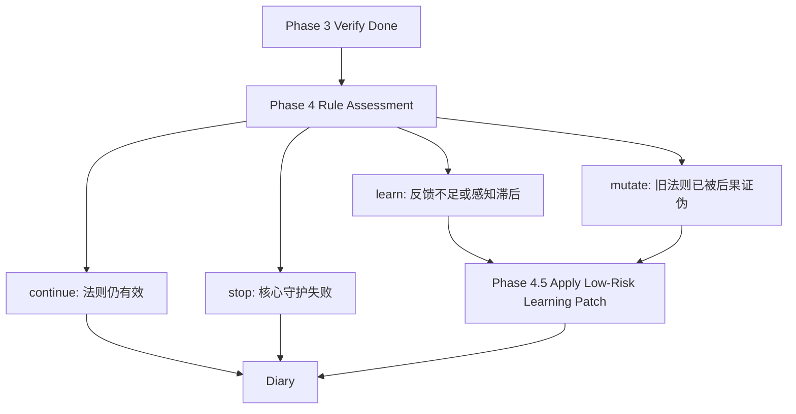

# Phase 4/4.5 从目标审批到规则更新：让失败自动变成新法则

> 日期：2026-06-01  
> 项目：js-evolution-agent（典型主体 agentank-tank / Phase 4 & 4.5）  
> 类型：架构设计 / 功能实现 / 问题排查  
> 来源：Cursor Agent 对话  

---

## 目录

1. [背景与动机](#1-背景与动机)
2. [分析过程](#2-分析过程)
3. [方案设计](#3-方案设计)
4. [实现要点](#4-实现要点)
5. [验证与测试](#5-验证与测试)
6. [后续演化](#6-后续演化)

---

## 1. 背景与动机

这次对话起点不是代码报错，而是一次进化复盘。

`agentank-tank` 最新进化结果进入了人工介入：回退到 freeze 基线后连续两次技能迭代都没有达到 `rank` 改善 5 位的门槛。报告判断守护层稳定，真正的问题是本地模拟与真实排名脱钩。

表面看，系统做对了：它停下自动发布，生成了人工介入报告。

但操作者追问的是更深的问题：**既然 Cyber-Taoist 理论已经提供“成败筛选后进入规则更新”，为什么系统不能自己走到规则更新？为什么还要等人？**

真正的问题不是“Phase 4 有没有评估”。

真正的问题是：**Phase 4/4.5 仍然像一个目标审批器，而不是一个规则更新器。**

旧流程会问：

```text
这个目标还要 keep、refine、split、replace 吗？
```

但第一性原理更应该问：

```text
当前法则还产生有效交易反馈吗？
失败是否已经提供了新信息？
守护层是否稳定到足以继续低风险学习？
```

这次改造就是把 Phase 4/4.5 的中心问题从“目标是否保持”换成“法则是否该更新”。

---

## 2. 分析过程

### 2.1 死路不是理论缺失，而是机制断层

从 Cyber-Taoist 理论看，当前 `agentank-tank` 的状态很清楚：

| 理论概念 | 在本次场景中的对应 |
| --- | --- |
| 法则 R | 本地模拟、门禁指标、skillType 切换路径 |
| 交易 T | 发布候选、GET rank、replay/challenge 反馈 |
| 生态位 NI | 真实 `standing.rank`、`rankScore`、胜率 |
| 成败筛选 | 多次发布无 ≥5 位改善，回退后两次仍无改善 |
| 规则更新 | 应把“模拟-真实脱钩”的失败反馈沉淀成新目标 |

理论没有缺席。缺席的是把理论判断变成机械动作的桥。

最近一次 `goals_assess` 给出了 `status: keep`，理由是“目标已正确触发人工介入请求报告，定义清晰、可验证”。随后 Phase 4.5 看到旧状态 `keep`，直接跳过：

```text
status: skipped
reason: status_not_actionable
```

也就是说，系统识别了“旧法则失败”，但把“正确停车”当成目标达成，没把失败继续编译成新法则。

### 2.2 旧状态空间太像审批表

旧状态空间是：

```text
keep | refine | split | replace | retire | insufficient_evidence
```

它适合描述目标文件要不要改，却不适合描述进化阶段。

例如 `keep` 同时可能表示两种完全相反的情况：

| 情况 | 是否应该继续旧法则 |
| --- | --- |
| 法则仍有效，成果指标改善 | 是 |
| 目标正确触发人工介入，因为旧法则失败 | 否 |

这就是这次问题的核心歧义。

### 2.3 `goal_suggestions` 也没有进入闭环

Analyze+Decide 已经会输出 `goal_suggestions`，比如更新 rank 基线、重置模拟评分权重、构建真实反馈门禁。

但这些建议只是记录在上下文里，不会自然转成 `goal_patches`。Phase 4 不显式消费它们，Phase 4.5 也不认识它们。

所以系统会说出正确方向，却不会自动走过去。

---

## 3. 方案设计

### 3.1 新增 rule_status，保留旧 status

为避免破坏旧事件、旧 diary、旧测试，方案不是直接删除 `status`，而是新增一层更贴近进化理论的 `rule_status`：

```text
continue | learn | mutate | stop | insufficient_evidence
```



兼容映射：

| `rule_status` | 旧 `status` 兼容语义 | Phase 4.5 行为 |
| --- | --- | --- |
| `continue` | `keep` | 不自动改目标 |
| `learn` | `refine` | 可应用低风险学习型 patch |
| `mutate` | `refine` / `replace` | 可更新成果子目标或整树目标 |
| `stop` | `keep` / `insufficient_evidence` | 不触发成果 patch |
| `insufficient_evidence` | `insufficient_evidence` | 不改目标 |

### 3.2 learn 和 mutate 的边界不同

`learn` 不是“继续做事”，而是“低风险学习”：

- 只读探针；
- 诊断；
- 反馈回路校准；
- replay / challenge / rank / rankScore 相关性分析；
- 明确禁止发布和远端写入。

`mutate` 才是“旧法则已被后果证伪，需要改成果目标”。它可以更新成果子目标，把失败反馈沉淀成新门禁或新策略假设，但仍不能绕过主体发布审批。

### 关键决策

| 决策 | 选择 | 理由 |
| --- | --- | --- |
| 新语义承载 | 新增 `rule_status`，保留旧 `status` | 避免破坏历史记录和现有校准逻辑 |
| 可行动状态 | `learn` / `mutate` | 对应感知滞后与规则更新，能推动 4.5 |
| `learn` 安全边界 | 关键字过滤低风险 patch | 防止“学习期”偷偷恢复发布 |
| 失败硬规则 | prompt 明确禁止纯 `keep` | 防止再次把“正确停车”误判为进化完成 |
| `goal_suggestions` | 纳入 Phase 4 context | 让 Phase 1 的建议有机会升级为 `goal_patches` |

---

## 4. 实现要点

### 4.1 关键模块

| 文件 | 职责 |
| --- | --- |
| [`src/intelligence/goal-calibrate-policy.mjs`](../../src/intelligence/goal-calibrate-policy.mjs) | 新增 `VALID_RULE_STATUSES`、`normalizeRuleStatus`、`isActionableAssessment` 等规则状态工具 |
| [`src/intelligence/goal-assessor.mjs`](../../src/intelligence/goal-assessor.mjs) | 改写 Phase 4 prompt；解析 `rule_status`；兼容模型直接输出 `status=learn/mutate`；读取最近 `goal_suggestions` |
| [`src/cli/commands/goals.mjs`](../../src/cli/commands/goals.mjs) | 在 `autoCalibrateGoals` 中识别 `rule_status`；让 `learn/mutate` 可行动；过滤 `learn` 的高风险 patch |
| [`src/intelligence/evolution-diary-builder.mjs`](../../src/intelligence/evolution-diary-builder.mjs) | 在 diary context、AI prompt 和 fallback diary 中展示 `rule_status` |
| [`test/goal-calibrate-policy.test.mjs`](../../test/goal-calibrate-policy.test.mjs) | 覆盖 `learn/mutate` 规则状态可行动逻辑 |
| [`test/goal-assessor-rule-status.test.mjs`](../../test/goal-assessor-rule-status.test.mjs) | 覆盖新旧状态解析兼容 |
| [`test/cli.test.mjs`](../../test/cli.test.mjs) | 覆盖 `keep + rule_status=mutate` 不再跳过、`learn` 只应用低风险 patch |

### 4.2 Phase 4 prompt 的关键变化

评估器现在不再只被要求判断目标是否可验证，而是要先判断规则状态：

```text
当前法则是否仍产生有效交易反馈？
失败是否已经形成可沉淀的新信息？
守护层是否稳定到足以继续低风险学习？
```

并且加入硬规则：

```text
不得把“目标正确触发人工介入/停止发布”直接当成 continue/keep。
若触发原因是成果法则失败、模拟失真、真实反馈脱钩，且守护层稳定，
必须输出 rule_status="learn" 或 rule_status="mutate"，并给出 goal_patches。
```

### 4.3 Phase 4.5 的新决策顺序

```text
1. 解析 assessment.rule_status。
2. 若 rule_status=learn/mutate，将旧 status 映射为 refine，使 4.5 可行动。
3. 若 rule_status=learn，先过滤 patch：
   - 必须包含只读、诊断、反馈、校准、replay、challenge、rankScore 等学习信号；
   - 不得包含 remote_write、POST /api/agent/tank/code、恢复发布等高风险信号。
4. 有合法 patches → 应用 patch 或 patch_partial。
5. 无合法 patches 且无 proposed_goal → skipped，并记录 skipped_patches。
6. 无 rule_status 的旧评估结果 → 沿用原有 status 逻辑。
```

---

## 5. 验证与测试

本次运行了两层验证。

定向回归：

```bash
npm test -- test/goal-calibrate-policy.test.mjs test/goal-patches.test.mjs test/goal-assessor-rule-status.test.mjs test/cli.test.mjs
```

结果：

```text
Test Files  4 passed (4)
Tests       138 passed (138)
```

全量测试：

```bash
npm test
```

结果：

```text
Test Files  27 passed (27)
Tests       477 passed (477)
```

同时对修改文件运行了 linter 诊断，结果无 linter errors。

---

## 6. 后续演化

这次改造解决的是 Phase 4/4.5 的语义断层，但还有几个可以继续推进的方向：

1. **让 `learn` 的低风险过滤更结构化**  
   现在使用关键词做最小安全门禁。后续可以让 patch 明确携带 `risk_profile: read_only_learning` 或 `allowed_effects`，减少自然语言误判。

2. **把 `goal_suggestions` 升级路径做成显式机制**  
   目前 Phase 4 context 会读取最近 `goal_suggestions`，但是否转成 patch 仍由 LLM 判断。后续可以增加 `suggestion_to_patch` 的机械预处理或审计字段。

3. **为 `mutate` 增加更强的审计输出**  
   `mutate` 代表旧法则被证伪，应在 goal_event 中更明确记录“被证伪的法则”“失败后果”“新法则假设”。

4. **用真实 AgenTank 死路场景跑一次非 mock 验证**  
   当前测试覆盖了机械行为。下一步可在安全只读范围内触发一次新 Phase 4，确认它会输出 `rule_status=learn/mutate`，而不是旧的 `keep -> status_not_actionable`。

---

## 附：本轮对话问题—思考—方案—执行对照

| 阶段 | 内容 |
| --- | --- |
| 问题 | `agentank-tank` 已识别模拟-真实脱钩并触发人工介入，但系统没有自动进入规则更新期。 |
| 思考 | Cyber-Taoist 理论已提供“成败筛选 → 规则更新”，问题在于 Phase 4/4.5 只有目标审批语义，没有法则状态语义。 |
| 方案 | 新增 `rule_status`，把 Phase 4 判断简化为 `continue/learn/mutate/stop`，让 `learn/mutate` 驱动 Phase 4.5 自动校准。 |
| 执行 | 修改 goal assessor、calibrate policy、goals command、diary builder，并补充回归测试；定向和全量测试均通过。 |
