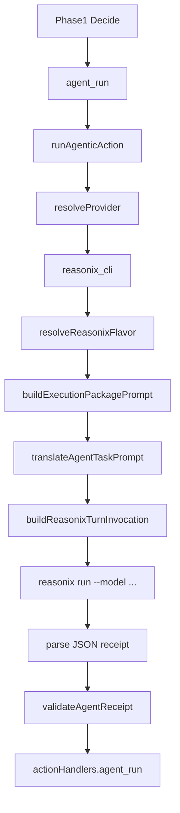

# Reasonix Agent Provider：把 DeepSeek 原生编码代理接进执行闭环

> 日期：2026-06-01  
> 项目：js-evolution-agent  
> 类型：调研分析 / 架构设计 / 功能实现  
> 来源：Cursor Agent 对话

---

## 目录

1. [背景与动机](#1-背景与动机)
2. [分析过程](#2-分析过程)
3. [方案设计](#3-方案设计)
4. [实现要点](#4-实现要点)
5. [版本兼容（npm 0.x vs Go main-v2）](#5-版本兼容npm-0x-vs-go-main-v2)
6. [凭据与环境加载](#6-凭据与环境加载)
7. [验证与测试](#7-验证与测试)
8. [后续演化](#8-后续演化)

---

## 1. 背景与动机

这次工作的起点，是一个看起来很自然的问题：既然系统已经能用 Cursor 和 Claude Code 做执行 agent，能不能把 DeepSeek-Reasonix 也接进来？

Reasonix 的价值不只是“又一个命令行 coding agent”。它的核心定位是 DeepSeek-native：围绕 DeepSeek 的 prefix cache、低成本长会话和工具执行循环设计。前一轮工作已经把本系统的 prompt 稳定性变成可观测不变量，这一轮则进一步追问：

真正的问题不是“能不能调用 Reasonix”。

真正的问题是：能不能让 Reasonix 像 `cursor_sdk`、`claude_code_sdk` 一样，进入 `agent_run` 的执行闭环，同时不破坏现有的权限、执行根、审批和 receipt 验证协议。

这决定了接入方式不能是随手加一个新 action type。否则 Decide 会开始理解“Reasonix 专用动作菜单”，系统边界会变得更散。正确的入口应该是 provider。

## 2. 分析过程

调研先从 Reasonix 仓库与文档开始。

它当前存在**两条 CLI 线**，行为并不相同：

| 维度 | Go `main-v2`（计划目标） | npm `reasonix@0.53.x`（本机已装） |
| --- | --- | --- |
| 安装 | `make build`；npm 1.0 尚未发布 | `npm install -g reasonix` |
| task 输入 | positional `<task>` 或 stdin fallback | **必须** positional `<task>`；stdin 无效 |
| flags | `--model`、`--max-steps`、`--show-thinking` | `--model`、`--effort`、`--budget` 等；**无 `--max-steps`** |
| 配置 | `./reasonix.toml` / `~/.config/reasonix/config.toml` | `~/.reasonix/config.json`；host 生成的 `.toml` 不会被自动加载 |

Go 版典型用法：

```bash
reasonix run "implement the TODOs"
echo "explain this code" | reasonix run
```

npm 0.x 典型用法：

```bash
reasonix run "implement the TODOs" --model deepseek-v4-flash
# echo "..." | reasonix run   → error: missing required argument 'task'
```

配置上，Reasonix 使用 API key、MCP 插件和内置工具。权限模型包含 `[permissions]` 和 `[sandbox]`（Go 版 TOML），但有一个关键约束：`reasonix run` 是非交互模式，`ask` 在没有 approver 时会解析为 allow；同时 Windows 下 `bash` 没有强 OS 沙箱保证。

随后检查本系统执行 agent 的现有结构，重点落在：

| 文件 | 发现 |
| --- | --- |
| [`src/actions/agent-adapter.mjs`](../../src/actions/agent-adapter.mjs) | `agent_run` 已经通过 `runAgenticAction()` 分发到 `llm_only`、`claude_code_sdk`、`cursor_sdk`。这是 Reasonix 最自然的接入点。 |
| [`src/actions/agent-run-spec.mjs`](../../src/actions/agent-run-spec.mjs) | `permission_profile` 已经统一成 `read_only`、`workspace_write`、`remote_write_review`，可以直接复用。 |
| [`src/actions/agent-run-observer.mjs`](../../src/actions/agent-run-observer.mjs) | Cursor / Claude 的事件都会写入 agent-run JSONL，Reasonix 也应进入同一观测面。 |
| [`src/actions/handlers.mjs`](../../src/actions/handlers.mjs) | `actionHandlers.agent_run` 已经负责 receipt 归一化、approval、verify 入口和 action receipt 记录，不需要新增 action handler。 |

关键判断是：Reasonix 第一版应该当作 CLI provider，而不是 SDK provider。

原因很直接。Reasonix 目前公开稳定的是 CLI；没有本系统可直接消费的 JS SDK 或结构化 tool event stream。CLI 接入观测粒度低一些，但可以最快打通闭环。等闭环稳定后，再考虑长会话、MCP 和缓存指标。

## 3. 方案设计

最终方案是新增 `reasonix_cli` provider，与 `cursor_sdk`、`claude_code_sdk` 平级。

数据流（第二版，含 flavor 与 argv task）：



### 关键决策

| 决策 | 选择 | 理由 |
| --- | --- | --- |
| 接入层级 | 新增 provider `reasonix_cli` | 保持 Decide 只产出 `agent_run`，不引入 Reasonix 专用 action 菜单。 |
| 执行方式 | `child_process.spawn()` 调 `reasonix run` | Reasonix 当前稳定入口是 CLI，subprocess 最贴近实际使用。 |
| 输入方式 | **默认 argv positional `<task>`**；Go 且 prompt > 7000 字符时回退 stdin | npm 0.x 不支持 stdin task；Go 两路都可用，argv 优先。 |
| CLI flavor | 自动探测 `npm` / `go`，可用 `JEA_REASONIX_FLAVOR` 覆盖 | 同一 adapter 兼容 npm 0.53.x 与 Go main-v2，按 flavor 条件传 flag。 |
| `--max-steps` | 仅 `go` flavor 传递 | npm 0.x 无此 flag，硬传会导致 CLI 报错。 |
| provider 选择 | `JEA_AGENT_PROVIDER=reasonix_cli` 或 action override | provider 是宿主执行配置，不放回模型生成的 `run_spec`。 |
| 权限策略 | host prompt constraints + 临时 Reasonix config metadata | Reasonix 当前 `run` 不支持 `--config`，所以不能假装 CLI 参数能强制加载配置。 |
| 观测策略 | 标记 `capability_gap: tool_trace` | CLI stdout 无法提供 Cursor / Claude SDK 那种结构化 tool lifecycle。 |
| bash 默认值 | 默认禁用 | Windows 下 Reasonix bash sandbox 不是强保证，必须保守。 |

这里有一个重要修正：计划里原本提到可把临时 config 通过 `--config` 传给 `reasonix run`，且第一版 MVP 曾用 **stdin-only** 传 prompt。实现前核对 Reasonix `main-v2` 源码后发现，当前 `run` 只支持 `--model`、`--max-steps`、`--show-thinking`，没有 `--config`。本机联调 npm `0.53.2` 又发现 stdin 无效、必须 argv task。因此第二版改为 argv 传 task，并按 flavor 条件化 `--max-steps`。

## 4. 实现要点

### 项目结构

```text
js-evolution-agent/
├── src/
│   ├── actions/
│   │   ├── agent-adapter.mjs
│   │   ├── agent-run-observer.mjs
│   │   └── execution-env.mjs
│   └── cli/utils/
│       └── project.mjs
├── test/
│   ├── actions.test.mjs
│   ├── agent-run-observer.test.mjs
│   └── execution-env.test.mjs
├── work_dir/
│   └── smoke-reasonix-provider.mjs
└── .env.example
```

### 关键模块

| 文件 | 职责 |
| --- | --- |
| [`src/actions/agent-adapter.mjs`](../../src/actions/agent-adapter.mjs) | 新增 `reasonix_cli` provider；`resolveReasonixFlavor`、`buildReasonixRunBaseArgs`、`buildReasonixTurnInvocation`；生成 host constraints prompt；运行 CLI subprocess；解析 stdout receipt；执行 verification loop。 |
| [`src/actions/agent-run-observer.mjs`](../../src/actions/agent-run-observer.mjs) | 新增 `REASONIX_PROVIDER` 和 `[agent:reasonix]` 日志 tag。 |
| [`src/intelligence/conversation-context.mjs`](../../src/intelligence/conversation-context.mjs) | 在语义验证输出 schema 的 provider 枚举中加入 `reasonix_cli`。 |
| [`src/cli/utils/project.mjs`](../../src/cli/utils/project.mjs) | `loadProjectEnv()` 以 `override: true` 加载项目根 `.env`，避免 Shell 占位值覆盖本地凭据。 |
| [`src/actions/execution-env.mjs`](../../src/actions/execution-env.mjs) | `buildExecutionEnv()` 让 execution/tool root 的 `.env` 覆盖同名 stale 进程变量，供 Reasonix 等子进程使用。 |
| [`test/actions.test.mjs`](../../test/actions.test.mjs) | fake Reasonix CLI（从 argv 读 task）；覆盖 flavor、argv invocation、embedded JSON receipt、缺 binary defer、权限配置生成。 |
| [`test/execution-env.test.mjs`](../../test/execution-env.test.mjs) | 覆盖项目 `.env` 与 execution root `.env` 的 override 语义。 |
| [`.env.example`](../../.env.example) | 增加 `reasonix_cli` provider、`JEA_REASONIX_FLAVOR` 等说明。 |

### 环境变量

Reasonix provider 相关配置：

```bash
JEA_AGENT_PROVIDER=reasonix_cli
REASONIX_BIN=reasonix
JEA_REASONIX_BIN_ARGS=
JEA_REASONIX_MODEL=deepseek-v4-flash
# auto | npm | go — npm 0.x 与 Go main-v2 行为不同，通常 auto 即可
JEA_REASONIX_FLAVOR=auto
# 仅 go/main-v2 生效
JEA_REASONIX_MAX_STEPS=25
JEA_REASONIX_TIMEOUT_MS=1800000
JEA_REASONIX_CONFIG=
JEA_REASONIX_ALLOW_BASH=0
```

其中 `JEA_REASONIX_CONFIG` 当前不会变成 `reasonix run --config`，因为上游 CLI 暂不支持这个 flag。它只作为子进程环境变量 `REASONIX_CONFIG` 和 host metadata 保留，给 wrapper 或未来 Reasonix 版本使用。

Reasonix 子进程使用 `DEEPSEEK_API_KEY`（与 JEA 主 LLM 相同）。需确保项目根 `.env` 中的 key 能进入子进程环境（见下一节）。

### adapter 核心 API（可单测）

```javascript
// flavor: 'npm' | 'go'，由 --version / run --help 或 JEA_REASONIX_FLAVOR 决定
resolveReasonixFlavor(binary, binaryArgs)

// 不含 task；go flavor 才附加 --max-steps
buildReasonixRunBaseArgs({ binaryArgs, model, maxSteps, flavor })

// npm / 常规 go：argv 末尾追加 task；go 且超长 prompt：stdin fallback
buildReasonixTurnInvocation(baseRunArgs, prompt, flavor)
```

## 5. 版本兼容（npm 0.x vs Go main-v2）

### 探测逻辑

1. 若设置 `JEA_REASONIX_FLAVOR=npm|go`，直接使用。
2. 否则执行 `reasonix --version`：
   - 语义版本 `0.x.x` → `npm`
   - `dev` / `1.x` / 含 `main-v2` → `go`
3. 若版本串无法判定，再读 `reasonix run --help` 是否含 `--max-steps` → `go`，否则默认 `npm`（保守：不传 go-only flag）。

结果缓存在进程内，避免每轮 verification 重复 probe。

### 调用形态对比

| flavor | 实际 spawn 形态 | stdin |
| --- | --- | --- |
| `npm` | `reasonix run [--model M] "<task+host constraints>"` | 忽略 |
| `go`（常规） | 同上 | 忽略 |
| `go`（prompt > 7000） | `reasonix run [--model M] [--max-steps N]` | 写入完整 prompt |

fake CLI 与冒烟脚本 [`work_dir/smoke-reasonix-provider.mjs`](../../work_dir/smoke-reasonix-provider.mjs) 均从 **argv 末位 positional** 读取 task，与 npm 0.x 一致。

### 本机现状（2026-06-01）

- 已安装：`reasonix 0.53.2`（npm 全局）
- flavor 自动识别为 `npm`
- CLI 能正常启动；API 401 曾在 Shell 占位 key 覆盖 `.env` 时出现（见第 6 节，已修）

## 6. 凭据与环境加载

联调时发现：项目根 `.env` 已配置有效 `DEEPSEEK_API_KEY`，但 Cursor 集成终端进程里带着 `DEEPSEEK_API_KEY=test`，且旧版 `loadProjectEnv()` 使用 `override: false`，导致 **Shell 占位值永远赢过 `.env`**。表现：

```text
npm run jea -- llm ping
→ 401 Authentication Fails, Your api key: test is invalid
```

修复两处：

| 位置 | 旧行为 | 新行为 |
| --- | --- | --- |
| [`loadProjectEnv()`](../../src/cli/utils/project.mjs) | dotenv `override: false` | `override: true` — 项目根 `.env` 为本地配置来源 |
| [`buildExecutionEnv()`](../../src/actions/execution-env.mjs) | 仅填充 baseEnv 中**空**的 key | execution/tool root `.env` 中已定义的 key **覆盖** baseEnv |

修复后：

```text
npm run jea -- llm ping
→ ok: true, response: pong
```

**注意**：在终端里**直接**运行 `reasonix`（不经过 `jea`）仍可能读到 Shell 里的 stale 变量；可 `Remove-Item Env:DEEPSEEK_API_KEY` 或重开终端。经 `jea` / `reasonix_cli` provider 的路径已正确注入 `.env` 凭据。

## 7. 验证与测试

验证分四层。

**IDE 诊断**：相关文件无新增 linter 错误。

**Reasonix 定向测试**：

```bash
npm test -- test/actions.test.mjs -t "Reasonix"
```

覆盖：默认 provider、别名归一、`argv` task 传递、flavor/`--max-steps` 条件、embedded JSON receipt、binary 缺失 defer、权限 config 生成。

**环境加载测试**：

```bash
npm test -- test/execution-env.test.mjs
```

**全量测试**：

```bash
npm test
```

结果（2026-06-01 末）：

```text
Test Files  28 passed (28)
Tests       492 passed (492)
```

**冒烟脚本**（fake binary，npm flavor）：

```bash
node work_dir/smoke-reasonix-provider.mjs
```

```text
success: true
provider: reasonix_cli
flavor: npm
schema_status: valid
```

**DeepSeek 连通性**（修复 env 加载后）：

```bash
npm run jea -- llm ping
→ ok: true, response: pong
```

测试覆盖要点：

- `reasonix`、`deepseek_reasonix` 能归一到 `reasonix_cli`。
- task 通过 argv positional 传给 fake CLI（npm 语义）。
- `buildReasonixTurnInvocation` 在 go + 超长 prompt 时走 stdin fallback。
- `--max-steps` 仅在 go flavor 的 base args 中出现。
- binary 不存在时返回 deferred 和 `provider_failure`。
- agent-run JSONL 中出现 `[agent:reasonix]` 和 `capability_gap: tool_trace`。
- 项目 / execution root `.env` 覆盖 stale Shell 占位凭据。

## 8. 后续演化

第一版目标「能安全进入执行闭环」已基本达成。后续仍有三件事值得继续做。

**第一**，跟进 Reasonix config 加载能力。若上游支持 `reasonix run --config` 或 npm 版能读 host 生成的 TOML/JSON，可把临时 `reasonix.toml` 从 metadata 升级为硬约束输入。

**第二**，研究长会话或 resume。Reasonix 的价值很大一部分来自 prefix-cache 稳定性和长会话复用。若 CLI 或 serve 模式能暴露稳定 session，可让同一 execution root 复用 Reasonix 上下文，而不是每个 verification turn 都开新进程。

**第三**，再接 MCP。第一版故意不接 MCP，避免工具面突然扩大。后续可让 subject policy 或 `subjects.json` 声明允许暴露给 Reasonix 的 MCP server，并按 `permission_profile` 生成受控配置。

**第四**（可选），在本机用真实 `reasonix 0.53.2` 跑一轮 `JEA_AGENT_PROVIDER=reasonix_cli` 的 `agent_execute` / `agent_run` 端到端联调，确认 stdout receipt 与 verification loop 在真实 DeepSeek 响应下稳定。

---

## 附：本轮对话问题—思考—方案—执行对照

| 阶段 | 内容 |
| --- | --- |
| 问题 | 用户希望分析 DeepSeek-Reasonix，并把它像 Cursor、Claude Code 一样接成本系统的执行 agent。 |
| 思考 | 核心约束不是“调用 CLI”，而是不能破坏 `agent_run`、execution root、approval、receipt 和 provider 选择边界；且 npm 0.x 与 Go main-v2 CLI 语义不同。 |
| 方案 | 新增 `reasonix_cli` provider；argv 传 task + flavor 探测；项目 / execution `.env` 覆盖 Shell 占位凭据。 |
| MVP | stdin 传 prompt、无 flavor 区分（仅适 Go 语义，与 npm 0.53.x 不兼容）。 |
| 修订 | argv positional task、`JEA_REASONIX_FLAVOR`、条件化 `--max-steps`；`loadProjectEnv` / `buildExecutionEnv` override 修复。 |
| 执行 | 修改 `agent-adapter.mjs`、`agent-run-observer.mjs`、`conversation-context.mjs`、`project.mjs`、`execution-env.mjs`、测试、`.env.example`、journal；492 tests pass；`llm ping` 与 fake CLI 冒烟通过。 |
